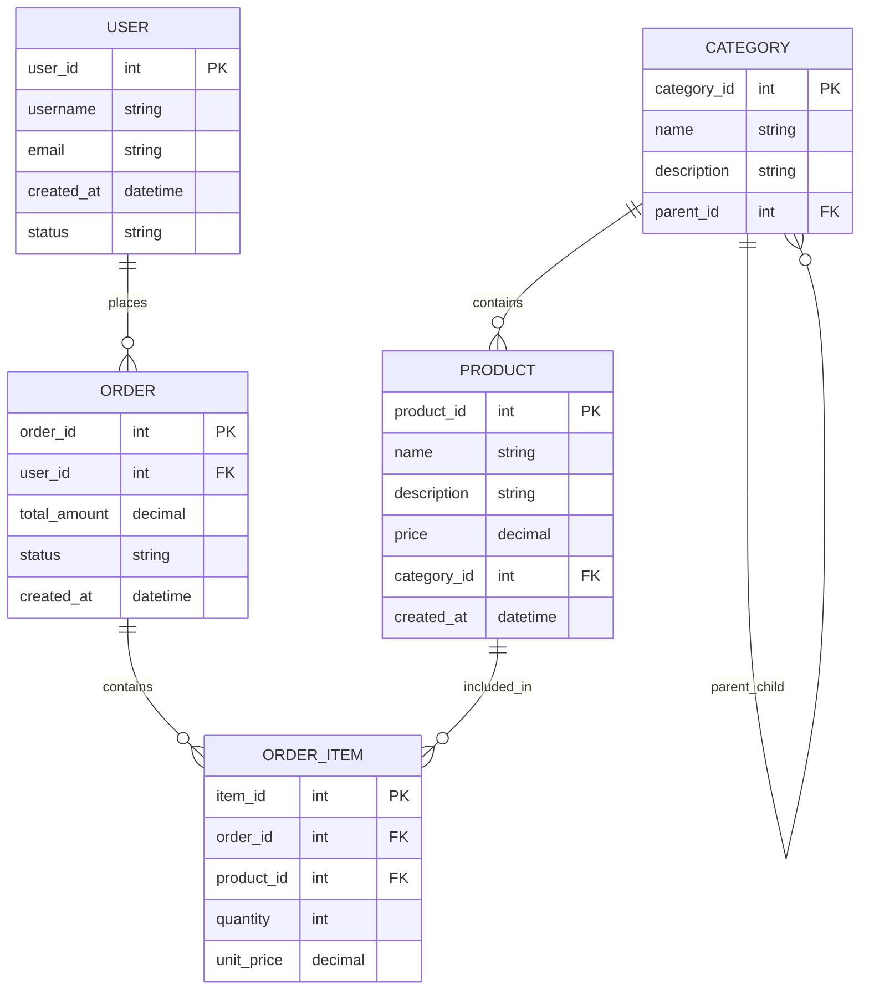

# 数据库设计原理与最佳实践

## 概述

数据库设计是软件系统架构的核心组成部分，直接影响系统的性能、可扩展性和数据完整性。深入理解数据库设计的原理和方法，是构建高效、可维护系统的关键技能。

## 数据库设计基础原理

### 数据库设计概述

**数据库设计的定义**：
- 数据库设计是指根据用户需求和应用场景，设计数据库结构、表关系、索引和约束的过程
- 目标是创建高效、可靠、可维护的数据库结构
- 涵盖概念设计、逻辑设计、物理设计三个层次

**数据库设计的原则**：
- **数据完整性**：确保数据的准确性和一致性
- **性能优化**：提高查询效率和数据访问速度
- **可扩展性**：支持数据量和用户量的增长
- **安全性**：保护数据免受未授权访问和损坏
- **规范化**：减少数据冗余和维护成本

### 概念设计

**实体-关系模型（ER模型）**：


**实体识别原则**：
- **识别性强**：每个实体都有唯一标识符
- **描述性好**：实体具有描述性的属性
- **行为性**：实体参与业务流程和操作
- **独立性强**：实体可以独立存在和操作

**关系设计原则**：
- **基数关系**：1:1、1:N、M:N关系的正确建模
- **参与度**：部分参与和完全参与的设计
- **可选性**：必须关系和可选关系的设计
- **方向性**：双向和单向关系的决策

### 逻辑设计

**关系模式设计**：

```sql
-- 用户表
CREATE TABLE users (
    user_id INT PRIMARY KEY,
    username VARCHAR(50) UNIQUE NOT NULL,
    email VARCHAR(100) UNIQUE NOT NULL,
    password_hash VARCHAR(255) NOT NULL,
    first_name VARCHAR(50),
    last_name VARCHAR(50),
    phone VARCHAR(20),
    created_at TIMESTAMP DEFAULT CURRENT_TIMESTAMP,
    updated_at TIMESTAMP DEFAULT CURRENT_TIMESTAMP ON UPDATE CURRENT_TIMESTAMP,
    status ENUM('active', 'inactive', 'suspended') DEFAULT 'active',
    
    -- 索引设计
    INDEX idx_username (username),
    INDEX idx_email (email),
    INDEX idx_status (status),
    INDEX idx_created_at (created_at),
    
    -- 约束
    CONSTRAINT chk_email_format CHECK (email REGEXP '^[A-Za-z0-9._%+-]+@[A-Za-z0-9.-]+\.[A-Za-z]{2,}$'),
    CONSTRAINT chk_username_length CHECK (LENGTH(username) >= 3 AND LENGTH(username) <= 50)
);

-- 产品分类表
CREATE TABLE categories (
    category_id INT PRIMARY KEY AUTO_INCREMENT,
    name VARCHAR(100) NOT NULL,
    description TEXT,
    parent_id INT NULL,
    sort_order INT DEFAULT 0,
    is_active BOOLEAN DEFAULT TRUE,
    created_at TIMESTAMP DEFAULT CURRENT_TIMESTAMP,
    updated_at TIMESTAMP DEFAULT CURRENT_TIMESTAMP ON UPDATE CURRENT_TIMESTAMP,
    
    -- 外键约束
    FOREIGN KEY (parent_id) REFERENCES categories(category_id) 
        ON DELETE SET NULL ON UPDATE CASCADE,
    
    -- 索引
    INDEX idx_parent_id (parent_id),
    INDEX idx_name (name),
    INDEX idx_active (is_active),
    
    -- 约束
    CONSTRAINT chk_parent_not_self CHECK (category_id != parent_id OR parent_id IS NULL)
);

-- 产品表
CREATE TABLE products (
    product_id INT PRIMARY KEY AUTO_INCREMENT,
    name VARCHAR(200) NOT NULL,
    description TEXT,
    short_description VARCHAR(500),
    sku VARCHAR(100) UNIQUE,
    price DECIMAL(10, 2) NOT NULL,
    compare_price DECIMAL(10, 2),
    cost_price DECIMAL(10, 2),
    category_id INT NOT NULL,
    brand VARCHAR(100),
    weight DECIMAL(8, 3),
    dimensions JSON,
    images JSON,
    tags JSON,
    meta_title VARCHAR(200),
    meta_description VARCHAR(300),
    status ENUM('draft', 'active', 'inactive', 'archived') DEFAULT 'draft',
    inventory_tracking BOOLEAN DEFAULT TRUE,
    stock_quantity INT DEFAULT 0,
    low_stock_threshold INT DEFAULT 10,
    allow_backorder BOOLEAN DEFAULT FALSE,
    created_at TIMESTAMP DEFAULT CURRENT_TIMESTAMP,
    updated_at TIMESTAMP DEFAULT CURRENT_TIMESTAMP ON UPDATE CURRENT_TIMESTAMP,
    
    -- 外键约束
    FOREIGN KEY (category_id) REFERENCES categories(category_id) 
        ON DELETE RESTRICT ON UPDATE CASCADE,
    
    -- 索引
    INDEX idx_name (name),
    INDEX idx_category (category_id),
    INDEX idx_price (price),
    INDEX idx_status (status),
    INDEX idx_sku (sku),
    INDEX idx_brand (brand),
    INDEX idx_created_at (created_at),
    INDEX idx_stock_status (stock_quantity, low_stock_threshold),
    
    -- 复合索引
    INDEX idx_category_status (category_id, status),
    INDEX idx_price_range (price, status),
    
    -- 约束
    CONSTRAINT chk_price_positive CHECK (price > 0),
    CONSTRAINT chk_compare_price CHECK (compare_price IS NULL OR compare_price >= price),
    CONSTRAINT chk_stock_non_negative CHECK (stock_quantity >= 0)
);

-- 订单表
CREATE TABLE orders (
    order_id INT PRIMARY KEY AUTO_INCREMENT,
    order_number VARCHAR(50) UNIQUE NOT NULL,
    user_id INT NOT NULL,
    status ENUM('pending', 'confirmed', 'processing', 'shipped', 'delivered', 'cancelled', 'refunded') DEFAULT 'pending',
    payment_status ENUM('pending', 'paid', 'failed', 'refunded', 'partially_refunded') DEFAULT 'pending',
    fulfillment_status ENUM('unfulfilled', 'partial', 'fulfilled') DEFAULT 'unfulfilled',
    
    -- 金额信息
    subtotal_amount DECIMAL(10, 2) NOT NULL,
    tax_amount DECIMAL(10, 2) DEFAULT 0,
    shipping_amount DECIMAL(10, 2) DEFAULT 0,
    discount_amount DECIMAL(10, 2) DEFAULT 0,
    total_amount DECIMAL(10, 2) NOT NULL,
    currency VARCHAR(3) DEFAULT 'USD',
    
    -- 地址信息
    shipping_address JSON,
    billing_address JSON,
    
    -- 时间信息
    order_date TIMESTAMP DEFAULT CURRENT_TIMESTAMP,
    shipped_date TIMESTAMP NULL,
    delivered_date TIMESTAMP NULL,
    cancelled_date TIMESTAMP NULL,
    
    -- 备注信息
    customer_notes TEXT,
    internal_notes TEXT,
    
    -- 元数据
    source VARCHAR(50),
    affiliate_id INT,
    created_at TIMESTAMP DEFAULT CURRENT_TIMESTAMP,
    updated_at TIMESTAMP DEFAULT CURRENT_TIMESTAMP ON UPDATE CURRENT_TIMESTAMP,
    
    -- 外键约束
    FOREIGN KEY (user_id) REFERENCES users(user_id) 
        ON DELETE RESTRICT ON UPDATE CASCADE,
    
    -- 索引
    INDEX idx_user_id (user_id),
    INDEX idx_status (status),
    INDEX idx_payment_status (payment_status),
    INDEX idx_fulfillment_status (fulfillment_status),
    INDEX idx_order_number (order_number),
    INDEX idx_order_date (order_date),
    INDEX idx_total_amount (total_amount),
    
    -- 复合索引
    INDEX idx_user_status (user_id, status),
    INDEX idx_date_status (order_date, status),
    
    -- 约束
    CONSTRAINT chk_amounts_positive CHECK (
        subtotal_amount >= 0 AND 
        tax_amount >= 0 AND 
        shipping_amount >= 0 AND 
        discount_amount >= 0 AND
        total_amount > 0
    )
);

-- 订单项表
CREATE TABLE order_items (
    item_id INT PRIMARY KEY AUTO_INCREMENT,
    order_id INT NOT NULL,
    product_id INT NOT NULL,
    
    -- 产品信息快照
    product_name VARCHAR(200) NOT NULL,
    product_sku VARCHAR(100),
    product_image_url VARCHAR(500),
    
    -- 数量和价格
    quantity INT NOT NULL,
    unit_price DECIMAL(10, 2) NOT NULL,
    total_price DECIMAL(10, 2) NOT NULL,
    
    -- 税费
    tax_rate DECIMAL(5, 4) DEFAULT 0,
    tax_amount DECIMAL(10, 2) DEFAULT 0,
    
    -- 折扣
    discount_amount DECIMAL(10, 2) DEFAULT 0,
    discount_reason VARCHAR(100),
    
    -- 状态
    status ENUM('active', 'returned', 'exchanged', 'cancelled') DEFAULT 'active',
    
    created_at TIMESTAMP DEFAULT CURRENT_TIMESTAMP,
    updated_at TIMESTAMP DEFAULT CURRENT_TIMESTAMP ON UPDATE CURRENT_TIMESTAMP,
    
    -- 外键约束
    FOREIGN KEY (order_id) REFERENCES orders(order_id) 
        ON DELETE CASCADE ON UPDATE CASCADE,
    FOREIGN KEY (product_id) REFERENCES products(product_id) 
        ON DELETE RESTRICT ON UPDATE CASCADE,
    
    -- 索引
    INDEX idx_order_id (order_id),
    INDEX idx_product_id (product_id),
    INDEX idx_status (status),
    
    -- 约束
    CONSTRAINT chk_quantity_positive CHECK (quantity > 0),
    CONSTRAINT chk_unit_price_positive CHECK (unit_price > 0),
    CONSTRAINT chk_total_price CHECK (total_price = (quantity * unit_price) + tax_amount - discount_amount)
);
```

### 物理设计

**表分区策略**：

```sql
-- 按时间分区（订单表）
ALTER TABLE orders 
PARTITION BY RANGE (YEAR(order_date)) (
    PARTITION p2020 VALUES LESS THAN (2021),
    PARTITION p2021 VALUES LESS THAN (2022),
    PARTITION p2022 VALUES LESS THAN (2023),
    PARTITION p2023 VALUES LESS THAN (2024),
    PARTITION p2024 VALUES LESS THAN (2025),
    PARTITION p_future VALUES LESS THAN MAXVALUE
);

-- 按哈希分区（用户表）
ALTER TABLE users 
PARTITION BY HASH (user_id) PARTITIONS 16;

-- 按范围分区（产品表，按价格范围）
ALTER TABLE products
PARTITION BY RANGE COLUMNS(price) (
    PARTITION p_low VALUES LESS THAN (50),
    PARTITION p_medium VALUES LESS THAN (200),
    PARTITION p_high VALUES LESS THAN (500),
    PARTITION p_premium VALUES LESS THAN MAXVALUE
);
```

**存储引擎选择**：

```sql
-- 事务性表使用InnoDB
CREATE TABLE orders (
    order_id INT PRIMARY KEY AUTO_INCREMENT,
    -- ... 其他字段
) ENGINE=InnoDB 
  DEFAULT CHARSET=utf8mb4 
  COLLATE=utf8mb4_unicode_ci
  COMMENT='订单表';

-- 审计日志表使用MyISAM
CREATE TABLE audit_logs (
    log_id INT PRIMARY KEY AUTO_INCREMENT,
    table_name VARCHAR(50) NOT NULL,
    operation ENUM('INSERT', 'UPDATE', 'DELETE') NOT NULL,
    record_id INT NOT NULL,
    old_values JSON,
    new_values JSON,
    user_id INT,
    created_at TIMESTAMP DEFAULT CURRENT_TIMESTAMP,
    INDEX idx_table_operation (table_name, operation),
    INDEX idx_record_id (record_id),
    INDEX idx_created_at (created_at)
) ENGINE=MyISAM
  DEFAULT CHARSET=utf8mb4 
  COLLATE=utf8mb4_unicode_ci
  COMMENT='审计日志表';
```

## 范式设计原理

### 第一范式（1NF）

**1NF要求**：
- 每个列都是原子的（不可再分）
- 每列具有相同的数据类型
- 每列都有唯一的列名
- 列的顺序无关紧要

**违反1NF的例子**：
```sql
-- 违反1NF：地址字段可以再分
CREATE TABLE bad_users (
    user_id INT PRIMARY KEY,
    name VARCHAR(100),
    address VARCHAR(200) -- 可以再分为城市、街道、邮编等
);

-- 符合1NF：正确设计
CREATE TABLE users (
    user_id INT PRIMARY KEY,
    name VARCHAR(100),
    street_address VARCHAR(100),
    city VARCHAR(50),
    state VARCHAR(50),
    postal_code VARCHAR(20),
    country VARCHAR(50)
);
```

### 第二范式（2NF）

**2NF要求**：
- 满足1NF
- 所有非主键字段都完全依赖于主键

**违反2NF的例子**：
```sql
-- 违反2NF：订单项表中产品信息依赖于product_id，而不是复合主键(order_id, product_id)
CREATE TABLE bad_order_items (
    order_id INT,
    product_id INT,
    product_name VARCHAR(200), -- 依赖于product_id，而不是(ord_order_id, product_id)
    quantity INT,
    unit_price DECIMAL(10, 2),
    PRIMARY KEY (order_id, product_id)
);

-- 符合2NF：将产品信息分离到独立表
CREATE TABLE order_items (
    order_id INT,
    product_id INT,
    quantity INT,
    unit_price DECIMAL(10, 2),
    product_name VARCHAR(200), -- 产品名称的副本，用于性能优化
    PRIMARY KEY (order_id, product_id),
    FOREIGN KEY (product_id) REFERENCES products(product_id)
);

-- 产品表独立存储产品信息
CREATE TABLE products (
    product_id INT PRIMARY KEY,
    name VARCHAR(200),
    -- ... 其他产品属性
);
```

### 第三范式（3NF）

**3NF要求**：
- 满足2NF
- 所有非主键字段不传递依赖于主键

**违反3NF的例子**：
```sql
-- 违反3NF：产品表中category_name依赖于category_id
CREATE TABLE bad_products (
    product_id INT PRIMARY KEY,
    name VARCHAR(200),
    category_id INT,
    category_name VARCHAR(100), -- 传递依赖于category_id
    price DECIMAL(10, 2),
    FOREIGN KEY (category_id) REFERENCES categories(category_id)
);

-- 符合3NF：分离到独立表
CREATE TABLE products (
    product_id INT PRIMARY KEY,
    name VARCHAR(200),
    category_id INT,
    price DECIMAL(10, 2),
    FOREIGN KEY (category_id) REFERENCES categories(category_id)
);

CREATE TABLE categories (
    category_id INT PRIMARY KEY,
    name VARCHAR(100)
);
```

### 反范式设计

**何时使用反范式**：
- 查询性能比存储空间更重要
- 减少表连接操作
- 简化复杂查询
- 提高读取性能

**反范式设计示例**：

```sql
-- 产品表：包含分类名称，减少连接查询
CREATE TABLE products (
    product_id INT PRIMARY KEY,
    name VARCHAR(200),
    category_id INT,
    category_name VARCHAR(100), -- 反范式：冗余存储分类名称
    price DECIMAL(10, 2),
    FOREIGN KEY (category_id) REFERENCES categories(category_id)
);

-- 订单表：包含用户信息快照
CREATE TABLE orders (
    order_id INT PRIMARY KEY,
    user_id INT,
    user_name VARCHAR(100),      -- 反范式：冗余存储用户名
    user_email VARCHAR(100),     -- 反范式：冗余存储用户邮箱
    total_amount DECIMAL(10, 2),
    -- ... 其他字段
);

-- 物化视图：预计算的汇总数据
CREATE TABLE product_stats (
    product_id INT PRIMARY KEY,
    total_orders INT DEFAULT 0,
    total_revenue DECIMAL(12, 2) DEFAULT 0,
    avg_order_value DECIMAL(10, 2) DEFAULT 0,
    last_order_date TIMESTAMP,
    last_updated TIMESTAMP DEFAULT CURRENT_TIMESTAMP ON UPDATE CURRENT_TIMESTAMP,
    
    FOREIGN KEY (product_id) REFERENCES products(product_id)
);
```

## 索引设计原理

### 索引类型与原理

**B+树索引**：
```sql
-- 主键索引（聚簇索引）
ALTER TABLE users ADD PRIMARY KEY (user_id);

-- 唯一索引
CREATE UNIQUE INDEX idx_email ON users(email);

-- 复合索引：最左前缀原则
CREATE INDEX idx_user_status_created ON users(status, created_at);

-- 函数索引：基于表达式的索引
CREATE INDEX idx_user_email_lower ON users((LOWER(email)));

-- 部分索引：仅对特定条件的记录创建索引
CREATE INDEX idx_active_users ON users(email) WHERE status = 'active';
```

**索引选择策略**：

```java
// 索引选择分析
public class IndexAnalysisService {
    
    public IndexRecommendation analyzeQuery(String sql) {
        SqlParser parser = new SqlParser();
        SqlTree tree = parser.parse(sql);
        
        IndexRecommendation.Builder recommendation = IndexRecommendation.builder();
        
        // 分析WHERE子句
        List<Expression> whereExpressions = extractWhereExpressions(tree);
        for (Expression expr : whereExpressions) {
            IndexColumn indexColumn = extractColumnFromExpression(expr);
            if (isSelectiveCondition(expr)) {
                recommendation.addWhereIndex(indexColumn);
            }
        }
        
        // 分析ORDER BY子句
        List<Expression> orderByExpressions = extractOrderByExpressions(tree);
        if (!orderByExpressions.isEmpty()) {
            IndexColumn firstOrderColumn = extractColumnFromExpression(orderByExpressions.get(0));
            recommendation.addOrderByIndex(firstOrderColumn);
        }
        
        // 分析JOIN条件
        List<JoinCondition> joinConditions = extractJoinConditions(tree);
        for (JoinCondition condition : joinConditions) {
            recommendation.addJoinIndex(condition.getRightColumn());
        }
        
        return recommendation.build();
    }
    
    private boolean isSelectiveCondition(Expression expression) {
        // 判断是否为高选择性条件
        return expression instanceof BinaryExpression && 
               ((BinaryExpression) expression).getOperator() == BinaryOperator.EQUALS;
    }
}
```

**索引使用监控**：

```sql
-- 索引使用统计
SELECT 
    OBJECT_SCHEMA,
    OBJECT_NAME,
    INDEX_NAME,
    COUNT_FETCH,
    COUNT_INSERT,
    COUNT_UPDATE,
    COUNT_DELETE,
    READ_LATENCY,
    WRITE_LATENCY
FROM performance_schema.table_io_waits_summary_by_index_usage
WHERE OBJECT_SCHEMA = 'ecommerce'
ORDER BY COUNT_FETCH DESC;

-- 未使用的索引查询
SELECT 
    s.OBJECT_SCHEMA,
    s.OBJECT_NAME,
    s.INDEX_NAME
FROM performance_schema.table_io_waits_summary_by_index_usage s
LEFT JOIN performance_schema.table_io_waits_summary_by_table t 
    ON s.OBJECT_SCHEMA = t.OBJECT_SCHEMA 
    AND s.OBJECT_NAME = t.OBJECT_NAME
WHERE s.COUNT_FETCH = 0 
    AND s.INDEX_NAME != 'PRIMARY'
    AND t.OBJECT_SCHEMA IS NOT NULL;
```

## 数据完整性约束

### 主键约束

**主键设计原则**：
```sql
-- 业务主键 vs 代理主键
-- 业务主键：基于业务逻辑的唯一标识
CREATE TABLE products (
    sku VARCHAR(50) PRIMARY KEY,  -- 业务主键
    name VARCHAR(200),
    price DECIMAL(10, 2)
);

-- 代理主键：系统生成的数字ID
CREATE TABLE products (
    product_id INT PRIMARY KEY AUTO_INCREMENT,  -- 代理主键
    sku VARCHAR(50) UNIQUE NOT NULL,
    name VARCHAR(200),
    price DECIMAL(10, 2)
);

-- 复合主键
CREATE TABLE order_items (
    order_id INT,
    product_id INT,
    quantity INT,
    PRIMARY KEY (order_id, product_id),
    FOREIGN KEY (order_id) REFERENCES orders(order_id),
    FOREIGN KEY (product_id) REFERENCES products(product_id)
);
```

### 外键约束

**外键设计策略**：

```sql
-- 严格外键约束
CREATE TABLE orders (
    order_id INT PRIMARY KEY AUTO_INCREMENT,
    user_id INT NOT NULL,
    -- ...
    FOREIGN KEY (user_id) REFERENCES users(user_id)
        ON DELETE RESTRICT        -- 禁止删除有订单的用户
        ON UPDATE CASCADE         -- 用户ID变更时级联更新
);

-- 软删除策略（使用状态字段）
CREATE TABLE users (
    user_id INT PRIMARY KEY AUTO_INCREMENT,
    username VARCHAR(50) UNIQUE NOT NULL,
    email VARCHAR(100) UNIQUE NOT NULL,
    status ENUM('active', 'inactive', 'deleted') DEFAULT 'active',
    deleted_at TIMESTAMP NULL,
    -- ...
    INDEX idx_status (status),
    INDEX idx_email (email)
);

-- 订单表使用软删除引用
CREATE TABLE orders (
    order_id INT PRIMARY KEY AUTO_INCREMENT,
    user_id INT NOT NULL,
    -- ...
    FOREIGN KEY (user_id) REFERENCES users(user_id)
        ON DELETE SET NULL        -- 用户删除时，订单用户ID设为NULL
        ON UPDATE CASCADE
);
```

### 检查约束

**业务规则约束**：

```sql
-- 价格约束
ALTER TABLE products ADD CONSTRAINT chk_price_positive 
    CHECK (price > 0);

-- 日期约束
ALTER TABLE orders ADD CONSTRAINT chk_delivery_date 
    CHECK (delivered_date IS NULL OR delivered_date >= order_date);

-- 数量约束
ALTER TABLE order_items ADD CONSTRAINT chk_quantity_positive 
    CHECK (quantity > 0);

-- 邮箱格式约束
ALTER TABLE users ADD CONSTRAINT chk_email_format 
    CHECK (email REGEXP '^[A-Za-z0-9._%+-]+@[A-Za-z0-9.-]+\.[A-Za-z]{2,}$');

-- JSON数据约束
ALTER TABLE products ADD CONSTRAINT chk_images_valid 
    CHECK (JSON_VALID(images));

-- 枚举值约束
ALTER TABLE orders ADD CONSTRAINT chk_status_valid 
    CHECK (status IN ('pending', 'confirmed', 'processing', 'shipped', 'delivered', 'cancelled'));
```

### 触发器实现复杂约束

```sql
-- 订单总金额一致性检查
DELIMITER //

CREATE TRIGGER tr_orders_validate_amount
BEFORE INSERT ON orders
FOR EACH ROW
BEGIN
    DECLARE calculated_total DECIMAL(10, 2);
    
    -- 计算订单项总金额
    SELECT COALESCE(SUM((quantity * unit_price) + tax_amount - discount_amount), 0)
    INTO calculated_total
    FROM order_items
    WHERE order_id = NEW.order_id;
    
    -- 验证总金额一致性
    IF ABS(NEW.total_amount - (NEW.subtotal_amount + NEW.tax_amount + NEW.shipping_amount - NEW.discount_amount)) > 0.01 THEN
        SIGNAL SQLSTATE '45000' SET MESSAGE_TEXT = '订单总金额计算错误';
    END IF;
END//

-- 库存检查和更新
CREATE TRIGGER tr_order_items_check_inventory
BEFORE INSERT ON order_items
FOR EACH ROW
BEGIN
    DECLARE current_stock INT;
    DECLARE product_exists INT;
    
    -- 检查产品是否存在且活跃
    SELECT COUNT(*) INTO product_exists
    FROM products
    WHERE product_id = NEW.product_id AND status = 'active';
    
    IF product_exists = 0 THEN
        SIGNAL SQLSTATE '45000' SET MESSAGE_TEXT = '产品不存在或不活跃';
    END IF;
    
    -- 检查库存
    SELECT stock_quantity INTO current_stock
    FROM products
    WHERE product_id = NEW.product_id;
    
    IF NEW.quantity > current_stock AND NOT EXISTS (
        SELECT 1 FROM products WHERE product_id = NEW.product_id AND allow_backorder = TRUE
    ) THEN
        SIGNAL SQLSTATE '45000' SET MESSAGE_TEXT = '库存不足';
    END IF;
END//

-- 库存自动更新
CREATE TRIGGER tr_order_items_update_inventory
AFTER INSERT ON order_items
FOR EACH ROW
BEGIN
    UPDATE products
    SET stock_quantity = stock_quantity - NEW.quantity
    WHERE product_id = NEW.product_id 
        AND inventory_tracking = TRUE;
END//
```

## 数据建模最佳实践

### 分层建模

**分层数据建模**：

```sql
-- 基础层：原子数据
CREATE TABLE users (
    user_id INT PRIMARY KEY AUTO_INCREMENT,
    username VARCHAR(50) UNIQUE NOT NULL,
    email VARCHAR(100) UNIQUE NOT NULL,
    password_hash VARCHAR(255) NOT NULL,
    created_at TIMESTAMP DEFAULT CURRENT_TIMESTAMP
);

-- 业务层：业务实体
CREATE TABLE user_profiles (
    profile_id INT PRIMARY KEY AUTO_INCREMENT,
    user_id INT NOT NULL,
    first_name VARCHAR(50),
    last_name VARCHAR(50),
    date_of_birth DATE,
    gender ENUM('male', 'female', 'other', 'prefer_not_to_say'),
    bio TEXT,
    avatar_url VARCHAR(500),
    timezone VARCHAR(50) DEFAULT 'UTC',
    preferred_language VARCHAR(10) DEFAULT 'en',
    created_at TIMESTAMP DEFAULT CURRENT_TIMESTAMP,
    updated_at TIMESTAMP DEFAULT CURRENT_TIMESTAMP ON UPDATE CURRENT_TIMESTAMP,
    
    FOREIGN KEY (user_id) REFERENCES users(user_id) ON DELETE CASCADE,
    UNIQUE KEY uk_user_id (user_id)
);

-- 聚合层：业务聚合
CREATE TABLE user_statistics (
    stat_id INT PRIMARY KEY AUTO_INCREMENT,
    user_id INT NOT NULL,
    total_orders INT DEFAULT 0,
    total_spent DECIMAL(12, 2) DEFAULT 0,
    avg_order_value DECIMAL(10, 2) DEFAULT 0,
    last_order_date TIMESTAMP NULL,
    account_age_days INT,
    loyalty_tier ENUM('bronze', 'silver', 'gold', 'platinum') DEFAULT 'bronze',
    points_balance INT DEFAULT 0,
    created_at TIMESTAMP DEFAULT CURRENT_TIMESTAMP,
    updated_at TIMESTAMP DEFAULT CURRENT_TIMESTAMP ON UPDATE CURRENT_TIMESTAMP,
    
    FOREIGN KEY (user_id) REFERENCES users(user_id) ON DELETE CASCADE,
    UNIQUE KEY uk_user_id (user_id)
);
```

### 版本控制

**数据版本管理**：

```sql
-- 临时表：当前有效数据
CREATE TABLE products (
    product_id INT PRIMARY KEY AUTO_INCREMENT,
    version_id INT NOT NULL,
    name VARCHAR(200) NOT NULL,
    price DECIMAL(10, 2) NOT NULL,
    status ENUM('active', 'inactive') DEFAULT 'active',
    valid_from TIMESTAMP DEFAULT CURRENT_TIMESTAMP,
    valid_to TIMESTAMP NULL,
    created_by INT NOT NULL,
    approved_by INT NULL,
    created_at TIMESTAMP DEFAULT CURRENT_TIMESTAMP,
    
    INDEX idx_version (product_id, version_id),
    INDEX idx_validity (valid_from, valid_to),
    INDEX idx_status (status)
);

-- 变更历史表
CREATE TABLE product_history (
    change_id INT PRIMARY KEY AUTO_INCREMENT,
    product_id INT NOT NULL,
    version_id INT NOT NULL,
    change_type ENUM('INSERT', 'UPDATE', 'DELETE') NOT NULL,
    old_values JSON,
    new_values JSON,
    change_reason VARCHAR(500),
    changed_by INT NOT NULL,
    change_timestamp TIMESTAMP DEFAULT CURRENT_TIMESTAMP,
    
    INDEX idx_product_version (product_id, version_id),
    INDEX idx_change_time (change_timestamp),
    INDEX idx_change_type (change_type)
);
```

### 审计追踪

**数据变更审计**：

```sql
-- 审计日志表
CREATE TABLE audit_log (
    log_id BIGINT PRIMARY KEY AUTO_INCREMENT,
    table_name VARCHAR(50) NOT NULL,
    operation ENUM('INSERT', 'UPDATE', 'DELETE') NOT NULL,
    record_id BIGINT NOT NULL,
    old_values JSON,
    new_values JSON,
    changed_columns JSON,
    change_reason VARCHAR(500),
    user_id INT,
    session_id VARCHAR(100),
    ip_address VARCHAR(45),
    user_agent TEXT,
    change_timestamp TIMESTAMP DEFAULT CURRENT_TIMESTAMP,
    
    INDEX idx_table_record (table_name, record_id),
    INDEX idx_operation (operation),
    INDEX idx_user_id (user_id),
    INDEX idx_change_time (change_timestamp),
    INDEX idx_session (session_id)
);

-- 触发器实现自动审计
DELIMITER //

CREATE TRIGGER tr_products_audit_insert
AFTER INSERT ON products
FOR EACH ROW
BEGIN
    INSERT INTO audit_log (
        table_name, operation, record_id, new_values, 
        user_id, session_id, ip_address
    ) VALUES (
        'products', 'INSERT', NEW.product_id, 
        JSON_OBJECT(
            'name', NEW.name,
            'price', NEW.price,
            'category_id', NEW.category_id
        ),
        @current_user_id, @current_session_id, @current_ip_address
    );
END//

CREATE TRIGGER tr_products_audit_update
AFTER UPDATE ON products
FOR EACH ROW
BEGIN
    INSERT INTO audit_log (
        table_name, operation, record_id, old_values, new_values,
        changed_columns, user_id, session_id, ip_address
    ) VALUES (
        'products', 'UPDATE', NEW.product_id,
        JSON_OBJECT(
            'name', OLD.name,
            'price', OLD.price,
            'category_id', OLD.category_id
        ),
        JSON_OBJECT(
            'name', NEW.name,
            'price', NEW.price,
            'category_id', NEW.category_id
        ),
        JSON_ARRAY('name', 'price', 'category_id'),
        @current_user_id, @current_session_id, @current_ip_address
    );
END//
```

## 性能优化策略

### 查询优化

**查询性能分析**：

```sql
-- 慢查询分析
SELECT 
    query_time,
    lock_time,
    rows_sent,
    rows_examined,
    sql_text
FROM mysql.slow_log 
WHERE db = 'ecommerce' 
    AND start_time >= DATE_SUB(NOW(), INTERVAL 1 HOUR)
ORDER BY query_time DESC
LIMIT 10;

-- 执行计划分析
EXPLAIN FORMAT=JSON
SELECT u.username, p.name, oi.quantity
FROM users u
JOIN orders o ON u.user_id = o.user_id
JOIN order_items oi ON o.order_id = oi.order_id
JOIN products p ON oi.product_id = p.product_id
WHERE u.status = 'active' 
    AND o.order_date >= '2024-01-01'
ORDER BY o.order_date DESC
LIMIT 20;

-- 索引使用分析
EXPLAIN
SELECT o.order_id, o.total_amount, u.username
FROM orders o
JOIN users u ON o.user_id = u.user_id
WHERE o.status = 'delivered' 
    AND o.order_date BETWEEN '2024-01-01' AND '2024-12-31';
```

### 分区策略

**按时间分区**：

```sql
-- 订单表按月分区
CREATE TABLE orders_2024 (
    order_id INT NOT NULL AUTO_INCREMENT,
    user_id INT NOT NULL,
    order_date DATE NOT NULL,
    total_amount DECIMAL(10, 2) NOT NULL,
    status ENUM('pending', 'confirmed', 'shipped', 'delivered') DEFAULT 'pending',
    
    PRIMARY KEY (order_id, order_date),
    INDEX idx_user_date (user_id, order_date),
    INDEX idx_status_date (status, order_date)
) ENGINE=InnoDB
PARTITION BY RANGE (MONTH(order_date)) (
    PARTITION p01 VALUES LESS THAN (2),
    PARTITION p02 VALUES LESS THAN (3),
    PARTITION p03 VALUES LESS THAN (4),
    PARTITION p04 VALUES LESS THAN (5),
    PARTITION p05 VALUES LESS THAN (6),
    PARTITION p06 VALUES LESS THAN (7),
    PARTITION p07 VALUES LESS THAN (8),
    PARTITION p08 VALUES LESS THAN (9),
    PARTITION p09 VALUES LESS THAN (10),
    PARTITION p10 VALUES LESS THAN (11),
    PARTITION p11 VALUES LESS THAN (12),
    PARTITION p12 VALUES LESS THAN (13)
);
```

### 缓存策略

**查询结果缓存**：

```java
// 查询缓存服务
@Service
public class QueryCacheService {
    
    @Autowired
    private RedisTemplate<String, Object> redisTemplate;
    
    private static final String CACHE_PREFIX = "query:";
    private static final Duration CACHE_DURATION = Duration.ofMinutes(30);
    
    public <T> T getCachedQueryResult(String queryKey, Supplier<T> queryFunction, Class<T> resultType) {
        String cacheKey = CACHE_PREFIX + queryKey;
        
        // 尝试从缓存获取
        T cachedResult = (T) redisTemplate.opsForValue().get(cacheKey);
        if (cachedResult != null) {
            return cachedResult;
        }
        
        // 执行查询
        T result = queryFunction.get();
        
        // 存储到缓存
        if (result != null) {
            redisTemplate.opsForValue().set(cacheKey, result, CACHE_DURATION);
        }
        
        return result;
    }
    
    public void invalidateCachePattern(String pattern) {
        Set<String> keys = redisTemplate.keys(CACHE_PREFIX + pattern);
        if (!keys.isEmpty()) {
            redisTemplate.delete(keys);
        }
    }
}

// 产品服务使用缓存
@Service
public class ProductService {
    
    @Autowired
    private ProductRepository productRepository;
    
    @Autowired
    private QueryCacheService cacheService;
    
    public List<Product> getActiveProductsByCategory(Long categoryId, int limit, int offset) {
        String cacheKey = String.format("category:%d:active:%d:%d", categoryId, limit, offset);
        
        return cacheService.getCachedQueryResult(
            cacheKey,
            () -> productRepository.findByCategoryAndStatusOrderByCreatedAtDesc(
                categoryId, "active", limit, offset
            ),
            List.class
        );
    }
}
```

## 总结

数据库设计是软件系统架构的基础，需要综合考虑多个方面的因素：

### 设计原则总结

1. **规范化优先**：优先设计符合范式的结构，减少数据冗余
2. **性能平衡**：在规范化和性能之间找到平衡点
3. **扩展性考虑**：设计时考虑未来的扩展需求
4. **完整性保证**：通过约束和触发器确保数据完整性
5. **监控优化**：持续监控和优化数据库性能

### 关键决策要点

1. **主键选择**：业务主键 vs 代理主键的权衡
2. **索引策略**：基于查询模式设计合适的索引
3. **分区方案**：根据数据量和访问模式选择分区策略
4. **约束设计**：软删除 vs 硬删除的选择
5. **缓存策略**：基于数据更新频率设计缓存方案

良好的数据库设计是构建可扩展、高性能系统的基石，需要在理解业务需求的基础上，运用设计理论和最佳实践来实现。