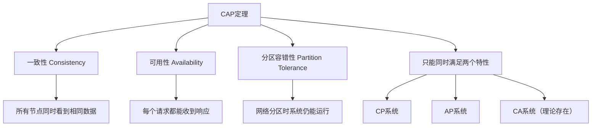

# 分布式数据库设计与原理

## 概述

分布式数据库是现代大规模系统架构的核心组件，它通过将数据和计算分布在多个节点上，实现高可用性、可扩展性和容错能力。深入理解分布式数据库的原理、设计模式和技术选型，是构建企业级系统的关键技能。

## 分布式数据库基础原理

### 分布式数据库概述

**分布式数据库的定义**：
- 分布式数据库是在地理上分布的逻辑数据库，由多个物理数据库组成
- 数据存储在多个计算机节点上，对用户呈现为统一的逻辑数据库
- 具有数据分布性、逻辑统一性、站点自治性和分布透明性等特点

**分布式数据库的优势**：
- **可扩展性**：通过增加节点来扩展存储容量和处理能力
- **可用性**：单点故障不影响整体系统运行
- **性能**：数据就近访问，减少网络延迟
- **成本效益**：可以使用普通硬件构建高性能系统

**分布式数据库的挑战**：
- **一致性**：维护数据在不同节点间的一致性
- **可用性**：在网络分区或节点故障时的服务能力
- **分区容错**：在网络分区时系统仍能运行
- **复杂性**：系统设计和运维复杂度增加

### CAP定理

**CAP定理的核心概念**：



**一致性分类**：

```java
// 一致性模型层次
public class ConsistencyModel {
    
    // 强一致性
    // 所有节点同时看到最新数据
    public interface StrongConsistency {
        void write(String key, String value);
        String read(String key); // 总是返回最新写入的值
    }
    
    // 弱一致性
    // 数据最终会一致，但不保证立即一致
    public interface WeakConsistency {
        void write(String key, String value);
        String read(String key); // 可能返回旧数据
        Duration getInconsistencyWindow();
    }
    
    // 最终一致性
    // 在没有新写入时，数据最终会达到一致
    public interface EventualConsistency {
        void write(String key, String value);
        String read(String key); // 可能返回旧数据，但最终会一致
        boolean isConverged(String key);
    }
    
    // 因果一致性
    // 保证因果相关的操作顺序一致
    public interface CausalConsistency {
        void write(String key, String value);
        void markAsDependent(String key1, String key2); // 定义因果关系
        String read(String key);
    }
    
    // 读己之写一致性
    // 用户总是看到自己的最新写入
    public interface ReadYourWritesConsistency {
        void write(String key, String value, String sessionId);
        String read(String key, String sessionId); // 返回该session的最新写入
    }
}

// 一致性实现示例
public class StrongConsistencyKVStore implements StrongConsistency {
    private List<Node> nodes;
    private int replicationFactor;
    
    public StrongConsistencyKVStore(List<Node> nodes, int replicationFactor) {
        this.nodes = nodes;
        this.replicationFactor = replicationFactor;
    }
    
    @Override
    public void write(String key, String value) {
        // 1. 选择主节点
        Node primary = selectPrimaryNode(key);
        
        // 2. 写入主节点
        primary.write(key, value);
        
        // 3. 同步复制到所有副本
        List<Node> replicas = selectReplicaNodes(key, replicationFactor - 1);
        for (Node replica : replicas) {
            replica.writeAsync(key, value);
        }
        
        // 4. 等待所有副本确认
        waitForAllReplicas(key, value);
    }
    
    @Override
    public String read(String key) {
        // 读取所有副本并比较
        List<String> values = new ArrayList<>();
        for (Node node : nodes) {
            values.add(node.read(key));
        }
        
        // 检查一致性
        String firstValue = values.get(0);
        for (String value : values) {
            if (!value.equals(firstValue)) {
                throw new ConsistencyViolationException("数据不一致");
            }
        }
        
        return firstValue;
    }
    
    private void waitForAllReplicas(String key, String value) {
        // 等待所有副本确认写入
        // 实现细节省略...
    }
}
```

### 数据分片原理

**分片策略**：

```java
// 分片策略接口
public interface ShardingStrategy {
    int shardId(String key, int totalShards);
    List<Integer> shardIds(List<String> keys, int totalShards);
}

// 1. 哈希分片
public class HashShardingStrategy implements ShardingStrategy {
    private final int totalShards;
    
    public HashShardingStrategy(int totalShards) {
        this.totalShards = totalShards;
    }
    
    @Override
    public int shardId(String key, int totalShards) {
        int hash = key.hashCode();
        return Math.abs(hash) % totalShards;
    }
    
    @Override
    public List<Integer> shardIds(List<String> keys, int totalShards) {
        return keys.stream()
                   .map(key -> shardId(key, totalShards))
                   .distinct()
                   .collect(Collectors.toList());
    }
}

// 2. 范围分片
public class RangeShardingStrategy implements ShardingStrategy {
    private final List<RangeShard> rangeShards;
    
    public RangeShardingStrategy(List<RangeShard> rangeShards) {
        this.rangeShards = rangeShards.stream()
                .sorted(Comparator.comparing(RangeShard::getStart))
                .collect(Collectors.toList());
    }
    
    @Override
    public int shardId(String key, int totalShards) {
        long numericKey = Long.parseLong(key);
        for (RangeShard shard : rangeShards) {
            if (numericKey >= shard.getStart() && numericKey < shard.getEnd()) {
                return shard.getShardId();
            }
        }
        throw new KeyOutOfRangeException("Key out of range: " + key);
    }
    
    public static class RangeShard {
        private final long start;
        private final long end;
        private final int shardId;
        
        public RangeShard(long start, long end, int shardId) {
            this.start = start;
            this.end = end;
            this.shardId = shardId;
        }
        
        public long getStart() { return start; }
        public long getEnd() { return end; }
        public int getShardId() { return shardId; }
    }
}

// 3. 目录分片
public class DirectoryShardingStrategy implements ShardingStrategy {
    private final ShardDirectory shardDirectory;
    
    public DirectoryShardingStrategy(ShardDirectory shardDirectory) {
        this.shardDirectory = shardDirectory;
    }
    
    @Override
    public int shardId(String key, int totalShards) {
        return shardDirectory.getShardForKey(key);
    }
    
    public interface ShardDirectory {
        int getShardForKey(String key);
        void updateShardMapping(String key, int shardId);
        void removeShardMapping(String key);
    }
}

// 分片管理器
public class ShardManager {
    private final ShardingStrategy shardingStrategy;
    private final int totalShards;
    private final Map<Integer, ShardNode> shardNodes;
    
    public ShardManager(ShardingStrategy shardingStrategy, int totalShards) {
        this.shardingStrategy = shardingStrategy;
        this.totalShards = totalShards;
        this.shardNodes = new ConcurrentHashMap<>();
    }
    
    public void addShardNode(int shardId, ShardNode node) {
        shardNodes.put(shardId, node);
    }
    
    public void removeShardNode(int shardId) {
        shardNodes.remove(shardId);
    }
    
    public ShardNode getShardNode(String key) {
        int shardId = shardingStrategy.shardId(key, totalShards);
        ShardNode node = shardNodes.get(shardId);
        if (node == null) {
            throw new ShardNotAvailableException("Shard " + shardId + " not available");
        }
        return node;
    }
    
    public List<ShardNode> getShardNodes(List<String> keys) {
        Set<Integer> shardIds = shardingStrategy.shardIds(keys, totalShards).stream()
                .collect(Collectors.toSet());
        
        return shardIds.stream()
                .map(shardNodes::get)
                .filter(Objects::nonNull)
                .collect(Collectors.toList());
    }
}
```

### 副本机制

**复制策略**：

```java
// 复制模式
public enum ReplicationMode {
    SYNCHRONOUS,  // 同步复制
    ASYNCHRONOUS, // 异步复制
    SEMI_SYNC     // 半同步复制
}

// 复制管理器
public class ReplicationManager {
    private final List<ReplicaNode> replicas;
    private final ReplicationMode mode;
    private final int minAckNodes;
    
    public ReplicationManager(List<ReplicaNode> replicas, ReplicationMode mode) {
        this.replicas = replicas;
        this.mode = mode;
        this.minAckNodes = calculateMinAckNodes(mode);
    }
    
    public WriteResult write(String key, String value) {
        switch (mode) {
            case SYNCHRONOUS:
                return writeSynchronous(key, value);
            case ASYNCHRONOUS:
                return writeAsynchronous(key, value);
            case SEMI_SYNC:
                return writeSemiSynchronous(key, value);
            default:
                throw new UnsupportedOperationException("Unsupported replication mode: " + mode);
        }
    }
    
    private WriteResult writeSynchronous(String key, String value) {
        List<CompletableFuture<AckResult>> futures = replicas.stream()
                .map(replica -> replica.writeAsync(key, value))
                .collect(Collectors.toList());
        
        // 等待所有节点确认
        CompletableFuture<Void> allAcks = CompletableFuture.allOf(futures.toArray(new CompletableFuture[0]));
        
        try {
            allAcks.get(5, TimeUnit.SECONDS); // 5秒超时
            
            return WriteResult.success(replicas.size(), replicas.size());
        } catch (TimeoutException e) {
            // 超时处理
            List<String> failedNodes = futures.stream()
                    .filter(future -> !future.isDone() || future.isCompletedExceptionally())
                    .map(future -> "unknown")
                    .collect(Collectors.toList());
            
            return WriteResult.failure(failedNodes, "Write timeout");
        } catch (Exception e) {
            return WriteResult.failure(Collections.emptyList(), e.getMessage());
        }
    }
    
    private WriteResult writeAsynchronous(String key, String value) {
        // 异步写入所有副本
        replicas.forEach(replica -> replica.writeAsync(key, value));
        
        return WriteResult.success(replicas.size(), 1); // 只有主节点确认
    }
    
    private WriteResult writeSemiSynchronous(String key, String value) {
        // 主节点写入
        ReplicaNode primary = replicas.get(0);
        AckResult primaryResult = primary.write(key, value);
        
        if (!primaryResult.isSuccess()) {
            return WriteResult.failure(Collections.singletonList("primary"), "Primary write failed");
        }
        
        // 异步写入其他副本，但等待至少minAckNodes-1个确认
        List<CompletableFuture<AckResult>> futures = replicas.subList(1, replicas.size()).stream()
                .map(replica -> replica.writeAsync(key, value))
                .collect(Collectors.toList());
        
        try {
            CompletableFuture<Void> minAcks = CompletableFuture.allOf(
                futures.subList(0, minAckNodes - 1).toArray(new CompletableFuture[0])
            );
            minAcks.get(3, TimeUnit.SECONDS);
            
            return WriteResult.success(replicas.size(), minAckNodes);
        } catch (TimeoutException e) {
            return WriteResult.failure(Collections.singletonList("timeout"), "Replication timeout");
        }
    }
    
    public String read(String key) {
        if (replicas.isEmpty()) {
            throw new NoReplicaAvailableException("No replicas available");
        }
        
        // 读取所有副本并使用多数投票
        List<String> values = replicas.stream()
                .map(replica -> {
                    try {
                        return replica.read(key);
                    } catch (Exception e) {
                        return null;
                    }
                })
                .filter(Objects::nonNull)
                .collect(Collectors.toList());
        
        if (values.isEmpty()) {
            throw new ReadFailureException("Failed to read from all replicas");
        }
        
        // 使用版本向量解决冲突
        return resolveConflicts(values);
    }
    
    private String resolveConflicts(List<String> values) {
        if (values.size() == 1) {
            return values.get(0);
        }
        
        // 实现冲突解决策略（时间戳、版本号、优先级等）
        return values.stream()
                .max(Comparator.naturalOrder())
                .orElse(values.get(0));
    }
    
    private int calculateMinAckNodes(ReplicationMode mode) {
        switch (mode) {
            case SYNCHRONOUS:
                return replicas.size();
            case SEMI_SYNC:
                return Math.max(2, (replicas.size() / 2) + 1); // 多数
            case ASYNCHRONOUS:
                return 1;
            default:
                return 1;
        }
    }
}
```

## 分布式一致性算法

### Paxos算法

**Paxos原理**：

```java
// Paxos算法实现
public class PaxosNode {
    private final int nodeId;
    private final List<PaxosNode> allNodes;
    private final int quorum;
    
    // Proposer状态
    private int currentProposalNumber = 0;
    private int lastAcceptedProposal = -1;
    private String lastAcceptedValue = null;
    
    // Acceptor状态
    private final Map<Integer, Proposal> acceptedProposals = new ConcurrentHashMap<>();
    private final Map<Integer, Integer> promisedProposals = new ConcurrentHashMap<>();
    
    public PaxosNode(int nodeId, List<PaxosNode> allNodes) {
        this.nodeId = nodeId;
        this.allNodes = allNodes;
        this.quorum = (allNodes.size() / 2) + 1;
    }
    
    // 阶段1：Prepare
    public PrepareResponse prepare(int proposalNumber) {
        if (proposalNumber <= promisedProposals.getOrDefault(nodeId, -1)) {
            return new PrepareResponse(false, lastAcceptedProposal, lastAcceptedValue);
        }
        
        // 更新承诺
        promisedProposals.put(nodeId, proposalNumber);
        
        return new PrepareResponse(true, lastAcceptedProposal, lastAcceptedValue);
    }
    
    // 阶段2：Accept
    public AcceptResponse accept(int proposalNumber, String value) {
        if (proposalNumber < promisedProposals.getOrDefault(nodeId, -1)) {
            return new AcceptResponse(false, "Proposal number too low");
        }
        
        // 接受提议
        acceptedProposals.put(proposalNumber, new Proposal(proposalNumber, value, nodeId));
        lastAcceptedProposal = proposalNumber;
        lastAcceptedValue = value;
        
        return new AcceptResponse(true, "Accepted");
    }
    
    // Proposer发起提议
    public PaxosResult propose(String value) throws InterruptedException {
        int proposalNumber = ++currentProposalNumber;
        
        // 阶段1：Prepare请求
        List<PrepareResponse> prepares = sendPrepareRequests(proposalNumber);
        
        long acceptedCount = prepares.stream().filter(PrepareResponse::isPromise).count();
        if (acceptedCount < quorum) {
            return PaxosResult.failure("Insufficient promises: " + acceptedCount + "/" + quorum);
        }
        
        // 选择值（最高编号的accepted值或新值）
        String chosenValue = selectValue(prepares, value);
        
        // 阶段2：Accept请求
        List<AcceptResponse> accepts = sendAcceptRequests(proposalNumber, chosenValue);
        
        long acceptedCount2 = accepts.stream().filter(AcceptResponse::isAccepted).count();
        if (acceptedCount2 < quorum) {
            return PaxosResult.failure("Insufficient accepts: " + acceptedCount2 + "/" + quorum);
        }
        
        return PaxosResult.success(chosenValue);
    }
    
    private List<PrepareResponse> sendPrepareRequests(int proposalNumber) {
        return allNodes.parallelStream()
                .map(node -> {
                    try {
                        return node.prepare(proposalNumber);
                    } catch (Exception e) {
                        return new PrepareResponse(false, -1, null);
                    }
                })
                .collect(Collectors.toList());
    }
    
    private String selectValue(List<PrepareResponse> prepares, String newValue) {
        return prepares.stream()
                .filter(PrepareResponse::isPromise)
                .filter(response -> response.getLastAcceptedProposal() > -1)
                .max(Comparator.comparing(PrepareResponse::getLastAcceptedProposal))
                .map(PrepareResponse::getLastAcceptedValue)
                .orElse(newValue);
    }
    
    private List<AcceptResponse> sendAcceptRequests(int proposalNumber, String value) {
        return allNodes.parallelStream()
                .map(node -> {
                    try {
                        return node.accept(proposalNumber, value);
                    } catch (Exception e) {
                        return new AcceptResponse(false, e.getMessage());
                    }
                })
                .collect(Collectors.toList());
    }
}

// 结果类
public class PaxosResult {
    private final boolean success;
    private final String value;
    private final String error;
    
    private PaxosResult(boolean success, String value, String error) {
        this.success = success;
        this.value = value;
        this.error = error;
    }
    
    public static PaxosResult success(String value) {
        return new PaxosResult(true, value, null);
    }
    
    public static PaxosResult failure(String error) {
        return new PaxosResult(false, null, error);
    }
    
    public boolean isSuccess() { return success; }
    public String getValue() { return value; }
    public String getError() { return error; }
}
```

### Raft算法

**Raft算法实现**：

```java
// Raft算法实现
public class RaftNode {
    private final int nodeId;
    private final List<RaftNode> allNodes;
    private final int quorum;
    
    // 状态
    private RaftState state = RaftState.FOLLOWER;
    private int currentTerm = 0;
    private int votedFor = -1;
    private int commitIndex = -1;
    private int lastApplied = -1;
    
    // Leader状态
    private int leaderId = -1;
    private final Map<Integer, Integer> nextIndex = new ConcurrentHashMap<>();
    private final Map<Integer, Integer> matchIndex = new ConcurrentHashMap<>();
    
    // 日志
    private final List<LogEntry> log = new ArrayList<>();
    
    // 选举相关
    private long lastHeartbeatTime = 0;
    private final Duration electionTimeout = Duration.ofMillis(150 + new Random().nextInt(150));
    
    // 通信接口
    public interface RaftNode {
        RequestVoteResponse requestVote(RequestVoteRequest request);
        AppendEntriesResponse appendEntries(AppendEntriesRequest request);
        InstallSnapshotResponse installSnapshot(InstallSnapshotRequest request);
    }
    
    // 选举定时器
    public void checkElectionTimeout() {
        if (System.currentTimeMillis() - lastHeartbeatTime > electionTimeout.toMillis()) {
            startElection();
        }
    }
    
    private void startElection() {
        state = RaftState.CANDIDATE;
        currentTerm++;
        votedFor = nodeId;
        lastHeartbeatTime = System.currentTimeMillis();
        
        // 给自己投票
        int voteCount = 1;
        
        // 向其他节点请求投票
        List<RequestVoteResponse> responses = allNodes.parallelStream()
                .filter(node -> node != this)
                .map(node -> node.requestVote(new RequestVoteRequest(currentTerm, nodeId, log.size(), log.isEmpty() ? -1 : log.get(log.size() - 1).getTerm())))
                .collect(Collectors.toList());
        
        for (RequestVoteResponse response : responses) {
            if (response.isVoteGranted()) {
                voteCount++;
            }
        }
        
        if (voteCount >= quorum) {
            becomeLeader();
        } else {
            // 选举失败，回到Follower状态
            state = RaftState.FOLLOWER;
            votedFor = -1;
        }
    }
    
    private void becomeLeader() {
        state = RaftState.LEADER;
        leaderId = nodeId;
        
        // 初始化Leader状态
        for (RaftNode node : allNodes) {
            if (node != this) {
                nextIndex.put(node.nodeId, log.size() + 1);
                matchIndex.put(node.nodeId, 0);
            }
        }
        
        // 立即发送心跳
        sendHeartbeat();
    }
    
    // 日志复制
    public void replicateLog(String command) {
        if (state != RaftState.LEADER) {
            throw new IllegalStateException("Only leader can replicate logs");
        }
        
        // 添加日志条目
        LogEntry entry = new LogEntry(currentTerm, command, System.currentTimeMillis());
        log.add(entry);
        
        // 尝试复制到Followers
        replicateToFollowers();
    }
    
    private void replicateToFollowers() {
        for (RaftNode follower : allNodes) {
            if (follower == this) continue;
            
            try {
                int nextIdx = nextIndex.get(follower.nodeId);
                
                // 准备日志条目
                List<LogEntry> entriesToSend = new ArrayList<>();
                if (nextIdx <= log.size()) {
                    entriesToSend.addAll(log.subList(nextIdx - 1, log.size()));
                }
                
                // 发送AppendEntries
                AppendEntriesRequest request = new AppendEntriesRequest(
                    currentTerm, nodeId, nextIdx - 1, 
                    nextIdx > 1 ? log.get(nextIdx - 2).getTerm() : -1,
                    entriesToSend, commitIndex
                );
                
                AppendEntriesResponse response = follower.appendEntries(request);
                
                if (response.isSuccess()) {
                    // 更新匹配索引
                    if (!entriesToSend.isEmpty()) {
                        matchIndex.put(follower.nodeId, nextIdx + entriesToSend.size() - 1);
                        nextIndex.put(follower.nodeId, matchIndex.get(follower.nodeId) + 1);
                    }
                } else {
                    // 减少nextIndex重试
                    nextIndex.put(follower.nodeId, Math.max(1, nextIdx - 1));
                }
            } catch (Exception e) {
                // 处理失败情况
                nextIndex.put(follower.nodeId, Math.max(1, nextIndex.get(follower.nodeId) - 1));
            }
        }
        
        // 检查是否可以提交
        checkCommitIndex();
    }
    
    private void checkCommitIndex() {
        // 找到大多数节点都有的最高日志索引
        List<Integer> matchIndices = new ArrayList<>(matchIndex.values());
        matchIndices.add(log.size()); // Leader自己的日志
        Collections.sort(matchIndices, Collections.reverseOrder());
        
        int newCommitIndex = matchIndices.get(quorum - 1);
        
        if (newCommitIndex > commitIndex && log.get(newCommitIndex - 1).getTerm() == currentTerm) {
            commitIndex = newCommitIndex;
            applyCommittedEntries();
        }
    }
    
    private void applyCommittedEntries() {
        while (lastApplied < commitIndex) {
            lastApplied++;
            LogEntry entry = log.get(lastApplied);
            applyLogEntry(entry);
        }
    }
    
    private void applyLogEntry(LogEntry entry) {
        // 应用日志条目到状态机
        // 具体实现取决于应用场景
        System.out.println("Applying log entry: " + entry.getCommand());
    }
    
    private void sendHeartbeat() {
        AppendEntriesRequest heartbeat = new AppendEntriesRequest(
            currentTerm, nodeId, log.size(), 
            log.isEmpty() ? -1 : log.get(log.size() - 1).getTerm(),
            Collections.emptyList(), commitIndex
        );
        
        allNodes.parallelStream()
                .filter(node -> node != this)
                .forEach(node -> node.appendEntries(heartbeat));
    }
    
    // 状态机
    public enum RaftState {
        FOLLOWER, CANDIDATE, LEADER
    }
    
    // 日志条目
    public static class LogEntry {
        private final int term;
        private final String command;
        private final long timestamp;
        
        public LogEntry(int term, String command, long timestamp) {
            this.term = term;
            this.command = command;
            this.timestamp = timestamp;
        }
        
        public int getTerm() { return term; }
        public String getCommand() { return command; }
        public long getTimestamp() { return timestamp; }
    }
}
```

## 分布式事务

### 两阶段提交（2PC）

**2PC原理实现**：

```java
// 两阶段提交协议实现
public class TwoPhaseCommitCoordinator {
    private final List<Participant> participants;
    private final String transactionId;
    private CommitState state = CommitState.INITIATED;
    
    public TwoPhaseCommitCoordinator(List<Participant> participants, String transactionId) {
        this.participants = participants;
        this.transactionId = transactionId;
    }
    
    public CommitResult executeTransaction(TransactionAction action) {
        try {
            // 阶段1：准备阶段
            List<PrepareResult> prepareResults = preparePhase(action);
            
            // 检查所有参与者是否准备好
            if (prepareResults.stream().allMatch(PrepareResult::isReady)) {
                // 阶段2：提交阶段
                return commitPhase();
            } else {
                // 中止事务
                return abortPhase();
            }
        } catch (Exception e) {
            // 发生异常，中止事务
            return abortPhase();
        }
    }
    
    private List<PrepareResult> preparePhase(TransactionAction action) {
        List<CompletableFuture<PrepareResult>> futures = participants.stream()
                .map(participant -> CompletableFuture.supplyAsync(() -> {
                    try {
                        return participant.prepare(transactionId, action);
                    } catch (Exception e) {
                        return PrepareResult.notReady(e.getMessage());
                    }
                }))
                .collect(Collectors.toList());
        
        return futures.stream()
                .map(future -> {
                    try {
                        return future.get(30, TimeUnit.SECONDS);
                    } catch (Exception e) {
                        return PrepareResult.notReady("Timeout: " + e.getMessage());
                    }
                })
                .collect(Collectors.toList());
    }
    
    private CommitResult commitPhase() {
        List<CompletableFuture<CommitResult>> futures = participants.stream()
                .map(participant -> CompletableFuture.supplyAsync(() -> {
                    try {
                        return participant.commit(transactionId);
                    } catch (Exception e) {
                        return CommitResult.failure(e.getMessage());
                    }
                }))
                .collect(Collectors.toList());
        
        List<CommitResult> results = futures.stream()
                .map(future -> {
                    try {
                        return future.get(30, TimeUnit.SECONDS);
                    } catch (Exception e) {
                        return CommitResult.failure("Commit timeout: " + e.getMessage());
                    }
                })
                .collect(Collectors.toList());
        
        state = CommitState.COMMITTED;
        
        boolean allCommitted = results.stream().allMatch(CommitResult::isSuccess);
        if (allCommitted) {
            return CommitResult.success("Transaction committed successfully");
        } else {
            // 部分提交失败，需要补偿操作
            compensatePhase(results);
            return CommitResult.failure("Transaction commit failed");
        }
    }
    
    private CommitResult abortPhase() {
        List<CompletableFuture<CommitResult>> futures = participants.stream()
                .map(participant -> CompletableFuture.supplyAsync(() -> {
                    try {
                        return participant.abort(transactionId);
                    } catch (Exception e) {
                        return CommitResult.failure(e.getMessage());
                    }
                }))
                .collect(Collectors.toList());
        
        futures.forEach(future -> {
            try {
                future.get(30, TimeUnit.SECONDS);
            } catch (Exception e) {
                // 记录失败日志
                System.err.println("Abort failed: " + e.getMessage());
            }
        });
        
        state = CommitState.ABORTED;
        return CommitResult.failure("Transaction aborted");
    }
    
    private void compensatePhase(List<CommitResult> results) {
        // 补偿已成功提交的操作
        for (int i = 0; i < participants.size(); i++) {
            if (results.get(i).isSuccess()) {
                try {
                    participants.get(i).compensate(transactionId);
                } catch (Exception e) {
                    // 记录补偿失败，需要人工干预
                    System.err.println("Compensation failed for participant " + i + ": " + e.getMessage());
                }
            }
        }
    }
    
    public enum CommitState {
        INITIATED, PREPARED, COMMITTED, ABORTED
    }
}

// 参与者接口
public interface Participant {
    PrepareResult prepare(String transactionId, TransactionAction action);
    CommitResult commit(String transactionId);
    CommitResult abort(String transactionId);
    void compensate(String transactionId);
}

// 参与者实现
public class DatabaseParticipant implements Participant {
    private final DatabaseConnection connection;
    private final List<TransactionLog> transactionLogs = new ArrayList<>();
    
    @Override
    public PrepareResult prepare(String transactionId, TransactionAction action) {
        try {
            connection.beginTransaction();
            
            // 执行操作前的验证
            if (!action.canExecute(connection)) {
                return PrepareResult.notReady("Validation failed");
            }
            
            // 记录预写日志
            TransactionLog log = new TransactionLog(transactionId, action, TransactionLog.Status.PREPARED);
            transactionLogs.add(log);
            
            // 持有资源锁
            action.acquireLocks(connection);
            
            return PrepareResult.ready();
        } catch (Exception e) {
            return PrepareResult.notReady(e.getMessage());
        }
    }
    
    @Override
    public CommitResult commit(String transactionId) {
        try {
            // 查找对应的预写日志
            TransactionLog log = transactionLogs.stream()
                    .filter(t -> t.getTransactionId().equals(transactionId))
                    .findFirst()
                    .orElseThrow(() -> new IllegalStateException("No prepared transaction found"));
            
            // 提交事务
            action.execute(connection);
            connection.commit();
            
            // 更新日志状态
            log.setStatus(TransactionLog.Status.COMMITTED);
            
            // 释放锁
            action.releaseLocks(connection);
            
            return CommitResult.success("Committed");
        } catch (Exception e) {
            return CommitResult.failure(e.getMessage());
        }
    }
    
    @Override
    public CommitResult abort(String transactionId) {
        try {
            connection.rollback();
            
            // 更新日志状态
            transactionLogs.stream()
                    .filter(t -> t.getTransactionId().equals(transactionId))
                    .forEach(t -> t.setStatus(TransactionLog.Status.ABORTED));
            
            // 释放锁
            action.releaseLocks(connection);
            
            return CommitResult.success("Aborted");
        } catch (Exception e) {
            return CommitResult.failure(e.getMessage());
        }
    }
    
    @Override
    public void compensate(String transactionId) {
        try {
            // 执行补偿操作
            action.compensate(connection);
        } catch (Exception e) {
            throw new CompensationException("Compensation failed", e);
        }
    }
}
```

### 三阶段提交（3PC）

**3PC算法实现**：

```java
// 三阶段提交协议实现
public class ThreePhaseCommitCoordinator {
    private final List<Participant> participants;
    private final String transactionId;
    private CommitState state = CommitState.INITIATED;
    
    public ThreePhaseCommitCoordinator(List<Participant> participants, String transactionId) {
        this.participants = participants;
        this.transactionId = transactionId;
    }
    
    public CommitResult executeTransaction(TransactionAction action) {
        try {
            // 阶段1：Can-Commit阶段
            List<CanCommitResult> canCommitResults = canCommitPhase(action);
            
            if (canCommitResults.stream().allMatch(CanCommitResult::canProceed)) {
                // 阶段2：Pre-Commit阶段
                List<PreCommitResult> preCommitResults = preCommitPhase(action);
                
                if (preCommitResults.stream().allMatch(PreCommitResult::isPrepared)) {
                    // 阶段3：Do-Commit阶段
                    return doCommitPhase();
                } else {
                    // 中止事务
                    return abortPhase();
                }
            } else {
                return abortPhase();
            }
        } catch (Exception e) {
            // 处理超时或网络分区
            return handleFailure(e);
        }
    }
    
    private List<CanCommitResult> canCommitPhase(TransactionAction action) {
        return participants.parallelStream()
                .map(participant -> {
                    try {
                        return participant.canCommit(transactionId, action);
                    } catch (Exception e) {
                        return CanCommitResult.cannotProceed(e.getMessage());
                    }
                })
                .collect(Collectors.toList());
    }
    
    private List<PreCommitResult> preCommitPhase(TransactionAction action) {
        return participants.parallelStream()
                .map(participant -> {
                    try {
                        return participant.preCommit(transactionId, action);
                    } catch (Exception e) {
                        return PreCommitResult.preparationFailed(e.getMessage());
                    }
                })
                .collect(Collectors.toList());
    }
    
    private CommitResult doCommitPhase() {
        List<CompletableFuture<CommitResult>> futures = participants.stream()
                .map(participant -> CompletableFuture.supplyAsync(() -> {
                    try {
                        return participant.doCommit(transactionId);
                    } catch (Exception e) {
                        return CommitResult.failure(e.getMessage());
                    }
                }))
                .collect(Collectors.toList());
        
        state = CommitState.COMMITTED;
        return CommitResult.success("Transaction committed");
    }
    
    private CommitResult abortPhase() {
        participants.parallelStream()
                .forEach(participant -> {
                    try {
                        participant.doAbort(transactionId);
                    } catch (Exception e) {
                        System.err.println("Abort failed: " + e.getMessage());
                    }
                });
        
        state = CommitState.ABORTED;
        return CommitResult.failure("Transaction aborted");
    }
    
    private CommitResult handleFailure(Exception e) {
        // 网络分区或超时情况下的处理
        if (state == CommitState.PRE_COMMITTED) {
            // 如果已经Pre-Commit，尝试Do-Commit
            return doCommitPhase();
        } else {
            // 否则中止事务
            return abortPhase();
        }
    }
    
    public enum CommitState {
        INITIATED, CAN_COMMIT, PRE_COMMITTED, COMMITTED, ABORTED
    }
}
```

### Saga模式

**Saga事务实现**：

```java
// Saga模式实现
public class SagaOrchestrator {
    private final List<SagaStep> steps;
    private final String sagaId;
    private SagaState state = SagaState.INITIATED;
    private final List<SagaStep> completedSteps = new ArrayList<>();
    
    public SagaOrchestrator(List<SagaStep> steps, String sagaId) {
        this.steps = steps;
        this.sagaId = sagaId;
    }
    
    public SagaResult executeSaga() {
        try {
            // 按顺序执行步骤
            for (int i = 0; i < steps.size(); i++) {
                SagaStep step = steps.get(i);
                
                try {
                    // 执行正向操作
                    StepResult result = step.execute(sagaId, i);
                    
                    if (result.isSuccess()) {
                        completedSteps.add(step);
                    } else {
                        // 执行失败，开始补偿
                        return compensateAndFail(step, result);
                    }
                } catch (Exception e) {
                    return compensateAndFail(step, StepResult.failure(e.getMessage()));
                }
            }
            
            state = SagaState.COMPLETED;
            return SagaResult.success("Saga completed successfully");
            
        } catch (Exception e) {
            state = SagaState.FAILED;
            return SagaResult.failure("Saga failed: " + e.getMessage());
        }
    }
    
    private SagaResult compensateAndFail(SagaStep failedStep, StepResult failure) {
        // 从失败的步骤开始，逆向补偿
        List<SagaStep> stepsToCompensate = new ArrayList<>(completedSteps);
        Collections.reverse(stepsToCompensate);
        
        List<CompensationResult> compensationResults = new ArrayList<>();
        
        for (Step step : stepsToCompensate) {
            try {
                CompensationResult result = step.compensate(sagaId);
                compensationResults.add(result);
                
                if (!result.isSuccess()) {
                    // 补偿失败，需要人工干预
                    break;
                }
            } catch (Exception e) {
                compensationResults.add(CompensationResult.failure(e.getMessage()));
                break;
            }
        }
        
        state = SagaState.COMPENSATED;
        return SagaResult.failure("Saga compensated due to: " + failure.getError());
    }
    
    public enum SagaState {
        INITIATED, IN_PROGRESS, COMPLETED, FAILED, COMPENSATED
    }
}

// Saga步骤接口
public interface SagaStep {
    StepResult execute(String sagaId, int stepIndex);
    CompensationResult compensate(String sagaId);
}

// 具体Saga步骤示例
public class OrderProcessingSaga implements SagaStep {
    private final OrderService orderService;
    private final InventoryService inventoryService;
    private final PaymentService paymentService;
    private final NotificationService notificationService;
    
    @Override
    public StepResult execute(String sagaId, int stepIndex) {
        switch (stepIndex) {
            case 0:
                return createOrder(sagaId);
            case 1:
                return reserveInventory(sagaId);
            case 2:
                return processPayment(sagaId);
            case 3:
                return sendConfirmation(sagaId);
            default:
                throw new IllegalArgumentException("Invalid step index: " + stepIndex);
        }
    }
    
    private StepResult createOrder(String sagaId) {
        try {
            Order order = orderService.createOrder(sagaId);
            if (order != null) {
                return StepResult.success(order.getOrderId());
            } else {
                return StepResult.failure("Failed to create order");
            }
        } catch (Exception e) {
            return StepResult.failure("Order creation error: " + e.getMessage());
        }
    }
    
    private StepResult reserveInventory(String sagaId) {
        try {
            boolean reserved = inventoryService.reserveInventory(sagaId);
            if (reserved) {
                return StepResult.success("Inventory reserved");
            } else {
                return StepResult.failure("Inventory reservation failed");
            }
        } catch (Exception e) {
            return StepResult.failure("Inventory error: " + e.getMessage());
        }
    }
    
    private StepResult processPayment(String sagaId) {
        try {
            Payment payment = paymentService.processPayment(sagaId);
            if (payment.isSuccessful()) {
                return StepResult.success(payment.getTransactionId());
            } else {
                return StepResult.failure("Payment processing failed");
            }
        } catch (Exception e) {
            return StepResult.failure("Payment error: " + e.getMessage());
        }
    }
    
    private StepResult sendConfirmation(String sagaId) {
        try {
            notificationService.sendOrderConfirmation(sagaId);
            return StepResult.success("Confirmation sent");
        } catch (Exception e) {
            return StepResult.failure("Notification error: " + e.getMessage());
        }
    }
    
    @Override
    public CompensationResult compensate(String sagaId) {
        // 逆向补偿过程
        List<CompensationResult> results = new ArrayList<>();
        
        try {
            // 3. 取消订单确认
            results.add(cancelConfirmation(sagaId));
            
            // 2. 撤销支付
            results.add(reversePayment(sagaId));
            
            // 1. 释放库存
            results.add(releaseInventory(sagaId));
            
            // 0. 取消订单
            results.add(cancelOrder(sagaId));
            
            return results.stream().anyMatch(CompensationResult::isSuccess) 
                ? CompensationResult.success("Compensation completed")
                : CompensationResult.failure("Compensation failed");
                
        } catch (Exception e) {
            return CompensationResult.failure("Compensation error: " + e.getMessage());
        }
    }
    
    private CompensationResult cancelOrder(String sagaId) {
        try {
            orderService.cancelOrder(sagaId);
            return CompensationResult.success("Order cancelled");
        } catch (Exception e) {
            return CompensationResult.failure("Order cancellation failed: " + e.getMessage());
        }
    }
    
    private CompensationResult releaseInventory(String sagaId) {
        try {
            inventoryService.releaseInventory(sagaId);
            return CompensationResult.success("Inventory released");
        } catch (Exception e) {
            return CompensationResult.failure("Inventory release failed: " + e.getMessage());
        }
    }
    
    private CompensationResult reversePayment(String sagaId) {
        try {
            paymentService.reversePayment(sagaId);
            return CompensationResult.success("Payment reversed");
        } catch (Exception e) {
            return CompensationResult.failure("Payment reversal failed: " + e.getMessage());
        }
    }
    
    private CompensationResult cancelConfirmation(String sagaId) {
        try {
            notificationService.cancelConfirmation(sagaId);
            return CompensationResult.success("Confirmation cancelled");
        } catch (Exception e) {
            return CompensationResult.failure("Confirmation cancellation failed: " + e.getMessage());
        }
    }
}
```

## 分布式查询优化

### 查询路由

**查询路由策略**：

```java
// 查询路由器
public class QueryRouter {
    private final ShardManager shardManager;
    private final ReplicaManager replicaManager;
    private final QueryAnalyzer queryAnalyzer;
    
    public QueryRouter(ShardManager shardManager, ReplicaManager replicaManager, QueryAnalyzer queryAnalyzer) {
        this.shardManager = shardManager;
        this.replicaManager = replicaManager;
        this.queryAnalyzer = queryAnalyzer;
    }
    
    public QueryPlan routeQuery(String query) {
        QueryAnalysis analysis = queryAnalyzer.analyze(query);
        
        return QueryPlan.builder()
                .withQuery(query)
                .withAnalysis(analysis)
                .withTargetShards(determineTargetShards(analysis))
                .withTargetReplicas(selectReplicas(analysis))
                .withExecutionStrategy(determineExecutionStrategy(analysis))
                .build();
    }
    
    private List<ShardInfo> determineTargetShards(QueryAnalysis analysis) {
        if (analysis.isSingleShardQuery()) {
            // 单分片查询
            return Collections.singletonList(shardManager.getShardNode(analysis.getShardKey()));
        } else if (analysis.isFanOutQuery()) {
            // 需要查询所有分片
            return shardManager.getAllShardNodes();
        } else {
            // 部分分片查询
            return analysis.getTargetShards().stream()
                    .map(shardManager::getShardNode)
                    .collect(Collectors.toList());
        }
    }
    
    private List<ReplicaInfo> selectReplicas(QueryAnalysis analysis) {
        if (analysis.isReadOnlyQuery()) {
            // 只读查询可以选择副本
            return replicaManager.getReadableReplicas(analysis.getPreferredConsistency());
        } else {
            // 写查询必须路由到主节点
            return replicaManager.getPrimaryReplicas();
        }
    }
    
    private ExecutionStrategy determineExecutionStrategy(QueryAnalysis analysis) {
        if (analysis.requiresAggregation()) {
            return ExecutionStrategy.FAN_OUT_AGGREGATE;
        } else if (analysis.requiresSorting()) {
            return ExecutionStrategy.FAN_OUT_SORT;
        } else if (analysis.isSimpleQuery()) {
            return ExecutionStrategy.DIRECT_ROUTE;
        } else {
            return ExecutionStrategy.FAN_OUT;
        }
    }
}

// 查询分析器
public class QueryAnalyzer {
    
    public QueryAnalysis analyze(String query) {
        // 解析SQL或查询语言
        QueryParser parser = new QueryParser(query);
        ParsedQuery parsed = parser.parse();
        
        return QueryAnalysis.builder()
                .withQueryType(determineQueryType(parsed))
                .withShardKey(extractShardKey(parsed))
                .withTablesInvolved(extractTables(parsed))
                .withFilters(extractFilters(parsed))
                .withAggregations(extractAggregations(parsed))
                .withSorting(extractSorting(parsed))
                .withRequiresAggregation(determineAggregationNeed(parsed))
                .withReadOnly(isReadOnly(parsed))
                .build();
    }
    
    private QueryType determineQueryType(ParsedQuery parsed) {
        if (parsed.isSelect()) {
            if (parsed.hasJoin()) {
                return QueryType.JOIN_QUERY;
            } else if (parsed.hasAggregation()) {
                return QueryType.AGGREGATION_QUERY;
            } else {
                return QueryType.SIMPLE_SELECT;
            }
        } else if (parsed.isInsert() || parsed.isUpdate() || parsed.isDelete()) {
            return QueryType.WRITE_QUERY;
        }
        return QueryType.UNKNOWN;
    }
    
    private String extractShardKey(ParsedQuery parsed) {
        // 从WHERE子句或查询条件中提取分片键
        List<FilterCondition> filters = parsed.getWhereConditions();
        
        return filters.stream()
                .filter(condition -> condition.isShardKeyCondition())
                .map(FilterCondition::getValue)
                .findFirst()
                .orElse(null);
    }
    
    private boolean isReadOnly(ParsedQuery parsed) {
        return parsed.isSelect() && !parsed.hasForUpdate();
    }
    
    private boolean determineAggregationNeed(ParsedQuery parsed) {
        return parsed.hasGroupBy() || parsed.hasAggregateFunctions();
    }
}

// 查询执行器
public class DistributedQueryExecutor {
    private final QueryRouter queryRouter;
    private final ExecutorService executorService = Executors.newFixedThreadPool(32);
    
    public QueryResult executeQuery(String query) {
        QueryPlan plan = queryRouter.routeQuery(query);
        
        switch (plan.getExecutionStrategy()) {
            case DIRECT_ROUTE:
                return executeDirectRoute(plan);
            case FAN_OUT:
                return executeFanOut(plan);
            case FAN_OUT_AGGREGATE:
                return executeFanOutAggregate(plan);
            case FAN_OUT_SORT:
                return executeFanOutSort(plan);
            default:
                throw new UnsupportedOperationException("Unsupported execution strategy: " + plan.getExecutionStrategy());
        }
    }
    
    private QueryResult executeFanOutAggregate(QueryPlan plan) {
        List<CompletableFuture<PartialResult>> futures = plan.getTargetShards().stream()
                .map(shard -> CompletableFuture.supplyAsync(() -> {
                    try {
                        return executePartialQueryOnShard(plan.getQuery(), shard);
                    } catch (Exception e) {
                        return PartialResult.failure(e.getMessage());
                    }
                }, executorService))
                .collect(Collectors.toList());
        
        List<PartialResult> partialResults = futures.stream()
                .map(future -> {
                    try {
                        return future.get(30, TimeUnit.SECONDS);
                    } catch (Exception e) {
                        return PartialResult.failure("Query timeout: " + e.getMessage());
                    }
                })
                .collect(Collectors.toList());
        
        // 合并和聚合结果
        return mergePartialResults(partialResults, plan.getAnalysis());
    }
    
    private QueryResult executeFanOutSort(QueryPlan plan) {
        List<CompletableFuture<PartialResult>> futures = plan.getTargetShards().stream()
                .map(shard -> CompletableFuture.supplyAsync(() -> {
                    try {
                        PartialResult result = executePartialQueryOnShard(plan.getQuery(), shard);
                        // 在分片上排序部分结果
                        result.sort();
                        return result;
                    } catch (Exception e) {
                        return PartialResult.failure(e.getMessage());
                    }
                }, executorService))
                .collect(Collectors.toList());
        
        List<PartialResult> partialResults = futures.stream()
                .map(future -> {
                    try {
                        return future.get(30, TimeUnit.SECONDS);
                    } catch (Exception e) {
                        return PartialResult.failure("Query timeout: " + e.getMessage());
                    }
                })
                .collect(Collectors.toList());
        
        // 合并排序结果
        return mergeSortedResults(partialResults);
    }
    
    private PartialResult executePartialQueryOnShard(String query, ShardInfo shard) {
        try {
            // 在指定分片上执行查询
            return shard.getConnection().executeQuery(query);
        } catch (Exception e) {
            throw new QueryExecutionException("Failed to execute query on shard " + shard.getShardId(), e);
        }
    }
}
```

## 监控与运维

### 分布式监控

**监控指标收集**：

```java
// 分布式监控服务
@Component
public class DistributedMonitoringService {
    
    @Autowired
    private MetricRegistry metricRegistry;
    
    @Autowired
    private HealthIndicator healthIndicator;
    
    // 监控分布式数据库关键指标
    public void collectMetrics() {
        collectConsistencyMetrics();
        collectLatencyMetrics();
        collectThroughputMetrics();
        collectAvailabilityMetrics();
        collectPartitionMetrics();
    }
    
    private void collectConsistencyMetrics() {
        // 一致性延迟指标
        Timer consistencyTimer = metricRegistry.timer("db.consistency.delay");
        consistencyTimer.record(getConsistencyDelay(), TimeUnit.MILLISECONDS);
        
        // 副本同步状态
        Gauge<Integer> replicaSyncGauge = () -> getReplicaSyncStatus();
        metricRegistry.gauge("db.replica.sync.status", replicaSyncGauge);
        
        // 数据冲突数量
        Counter conflictsCounter = metricRegistry.counter("db.conflicts.total");
        conflictsCounter.inc(getConflictCount());
    }
    
    private void collectLatencyMetrics() {
        // 查询延迟分布
        Timer queryTimer = metricRegistry.timer("db.query.latency");
        
        // 分片查询延迟
        Timer shardQueryTimer = metricRegistry.timer("db.shard.query.latency");
        
        // 网络延迟
        Timer networkTimer = metricRegistry.timer("db.network.latency");
    }
    
    private void collectThroughputMetrics() {
        // 每秒查询数
        Meter queriesPerSecond = metricRegistry.meter("db.queries.per.second");
        
        // 每秒写入数
        Meter writesPerSecond = metricRegistry.meter("db.writes.per.second");
        
        // 数据传输量
        Meter dataTransferRate = metricRegistry.meter("db.data.transfer.rate");
    }
    
    private void collectAvailabilityMetrics() {
        // 节点可用性
        Gauge<Double> availabilityGauge = () -> calculateAvailability();
        metricRegistry.gauge("db.availability", availabilityGauge);
        
        // 故障转移时间
        Timer failoverTimer = metricRegistry.timer("db.failover.time");
        
        // 服务健康状态
        healthIndicator.checkHealth();
    }
    
    private void collectPartitionMetrics() {
        // 分片分布情况
        Map<Integer, Integer> shardSizes = getShardSizes();
        shardSizes.forEach((shardId, size) -> {
            Gauge<Integer> shardSizeGauge = () -> size;
            metricRegistry.gauge("db.shard." + shardId + ".size", shardSizeGauge);
        });
        
        // 数据倾斜程度
        Gauge<Double> dataSkewGauge = () -> calculateDataSkew();
        metricRegistry.gauge("db.data.skew", dataSkewGauge);
    }
    
    public HealthStatus checkSystemHealth() {
        HealthStatus.Builder status = HealthStatus.builder();
        
        // 检查节点健康状态
        List<NodeHealth> nodeHealths = checkAllNodes();
        long healthyNodes = nodeHealths.stream().filter(NodeHealth::isHealthy).count();
        
        if (healthyNodes == nodeHealths.size()) {
            status.up();
        } else if (healthyNodes > nodeHealths.size() / 2) {
            status.degraded();
        } else {
            status.down();
        }
        
        // 添加详细健康信息
        status.withDetail("total_nodes", nodeHealths.size());
        status.withDetail("healthy_nodes", healthyNodes);
        status.withDetail("unhealthy_nodes", nodeHealths.size() - healthyNodes);
        
        // 检查一致性状态
        boolean isConsistent = checkDataConsistency();
        status.withDetail("data_consistent", isConsistent);
        
        // 检查性能状态
        PerformanceStatus perfStatus = checkPerformanceStatus();
        status.withDetail("performance_status", perfStatus.name());
        
        return status.build();
    }
    
    private List<NodeHealth> checkAllNodes() {
        List<NodeInfo> allNodes = getAllNodes();
        
        return allNodes.parallelStream()
                .map(this::checkNodeHealth)
                .collect(Collectors.toList());
    }
    
    private NodeHealth checkNodeHealth(NodeInfo node) {
        try {
            // 检查节点响应时间
            long responseTime = measureNodeResponseTime(node);
            
            // 检查节点连接状态
            boolean isConnected = testNodeConnection(node);
            
            // 检查节点资源使用情况
            ResourceUsage resourceUsage = getNodeResourceUsage(node);
            
            // 检查节点同步状态
            SyncStatus syncStatus = getNodeSyncStatus(node);
            
            return NodeHealth.builder()
                    .withNodeId(node.getNodeId())
                    .withHealthy(isConnected && responseTime < 5000 && syncStatus.isInSync())
                    .withResponseTime(responseTime)
                    .withResourceUsage(resourceUsage)
                    .withSyncStatus(syncStatus)
                    .build();
                    
        } catch (Exception e) {
            return NodeHealth.unhealthy(node.getNodeId(), e.getMessage());
        }
    }
    
    private PerformanceStatus checkPerformanceStatus() {
        // 检查查询延迟
        double avgQueryLatency = getAverageQueryLatency();
        
        // 检查吞吐量
        double throughput = getCurrentThroughput();
        
        // 检查错误率
        double errorRate = getErrorRate();
        
        if (avgQueryLatency < 100 && throughput > 1000 && errorRate < 0.01) {
            return PerformanceStatus.HEALTHY;
        } else if (avgQueryLatency < 500 && throughput > 500 && errorRate < 0.05) {
            return PerformanceStatus.DEGRADED;
        } else {
            return PerformanceStatus.UNHEALTHY;
        }
    }
}
```

### 故障检测与恢复

**故障检测机制**：

```java
// 故障检测器
public class FailureDetector {
    private final List<NodeInfo> nodes;
    private final ScheduledExecutorService scheduler = Executors.newScheduledThreadPool(4);
    private final Map<String, FailureStats> failureStats = new ConcurrentHashMap<>();
    
    public void startDetection() {
        // 定期发送心跳包
        scheduler.scheduleAtFixedRate(this::sendHeartbeats, 0, 1, TimeUnit.SECONDS);
        
        // 定期检查节点状态
        scheduler.scheduleAtFixedRate(this::checkNodeStatus, 0, 5, TimeUnit.SECONDS);
        
        // 定期清理过期的故障记录
        scheduler.scheduleAtFixedRate(this::cleanupFailureStats, 0, 60, TimeUnit.SECONDS);
    }
    
    private void sendHeartbeats() {
        nodes.parallelStream().forEach(node -> {
            try {
                long startTime = System.currentTimeMillis();
                HeartbeatResponse response = sendHeartbeat(node);
                long latency = System.currentTimeMillis() - startTime;
                
                updateNodeHealth(node, true, latency);
                
            } catch (Exception e) {
                updateNodeHealth(node, false, -1);
                recordFailure(node);
            }
        });
    }
    
    private void updateNodeHealth(NodeInfo node, boolean isAlive, long latency) {
        FailureStats stats = failureStats.computeIfAbsent(node.getNodeId(), k -> new FailureStats());
        
        if (isAlive) {
            stats.recordSuccess(latency);
        } else {
            stats.recordFailure();
        }
    }
    
    private void checkNodeStatus() {
        nodes.forEach(node -> {
            FailureStats stats = failureStats.get(node.getNodeId());
            if (stats != null) {
                FailureStatus status = determineNodeStatus(stats);
                if (status != FailureStatus.HEALTHY) {
                    handleNodeFailure(node, status);
                }
            }
        });
    }
    
    private FailureStatus determineNodeStatus(FailureStats stats) {
        if (stats.getConsecutiveFailures() >= 3) {
            return FailureStatus.SUSPECTED_DOWN;
        }
        
        if (stats.getFailureRate() > 0.5) {
            return FailureStatus.UNSTABLE;
        }
        
        if (stats.getAverageLatency() > 5000) {
            return FailureStatus.SLOW;
        }
        
        return FailureStatus.HEALTHY;
    }
    
    private void handleNodeFailure(NodeInfo node, FailureStatus status) {
        switch (status) {
            case SUSPECTED_DOWN:
                markNodeAsDown(node);
                triggerFailover(node);
                break;
            case UNSTABLE:
                logUnstableNode(node, status);
                break;
            case SLOW:
                markNodeAsDegraded(node);
                break;
            default:
                break;
        }
    }
    
    private void triggerFailover(NodeInfo failedNode) {
        // 启动故障转移流程
        FailoverCoordinator coordinator = new FailoverCoordinator();
        FailoverPlan plan = coordinator.createFailoverPlan(failedNode);
        
        coordinator.executeFailover(plan);
    }
}
```

## 总结

分布式数据库是现代企业级系统的核心基础设施，涉及多个复杂的技术领域：

### 核心原理总结

1. **CAP定理**：理解一致性、可用性、分区容错性的权衡
2. **分片策略**：基于哈希、范围或目录的数据分片方法
3. **复制机制**：同步、异步、半同步复制的选择
4. **一致性算法**：Paxos、Raft等分布式一致性协议
5. **事务管理**：2PC、3PC、Saga等分布式事务处理

### 设计要点

1. **数据分布**：合理设计分片键，避免数据倾斜
2. **副本策略**：平衡一致性和可用性
3. **查询优化**：高效的查询路由和执行策略
4. **故障处理**：完善的故障检测和恢复机制
5. **监控运维**：全面的监控指标和健康检查

### 技术选型考虑

1. **业务需求**：强一致性 vs 高可用性的选择
2. **数据规模**：分片策略和副本数量的确定
3. **访问模式**：读写比例和查询类型的影响
4. **成本控制**：硬件成本和运营成本的平衡
5. **团队能力**：技术栈和学习成本

构建分布式数据库系统需要在理论理解的基础上，结合具体业务场景做出合理的设计和实现决策。