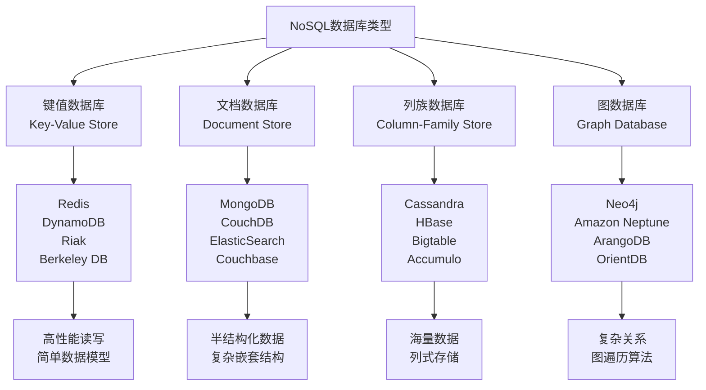

# NoSQL数据库设计与原理

## 概述

NoSQL（Not Only SQL）数据库是针对传统关系型数据库的局限性而发展起来的新型数据库技术。它通过牺牲强一致性来获得更好的可扩展性、灵活性和性能，成为现代互联网应用和大数据处理的重要基础设施。深入理解NoSQL数据库的设计原理、类型特点和适用场景，是构建高性能分布式系统的关键技能。

## NoSQL数据库基础

### NoSQL数据库概述

**NoSQL数据库的定义**：
- NoSQL是一类非关系型数据库的总称，包括文档数据库、键值数据库、列族数据库、图数据库等
- 强调数据存储的灵活性、可扩展性和高性能
- 通常采用分布式架构，支持水平扩展
- 弱化ACID事务特性，追求最终一致性

**NoSQL数据库的优势**：
- **灵活性**：无固定Schema，数据结构灵活多变
- **可扩展性**：天然支持分布式和水平扩展
- **高性能**：针对特定访问模式优化，读写性能优异
- **开发效率**：简化数据模型，降低开发复杂度
- **成本效益**：可以使用普通硬件构建高性能系统

**NoSQL数据库的挑战**：
- **一致性问题**：最终一致性vs强一致性的权衡
- **查询复杂性**：缺乏统一的查询语言和复杂查询能力
- **事务支持**：跨文档/跨表的原子性操作支持有限
- **数据迁移**：不同NoSQL数据库之间的数据迁移复杂
- **运维复杂度**：分布式系统的运维和监控复杂

### NoSQL数据库分类

**NoSQL数据库的四大类型**：



## 键值数据库原理

### 键值存储原理

**键值数据库的核心概念**：

```java
// 键值存储接口
public interface KeyValueStore {
    void put(String key, byte[] value);
    byte[] get(String key);
    void delete(String key);
    boolean exists(String key);
    
    // 批量操作
    void putAll(Map<String, byte[]> entries);
    Map<String, byte[]> getAll(List<String> keys);
    void deleteAll(List<String> keys);
    
    // 迭代操作
    KeyValueIterator scan(String startKey, String endKey);
    KeyValueIterator scanAll();
}

// Redis风格的键值存储实现
public class RedisStyleKeyValueStore implements KeyValueStore {
    private final Map<String, byte[]> dataStore = new ConcurrentHashMap<>();
    private final EvictionPolicy evictionPolicy;
    private final int maxSize;
    
    public RedisStyleKeyValueStore(EvictionPolicy policy, int maxSize) {
        this.evictionPolicy = policy;
        this.maxSize = maxSize;
    }
    
    @Override
    public void put(String key, byte[] value) {
        // 检查容量限制
        if (!dataStore.containsKey(key) && dataStore.size() >= maxSize) {
            evictEntry();
        }
        
        dataStore.put(key, value);
        
        // 更新访问统计
        updateAccessStats(key);
    }
    
    @Override
    public byte[] get(String key) {
        byte[] value = dataStore.get(key);
        
        // 更新访问统计和LRU信息
        if (value != null) {
            updateAccessStats(key);
        }
        
        return value;
    }
    
    @Override
    public void delete(String key) {
        dataStore.remove(key);
        removeAccessStats(key);
    }
    
    @Override
    public KeyValueIterator scan(String startKey, String endKey) {
        return new KeyValueIterator() {
            private final List<String> keys = new ArrayList<>();
            private int currentIndex = 0;
            
            {
                // 收集范围内的键
                dataStore.keySet().stream()
                    .filter(key -> key.compareTo(startKey) >= 0 && 
                                  (endKey == null || key.compareTo(endKey) <= 0))
                    .sorted()
                    .forEach(keys::add);
            }
            
            @Override
            public boolean hasNext() {
                return currentIndex < keys.size();
            }
            
            @Override
            public KeyValueEntry next() {
                if (!hasNext()) {
                    throw new NoSuchElementException();
                }
                
                String key = keys.get(currentIndex++);
                return new KeyValueEntry(key, dataStore.get(key));
            }
        };
    }
    
    private void evictEntry() {
        switch (evictionPolicy) {
            case LRU:
                evictLRU();
                break;
            case LFU:
                evictLFU();
                break;
            case FIFO:
                evictFIFO();
                break;
            case RANDOM:
                evictRandom();
                break;
        }
    }
    
    private void evictLRU() {
        String lruKey = dataStore.entrySet().stream()
                .min(Comparator.comparingLong(entry -> getLastAccessTime(entry.getKey())))
                .map(Map.Entry::getKey)
                .orElseThrow(() new IllegalStateException("No entry to evict"));
        
        dataStore.remove(lruKey);
    }
    
    private void evictLFU() {
        String lfuKey = dataStore.entrySet().stream()
                .min(Comparator.comparingLong(entry -> getAccessCount(entry.getKey())))
                .map(Map.Entry::getKey)
                .orElseThrow(() -> new IllegalStateException("No entry to evict"));
        
        dataStore.remove(lfuKey);
    }
    
    private void evictRandom() {
        List<String> keys = new ArrayList<>(dataStore.keySet());
        String randomKey = keys.get(new Random().nextInt(keys.size()));
        dataStore.remove(randomKey);
    }
    
    // 访问统计管理
    private final Map<String, AccessStats> accessStats = new ConcurrentHashMap<>();
    
    private void updateAccessStats(String key) {
        AccessStats stats = accessStats.computeIfAbsent(key, k -> new AccessStats());
        stats.recordAccess();
    }
    
    private long getLastAccessTime(String key) {
        return accessStats.getOrDefault(key, new AccessStats()).getLastAccessTime();
    }
    
    private long getAccessCount(String key) {
        return accessStats.getOrDefault(key, new AccessStats()).getAccessCount();
    }
    
    public enum EvictionPolicy {
        LRU, LFU, FIFO, RANDOM
    }
    
    private static class AccessStats {
        private long accessCount = 0;
        private long lastAccessTime = System.currentTimeMillis();
        
        void recordAccess() {
            this.accessCount++;
            this.lastAccessTime = System.currentTimeMillis();
        }
        
        long getAccessCount() { return accessCount; }
        long getLastAccessTime() { return lastAccessTime; }
    }
}
```

### 数据分片与一致性

**Dynamo风格的键值存储**：

```java
// Dynamo风格的键值存储
public class DynamoStyleKeyValueStore implements KeyValueStore {
    private final List<Node> nodes;
    private final ConsistentHashing consistentHashing;
    private final int replicationFactor;
    private final ReadRepair readRepair;
    private final ConflictResolver conflictResolver;
    
    public DynamoStyleKeyValueStore(List<Node> nodes, int replicationFactor) {
        this.nodes = nodes;
        this.replicationFactor = replicationFactor;
        this.consistentHashing = new ConsistentHashing(nodes);
        this.readRepair = new ReadRepair();
        this.conflictResolver = new VectorClockResolver();
    }
    
    @Override
    public void put(String key, byte[] value) {
        List<Node> targetNodes = consistentHashing.getNodes(key, replicationFactor);
        
        // 创建带版本的信息
        VersionedValue versionedValue = new VersionedValue(
            value, 
            VectorClock.generateClock(), 
            System.currentTimeMillis()
        );
        
        // 异步写入所有副本
        List<CompletableFuture<WriteResult>> futures = targetNodes.stream()
                .map(node -> CompletableFuture.supplyAsync(() -> {
                    try {
                        return node.put(key, versionedValue);
                    } catch (Exception e) {
                        return WriteResult.failure(e.getMessage());
                    }
                }))
                .collect(Collectors.toList());
        
        // 等待大部分副本确认
        CompletableFuture<Void> majority = CompletableFuture.allOf(
            futures.subList(0, (replicationFactor / 2) + 1).toArray(new CompletableFuture[0])
        );
        
        try {
            majority.get(5, TimeUnit.SECONDS);
        } catch (Exception e) {
            // 处理写入失败
            System.err.println("Write failed: " + e.getMessage());
        }
    }
    
    @Override
    public byte[] get(String key) {
        List<Node> targetNodes = consistentHashing.getNodes(key, replicationFactor);
        
        // 并发读取所有副本
        List<CompletableFuture<VersionedValue>> futures = targetNodes.stream()
                .map(node -> CompletableFuture.supplyAsync(() -> {
                    try {
                        return node.get(key);
                    } catch (Exception e) {
                        return null;
                    }
                }))
                .collect(Collectors.toList());
        
        // 收集结果
        List<VersionedValue> values = futures.stream()
                .map(future -> {
                    try {
                        return future.get(5, TimeUnit.SECONDS);
                    } catch (Exception e) {
                        return null;
                    }
                })
                .filter(Objects::nonNull)
                .collect(Collectors.toList());
        
        if (values.isEmpty()) {
            return null;
        }
        
        // 冲突解决
        VersionedValue resolved = conflictResolver.resolveConflicts(values);
        
        // 读修复
        if (values.size() > 1) {
            readRepair.repairInconsistentReplicas(key, values, targetNodes);
        }
        
        return resolved.getValue();
    }
    
    // 一致性哈希
    public static class ConsistentHashing {
        private final SortedMap<Integer, Node> ring = new TreeMap<>();
        private final int virtualNodes;
        
        public ConsistentHashing(List<Node> nodes) {
            this(nodes, 150); // 默认150个虚拟节点
        }
        
        public ConsistentHashing(List<Node> nodes, int virtualNodes) {
            this.virtualNodes = virtualNodes;
            addNodes(nodes);
        }
        
        public List<Node> getNodes(String key, int count) {
            List<Node> result = new ArrayList<>();
            SortedMap<Integer, Node> tailMap = ring.tailMap(hash(key));
            
            for (Map.Entry<Integer, Node> entry : tailMap.entrySet()) {
                if (result.size() >= count) {
                    break;
                }
                if (!result.contains(entry.getValue())) {
                    result.add(entry.getValue());
                }
            }
            
            // 如果不够，从头开始循环
            if (result.size() < count) {
                for (Map.Entry<Integer, Node> entry : ring.entrySet()) {
                    if (result.size() >= count) {
                        break;
                    }
                    if (!result.contains(entry.getValue())) {
                        result.add(entry.getValue());
                    }
                }
            }
            
            return result;
        }
        
        private int hash(String key) {
            return hash(key.getBytes());
        }
        
        private int hash(byte[] key) {
            // 使用MurmurHash或其他一致性哈希算法
            return MurmurHash3.hash32(key);
        }
        
        private void addNodes(List<Node> nodes) {
            for (Node node : nodes) {
                addNode(node);
            }
        }
        
        private void addNode(Node node) {
            for (int i = 0; i < virtualNodes; i++) {
                int hash = hash((node.getId() + ":" + i).getBytes());
                ring.put(hash, node);
            }
        }
    }
    
    // 向量时钟冲突解决
    public static class VectorClockResolver implements ConflictResolver {
        @Override
        public VersionedValue resolveConflicts(List<VersionedValue> values) {
            if (values.size() == 1) {
                return values.get(0);
            }
            
            // 选择向量时钟最大的值
            return values.stream()
                    .max(Comparator.comparing(v -> v.getVectorClock().getVersion()))
                    .orElse(values.get(0));
        }
    }
    
    // 读修复
    public static class ReadRepair {
        public void repairInconsistentReplicas(String key, List<VersionedValue> values, List<Node> nodes) {
            VersionedValue resolved = resolveMostRecent(values);
            
            // 向不一致的副本写入正确数据
            nodes.parallelStream().forEach(node -> {
                try {
                    VersionedValue current = node.get(key);
                    if (current == null || !current.getVectorClock().equals(resolved.getVectorClock())) {
                        node.put(key, resolved);
                    }
                } catch (Exception e) {
                    // 记录修复失败
                    System.err.println("Read repair failed for node " + node.getId());
                }
            });
        }
        
        private VersionedValue resolveMostRecent(List<VersionedValue> values) {
            return values.stream()
                    .max(Comparator.comparing(VersionedValue::getTimestamp))
                    .orElse(values.get(0));
        }
    }
}
```

## 文档数据库原理

### 文档存储原理

**文档数据库的数据模型**：

```java
// 文档数据库实现
public class DocumentDatabase {
    private final Map<String, Map<String, Document>> collections = new ConcurrentHashMap<>();
    private final IndexManager indexManager;
    private final QueryEngine queryEngine;
    
    public DocumentDatabase() {
        this.indexManager = new IndexManager();
        this.queryEngine = new QueryEngine();
    }
    
    // 文档CRUD操作
    public void insertDocument(String collection, String id, Document document) {
        Map<String, Document> coll = collections.computeIfAbsent(collection, k -> new ConcurrentHashMap<>());
        
        // 检查ID冲突
        if (coll.containsKey(id)) {
            throw new DocumentAlreadyExistsException("Document with id " + id + " already exists");
        }
        
        // 添加元数据
        document.addMetadata("id", id);
        document.addMetadata("created_at", System.currentTimeMillis());
        document.addMetadata("updated_at", System.currentTimeMillis());
        document.addMetadata("_version", 1L);
        
        coll.put(id, document);
        
        // 更新索引
        indexManager.updateIndexes(collection, document, null);
    }
    
    public Document findDocument(String collection, String id) {
        Map<String, Document> coll = collections.get(collection);
        if (coll == null) {
            return null;
        }
        
        Document doc = coll.get(id);
        if (doc != null) {
            // 增加版本号和更新时间
            doc.updateMetadata("last_accessed", System.currentTimeMillis());
            doc.incrementVersion();
        }
        
        return doc;
    }
    
    public void updateDocument(String collection, String id, DocumentUpdate update) {
        Map<String, Document> coll = collections.get(collection);
        if (coll == null || !coll.containsKey(id)) {
            throw new DocumentNotFoundException("Document with id " + id + " not found");
        }
        
        Document oldDoc = coll.get(id);
        Document newDoc = applyUpdate(oldDoc, update);
        
        // 更新元数据
        newDoc.updateMetadata("updated_at", System.currentTimeMillis());
        newDoc.incrementVersion();
        
        coll.put(id, newDoc);
        
        // 更新索引
        indexManager.updateIndexes(collection, newDoc, oldDoc);
    }
    
    public void deleteDocument(String collection, String id) {
        Map<String, Document> coll = collections.get(collection);
        if (coll == null) {
            return;
        }
        
        Document doc = coll.remove(id);
        if (doc != null) {
            // 从索引中删除
            indexManager.removeFromIndexes(collection, doc);
        }
    }
    
    private Document applyUpdate(Document oldDoc, DocumentUpdate update) {
        Document newDoc = new Document(oldDoc);
        
        for (UpdateOperation operation : update.getOperations()) {
            switch (operation.getType()) {
                case SET:
                    newDoc.set(operation.getPath(), operation.getValue());
                    break;
                case UNSET:
                    newDoc.unset(operation.getPath());
                    break;
                case INCREMENT:
                    newDoc.increment(operation.getPath(), (Number) operation.getValue());
                    break;
                case PUSH:
                    newDoc.push(operation.getPath(), operation.getValue());
                    break;
                case PULL:
                    newDoc.pull(operation.getPath(), operation.getValue());
                    break;
                case ARRAY_ADD:
                    newDoc.addToArray(operation.getPath(), operation.getValue());
                    break;
                case ARRAY_REMOVE:
                    newDoc.removeFromArray(operation.getPath(), operation.getValue());
                    break;
            }
        }
        
        return newDoc;
    }
    
    // 查询方法
    public QueryResult query(String collection, Query query) {
        return queryEngine.executeQuery(collection, query, collections);
    }
    
    public List<Document> findByField(String collection, String field, Object value) {
        return indexManager.findByIndexedField(collection, field, value);
    }
    
    // 聚合管道
    public AggregationResult aggregate(String collection, AggregationPipeline pipeline) {
        return queryEngine.executeAggregation(collection, pipeline, collections);
    }
}

// 文档类
public class Document {
    private final Map<String, Object> data = new HashMap<>();
    private final Map<String, Object> metadata = new HashMap<>();
    
    public void set(String path, Object value) {
        set(data, path, value);
    }
    
    public Object get(String path) {
        return get(data, path);
    }
    
    public void unset(String path) {
        unset(data, path);
    }
    
    public void increment(String path, Number amount) {
        Object current = get(path);
        Number newValue = amount.doubleValue();
        
        if (current instanceof Number) {
            newValue = ((Number) current).doubleValue() + amount.doubleValue();
        }
        
        set(path, newValue);
    }
    
    public void push(String path, Object value) {
        Object current = get(path);
        if (current instanceof List) {
            ((List<?>) current).add(value);
        } else {
            List<Object> array = new ArrayList<>();
            array.add(value);
            set(path, array);
        }
    }
    
    public void pull(String path, Object value) {
        Object current = get(path);
        if (current instanceof List) {
            ((List<?>) current).remove(value);
        }
    }
    
    // 内部工具方法
    private void set(Map<String, Object> target, String path, Object value) {
        String[] keys = path.split("\\.");
        Map<String, Object> current = target;
        
        for (int i = 0; i < keys.length - 1; i++) {
            String key = keys[i];
            current.putIfAbsent(key, new HashMap<String, Object>());
            Object next = current.get(key);
            if (next instanceof Map) {
                current = (Map<String, Object>) next;
            } else {
                throw new IllegalArgumentException("Path element " + key + " is not an object");
            }
        }
        
        current.put(keys[keys.length - 1], value);
    }
    
    private Object get(Map<String, Object> source, String path) {
        String[] keys = path.split("\\.");
        Object current = source;
        
        for (String key : keys) {
            if (current instanceof Map) {
                current = ((Map<String, Object>) current).get(key);
            } else {
                return null;
            }
        }
        
        return current;
    }
    
    private void unset(Map<String, Object> target, String path) {
        String[] keys = path.split("\\.");
        Map<String, Object> current = target;
        
        for (int i = 0; i < keys.length - 1; i++) {
            String key = keys[i];
            current = (Map<String, Object>) current.computeIfAbsent(key, k -> new HashMap<>());
        }
        
        current.remove(keys[keys.length - 1]);
    }
    
    // 元数据管理
    public void addMetadata(String key, Object value) {
        metadata.put(key, value);
    }
    
    public void updateMetadata(String key, Object value) {
        metadata.put(key, value);
    }
    
    public void incrementVersion() {
        metadata.computeIfAbsent("_version", k -> 0L);
        metadata.put("_version", ((Number) metadata.get("_version")).longValue() + 1);
    }
    
    // 深度复制
    public Document(Document other) {
        this.data.putAll(deepCopy(other.data));
        this.metadata.putAll(other.metadata);
    }
    
    private Map<String, Object> deepCopy(Map<String, Object> source) {
        Map<String, Object> copy = new HashMap<>();
        source.forEach((key, value) -> {
            if (value instanceof Map) {
                copy.put(key, deepCopy((Map<String, Object>) value));
            } else if (value instanceof List) {
                copy.put(key, new ArrayList<>((List<?>) value));
            } else {
                copy.put(key, value);
            }
        });
        return copy;
    }
}
```

### 索引管理

**文档数据库索引系统**：

```java
// 索引管理器
public class IndexManager {
    private final Map<String, Map<String, Index>> collectionIndexes = new ConcurrentHashMap<>();
    
    // 创建索引
    public void createIndex(String collection, String field, IndexType type) {
        Map<String, Index> indexes = collectionIndexes.computeIfAbsent(collection, k -> new ConcurrentHashMap<>());
        Index index = createIndexInstance(field, type);
        indexes.put(field, index);
    }
    
    // 复合索引
    public void createCompoundIndex(String collection, List<String> fields, IndexType type) {
        String indexKey = String.join(",", fields);
        Map<String, Index> indexes = collectionIndexes.computeIfAbsent(collection, k -> new ConcurrentHashMap<>());
        Index index = new CompoundIndex(fields, type);
        indexes.put(indexKey, index);
    }
    
    // 全文索引
    public void createTextIndex(String collection, List<String> fields) {
        String indexKey = "text_" + String.join("_", fields);
        Map<String, Index> indexes = collectionIndexes.computeIfAbsent(collection, k -> new ConcurrentHashMap<>());
        TextIndex index = new TextIndex(fields);
        indexes.put(indexKey, index);
    }
    
    // 更新索引
    public void updateIndexes(String collection, Document newDoc, Document oldDoc) {
        Map<String, Index> indexes = collectionIndexes.get(collection);
        if (indexes == null) {
            return;
        }
        
        indexes.values().forEach(index -> {
            if (oldDoc != null) {
                index.remove(oldDoc);
            }
            index.add(newDoc);
        });
    }
    
    public void removeFromIndexes(String collection, Document doc) {
        Map<String, Index> indexes = collectionIndexes.get(collection);
        if (indexes == null) {
            return;
        }
        
        indexes.values().forEach(index -> index.remove(doc));
    }
    
    // 索引查询
    public List<Document> findByIndexedField(String collection, String field, Object value) {
        Map<String, Index> indexes = collectionIndexes.get(collection);
        if (indexes == null) {
            return Collections.emptyList();
        }
        
        Index index = indexes.get(field);
        if (index == null) {
            return Collections.emptyList();
        }
        
        return index.find(value);
    }
    
    // 选择最佳索引
    public Index selectBestIndex(String collection, Query query) {
        Map<String, Index> indexes = collectionIndexes.get(collection);
        if (indexes == null) {
            return null;
        }
        
        // 根据查询条件选择最佳索引
        return indexes.values().stream()
                .filter(index -> index.canHandleQuery(query))
                .max(Comparator.comparing(Index::getSelectivity))
                .orElse(null);
    }
    
    private Index createIndexInstance(String field, IndexType type) {
        switch (type) {
            case B_TREE:
                return new BTreeIndex(field);
            case HASH:
                return new HashIndex(field);
            case SPATIAL:
                return new SpatialIndex(field);
            default:
                return new BTreeIndex(field);
        }
    }
}

// B-Tree索引实现
public class BTreeIndex implements Index {
    private final String field;
    private final BTree<Comparable<?>, Set<String>> bTree;
    
    public BTreeIndex(String field) {
        this.field = field;
        this.bTree = new BTree<>();
    }
    
    @Override
    public void add(Document doc) {
        Object value = doc.get(field);
        if (value == null) {
            return;
        }
        
        Comparable<?> key = normalizeKey(value);
        bTree.put(key, doc.getMetadata("id").toString());
    }
    
    @Override
    public void remove(Document doc) {
        Object value = doc.get(field);
        if (value == null) {
            return;
        }
        
        Comparable<?> key = normalizeKey(value);
        bTree.remove(key, doc.getMetadata("id").toString());
    }
    
    @Override
    public List<Document> find(Object value) {
        Comparable<?> key = normalizeKey(value);
        Set<String> docIds = bTree.get(key);
        
        if (docIds == null) {
            return Collections.emptyList();
        }
        
        return docIds.stream()
                .map(this::loadDocument)
                .filter(Objects::nonNull)
                .collect(Collectors.toList());
    }
    
    @Override
    public List<Document> findRange(Object minValue, Object maxValue) {
        Comparable<?> minKey = normalizeKey(minValue);
        Comparable<?> maxKey = normalizeKey(maxValue);
        
        Set<String> docIds = bTree.rangeQuery(minKey, maxKey);
        
        return docIds.stream()
                .map(this::loadDocument)
                .filter(Objects::nonNull)
                .collect(Collectors.toList());
    }
    
    @Override
    public boolean canHandleQuery(Query query) {
        // 检查查询是否可以使用此索引
        return query.hasFieldCondition(field);
    }
    
    @Override
    public double getSelectivity() {
        // 计算索引选择性
        return bTree.getSize() / (double) getTotalDocuments();
    }
    
    private Comparable<?> normalizeKey(Object value) {
        if (value instanceof Comparable) {
            return (Comparable<?>) value;
        }
        return value.toString();
    }
    
    private Document loadDocument(String docId) {
        // 从存储中加载文档
        // 这里需要访问实际的文档存储
        return null; // 简化实现
    }
}

// 全文索引实现
public class TextIndex implements Index {
    private final List<String> fields;
    private final Map<String, InvertedIndex> invertedIndexes = new HashMap<>();
    
    public TextIndex(List<String> fields) {
        this.fields = fields;
        for (String field : fields) {
            invertedIndexes.put(field, new InvertedIndex());
        }
    }
    
    @Override
    public void add(Document doc) {
        for (String field : fields) {
            String text = extractText(doc.get(field));
            List<String> tokens = tokenize(text);
            invertedIndexes.get(field).addTokens(tokens, doc.getMetadata("id").toString());
        }
    }
    
    @Override
    public void remove(Document doc) {
        for (String field : fields) {
            String text = extractText(doc.get(field));
            List<String> tokens = tokenize(text);
            invertedIndexes.get(field).removeTokens(tokens, doc.getMetadata("id").toString());
        }
    }
    
    @Override
    public List<Document> find(Object query) {
        String searchText = query.toString().toLowerCase();
        List<String> searchTokens = tokenize(searchText);
        
        Set<String> candidateDocIds = new HashSet<>();
        boolean first = true;
        
        for (String field : fields) {
            Set<String> fieldDocIds = invertedIndexes.get(field).findDocuments(searchTokens);
            
            if (first) {
                candidateDocIds.addAll(fieldDocIds);
                first = false;
            } else {
                candidateDocIds.retainAll(fieldDocIds);
            }
        }
        
        return candidateDocIds.stream()
                .map(this::loadDocument)
                .filter(Objects::nonNull)
                .collect(Collectors.toList());
    }
    
    @Override
    public boolean canHandleQuery(Query query) {
        return query.isTextSearch() && fields.stream().anyMatch(query::searchesField);
    }
    
    @Override
    public double getSelectivity() {
        // 全文索引的选择性计算
        return 0.1; // 简化实现
    }
    
    private String extractText(Object value) {
        if (value == null) {
            return "";
        }
        return value.toString();
    }
    
    private List<String> tokenize(String text) {
        // 简单的分词实现
        return Arrays.asList(text.toLowerCase().split("\\W+"));
    }
    
    private Document loadDocument(String docId) {
        // 从存储中加载文档
        return null; // 简化实现
    }
}

// 反向索引
public class InvertedIndex {
    private final Map<String, Set<String>> tokenToDocIds = new ConcurrentHashMap<>();
    
    public void addTokens(List<String> tokens, String docId) {
        for (String token : tokens) {
            tokenToDocIds.computeIfAbsent(token, k -> ConcurrentHashMap.newKeySet()).add(docId);
        }
    }
    
    public void removeTokens(List<String> tokens, String docId) {
        for (String token : tokens) {
            Set<String> docIds = tokenToDocIds.get(token);
            if (docIds != null) {
                docIds.remove(docId);
                if (docIds.isEmpty()) {
                    tokenToDocIds.remove(token);
                }
            }
        }
    }
    
    public Set<String> findDocuments(List<String> tokens) {
        return tokens.stream()
                .map(tokenToDocIds::get)
                .filter(Objects::nonNull)
                .reduce(new HashSet<>(), (set1, set2) -> {
                    set1.addAll(set2);
                    return set1;
                });
    }
}
```

## 列族数据库原理

### 列式存储原理

**列族数据库的数据模型**：

```java
// 列族数据库实现
public class ColumnFamilyDatabase {
    private final Map<String, KeySpace> keySpaces = new ConcurrentHashMap<>();
    
    public ColumnFamilyDatabase() {
        // 初始化默认keyspace
        keySpaces.put("default", new KeySpace("default"));
    }
    
    // 写入操作
    public void put(String keyspace, String rowKey, String columnFamily, Map<String, byte[]> columns) {
        KeySpace ks = getOrCreateKeySpace(keyspace);
        Row row = ks.getOrCreateRow(rowKey);
        ColumnFamily cf = row.getOrCreateColumnFamily(columnFamily);
        
        long timestamp = System.currentTimeMillis();
        
        for (Map.Entry<String, byte[]> entry : columns.entrySet()) {
            Column column = new Column(entry.getKey(), entry.getValue(), timestamp);
            cf.put(column);
        }
        
        // 触发压缩和合并
        ks.scheduleCompaction();
    }
    
    // 读取操作
    public Map<String, byte[]> get(String keyspace, String rowKey, String columnFamily) {
        KeySpace ks = keySpaces.get(keyspace);
        if (ks == null) {
            return Collections.emptyMap();
        }
        
        Row row = ks.getRow(rowKey);
        if (row == null) {
            return Collections.emptyMap();
        }
        
        ColumnFamily cf = row.getColumnFamily(columnFamily);
        if (cf == null) {
            return Collections.emptyMap();
        }
        
        // 返回最新版本的数据
        Map<String, byte[]> result = new HashMap<>();
        for (Map.Entry<String, List<Column>> entry : cf.getColumns().entrySet()) {
            Column latest = getLatestColumn(entry.getValue());
            if (latest != null) {
                result.put(entry.getKey(), latest.getValue());
            }
        }
        
        return result;
    }
    
    // 范围查询
    public Map<String, Map<String, byte[]>> getRange(String keyspace, String columnFamily, 
                                                   String startKey, String endKey) {
        KeySpace ks = keySpaces.get(keyspace);
        if (ks == null) {
            return Collections.emptyMap();
        }
        
        return ks.getRowsInRange(startKey, endKey).stream()
                .collect(Collectors.toMap(
                    Row::getKey,
                    row -> {
                        ColumnFamily cf = row.getColumnFamily(columnFamily);
                        if (cf == null) {
                            return Collections.emptyMap();
                        }
                        
                        Map<String, byte[]> result = new HashMap<>();
                        for (Map.Entry<String, List<Column>> entry : cf.getColumns().entrySet()) {
                            Column latest = getLatestColumn(entry.getValue());
                            if (latest != null) {
                                result.put(entry.getKey(), latest.getValue());
                            }
                        }
                        return result;
                    }
                ));
    }
    
    // 批量写入
    public void batchPut(String keyspace, List<BatchMutation> mutations) {
        KeySpace ks = getOrCreateKeySpace(keyspace);
        
        for (BatchMutation mutation : mutations) {
            Row row = ks.getOrCreateRow(mutation.getRowKey());
            
            for (Map.Entry<String, Map<String, byte[]>> cfEntry : mutation.getColumnFamilies().entrySet()) {
                ColumnFamily cf = row.getOrCreateColumnFamily(cfEntry.getKey());
                
                long timestamp = System.currentTimeMillis();
                for (Map.Entry<String, byte[]> columnEntry : cfEntry.getValue().entrySet()) {
                    Column column = new Column(columnEntry.getKey(), columnEntry.getValue(), timestamp);
                    cf.put(column);
                }
            }
        }
        
        ks.scheduleCompaction();
    }
    
    private KeySpace getOrCreateKeySpace(String keyspace) {
        return keySpaces.computeIfAbsent(keyspace, KeySpace::new);
    }
    
    private Column getLatestColumn(List<Column> columns) {
        return columns.stream()
                .max(Comparator.comparing(Column::getTimestamp))
                .orElse(null);
    }
}

// KeySpace实现
public class KeySpace {
    private final String name;
    private final Map<String, Row> rows = new ConcurrentHashMap<>();
    private final CompactionManager compactionManager;
    
    public KeySpace(String name) {
        this.name = name;
        this.compactionManager = new CompactionManager();
    }
    
    public Row getOrCreateRow(String rowKey) {
        return rows.computeIfAbsent(rowKey, Row::new);
    }
    
    public Row getRow(String rowKey) {
        return rows.get(rowKey);
    }
    
    public List<Row> getRowsInRange(String startKey, String endKey) {
        return rows.values().stream()
                .filter(row -> {
                    String key = row.getKey();
                    return key.compareTo(startKey) >= 0 && 
                           (endKey == null || key.compareTo(endKey) <= 0);
                })
                .sorted(Comparator.comparing(Row::getKey))
                .collect(Collectors.toList());
    }
    
    public void scheduleCompaction() {
        compactionManager.scheduleCompaction(this);
    }
}

// Row实现
public class Row {
    private final String key;
    private final Map<String, ColumnFamily> columnFamilies = new ConcurrentHashMap<>();
    
    public Row(String key) {
        this.key = key;
    }
    
    public ColumnFamily getOrCreateColumnFamily(String columnFamily) {
        return columnFamilies.computeIfAbsent(columnFamily, ColumnFamily::new);
    }
    
    public ColumnFamily getColumnFamily(String columnFamily) {
        return columnFamilies.get(columnFamily);
    }
    
    public String getKey() {
        return key;
    }
    
    public Map<String, ColumnFamily> getColumnFamilies() {
        return columnFamilies;
    }
}

// ColumnFamily实现
public class ColumnFamily {
    private final String name;
    private final Map<String, List<Column>> columns = new ConcurrentHashMap<>();
    
    public ColumnFamily(String name) {
        this.name = name;
    }
    
    public void put(Column column) {
        columns.computeIfAbsent(column.getName(), k -> new CopyOnWriteArrayList<>()).add(column);
    }
    
    public void remove(String columnName) {
        columns.remove(columnName);
    }
    
    public Map<String, List<Column>> getColumns() {
        return columns;
    }
    
    public String getName() {
        return name;
    }
}

// Column实现
public class Column {
    private final String name;
    private final byte[] value;
    private final long timestamp;
    
    public Column(String name, byte[] value, long timestamp) {
        this.name = name;
        this.value = value;
        this.timestamp = timestamp;
    }
    
    public String getName() {
        return name;
    }
    
    public byte[] getValue() {
        return value;
    }
    
    public long getTimestamp() {
        return timestamp;
    }
}
```

### 数据压缩与合并

**SSTable和合并策略**：

```java
// SSTable实现
public class SSTable {
    private final File file;
    private final Map<String, List<Column>> index;
    private final CompressionStrategy compression;
    
    public SSTable(File file, CompressionStrategy compression) {
        this.file = file;
        this.compression = compression;
        this.index = new HashMap<>();
    }
    
    public static SSTable writeToFile(String filePath, Map<String, List<Column>> data) throws IOException {
        SSTable ssTable = new SSTable(new File(filePath), new SnappyCompression());
        
        try (DataOutputStream out = new DataOutputStream(
                new BufferedOutputStream(new FileOutputStream(filePath)))) {
            
            // 写入头部信息
            out.writeInt(0x53535442); // 'SSTB' magic number
            out.writeInt(1); // 版本号
            out.writeLong(System.currentTimeMillis());
            out.writeInt(data.size());
            
            long offset = 0;
            
            // 写入数据块
            for (Map.Entry<String, List<Column>> entry : data.entrySet()) {
                String rowKey = entry.getKey();
                List<Column> columns = entry.getValue();
                
                // 记录索引位置
                ssTable.index.put(rowKey, offset);
                
                // 写入行键
                writeString(out, rowKey);
                
                // 写入列数量
                out.writeInt(columns.size());
                
                for (Column column : columns) {
                    writeString(out, column.getName());
                    byte[] compressedValue = ssTable.compression.compress(column.getValue());
                    out.writeInt(compressedValue.length);
                    out.write(compressedValue);
                    out.writeLong(column.getTimestamp());
                }
                
                offset = out.size();
            }
            
            // 写入索引
            long indexOffset = out.size();
            for (Map.Entry<String, Long> indexEntry : ssTable.index.entrySet()) {
                writeString(out, indexEntry.getKey());
                out.writeLong(indexEntry.getValue());
            }
            
            // 写入索引偏移量
            out.writeLong(indexOffset);
        }
        
        return ssTable;
    }
    
    public Map<String, List<Column>> readFromFile() throws IOException {
        Map<String, List<Column>> data = new HashMap<>();
        
        try (DataInputStream in = new DataInputStream(
                new BufferedInputStream(new FileInputStream(file)))) {
            
            // 验证头部
            int magic = in.readInt();
            if (magic != 0x53535442) {
                throw new IOException("Invalid SSTable format");
            }
            
            int version = in.readInt();
            long creationTime = in.readLong();
            int rowCount = in.readInt();
            
            // 读取索引
            long indexOffset = in.readLong();
            in.skipBytes((int) (indexOffset - in.available()));
            
            Map<Long, String> offsetToRowKey = new HashMap<>();
            for (int i = 0; i < rowCount; i++) {
                String rowKey = readString(in);
                long offset = in.readLong();
                offsetToRowKey.put(offset, rowKey);
            }
            
            // 重新定位到数据开始
            in.skipBytes((int) (indexOffset - (file.length() - in.available())));
            
            // 读取数据
            for (int i = 0; i < rowCount; i++) {
                String rowKey = readString(in);
                int columnCount = in.readInt();
                List<Column> columns = new ArrayList<>();
                
                for (int j = 0; j < columnCount; j++) {
                    String columnName = readString(in);
                    int valueLength = in.readInt();
                    byte[] compressedValue = new byte[valueLength];
                    in.readFully(compressedValue);
                    long timestamp = in.readLong();
                    
                    byte[] value = compression.decompress(compressedValue);
                    columns.add(new Column(columnName, value, timestamp));
                }
                
                data.put(rowKey, columns);
            }
        }
        
        return data;
    }
    
    private static void writeString(DataOutputStream out, String str) throws IOException {
        byte[] bytes = str.getBytes("UTF-8");
        out.writeInt(bytes.length);
        out.write(bytes);
    }
    
    private static String readString(DataInputStream in) throws IOException {
        int length = in.readInt();
        byte[] bytes = new byte[length];
        in.readFully(bytes);
        return new String(bytes, "UTF-8");
    }
}

// 压缩策略
public interface CompressionStrategy {
    byte[] compress(byte[] data);
    byte[] decompress(byte[] data);
}

// Snappy压缩实现
public class SnappyCompression implements CompressionStrategy {
    @Override
    public byte[] compress(byte[] data) {
        // 使用Snappy算法压缩
        // 这里使用伪实现，实际中应使用Snappy库
        return data; // 简化实现
    }
    
    @Override
    public byte[] decompress(byte[] data) {
        // 使用Snappy算法解压
        return data; // 简化实现
    }
}

// 合并管理器
public class CompactionManager {
    private final ScheduledExecutorService scheduler = Executors.newScheduledThreadPool(2);
    
    public void scheduleCompaction(KeySpace keySpace) {
        scheduler.schedule(() -> {
            try {
                performCompaction(keySpace);
            } catch (Exception e) {
                System.err.println("Compaction failed: " + e.getMessage());
            }
        }, 1, TimeUnit.MINUTES);
    }
    
    private void performCompaction(KeySpace keySpace) throws IOException {
        // 1. 收集需要合并的SSTable文件
        List<SSTable> sstablesToCompact = selectSSTablesForCompaction(keySpace);
        
        if (sstablesToCompact.size() <= 1) {
            return; // 不需要合并
        }
        
        // 2. 读取所有数据
        Map<String, List<Column>> allData = new HashMap<>();
        
        for (SSTable ssTable : sstablesToCompact) {
            Map<String, List<Column>> tableData = ssTable.readFromFile();
            
            for (Map.Entry<String, List<Column>> entry : tableData.entrySet()) {
                allData.merge(entry.getKey(), entry.getValue(), this::mergeColumns);
            }
        }
        
        // 3. 写入新的SSTable文件
        String newFileName = "sstable_" + System.currentTimeMillis() + ".dat";
        SSTable newSSTable = SSTable.writeToFile(newFileName, allData);
        
        // 4. 删除旧的SSTable文件
        for (SSTable oldSSTable : sstablesToCompact) {
            oldSSTable.delete();
        }
        
        // 5. 注册新的SSTable文件
        keySpace.registerSSTable(newSSTable);
    }
    
    private List<SSTable> selectSSTablesForCompaction(KeySpace keySpace) {
        return keySpace.getSSTables().stream()
                .filter(SSTable::needsCompaction)
                .sorted(Comparator.comparing(SSTable::getSize))
                .collect(Collectors.toList());
    }
    
    private List<Column> mergeColumns(List<Column> cols1, List<Column> cols2) {
        Map<String, Column> mergedColumns = new HashMap<>();
        
        for (Column column : cols1) {
            mergedColumns.put(column.getName(), column);
        }
        
        for (Column column : cols2) {
            // 保留时间戳较新的版本
            if (!mergedColumns.containsKey(column.getName()) ||
                column.getTimestamp() > mergedColumns.get(column.getName()).getTimestamp()) {
                mergedColumns.put(column.getName(), column);
            }
        }
        
        return new ArrayList<>(mergedColumns.values());
    }
}
```

## 图数据库原理

### 图数据模型

**图数据库的数据结构**：

```java
// 图数据库实现
public class GraphDatabase {
    private final Map<String, Vertex> vertices = new ConcurrentHashMap<>();
    private final Map<String, Edge> edges = new ConcurrentHashMap<>();
    private final IndexManager indexManager;
    
    public GraphDatabase() {
        this.indexManager = new IndexManager();
    }
    
    // 顶点操作
    public Vertex addVertex(String id, Map<String, Object> properties) {
        Vertex vertex = new Vertex(id, properties);
        vertices.put(id, vertex);
        
        // 更新索引
        updateVertexIndexes(vertex, null);
        
        return vertex;
    }
    
    public Vertex getVertex(String id) {
        return vertices.get(id);
    }
    
    public void removeVertex(String id) {
        Vertex vertex = vertices.remove(id);
        if (vertex != null) {
            // 删除相关的边
            removeEdgesForVertex(id);
            
            // 从索引中移除
            removeVertexFromIndexes(vertex);
        }
    }
    
    // 边操作
    public Edge addEdge(String id, String sourceId, String targetId, String type, Map<String, Object> properties) {
        Vertex source = vertices.get(sourceId);
        Vertex target = vertices.get(targetId);
        
        if (source == null) {
            throw new VertexNotFoundException("Source vertex not found: " + sourceId);
        }
        
        if (target == null) {
            throw new VertexNotFoundException("Target vertex not found: " + targetId);
        }
        
        Edge edge = new Edge(id, source, target, type, properties);
        edges.put(id, edge);
        
        // 更新顶点的边关系
        source.addOutgoingEdge(edge);
        target.addIncomingEdge(edge);
        
        return edge;
    }
    
    public Edge getEdge(String id) {
        return edges.get(id);
    }
    
    public void removeEdge(String id) {
        Edge edge = edges.remove(id);
        if (edge != null) {
            // 从顶点中移除边引用
            edge.getSource().removeOutgoingEdge(edge);
            edge.getTarget().removeIncomingEdge(edge);
        }
    }
    
    // 图遍历
    public TraversalResult traverse(String startVertexId, TraversalStrategy strategy) {
        Vertex start = vertices.get(startVertexId);
        if (start == null) {
            throw new VertexNotFoundException("Start vertex not found: " + startVertexId);
        }
        
        return strategy.traverse(start, this);
    }
    
    // 路径查找
    public Path findPath(String sourceId, String targetId, PathFindingStrategy strategy) {
        return strategy.findPath(vertices.get(sourceId), vertices.get(targetId), this);
    }
    
    // 社区检测
    public List<Community> detectCommunities(CommunityDetectionStrategy strategy) {
        return strategy.detectCommunities(vertices.values(), edges.values());
    }
    
    // 图查询
    public GraphQuery query() {
        return new GraphQuery(this);
    }
    
    private void updateVertexIndexes(Vertex newVertex, Vertex oldVertex) {
        // 更新属性索引
        for (Map.Entry<String, Object> entry : newVertex.getProperties().entrySet()) {
            indexManager.indexVertexProperty(entry.getKey(), entry.getValue(), newVertex);
        }
    }
    
    private void removeEdgesForVertex(String vertexId) {
        edges.values().removeIf(edge -> 
            edge.getSource().getId().equals(vertexId) || 
            edge.getTarget().getId().equals(vertexId));
    }
    
    private void removeVertexFromIndexes(Vertex vertex) {
        indexManager.removeVertex(vertex);
    }
}

// 顶点类
public class Vertex {
    private final String id;
    private final Map<String, Object> properties;
    private final Set<Edge> outgoingEdges = ConcurrentHashMap.newKeySet();
    private final Set<Edge> incomingEdges = ConcurrentHashMap.newKeySet();
    
    public Vertex(String id, Map<String, Object> properties) {
        this.id = id;
        this.properties = new ConcurrentHashMap<>(properties);
    }
    
    public void addOutgoingEdge(Edge edge) {
        outgoingEdges.add(edge);
    }
    
    public void removeOutgoingEdge(Edge edge) {
        outgoingEdges.remove(edge);
    }
    
    public void addIncomingEdge(Edge edge) {
        incomingEdges.add(edge);
    }
    
    public void removeIncomingEdge(Edge edge) {
        incomingEdges.remove(edge);
    }
    
    // 获取邻居顶点
    public Set<Vertex> getNeighbors(EdgeType edgeType) {
        Set<Vertex> neighbors = new HashSet<>();
        
        switch (edgeType) {
            case OUTGOING:
                outgoingEdges.forEach(edge -> neighbors.add(edge.getTarget()));
                break;
            case INCOMING:
                incomingEdges.forEach(edge -> neighbors.add(edge.getSource()));
                break;
            case BOTH:
                outgoingEdges.forEach(edge -> neighbors.add(edge.getTarget()));
                incomingEdges.forEach(edge -> neighbors.add(edge.getSource()));
                break;
        }
        
        return neighbors;
    }
    
    // 计算度中心性
    public double getDegreeCentrality() {
        return outgoingEdges.size() + incomingEdges.size();
    }
    
    // 计算介数中心性
    public double getBetweennessCentrality() {
        // 简化的介数中心性计算
        return calculateBetweenness();
    }
    
    private double calculateBetweenness() {
        // 使用Brand算法的简化实现
        double betweenness = 0.0;
        
        for (Vertex s : ((GraphDatabase) vertices.values().stream().findAny().orElse(null)).getAllVertices()) {
            for (Vertex t : ((GraphDatabase) vertices.values().stream().findAny().orElse(null)).getAllVertices()) {
                if (s != this && t != this && s != t) {
                    List<Path> paths = findShortestPaths(s, t);
                    if (!paths.isEmpty()) {
                        int totalPaths = paths.size();
                        int pathsThroughThis = (int) paths.stream()
                                .filter(path -> path.containsVertex(this))
                                .count();
                        betweenness += (double) pathsThroughThis / totalPaths;
                    }
                }
            }
        }
        
        return betweenness;
    }
    
    private List<Path> findShortestPaths(Vertex source, Vertex target) {
        // BFS查找最短路径的简化实现
        List<Path> paths = new ArrayList<>();
        Queue<Path> queue = new LinkedList<>();
        
        queue.offer(new Path(source));
        
        while (!queue.isEmpty()) {
            Path currentPath = queue.poll();
            Vertex currentVertex = currentPath.getLastVertex();
            
            if (currentVertex.equals(target)) {
                paths.add(currentPath);
                continue;
            }
            
            for (Edge edge : currentVertex.getOutgoingEdges()) {
                Vertex nextVertex = edge.getTarget();
                if (!currentPath.containsVertex(nextVertex)) {
                    Path newPath = new Path(currentPath);
                    newPath.addVertex(nextVertex, edge);
                    queue.offer(newPath);
                }
            }
        }
        
        return paths;
    }
    
    public String getId() { return id; }
    public Map<String, Object> getProperties() { return properties; }
    public Set<Edge> getOutgoingEdges() { return outgoingEdges; }
    public Set<Edge> getIncomingEdges() { return incomingEdges; }
}

// 边类
public class Edge {
    private final String id;
    private final Vertex source;
    private final Vertex target;
    private final String type;
    private final Map<String, Object> properties;
    
    public Edge(String id, Vertex source, Vertex target, String type, Map<String, Object> properties) {
        this.id = id;
        this.source = source;
        this.target = target;
        this.type = type;
        this.properties = new ConcurrentHashMap<>(properties);
    }
    
    public String getId() { return id; }
    public Vertex getSource() { return source; }
    public Vertex getTarget() { return target; }
    public String getType() { return type; }
    public Map<String, Object> getProperties() { return properties; }
    
    public Vertex getOtherVertex(Vertex vertex) {
        if (vertex.equals(source)) {
            return target;
        } else if (vertex.equals(target)) {
            return source;
        } else {
            throw new IllegalArgumentException("Vertex not part of this edge");
        }
    }
}

// 路径类
public class Path {
    private final List<Vertex> vertices;
    private final List<Edge> edges;
    
    public Path(Vertex start) {
        this.vertices = new ArrayList<>();
        this.edges = new ArrayList<>();
        vertices.add(start);
    }
    
    public Path(Path other) {
        this.vertices = new ArrayList<>(other.vertices);
        this.edges = new ArrayList<>(other.edges);
    }
    
    public void addVertex(Vertex vertex, Edge edge) {
        vertices.add(vertex);
        edges.add(edge);
    }
    
    public Vertex getLastVertex() {
        return vertices.get(vertices.size() - 1);
    }
    
    public boolean containsVertex(Vertex vertex) {
        return vertices.contains(vertex);
    }
    
    public List<Vertex> getVertices() { return vertices; }
    public List<Edge> getEdges() { return edges; }
    public int getLength() { return edges.size(); }
}
```

### 图遍历算法

**深度优先搜索和广度优先搜索**：

```java
// 图遍历策略
public interface TraversalStrategy {
    TraversalResult traverse(Vertex startVertex, GraphDatabase graph);
}

// 深度优先搜索
public class DepthFirstTraversal implements TraversalStrategy {
    private final int maxDepth;
    private final Set<String> edgeTypesToFollow;
    
    public DepthFirstTraversal(int maxDepth, Set<String> edgeTypesToFollow) {
        this.maxDepth = maxDepth;
        this.edgeTypesToFollow = edgeTypesToFollow;
    }
    
    @Override
    public TraversalResult traverse(Vertex startVertex, GraphDatabase graph) {
        TraversalResult result = new TraversalResult();
        Set<String> visited = new HashSet<>();
        
        Stack<Path> stack = new Stack<>();
        stack.push(new Path(startVertex));
        
        while (!stack.isEmpty()) {
            Path currentPath = stack.pop();
            Vertex currentVertex = currentPath.getLastVertex();
            
            if (visited.contains(currentVertex.getId())) {
                continue;
            }
            
            visited.add(currentVertex.getId());
            result.addVisitedVertex(currentVertex, currentPath);
            
            if (currentPath.getLength() < maxDepth) {
                for (Edge edge : currentVertex.getOutgoingEdges()) {
                    if (edgeTypesToFollow.isEmpty() || edgeTypesToFollow.contains(edge.getType())) {
                        Vertex nextVertex = edge.getTarget();
                        
                        if (!visited.contains(nextVertex.getId())) {
                            Path newPath = new Path(currentPath);
                            newPath.addVertex(nextVertex, edge);
                            stack.push(newPath);
                        }
                    }
                }
            }
        }
        
        return result;
    }
}

// 广度优先搜索
public class BreadthFirstTraversal implements TraversalStrategy {
    private final int maxDepth;
    private final Set<String> edgeTypesToFollow;
    
    public BreadthFirstTraversal(int maxDepth, Set<String> edgeTypesToFollow) {
        this.maxDepth = maxDepth;
        this.edgeTypesToFollow = edgeTypesToFollow;
    }
    
    @Override
    public TraversalResult traverse(Vertex startVertex, GraphDatabase graph) {
        TraversalResult result = new TraversalResult();
        Set<String> visited = new HashSet<>();
        Queue<Path> queue = new LinkedList<>();
        
        queue.offer(new Path(startVertex));
        
        while (!queue.isEmpty()) {
            Path currentPath = queue.poll();
            Vertex currentVertex = currentPath.getLastVertex();
            
            if (visited.contains(currentVertex.getId())) {
                continue;
            }
            
            visited.add(currentVertex.getId());
            result.addVisitedVertex(currentVertex, currentPath);
            
            if (currentPath.getLength() < maxDepth) {
                for (Edge edge : currentVertex.getOutgoingEdges()) {
                    if (edgeTypesToFollow.isEmpty() || edgeTypesToFollow.contains(edge.getType())) {
                        Vertex nextVertex = edge.getTarget();
                        
                        if (!visited.contains(nextVertex.getId())) {
                            Path newPath = new Path(currentPath);
                            newPath.addVertex(nextVertex, edge);
                            queue.offer(newPath);
                        }
                    }
                }
            }
        }
        
        return result;
    }
}

// 最短路径算法
public interface PathFindingStrategy {
    Path findPath(Vertex source, Vertex target, GraphDatabase graph);
}

// Dijkstra算法实现
public class DijkstraPathFinder implements PathFindingStrategy {
    @Override
    public Path findPath(Vertex source, Vertex target, GraphDatabase graph) {
        Map<String, Double> distances = new HashMap<>();
        Map<String, String> previous = new HashMap<>();
        Set<String> visited = new HashSet<>();
        PriorityQueue<NodeDistance> queue = new PriorityQueue<>();
        
        // 初始化
        distances.put(source.getId(), 0.0);
        queue.offer(new NodeDistance(source.getId(), 0.0));
        
        while (!queue.isEmpty()) {
            NodeDistance current = queue.poll();
            String currentVertexId = current.getVertexId();
            
            if (visited.contains(currentVertexId)) {
                continue;
            }
            
            visited.add(currentVertexId);
            
            if (currentVertexId.equals(target.getId())) {
                break; // 找到目标
            }
            
            Vertex currentVertex = graph.getVertex(currentVertexId);
            
            // 检查所有邻居
            for (Edge edge : currentVertex.getOutgoingEdges()) {
                String neighborId = edge.getTarget().getId();
                double edgeWeight = getEdgeWeight(edge);
                double newDistance = distances.get(currentVertexId) + edgeWeight;
                
                if (!distances.containsKey(neighborId) || newDistance < distances.get(neighborId)) {
                    distances.put(neighborId, newDistance);
                    previous.put(neighborId, currentVertexId);
                    queue.offer(new NodeDistance(neighborId, newDistance));
                }
            }
        }
        
        // 重建路径
        return reconstructPath(source.getId(), target.getId(), previous);
    }
    
    private double getEdgeWeight(Edge edge) {
        // 从边属性中获取权重，默认值为1.0
        Object weight = edge.getProperties().get("weight");
        if (weight instanceof Number) {
            return ((Number) weight).doubleValue();
        }
        return 1.0;
    }
    
    private Path reconstructPath(String sourceId, String targetId, Map<String, String> previous) {
        List<String> pathIds = new ArrayList<>();
        String current = targetId;
        
        while (current != null) {
            pathIds.add(0, current);
            current = previous.get(current);
        }
        
        if (!pathIds.get(0).equals(sourceId)) {
            return null; // 没有找到路径
        }
        
        // 构建路径对象
        Path path = null; // 这里需要图的引用来构建完整的路径对象
        
        return path;
    }
    
    private static class NodeDistance implements Comparable<NodeDistance> {
        private final String vertexId;
        private final double distance;
        
        public NodeDistance(String vertexId, double distance) {
            this.vertexId = vertexId;
            this.distance = distance;
        }
        
        @Override
        public int compareTo(NodeDistance other) {
            return Double.compare(this.distance, other.distance);
        }
        
        public String getVertexId() { return vertexId; }
        public double getDistance() { return distance; }
    }
}

// 社区检测算法
public interface CommunityDetectionStrategy {
    List<Community> detectCommunities(Collection<Vertex> vertices, Collection<Edge> edges);
}

// Louvain算法实现
public class LouvainCommunityDetection implements CommunityDetectionStrategy {
    @Override
    public List<Community> detectCommunities(Collection<Vertex> vertices, Collection<Edge> edges) {
        // 初始化：每个顶点为一个社区
        Map<String, Integer> vertexCommunity = new HashMap<>();
        Map<Integer, Set<String>> communities = new HashMap<>();
        
        int communityId = 0;
        for (Vertex vertex : vertices) {
            vertexCommunity.put(vertex.getId(), communityId);
            communities.put(communityId, new HashSet<>(Collections.singletonList(vertex.getId())));
            communityId++;
        }
        
        boolean improved = true;
        while (improved) {
            improved = false;
            
            for (Vertex vertex : vertices) {
                int currentCommunity = vertexCommunity.get(vertex.getId());
                int bestCommunity = currentCommunity;
                double bestGain = 0.0;
                
                // 检查移动到邻居社区的收益
                Map<Integer, Double> communityGains = calculateCommunityGains(vertex, vertexCommunity, communities);
                
                for (Map.Entry<Integer, Double> gainEntry : communityGains.entrySet()) {
                    if (gainEntry.getValue() > bestGain) {
                        bestGain = gainEntry.getValue();
                        bestCommunity = gainEntry.getKey();
                    }
                }
                
                // 如果找到更好的社区，移动顶点
                if (bestCommunity != currentCommunity && bestGain > 0) {
                    moveVertexToCommunity(vertex.getId(), currentCommunity, bestCommunity, 
                                        vertexCommunity, communities);
                    improved = true;
                }
            }
        }
        
        // 构建社区结果
        return communities.entrySet().stream()
                .map(entry -> new Community(entry.getKey(), entry.getValue()))
                .collect(Collectors.toList());
    }
    
    private Map<Integer, Double> calculateCommunityGains(Vertex vertex, 
                                                        Map<String, Integer> vertexCommunity,
                                                        Map<Integer, Set<String>> communities) {
        Map<Integer, Double> gains = new HashMap<>();
        
        for (Edge edge : vertex.getOutgoingEdges()) {
            Vertex neighbor = edge.getTarget();
            int neighborCommunity = vertexCommunity.get(neighbor.getId());
            
            // 计算移动到邻居社区的收益
            double gain = calculateModularityGain(vertex, neighborCommunity, vertexCommunity, communities);
            gains.put(neighborCommunity, gains.getOrDefault(neighborCommunity, 0.0) + gain);
        }
        
        return gains;
    }
    
    private double calculateModularityGain(Vertex vertex, int targetCommunity,
                                         Map<String, Integer> vertexCommunity,
                                         Map<Integer, Set<String>> communities) {
        // 简化的模块度增益计算
        // 实际实现需要计算更复杂的网络拓扑指标
        
        Set<String> targetCommunityVertices = communities.get(targetCommunity);
        if (targetCommunityVertices == null) {
            return 0.0;
        }
        
        double internalEdges = 0.0;
        double totalEdges = vertex.getOutgoingEdges().size();
        
        for (Edge edge : vertex.getOutgoingEdges()) {
            if (targetCommunityVertices.contains(edge.getTarget().getId())) {
                internalEdges++;
            }
        }
        
        return (internalEdges / totalEdges) - (targetCommunityVertices.size() / (double) communities.size());
    }
    
    private void moveVertexToCommunity(String vertexId, int fromCommunity, int toCommunity,
                                     Map<String, Integer> vertexCommunity,
                                     Map<Integer, Set<String>> communities) {
        // 更新顶点社区映射
        vertexCommunity.put(vertexId, toCommunity);
        
        // 更新社区成员
        communities.get(fromCommunity).remove(vertexId);
        communities.computeIfAbsent(toCommunity, k -> new HashSet<>()).add(vertexId);
        
        // 如果原社区为空，删除它
        if (communities.get(fromCommunity).isEmpty()) {
            communities.remove(fromCommunity);
        }
    }
}

// 社区类
public class Community {
    private final int id;
    private final Set<String> vertexIds;
    
    public Community(int id, Set<String> vertexIds) {
        this.id = id;
        this.vertexIds = new HashSet<>(vertexIds);
    }
    
    public int getId() { return id; }
    public Set<String> getVertexIds() { return vertexIds; }
    public int getSize() { return vertexIds.size(); }
}
```

## 总结

NoSQL数据库通过不同的数据模型和存储策略，为现代应用提供了灵活的数据存储解决方案：

### 各类型数据库特点总结

1. **键值数据库**：
   - 极高的读写性能
   - 简单数据模型
   - 适用于缓存、会话存储等场景

2. **文档数据库**：
   - 灵活的半结构化数据模型
   - 丰富的查询能力
   - 适用于内容管理、用户画像等场景

3. **列族数据库**：
   - 高压缩率和写入性能
   - 适用于时间序列、日志数据等大规模数据存储

4. **图数据库**：
   - 高效处理复杂关系
   - 专门的图遍历算法
   - 适用于社交网络、推荐系统等场景

### 选型原则

1. **数据模型匹配**：根据数据结构选择合适的存储模型
2. **查询模式**：评估查询复杂度和频率
3. **一致性需求**：平衡一致性和可用性
4. **扩展性要求**：考虑数据增长和扩展需求
5. **团队能力**：考虑技术栈和运维成本

### 设计最佳实践

1. **合理设计数据模型**：充分利用数据库特性设计高效的数据结构
2. **优化索引策略**：根据查询模式设计合适的索引
3. **考虑数据分布**：合理设计分片键避免数据倾斜
4. **监控和调优**：建立完善的监控体系，及时发现和解决问题
5. **容错和恢复**：设计可靠的备份和恢复策略

通过深入理解NoSQL数据库的原理和特点，可以为不同的应用场景选择合适的数据库解决方案，构建高性能、可扩展的数据存储系统。