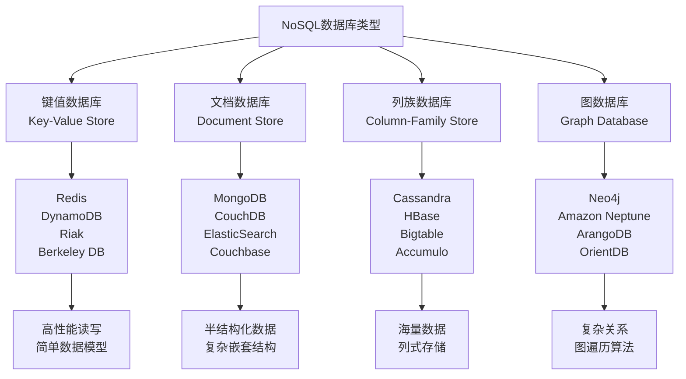

# NoSQL数据库设计与原理

## 概述

NoSQL（Not Only SQL）数据库是针对传统关系型数据库的局限性而发展起来的新型数据库技术。它通过牺牲强一致性来获得更好的可扩展性、灵活性和性能，成为现代互联网应用和大数据处理的重要基础设施。深入理解NoSQL数据库的设计原理、类型特点和适用场景，是构建高性能分布式系统的关键技能。

## NoSQL数据库基础

### NoSQL数据库概述

**NoSQL数据库的定义**：
- NoSQL是一类非关系型数据库的总称，包括文档数据库、键值数据库、列族数据库、图数据库等
- 强调数据存储的灵活性、可扩展性和高性能
- 通常采用分布式架构，支持水平扩展
- 弱化ACID事务特性，追求最终一致性

**NoSQL数据库的优势**：
- **灵活性**：无固定Schema，数据结构灵活多变
- **可扩展性**：天然支持分布式和水平扩展
- **高性能**：针对特定访问模式优化，读写性能优异
- **开发效率**：简化数据模型，降低开发复杂度
- **成本效益**：可以使用普通硬件构建高性能系统

**NoSQL数据库的挑战**：
- **一致性问题**：最终一致性vs强一致性的权衡
- **查询复杂性**：缺乏统一的查询语言和复杂查询能力
- **事务支持**：跨文档/跨表的原子性操作支持有限
- **数据迁移**：不同NoSQL数据库之间的数据迁移复杂
- **运维复杂度**：分布式系统的运维和监控复杂

### NoSQL数据库分类

**NoSQL数据库的四大类型**：



## 键值数据库原理

### 键值存储原理

**键值数据库的核心概念**：

```python
# 键值存储接口
from abc import ABC, abstractmethod
from typing import Dict, List, Optional, Iterator, Any
import threading
import time
import random
from collections import OrderedDict, defaultdict
from enum import Enum

class KeyValueEntry:
    """键值条目"""
    def __init__(self, key: str, value: bytes):
        self.key = key
        self.value = value

class KeyValueIterator(Iterator[KeyValueEntry], ABC):
    """键值迭代器接口"""
    pass

class KeyValueStore(ABC):
    """键值存储接口"""
    
    @abstractmethod
    def put(self, key: str, value: bytes) -> None:
        """写入键值对"""
        pass
    
    @abstractmethod
    def get(self, key: str) -> Optional[bytes]:
        """读取键对应的值"""
        pass
    
    @abstractmethod
    def delete(self, key: str) -> None:
        """删除键值对"""
        pass
    
    @abstractmethod
    def exists(self, key: str) -> bool:
        """检查键是否存在"""
        pass
    
    @abstractmethod
    def put_all(self, entries: Dict[str, bytes]) -> None:
        """批量写入键值对"""
        pass
    
    @abstractmethod
    def get_all(self, keys: List[str]) -> Dict[str, bytes]:
        """批量读取键对应的值"""
        pass
    
    @abstractmethod
    def delete_all(self, keys: List[str]) -> None:
        """批量删除键值对"""
        pass
    
    @abstractmethod
    def scan(self, start_key: str, end_key: Optional[str] = None) -> KeyValueIterator:
        """扫描指定范围的键值对"""
        pass
    
    @abstractmethod
    def scan_all(self) -> KeyValueIterator:
        """扫描所有键值对"""
        pass

# 驱逐策略枚举
class EvictionPolicy(Enum):
    LRU = "最近最少使用"
    LFU = "最不经常使用"
    FIFO = "先进先出"
    RANDOM = "随机"

# Redis风格的键值存储实现
class RedisStyleKeyValueStore(KeyValueStore):
    """Redis风格的键值存储实现"""
    
    def __init__(self, policy: EvictionPolicy, max_size: int):
        self.data_store: Dict[str, bytes] = {}  # 数据存储
        self.eviction_policy = policy  # 驱逐策略
        self.max_size = max_size  # 最大容量
        self.access_stats: Dict[str, "AccessStats"] = {}  # 访问统计
        self.lock = threading.RLock()  # 线程安全锁
        self.insertion_order = OrderedDict()  # 用于FIFO策略
    
    def put(self, key: str, value: bytes) -> None:
        """写入键值对"""
        with self.lock:
            # 检查容量限制
            if key not in self.data_store and len(self.data_store) >= self.max_size:
                self._evict_entry()
            
            # 更新或插入数据
            self.data_store[key] = value
            
            # 更新访问统计
            self._update_access_stats(key)
            
            # 更新插入顺序（用于FIFO）
            if self.eviction_policy == EvictionPolicy.FIFO:
                if key in self.insertion_order:
                    del self.insertion_order[key]
                self.insertion_order[key] = None
    
    def get(self, key: str) -> Optional[bytes]:
        """读取键对应的值"""
        with self.lock:
            value = self.data_store.get(key)
            
            # 更新访问统计
            if value is not None:
                self._update_access_stats(key)
                
                # 更新插入顺序位置（用于FIFO）
                if self.eviction_policy == EvictionPolicy.FIFO and key in self.insertion_order:
                    del self.insertion_order[key]
                    self.insertion_order[key] = None
            
            return value
    
    def delete(self, key: str) -> None:
        """删除键值对"""
        with self.lock:
            if key in self.data_store:
                del self.data_store[key]
                self._remove_access_stats(key)
                if self.eviction_policy == EvictionPolicy.FIFO and key in self.insertion_order:
                    del self.insertion_order[key]
    
    def exists(self, key: str) -> bool:
        """检查键是否存在"""
        with self.lock:
            return key in self.data_store
    
    def put_all(self, entries: Dict[str, bytes]) -> None:
        """批量写入键值对"""
        for key, value in entries.items():
            self.put(key, value)
    
    def get_all(self, keys: List[str]) -> Dict[str, bytes]:
        """批量读取键对应的值"""
        result = {}
        for key in keys:
            value = self.get(key)
            if value is not None:
                result[key] = value
        return result
    
    def delete_all(self, keys: List[str]) -> None:
        """批量删除键值对"""
        for key in keys:
            self.delete(key)
    
    def scan(self, start_key: str, end_key: Optional[str] = None) -> KeyValueIterator:
        """扫描指定范围的键值对"""
        with self.lock:
            # 创建键列表的副本
            keys = sorted(list(self.data_store.keys()))
            
            # 筛选范围内的键
            filtered_keys = []
            for key in keys:
                if key >= start_key and (end_key is None or key <= end_key):
                    filtered_keys.append(key)
            
            # 创建迭代器
            class ScanIterator(KeyValueIterator):
                def __init__(self, data_store, keys):
                    self.data_store = data_store
                    self.keys = keys
                    self.index = 0
                
                def __next__(self):
                    if self.index >= len(self.keys):
                        raise StopIteration
                    key = self.keys[self.index]
                    self.index += 1
                    return KeyValueEntry(key, self.data_store[key])
            
            return ScanIterator(self.data_store.copy(), filtered_keys)
    
    def scan_all(self) -> KeyValueIterator:
        """扫描所有键值对"""
        return self.scan("", None)
    
    def _evict_entry(self) -> None:
        """根据策略驱逐条目"""
        if not self.data_store:
            return
        
        with self.lock:
            if self.eviction_policy == EvictionPolicy.LRU:
                self._evict_lru()
            elif self.eviction_policy == EvictionPolicy.LFU:
                self._evict_lfu()
            elif self.eviction_policy == EvictionPolicy.FIFO:
                self._evict_fifo()
            elif self.eviction_policy == EvictionPolicy.RANDOM:
                self._evict_random()
    
    def _evict_lru(self) -> None:
        """驱逐最近最少使用的条目"""
        if not self.data_store:
            return
        
        # 找到最后访问时间最早的键
        lru_key = min(
            self.data_store.keys(),
            key=lambda k: self._get_last_access_time(k)
        )
        
        self.data_store.pop(lru_key)
        self._remove_access_stats(lru_key)
    
    def _evict_lfu(self) -> None:
        """驱逐最不经常使用的条目"""
        if not self.data_store:
            return
        
        # 找到访问次数最少的键
        lfu_key = min(
            self.data_store.keys(),
            key=lambda k: self._get_access_count(k)
        )
        
        self.data_store.pop(lfu_key)
        self._remove_access_stats(lfu_key)
    
    def _evict_fifo(self) -> None:
        """驱逐最先插入的条目"""
        if not self.data_store or not self.insertion_order:
            return
        
        # 移除第一个插入的键
        fifo_key, _ = self.insertion_order.popitem(last=False)
        self.data_store.pop(fifo_key)
        self._remove_access_stats(fifo_key)
    
    def _evict_random(self) -> None:
        """随机驱逐条目"""
        if not self.data_store:
            return
        
        # 随机选择一个键
        random_key = random.choice(list(self.data_store.keys()))
        self.data_store.pop(random_key)
        self._remove_access_stats(random_key)
    
    def _update_access_stats(self, key: str) -> None:
        """更新访问统计"""
        stats = self.access_stats.setdefault(key, self.AccessStats())
        stats.record_access()
    
    def _remove_access_stats(self, key: str) -> None:
        """移除访问统计"""
        if key in self.access_stats:
            del self.access_stats[key]
    
    def _get_last_access_time(self, key: str) -> float:
        """获取最后访问时间"""
        stats = self.access_stats.get(key)
        return stats.last_access_time if stats else 0
    
    def _get_access_count(self, key: str) -> int:
        """获取访问次数"""
        stats = self.access_stats.get(key)
        return stats.access_count if stats else 0
    
    # 访问统计内部类
    class AccessStats:
        """访问统计信息"""
        
        def __init__(self):
            self.access_count = 0
            self.last_access_time = time.time()
        
        def record_access(self) -> None:
            """记录一次访问"""
            self.access_count += 1
            self.last_access_time = time.time()
    
    # 异常类
    class NoSuchElementException(Exception):
        """元素不存在异常"""
        pass
    
    class IllegalStateException(Exception):
        """非法状态异常"""
        pass
```

### 数据分片与一致性

**Dynamo风格的键值存储**：

```python
# Dynamo风格的键值存储
import asyncio
import hashlib
import time
from typing import List, Dict, Optional, Tuple, Any
from dataclasses import dataclass
from enum import Enum
import threading
from collections import OrderedDict

# 版本化值
@dataclass
class VersionedValue:
    value: bytes
    vector_clock: Dict[str, int]
    timestamp: int

# 写入结果
@dataclass
class WriteResult:
    success: bool
    message: str
    
    @staticmethod
    def success():
        return WriteResult(True, "")
    
    @staticmethod
    def failure(message: str):
        return WriteResult(False, message)

# 节点接口
class Node:
    """分布式系统中的节点"""
    
    def __init__(self, node_id: str):
        self.node_id = node_id
        self.data: Dict[str, VersionedValue] = {}
        self.lock = threading.RLock()
    
    async def put(self, key: str, value: VersionedValue) -> WriteResult:
        """写入键值对"""
        try:
            with self.lock:
                self.data[key] = value
            return WriteResult.success()
        except Exception as e:
            return WriteResult.failure(str(e))
    
    async def get(self, key: str) -> Optional[VersionedValue]:
        """读取键值对"""
        try:
            with self.lock:
                return self.data.get(key)
        except Exception:
            return None

# 一致性哈希实现
class ConsistentHashing:
    """一致性哈希实现"""
    
    def __init__(self, nodes: List[Node], replicas: int = 100):
        self.replicas = replicas
        self.ring: Dict[int, Node] = {}
        self.nodes = nodes
        
        # 构建哈希环
        for node in nodes:
            self._add_node_to_ring(node)
    
    def _add_node_to_ring(self, node: Node) -> None:
        """将节点添加到哈希环"""
        for i in range(self.replicas):
            # 创建虚拟节点
            hash_value = self._hash(f"{node.node_id}:{i}")
            self.ring[hash_value] = node
    
    def _remove_node_from_ring(self, node: Node) -> None:
        """从哈希环移除节点"""
        for i in range(self.replicas):
            hash_value = self._hash(f"{node.node_id}:{i}")
            if hash_value in self.ring:
                del self.ring[hash_value]
    
    def _hash(self, key: str) -> int:
        """哈希函数"""
        return int(hashlib.md5(key.encode()).hexdigest(), 16)
    
    def get_nodes(self, key: str, count: int) -> List[Node]:
        """获取负责处理指定键的节点列表"""
        if not self.ring:
            return []
        
        hash_value = self._hash(key)
        
        # 找到第一个大于等于该哈希值的节点
        sorted_keys = sorted(self.ring.keys())
        index = 0
        for i, k in enumerate(sorted_keys):
            if k >= hash_value:
                index = i
                break
        
        # 收集节点
        result = []
        seen = set()
        
        while len(result) < count and len(seen) < len(self.nodes):
            key = sorted_keys[index % len(sorted_keys)]
            node = self.ring[key]
            
            if node.node_id not in seen:
                seen.add(node.node_id)
                result.append(node)
            
            index += 1
        
        return result

# 向量时钟
class VectorClock:
    """向量时钟实现"""
    
    @staticmethod
    def generate_clock() -> Dict[str, int]:
        """生成初始时钟"""
        return {}
    
    @staticmethod
    def increment(clock: Dict[str, int], node_id: str) -> Dict[str, int]:
        """增加节点的时钟值"""
        new_clock = clock.copy()
        new_clock[node_id] = new_clock.get(node_id, 0) + 1
        return new_clock
    
    @staticmethod
    def merge(clock1: Dict[str, int], clock2: Dict[str, int]) -> Dict[str, int]:
        """合并两个时钟"""
        merged = clock1.copy()
        for node_id, value in clock2.items():
            merged[node_id] = max(merged.get(node_id, 0), value)
        return merged

# 冲突解决器接口
class ConflictResolver:
    """冲突解决器接口"""
    
    def resolve_conflicts(self, values: List[VersionedValue]) -> VersionedValue:
        """解决版本冲突"""
        pass

# 向量时钟冲突解决器
class VectorClockResolver(ConflictResolver):
    """基于向量时钟的冲突解决器"""
    
    def resolve_conflicts(self, values: List[VersionedValue]) -> VersionedValue:
        """解决版本冲突"""
        if not values:
            raise ValueError("No values to resolve")
        
        # 找到最新的向量时钟
        latest = values[0]
        for value in values[1:]:
            if self._is_newer(value.vector_clock, latest.vector_clock):
                latest = value
        
        return latest
    
    def _is_newer(self, clock1: Dict[str, int], clock2: Dict[str, int]) -> bool:
        """判断clock1是否比clock2新"""
        # 检查clock1是否包含clock2的所有条目
        for node_id, value in clock2.items():
            if clock1.get(node_id, 0) < value:
                return False
        
        # 检查clock1是否至少有一个条目比clock2新
        for node_id, value in clock1.items():
            if value > clock2.get(node_id, 0):
                return True
        
        return False

# 读修复
class ReadRepair:
    """读修复机制"""
    
    async def repair_inconsistent_replicas(
        self, 
        key: str, 
        values: List[VersionedValue], 
        nodes: List[Node]
    ) -> None:
        """修复不一致的副本"""
        if not values or len(values) <= 1:
            return
        
        # 找到正确的值
        resolver = VectorClockResolver()
        correct_value = resolver.resolve_conflicts(values)
        
        # 修复所有节点
        for node in nodes:
            current_value = await node.get(key)
            if current_value is None or current_value != correct_value:
                await node.put(key, correct_value)

# Dynamo风格的键值存储实现
class DynamoStyleKeyValueStore(KeyValueStore):
    """Dynamo风格的键值存储实现"""
    
    def __init__(self, nodes: List[Node], replication_factor: int = 3):
        self.nodes = nodes
        self.replication_factor = replication_factor
        self.consistent_hashing = ConsistentHashing(nodes)
        self.read_repair = ReadRepair()
        self.conflict_resolver = VectorClockResolver()
    
    async def put(self, key: str, value: bytes) -> None:
        """写入键值对"""
        target_nodes = self.consistent_hashing.get_nodes(key, self.replication_factor)
        
        # 创建带版本的信息
        versioned_value = VersionedValue(
            value, 
            VectorClock.generate_clock(), 
            int(time.time() * 1000)
        )
        
        # 异步写入所有副本
        tasks = []
        for node in target_nodes:
            task = asyncio.create_task(node.put(key, versioned_value))
            tasks.append(task)
        
        # 等待大部分副本确认
        majority_count = (self.replication_factor // 2) + 1
        done, pending = await asyncio.wait(
            tasks[:majority_count],
            timeout=5.0
        )
        
        # 取消未完成的任务
        for task in pending:
            task.cancel()
    
    async def get(self, key: str) -> Optional[bytes]:
        """读取键值对"""
        target_nodes = self.consistent_hashing.get_nodes(key, self.replication_factor)
        
        # 并发读取所有副本
        tasks = []
        for node in target_nodes:
            task = asyncio.create_task(node.get(key))
            tasks.append(task)
        
        # 收集结果
        results = await asyncio.gather(*tasks, return_exceptions=False)
        
        # 过滤出有效结果
        valid_values = [v for v in results if v is not None]
        
        if not valid_values:
            return None
        
        # 冲突解决
        resolved = self.conflict_resolver.resolve_conflicts(valid_values)
        
        # 读修复
        if len(valid_values) > 1:
            await self.read_repair.repair_inconsistent_replicas(key, valid_values, target_nodes)
        
        return resolved.value
    
    def delete(self, key: str) -> None:
        """删除键值对（简单实现）"""
        # 这里可以实现删除逻辑
        pass
    
    def exists(self, key: str) -> bool:
        """检查键是否存在"""
        # 这里可以实现存在性检查
        return False
    
    def put_all(self, entries: Dict[str, bytes]) -> None:
        """批量写入键值对"""
        # 这里可以实现批量写入
        pass
    
    def get_all(self, keys: List[str]) -> Dict[str, bytes]:
        """批量读取键值对"""
        # 这里可以实现批量读取
        return {}
    
    def delete_all(self, keys: List[str]) -> None:
        """批量删除键值对"""
        # 这里可以实现批量删除
        pass
    
    def scan(self, start_key: str, end_key: Optional[str] = None) -> KeyValueIterator:
        """扫描指定范围的键值对"""
        # 这里可以实现范围扫描
        pass
    
    def scan_all(self) -> KeyValueIterator:
        """扫描所有键值对"""
        # 这里可以实现全表扫描
        pass
```
    
    // 一致性哈希
    public static class ConsistentHashing {
        private final SortedMap<Integer, Node> ring = new TreeMap<>();
        private final int virtualNodes;
        
        public ConsistentHashing(List<Node> nodes) {
            this(nodes, 150); // 默认150个虚拟节点
        }
        
        public ConsistentHashing(List<Node> nodes, int virtualNodes) {
            this.virtualNodes = virtualNodes;
            addNodes(nodes);
        }
        
        public List<Node> getNodes(String key, int count) {
            List<Node> result = new ArrayList<>();
            SortedMap<Integer, Node> tailMap = ring.tailMap(hash(key));
            
            for (Map.Entry<Integer, Node> entry : tailMap.entrySet()) {
                if (result.size() >= count) {
                    break;
                }
                if (!result.contains(entry.getValue())) {
                    result.add(entry.getValue());
                }
            }
            
            // 如果不够，从头开始循环
            if (result.size() < count) {
                for (Map.Entry<Integer, Node> entry : ring.entrySet()) {
                    if (result.size() >= count) {
                        break;
                    }
                    if (!result.contains(entry.getValue())) {
                        result.add(entry.getValue());
                    }
                }
            }
            
            return result;
        }
        
        private int hash(String key) {
            return hash(key.getBytes());
        }
        
        private int hash(byte[] key) {
            // 使用MurmurHash或其他一致性哈希算法
            return MurmurHash3.hash32(key);
        }
        
        private void addNodes(List<Node> nodes) {
            for (Node node : nodes) {
                addNode(node);
            }
        }
        
        private void addNode(Node node) {
            for (int i = 0; i < virtualNodes; i++) {
                int hash = hash((node.getId() + ":" + i).getBytes());
                ring.put(hash, node);
            }
        }
    }
    
    // 向量时钟冲突解决
    public static class VectorClockResolver implements ConflictResolver {
        @Override
        public VersionedValue resolveConflicts(List<VersionedValue> values) {
            if (values.size() == 1) {
                return values.get(0);
            }
            
            // 选择向量时钟最大的值
            return values.stream()
                    .max(Comparator.comparing(v -> v.getVectorClock().getVersion()))
                    .orElse(values.get(0));
        }
    }
    
    // 读修复
    public static class ReadRepair {
        public void repairInconsistentReplicas(String key, List<VersionedValue> values, List<Node> nodes) {
            VersionedValue resolved = resolveMostRecent(values);
            
            // 向不一致的副本写入正确数据
            nodes.parallelStream().forEach(node -> {
                try {
                    VersionedValue current = node.get(key);
                    if (current == null || !current.getVectorClock().equals(resolved.getVectorClock())) {
                        node.put(key, resolved);
                    }
                } catch (Exception e) {
                    // 记录修复失败
                    System.err.println("Read repair failed for node " + node.getId());
                }
            });
        }
        
        private VersionedValue resolveMostRecent(List<VersionedValue> values) {
            return values.stream()
                    .max(Comparator.comparing(VersionedValue::getTimestamp))
                    .orElse(values.get(0));
        }
    }
}
```

## 文档数据库原理

### 文档存储原理

**文档数据库的数据模型**：

```java
// 文档数据库实现
import time
from collections import defaultdict

class DocumentDatabase:
    def __init__(self):
        self.collections = defaultdict(dict)  # collection_name -> {doc_id -> document}
        self.index_manager = IndexManager()
        self.query_engine = QueryEngine()
    
    # 文档CRUD操作
    def insert_document(self, collection: str, id: str, document: 'Document') -> None:
        coll = self.collections[collection]
        
        # 检查ID冲突
        if id in coll:
            raise ValueError(f"Document with id {id} already exists")
        
        # 添加元数据
        document.add_metadata("id", id)
        document.add_metadata("created_at", time.time())
        document.add_metadata("updated_at", time.time())
        document.add_metadata("_version", 1)
        
        coll[id] = document
        
        # 更新索引
        self.index_manager.update_indexes(collection, document, None)
    
    def find_document(self, collection: str, id: str) -> 'Document':
        coll = self.collections.get(collection)
        if coll is None:
            return None
        
        doc = coll.get(id)
        if doc is not None:
            # 增加版本号和更新时间
            doc.update_metadata("last_accessed", time.time())
            doc.increment_version()
        
        return doc
    
    def update_document(self, collection: str, id: str, update: 'DocumentUpdate') -> None:
        coll = self.collections.get(collection)
        if coll is None or id not in coll:
            raise ValueError(f"Document with id {id} not found")
        
        old_doc = coll[id]
        new_doc = self._apply_update(old_doc, update)
        
        # 更新元数据
        new_doc.update_metadata("updated_at", time.time())
        new_doc.increment_version()
        
        coll[id] = new_doc
        
        # 更新索引
        self.index_manager.update_indexes(collection, new_doc, old_doc)
    
    def delete_document(self, collection: str, id: str) -> None:
        coll = self.collections.get(collection)
        if coll is None:
            return
        
        doc = coll.pop(id, None)
        if doc is not None:
            # 从索引中删除
            self.index_manager.remove_from_indexes(collection, doc)
    
    def _apply_update(self, old_doc: 'Document', update: 'DocumentUpdate') -> 'Document':
        new_doc = Document(old_doc)
        
        for operation in update.get_operations():
            operation_type = operation.get_type()
            if operation_type == "SET":
                new_doc.set(operation.get_path(), operation.get_value())
            elif operation_type == "UNSET":
                new_doc.unset(operation.get_path())
            elif operation_type == "INCREMENT":
                new_doc.increment(operation.get_path(), operation.get_value())
            elif operation_type == "PUSH":
                new_doc.push(operation.get_path(), operation.get_value())
            elif operation_type == "PULL":
                new_doc.pull(operation.get_path(), operation.get_value())
            elif operation_type == "ARRAY_ADD":
                new_doc.add_to_array(operation.get_path(), operation.get_value())
            elif operation_type == "ARRAY_REMOVE":
                new_doc.remove_from_array(operation.get_path(), operation.get_value())
        
        return new_doc
    
    # 查询方法
    def query(self, collection: str, query: 'Query') -> 'QueryResult':
        return self.query_engine.execute_query(collection, query, self.collections)
    
    def find_by_field(self, collection: str, field: str, value: object) -> list['Document']:
        return self.index_manager.find_by_indexed_field(collection, field, value)
    
    # 聚合管道
    def aggregate(self, collection: str, pipeline: 'AggregationPipeline') -> 'AggregationResult':
        return self.query_engine.execute_aggregation(collection, pipeline, self.collections)

// 文档类
class Document:
    def __init__(self, initial_data: dict = None, old_doc: 'Document' = None):
        if old_doc is not None:
            # 复制现有文档
            self.data = old_doc.data.copy()
            self.metadata = old_doc.metadata.copy()
        else:
            self.data = initial_data.copy() if initial_data is not None else {}
            self.metadata = {}
    
    def set(self, path: str, value: object) -> None:
        self._set(self.data, path, value)
    
    def get(self, path: str) -> object:
        return self._get(self.data, path)
    
    def unset(self, path: str) -> None:
        self._unset(self.data, path)
    
    def increment(self, path: str, amount: float) -> None:
        current = self.get(path)
        new_value = amount
        
        if isinstance(current, (int, float)):
            new_value = current + amount
        
        self.set(path, new_value)
    
    def push(self, path: str, value: object) -> None:
        current = self.get(path)
        if isinstance(current, list):
            current.append(value)
        else:
            self.set(path, [value])
    
    def pull(self, path: str, value: object) -> None:
        current = self.get(path)
        if isinstance(current, list):
            if value in current:
                current.remove(value)
    
    # 元数据管理
    def add_metadata(self, key: str, value: object) -> None:
        self.metadata[key] = value
    
    def update_metadata(self, key: str, value: object) -> None:
        self.metadata[key] = value
    
    def get_metadata(self, key: str) -> object:
        return self.metadata.get(key)
    
    def increment_version(self) -> None:
        current_version = self.metadata.get("_version", 0)
        self.metadata["_version"] = current_version + 1
    
    # 内部工具方法
    def _set(self, target: dict, path: str, value: object) -> None:
        keys = path.split(".")
        current = target
        
        for i in range(len(keys) - 1):
            key = keys[i]
            if key not in current:
                current[key] = {}
            next_val = current[key]
            if not isinstance(next_val, dict):
                raise ValueError(f"Path element {key} is not an object")
            current = next_val
        
        current[keys[-1]] = value
    
    def _get(self, source: dict, path: str) -> object:
        keys = path.split(".")
        current = source
        
        for key in keys:
            if isinstance(current, dict):
                current = current.get(key)
            else:
                return None
        
        return current
    
    def _unset(self, target: dict, path: str) -> None:
        keys = path.split(".")
        current = target
        
        for i in range(len(keys) - 1):
            key = keys[i]
            if key not in current or not isinstance(current[key], dict):
                return  # 路径不存在或不是对象，无需删除
            current = current[key]
        
        if keys[-1] in current:
            del current[keys[-1]]
    
    # 元数据管理
    public void addMetadata(String key, Object value) {
        metadata.put(key, value);
    }
    
    public void updateMetadata(String key, Object value) {
        metadata.put(key, value);
    }
    
    public void incrementVersion() {
        metadata.computeIfAbsent("_version", k -> 0L);
        metadata.put("_version", ((Number) metadata.get("_version")).longValue() + 1);
    }
    
    // 深度复制
    public Document(Document other) {
        this.data.putAll(deepCopy(other.data));
        this.metadata.putAll(other.metadata);
    }
    
    def deep_copy(self, source: Dict[str, Any]) -> Dict[str, Any]:
        copy = {}
        for key, value in source.items():
            if isinstance(value, dict):
                copy[key] = self.deep_copy(value)
            elif isinstance(value, list):
                copy[key] = list(value)
            else:
                copy[key] = value
        return copy
}
```

### 索引管理

**文档数据库索引系统**：

```python
from enum import Enum
from typing import List, Dict, Any, Optional, Set
from collections import defaultdict

# 索引类型枚举
class IndexType(Enum):
    B_TREE = "B_TREE"
    HASH = "HASH"
    SPATIAL = "SPATIAL"

# 索引接口定义
class Index:
    def add(self, doc: 'Document') -> None:
        pass
    
    def remove(self, doc: 'Document') -> None:
        pass
    
    def find(self, value: Any) -> List['Document']:
        pass
    
    def find_range(self, min_value: Any, max_value: Any) -> List['Document']:
        pass
    
    def can_handle_query(self, query: 'Query') -> bool:
        pass
    
    def get_selectivity(self) -> float:
        pass

# 索引管理器
class IndexManager:
    def __init__(self):
        self.collection_indexes: Dict[str, Dict[str, Index]] = defaultdict(dict)
    
    # 创建索引
    def create_index(self, collection: str, field: str, type: IndexType) -> None:
        indexes = self.collection_indexes[collection]
        index = self._create_index_instance(field, type)
        indexes[field] = index
    
    # 复合索引
    def create_compound_index(self, collection: str, fields: List[str], type: IndexType) -> None:
        index_key = ",".join(fields)
        indexes = self.collection_indexes[collection]
        index = CompoundIndex(fields, type)
        indexes[index_key] = index
    
    # 全文索引
    def create_text_index(self, collection: str, fields: List[str]) -> None:
        index_key = "text_" + "_".join(fields)
        indexes = self.collection_indexes[collection]
        index = TextIndex(fields)
        indexes[index_key] = index
    
    # 更新索引
    def update_indexes(self, collection: str, new_doc: 'Document', old_doc: Optional['Document']) -> None:
        indexes = self.collection_indexes.get(collection)
        if indexes is None:
            return
        
        for index in indexes.values():
            if old_doc is not None:
                index.remove(old_doc)
            index.add(new_doc)
    
    def remove_from_indexes(self, collection: str, doc: 'Document') -> None:
        indexes = self.collection_indexes.get(collection)
        if indexes is None:
            return
        
        for index in indexes.values():
            index.remove(doc)
    
    # 索引查询
    def find_by_indexed_field(self, collection: str, field: str, value: Any) -> List['Document']:
        indexes = self.collection_indexes.get(collection)
        if indexes is None:
            return []
        
        index = indexes.get(field)
        if index is None:
            return []
        
        return index.find(value)
    
    # 选择最佳索引
    def select_best_index(self, collection: str, query: 'Query') -> Optional[Index]:
        indexes = self.collection_indexes.get(collection)
        if indexes is None:
            return None
        
        # 根据查询条件选择最佳索引
        eligible_indexes = [index for index in indexes.values() 
                           if index.can_handle_query(query)]
        if not eligible_indexes:
            return None
            
        return max(eligible_indexes, key=lambda index: index.get_selectivity())
    
    def _create_index_instance(self, field: str, type: IndexType) -> Index:
        if type == IndexType.B_TREE:
            return BTreeIndex(field)
        elif type == IndexType.HASH:
            return HashIndex(field)
        elif type == IndexType.SPATIAL:
            return SpatialIndex(field)
        else:
            return BTreeIndex(field)
    }
}

# B-Tree索引实现（简化版本）
class BTreeIndex(Index):
    def __init__(self, field: str):
        self.field = field
        # 使用字典模拟B-Tree功能
        self.tree: Dict[Comparable, Set[str]] = defaultdict(set)
    
    def add(self, doc: 'Document') -> None:
        value = doc.get(self.field)
        if value is None:
            return
        
        key = self._normalize_key(value)
        doc_id = doc.get_metadata("id")
        self.tree[key].add(doc_id)
    
    def remove(self, doc: 'Document') -> None:
        value = doc.get(self.field)
        if value is None:
            return
        
        key = self._normalize_key(value)
        doc_id = doc.get_metadata("id")
        if key in self.tree:
            self.tree[key].discard(doc_id)
            if not self.tree[key]:
                del self.tree[key]
    
    def find(self, value: Any) -> List['Document']:
        key = self._normalize_key(value)
        doc_ids = self.tree.get(key, set())
        
        if not doc_ids:
            return []
        
        return [self._load_document(doc_id) for doc_id in doc_ids 
                if self._load_document(doc_id) is not None]
    
    def find_range(self, min_value: Any, max_value: Any) -> List['Document']:
        min_key = self._normalize_key(min_value)
        max_key = self._normalize_key(max_value)
        
        # 简化的范围查询实现
        doc_ids = set()
        for key in self.tree:
            if min_key <= key <= max_key:
                doc_ids.update(self.tree[key])
        
        return [self._load_document(doc_id) for doc_id in doc_ids 
                if self._load_document(doc_id) is not None]
    
    def can_handle_query(self, query: 'Query') -> bool:
        # 检查查询是否可以使用此索引
        return hasattr(query, 'has_field_condition') and query.has_field_condition(self.field)
    
    def get_selectivity(self) -> float:
        # 计算索引选择性
        return len(self.tree) / (self._get_total_documents() or 1.0)
    
    def _normalize_key(self, value: Any) -> Comparable:
        if isinstance(value, Comparable):
            return value
        return str(value)
    
    def _load_document(self, doc_id: str) -> Optional['Document']:
        # 从存储中加载文档
        # 这里需要访问实际的文档存储
        return None  # 简化实现
    
    def _get_total_documents(self) -> int:
        # 获取总文档数
        return 1000  # 简化实现
}

# 反向索引实现
class InvertedIndex:
    def __init__(self):
        self.token_to_doc_ids: Dict[str, Set[str]] = defaultdict(set)
    
    def add_tokens(self, tokens: List[str], doc_id: str) -> None:
        for token in tokens:
            self.token_to_doc_ids[token].add(doc_id)
    
    def remove_tokens(self, tokens: List[str], doc_id: str) -> None:
        for token in tokens:
            if token in self.token_to_doc_ids:
                self.token_to_doc_ids[token].discard(doc_id)
                if not self.token_to_doc_ids[token]:
                    del self.token_to_doc_ids[token]
    
    def find_documents(self, search_tokens: List[str]) -> Set[str]:
        if not search_tokens:
            return set()
        
        # 查找包含所有搜索词的文档
        candidate_doc_ids = self.token_to_doc_ids.get(search_tokens[0], set())
        for token in search_tokens[1:]:
            token_doc_ids = self.token_to_doc_ids.get(token, set())
            candidate_doc_ids.intersection_update(token_doc_ids)
        
        return candidate_doc_ids

# 全文索引实现
class TextIndex(Index):
    def __init__(self, fields: List[str]):
        self.fields = fields
        self.inverted_indexes: Dict[str, InvertedIndex] = {}
        for field in fields:
            self.inverted_indexes[field] = InvertedIndex()
    
    def add(self, doc: 'Document') -> None:
        for field in self.fields:
            text = self._extract_text(doc.get(field))
            tokens = self._tokenize(text)
            doc_id = doc.get_metadata("id")
            self.inverted_indexes[field].add_tokens(tokens, doc_id)
    
    def remove(self, doc: 'Document') -> None:
        for field in self.fields:
            text = self._extract_text(doc.get(field))
            tokens = self._tokenize(text)
            doc_id = doc.get_metadata("id")
            self.inverted_indexes[field].remove_tokens(tokens, doc_id)
    
    def find(self, value: Any) -> List['Document']:
        search_text = str(value).lower()
        search_tokens = self._tokenize(search_text)
        
        candidate_doc_ids = set()
        first = True
        
        for field in self.fields:
            field_doc_ids = self.inverted_indexes[field].find_documents(search_tokens)
            
            if first:
                candidate_doc_ids = field_doc_ids
                first = False
            else:
                candidate_doc_ids.intersection_update(field_doc_ids)
        
        return [self._load_document(doc_id) for doc_id in candidate_doc_ids 
                if self._load_document(doc_id) is not None]
    
    def find_range(self, min_value: Any, max_value: Any) -> List['Document']:
        # 全文索引不支持范围查询
        return []
    
    def can_handle_query(self, query: 'Query') -> bool:
        # 检查查询是否为文本搜索并包含相关字段
        return (hasattr(query, 'is_text_search') and query.is_text_search() and
                hasattr(query, 'searches_field') and 
                any(query.searches_field(field) for field in self.fields))
    
    def get_selectivity(self) -> float:
        # 全文索引的选择性计算
        return 0.1  # 简化实现
    
    def _extract_text(self, value: Any) -> str:
        if value is None:
            return ""
        return str(value)
    
    def _tokenize(self, text: str) -> List[str]:
        # 简单的分词实现
        import re
        return re.findall(r'\w+', text.lower())
    
    def _load_document(self, doc_id: str) -> Optional['Document']:
        # 从存储中加载文档
        # 这里需要访问实际的文档存储
        return None  # 简化实现


# 反向索引实现
class InvertedIndex:
    def __init__(self):
        self.token_to_doc_ids: Dict[str, Set[str]] = {}
    
    def add_tokens(self, tokens: List[str], doc_id: str) -> None:
        for token in tokens:
            if token not in self.token_to_doc_ids:
                self.token_to_doc_ids[token] = set()
            self.token_to_doc_ids[token].add(doc_id)
    
    def remove_tokens(self, tokens: List[str], doc_id: str) -> None:
        for token in tokens:
            if token in self.token_to_doc_ids:
                self.token_to_doc_ids[token].discard(doc_id)
                if not self.token_to_doc_ids[token]:
                    del self.token_to_doc_ids[token]
    
    def find_documents(self, search_tokens: List[str]) -> Set[str]:
        if not search_tokens:
            return set()
        
        # 查找包含所有搜索词的文档
        candidate_doc_ids = self.token_to_doc_ids.get(search_tokens[0], set())
        for token in search_tokens[1:]:
            token_doc_ids = self.token_to_doc_ids.get(token, set())
            candidate_doc_ids.intersection_update(token_doc_ids)
        
        return candidate_doc_ids
```

## 列族数据库原理

### 列式存储原理

**列族数据库的数据模型**：

```java
// 列族数据库实现
public class ColumnFamilyDatabase {
    private final Map<String, KeySpace> keySpaces = new ConcurrentHashMap<>();
    
    public ColumnFamilyDatabase() {
        // 初始化默认keyspace
        keySpaces.put("default", new KeySpace("default"));
    }
    
    // 写入操作
    public void put(String keyspace, String rowKey, String columnFamily, Map<String, byte[]> columns) {
        KeySpace ks = getOrCreateKeySpace(keyspace);
        Row row = ks.getOrCreateRow(rowKey);
        ColumnFamily cf = row.getOrCreateColumnFamily(columnFamily);
        
        long timestamp = System.currentTimeMillis();
        
        for (Map.Entry<String, byte[]> entry : columns.entrySet()) {
            Column column = new Column(entry.getKey(), entry.getValue(), timestamp);
            cf.put(column);
        }
        
        // 触发压缩和合并
        ks.scheduleCompaction();
    }
    
    // 读取操作
    public Map<String, byte[]> get(String keyspace, String rowKey, String columnFamily) {
        KeySpace ks = keySpaces.get(keyspace);
        if (ks == null) {
            return Collections.emptyMap();
        }
        
        Row row = ks.getRow(rowKey);
        if (row == null) {
            return Collections.emptyMap();
        }
        
        ColumnFamily cf = row.getColumnFamily(columnFamily);
        if (cf == null) {
            return Collections.emptyMap();
        }
        
        // 返回最新版本的数据
        Map<String, byte[]> result = new HashMap<>();
        for (Map.Entry<String, List<Column>> entry : cf.getColumns().entrySet()) {
            Column latest = getLatestColumn(entry.getValue());
            if (latest != null) {
                result.put(entry.getKey(), latest.getValue());
            }
        }
        
        return result;
    }
    
    // 范围查询
    public Map<String, Map<String, byte[]>> getRange(String keyspace, String columnFamily, 
                                                   String startKey, String endKey) {
        KeySpace ks = keySpaces.get(keyspace);
        if (ks == null) {
            return Collections.emptyMap();
        }
        
        return ks.getRowsInRange(startKey, endKey).stream()
                .collect(Collectors.toMap(
                    Row::getKey,
                    row -> {
                        ColumnFamily cf = row.getColumnFamily(columnFamily);
                        if (cf == null) {
                            return Collections.emptyMap();
                        }
                        
                        Map<String, byte[]> result = new HashMap<>();
                        for (Map.Entry<String, List<Column>> entry : cf.getColumns().entrySet()) {
                            Column latest = getLatestColumn(entry.getValue());
                            if (latest != null) {
                                result.put(entry.getKey(), latest.getValue());
                            }
                        }
                        return result;
                    }
                ));
    }
    
    // 批量写入
    public void batchPut(String keyspace, List<BatchMutation> mutations) {
        KeySpace ks = getOrCreateKeySpace(keyspace);
        
        for (BatchMutation mutation : mutations) {
            Row row = ks.getOrCreateRow(mutation.getRowKey());
            
            for (Map.Entry<String, Map<String, byte[]>> cfEntry : mutation.getColumnFamilies().entrySet()) {
                ColumnFamily cf = row.getOrCreateColumnFamily(cfEntry.getKey());
                
                long timestamp = System.currentTimeMillis();
                for (Map.Entry<String, byte[]> columnEntry : cfEntry.getValue().entrySet()) {
                    Column column = new Column(columnEntry.getKey(), columnEntry.getValue(), timestamp);
                    cf.put(column);
                }
            }
        }
        
        ks.scheduleCompaction();
    }
    
    private KeySpace getOrCreateKeySpace(String keyspace) {
        return keySpaces.computeIfAbsent(keyspace, KeySpace::new);
    }
    
    private Column getLatestColumn(List<Column> columns) {
        return columns.stream()
                .max(Comparator.comparing(Column::getTimestamp))
                .orElse(null);
    }
}

// KeySpace实现
public class KeySpace {
    private final String name;
    private final Map<String, Row> rows = new ConcurrentHashMap<>();
    private final CompactionManager compactionManager;
    
    public KeySpace(String name) {
        this.name = name;
        this.compactionManager = new CompactionManager();
    }
    
    public Row getOrCreateRow(String rowKey) {
        return rows.computeIfAbsent(rowKey, Row::new);
    }
    
    public Row getRow(String rowKey) {
        return rows.get(rowKey);
    }
    
    public List<Row> getRowsInRange(String startKey, String endKey) {
        return rows.values().stream()
                .filter(row -> {
                    String key = row.getKey();
                    return key.compareTo(startKey) >= 0 && 
                           (endKey == null || key.compareTo(endKey) <= 0);
                })
                .sorted(Comparator.comparing(Row::getKey))
                .collect(Collectors.toList());
    }
    
    public void scheduleCompaction() {
        compactionManager.scheduleCompaction(this);
    }
}

// Row实现
public class Row {
    private final String key;
    private final Map<String, ColumnFamily> columnFamilies = new ConcurrentHashMap<>();
    
    public Row(String key) {
        this.key = key;
    }
    
    public ColumnFamily getOrCreateColumnFamily(String columnFamily) {
        return columnFamilies.computeIfAbsent(columnFamily, ColumnFamily::new);
    }
    
    public ColumnFamily getColumnFamily(String columnFamily) {
        return columnFamilies.get(columnFamily);
    }
    
    public String getKey() {
        return key;
    }
    
    public Map<String, ColumnFamily> getColumnFamilies() {
        return columnFamilies;
    }
}

// ColumnFamily实现
public class ColumnFamily {
    private final String name;
    private final Map<String, List<Column>> columns = new ConcurrentHashMap<>();
    
    public ColumnFamily(String name) {
        this.name = name;
    }
    
    public void put(Column column) {
        columns.computeIfAbsent(column.getName(), k -> new CopyOnWriteArrayList<>()).add(column);
    }
    
    public void remove(String columnName) {
        columns.remove(columnName);
    }
    
    public Map<String, List<Column>> getColumns() {
        return columns;
    }
    
    public String getName() {
        return name;
    }
}

// Column实现
public class Column {
    private final String name;
    private final byte[] value;
    private final long timestamp;
    
    public Column(String name, byte[] value, long timestamp) {
        this.name = name;
        this.value = value;
        this.timestamp = timestamp;
    }
    
    public String getName() {
        return name;
    }
    
    public byte[] getValue() {
        return value;
    }
    
    public long getTimestamp() {
        return timestamp;
    }
}
```

### 数据压缩与合并

**SSTable和合并策略**：

```java
// SSTable实现
public class SSTable {
    private final File file;
    private final Map<String, List<Column>> index;
    private final CompressionStrategy compression;
    
    public SSTable(File file, CompressionStrategy compression) {
        this.file = file;
        this.compression = compression;
        this.index = new HashMap<>();
    }
    
    public static SSTable writeToFile(String filePath, Map<String, List<Column>> data) throws IOException {
        SSTable ssTable = new SSTable(new File(filePath), new SnappyCompression());
        
        try (DataOutputStream out = new DataOutputStream(
                new BufferedOutputStream(new FileOutputStream(filePath)))) {
            
            // 写入头部信息
            out.writeInt(0x53535442); // 'SSTB' magic number
            out.writeInt(1); // 版本号
            out.writeLong(System.currentTimeMillis());
            out.writeInt(data.size());
            
            long offset = 0;
            
            // 写入数据块
            for (Map.Entry<String, List<Column>> entry : data.entrySet()) {
                String rowKey = entry.getKey();
                List<Column> columns = entry.getValue();
                
                // 记录索引位置
                ssTable.index.put(rowKey, offset);
                
                // 写入行键
                writeString(out, rowKey);
                
                // 写入列数量
                out.writeInt(columns.size());
                
                for (Column column : columns) {
                    writeString(out, column.getName());
                    byte[] compressedValue = ssTable.compression.compress(column.getValue());
                    out.writeInt(compressedValue.length);
                    out.write(compressedValue);
                    out.writeLong(column.getTimestamp());
                }
                
                offset = out.size();
            }
            
            // 写入索引
            long indexOffset = out.size();
            for (Map.Entry<String, Long> indexEntry : ssTable.index.entrySet()) {
                writeString(out, indexEntry.getKey());
                out.writeLong(indexEntry.getValue());
            }
            
            // 写入索引偏移量
            out.writeLong(indexOffset);
        }
        
        return ssTable;
    }
    
    public Map<String, List<Column>> readFromFile() throws IOException {
        Map<String, List<Column>> data = new HashMap<>();
        
        try (DataInputStream in = new DataInputStream(
                new BufferedInputStream(new FileInputStream(file)))) {
            
            // 验证头部
            int magic = in.readInt();
            if (magic != 0x53535442) {
                throw new IOException("Invalid SSTable format");
            }
            
            int version = in.readInt();
            long creationTime = in.readLong();
            int rowCount = in.readInt();
            
            // 读取索引
            long indexOffset = in.readLong();
            in.skipBytes((int) (indexOffset - in.available()));
            
            Map<Long, String> offsetToRowKey = new HashMap<>();
            for (int i = 0; i < rowCount; i++) {
                String rowKey = readString(in);
                long offset = in.readLong();
                offsetToRowKey.put(offset, rowKey);
            }
            
            // 重新定位到数据开始
            in.skipBytes((int) (indexOffset - (file.length() - in.available())));
            
            // 读取数据
            for (int i = 0; i < rowCount; i++) {
                String rowKey = readString(in);
                int columnCount = in.readInt();
                List<Column> columns = new ArrayList<>();
                
                for (int j = 0; j < columnCount; j++) {
                    String columnName = readString(in);
                    int valueLength = in.readInt();
                    byte[] compressedValue = new byte[valueLength];
                    in.readFully(compressedValue);
                    long timestamp = in.readLong();
                    
                    byte[] value = compression.decompress(compressedValue);
                    columns.add(new Column(columnName, value, timestamp));
                }
                
                data.put(rowKey, columns);
            }
        }
        
        return data;
    }
    
    private static void writeString(DataOutputStream out, String str) throws IOException {
        byte[] bytes = str.getBytes("UTF-8");
        out.writeInt(bytes.length);
        out.write(bytes);
    }
    
    private static String readString(DataInputStream in) throws IOException {
        int length = in.readInt();
        byte[] bytes = new byte[length];
        in.readFully(bytes);
        return new String(bytes, "UTF-8");
    }
}

// 压缩策略
public interface CompressionStrategy {
    byte[] compress(byte[] data);
    byte[] decompress(byte[] data);
}

// Snappy压缩实现
public class SnappyCompression implements CompressionStrategy {
    @Override
    public byte[] compress(byte[] data) {
        // 使用Snappy算法压缩
        // 这里使用伪实现，实际中应使用Snappy库
        return data; // 简化实现
    }
    
    @Override
    public byte[] decompress(byte[] data) {
        // 使用Snappy算法解压
        return data; // 简化实现
    }
}

// 合并管理器
public class CompactionManager {
    private final ScheduledExecutorService scheduler = Executors.newScheduledThreadPool(2);
    
    public void scheduleCompaction(KeySpace keySpace) {
        scheduler.schedule(() -> {
            try {
                performCompaction(keySpace);
            } catch (Exception e) {
                System.err.println("Compaction failed: " + e.getMessage());
            }
        }, 1, TimeUnit.MINUTES);
    }
    
    private void performCompaction(KeySpace keySpace) throws IOException {
        // 1. 收集需要合并的SSTable文件
        List<SSTable> sstablesToCompact = selectSSTablesForCompaction(keySpace);
        
        if (sstablesToCompact.size() <= 1) {
            return; // 不需要合并
        }
        
        // 2. 读取所有数据
        Map<String, List<Column>> allData = new HashMap<>();
        
        for (SSTable ssTable : sstablesToCompact) {
            Map<String, List<Column>> tableData = ssTable.readFromFile();
            
            for (Map.Entry<String, List<Column>> entry : tableData.entrySet()) {
                allData.merge(entry.getKey(), entry.getValue(), this::mergeColumns);
            }
        }
        
        // 3. 写入新的SSTable文件
        String newFileName = "sstable_" + System.currentTimeMillis() + ".dat";
        SSTable newSSTable = SSTable.writeToFile(newFileName, allData);
        
        // 4. 删除旧的SSTable文件
        for (SSTable oldSSTable : sstablesToCompact) {
            oldSSTable.delete();
        }
        
        // 5. 注册新的SSTable文件
        keySpace.registerSSTable(newSSTable);
    }
    
    private List<SSTable> selectSSTablesForCompaction(KeySpace keySpace) {
        return keySpace.getSSTables().stream()
                .filter(SSTable::needsCompaction)
                .sorted(Comparator.comparing(SSTable::getSize))
                .collect(Collectors.toList());
    }
    
    private List<Column> mergeColumns(List<Column> cols1, List<Column> cols2) {
        Map<String, Column> mergedColumns = new HashMap<>();
        
        for (Column column : cols1) {
            mergedColumns.put(column.getName(), column);
        }
        
        for (Column column : cols2) {
            // 保留时间戳较新的版本
            if (!mergedColumns.containsKey(column.getName()) ||
                column.getTimestamp() > mergedColumns.get(column.getName()).getTimestamp()) {
                mergedColumns.put(column.getName(), column);
            }
        }
        
        return new ArrayList<>(mergedColumns.values());
    }
}
```

## 图数据库原理

### 图数据模型

**图数据库的数据结构**：

```java
// 图数据库实现
public class GraphDatabase {
    private final Map<String, Vertex> vertices = new ConcurrentHashMap<>();
    private final Map<String, Edge> edges = new ConcurrentHashMap<>();
    private final IndexManager indexManager;
    
    public GraphDatabase() {
        this.indexManager = new IndexManager();
    }
    
    // 顶点操作
    public Vertex addVertex(String id, Map<String, Object> properties) {
        Vertex vertex = new Vertex(id, properties);
        vertices.put(id, vertex);
        
        // 更新索引
        updateVertexIndexes(vertex, null);
        
        return vertex;
    }
    
    public Vertex getVertex(String id) {
        return vertices.get(id);
    }
    
    public void removeVertex(String id) {
        Vertex vertex = vertices.remove(id);
        if (vertex != null) {
            // 删除相关的边
            removeEdgesForVertex(id);
            
            // 从索引中移除
            removeVertexFromIndexes(vertex);
        }
    }
    
    // 边操作
    public Edge addEdge(String id, String sourceId, String targetId, String type, Map<String, Object> properties) {
        Vertex source = vertices.get(sourceId);
        Vertex target = vertices.get(targetId);
        
        if (source == null) {
            throw new VertexNotFoundException("Source vertex not found: " + sourceId);
        }
        
        if (target == null) {
            throw new VertexNotFoundException("Target vertex not found: " + targetId);
        }
        
        Edge edge = new Edge(id, source, target, type, properties);
        edges.put(id, edge);
        
        // 更新顶点的边关系
        source.addOutgoingEdge(edge);
        target.addIncomingEdge(edge);
        
        return edge;
    }
    
    public Edge getEdge(String id) {
        return edges.get(id);
    }
    
    public void removeEdge(String id) {
        Edge edge = edges.remove(id);
        if (edge != null) {
            // 从顶点中移除边引用
            edge.getSource().removeOutgoingEdge(edge);
            edge.getTarget().removeIncomingEdge(edge);
        }
    }
    
    // 图遍历
    public TraversalResult traverse(String startVertexId, TraversalStrategy strategy) {
        Vertex start = vertices.get(startVertexId);
        if (start == null) {
            throw new VertexNotFoundException("Start vertex not found: " + startVertexId);
        }
        
        return strategy.traverse(start, this);
    }
    
    // 路径查找
    public Path findPath(String sourceId, String targetId, PathFindingStrategy strategy) {
        return strategy.findPath(vertices.get(sourceId), vertices.get(targetId), this);
    }
    
    // 社区检测
    public List<Community> detectCommunities(CommunityDetectionStrategy strategy) {
        return strategy.detectCommunities(vertices.values(), edges.values());
    }
    
    // 图查询
    public GraphQuery query() {
        return new GraphQuery(this);
    }
    
    private void updateVertexIndexes(Vertex newVertex, Vertex oldVertex) {
        // 更新属性索引
        for (Map.Entry<String, Object> entry : newVertex.getProperties().entrySet()) {
            indexManager.indexVertexProperty(entry.getKey(), entry.getValue(), newVertex);
        }
    }
    
    private void removeEdgesForVertex(String vertexId) {
        edges.values().removeIf(edge -> 
            edge.getSource().getId().equals(vertexId) || 
            edge.getTarget().getId().equals(vertexId));
    }
    
    private void removeVertexFromIndexes(Vertex vertex) {
        indexManager.removeVertex(vertex);
    }
}

// 顶点类
public class Vertex {
    private final String id;
    private final Map<String, Object> properties;
    private final Set<Edge> outgoingEdges = ConcurrentHashMap.newKeySet();
    private final Set<Edge> incomingEdges = ConcurrentHashMap.newKeySet();
    
    public Vertex(String id, Map<String, Object> properties) {
        this.id = id;
        this.properties = new ConcurrentHashMap<>(properties);
    }
    
    public void addOutgoingEdge(Edge edge) {
        outgoingEdges.add(edge);
    }
    
    public void removeOutgoingEdge(Edge edge) {
        outgoingEdges.remove(edge);
    }
    
    public void addIncomingEdge(Edge edge) {
        incomingEdges.add(edge);
    }
    
    public void removeIncomingEdge(Edge edge) {
        incomingEdges.remove(edge);
    }
    
    // 获取邻居顶点
    public Set<Vertex> getNeighbors(EdgeType edgeType) {
        Set<Vertex> neighbors = new HashSet<>();
        
        switch (edgeType) {
            case OUTGOING:
                outgoingEdges.forEach(edge -> neighbors.add(edge.getTarget()));
                break;
            case INCOMING:
                incomingEdges.forEach(edge -> neighbors.add(edge.getSource()));
                break;
            case BOTH:
                outgoingEdges.forEach(edge -> neighbors.add(edge.getTarget()));
                incomingEdges.forEach(edge -> neighbors.add(edge.getSource()));
                break;
        }
        
        return neighbors;
    }
    
    // 计算度中心性
    public double getDegreeCentrality() {
        return outgoingEdges.size() + incomingEdges.size();
    }
    
    // 计算介数中心性
    public double getBetweennessCentrality() {
        // 简化的介数中心性计算
        return calculateBetweenness();
    }
    
    private double calculateBetweenness() {
        // 使用Brand算法的简化实现
        double betweenness = 0.0;
        
        for (Vertex s : ((GraphDatabase) vertices.values().stream().findAny().orElse(null)).getAllVertices()) {
            for (Vertex t : ((GraphDatabase) vertices.values().stream().findAny().orElse(null)).getAllVertices()) {
                if (s != this && t != this && s != t) {
                    List<Path> paths = findShortestPaths(s, t);
                    if (!paths.isEmpty()) {
                        int totalPaths = paths.size();
                        int pathsThroughThis = (int) paths.stream()
                                .filter(path -> path.containsVertex(this))
                                .count();
                        betweenness += (double) pathsThroughThis / totalPaths;
                    }
                }
            }
        }
        
        return betweenness;
    }
    
    private List<Path> findShortestPaths(Vertex source, Vertex target) {
        // BFS查找最短路径的简化实现
        List<Path> paths = new ArrayList<>();
        Queue<Path> queue = new LinkedList<>();
        
        queue.offer(new Path(source));
        
        while (!queue.isEmpty()) {
            Path currentPath = queue.poll();
            Vertex currentVertex = currentPath.getLastVertex();
            
            if (currentVertex.equals(target)) {
                paths.add(currentPath);
                continue;
            }
            
            for (Edge edge : currentVertex.getOutgoingEdges()) {
                Vertex nextVertex = edge.getTarget();
                if (!currentPath.containsVertex(nextVertex)) {
                    Path newPath = new Path(currentPath);
                    newPath.addVertex(nextVertex, edge);
                    queue.offer(newPath);
                }
            }
        }
        
        return paths;
    }
    
    public String getId() { return id; }
    public Map<String, Object> getProperties() { return properties; }
    public Set<Edge> getOutgoingEdges() { return outgoingEdges; }
    public Set<Edge> getIncomingEdges() { return incomingEdges; }
}

// 边类
public class Edge {
    private final String id;
    private final Vertex source;
    private final Vertex target;
    private final String type;
    private final Map<String, Object> properties;
    
    public Edge(String id, Vertex source, Vertex target, String type, Map<String, Object> properties) {
        this.id = id;
        this.source = source;
        this.target = target;
        this.type = type;
        this.properties = new ConcurrentHashMap<>(properties);
    }
    
    public String getId() { return id; }
    public Vertex getSource() { return source; }
    public Vertex getTarget() { return target; }
    public String getType() { return type; }
    public Map<String, Object> getProperties() { return properties; }
    
    public Vertex getOtherVertex(Vertex vertex) {
        if (vertex.equals(source)) {
            return target;
        } else if (vertex.equals(target)) {
            return source;
        } else {
            throw new IllegalArgumentException("Vertex not part of this edge");
        }
    }
}

// 路径类
public class Path {
    private final List<Vertex> vertices;
    private final List<Edge> edges;
    
    public Path(Vertex start) {
        this.vertices = new ArrayList<>();
        this.edges = new ArrayList<>();
        vertices.add(start);
    }
    
    public Path(Path other) {
        this.vertices = new ArrayList<>(other.vertices);
        this.edges = new ArrayList<>(other.edges);
    }
    
    public void addVertex(Vertex vertex, Edge edge) {
        vertices.add(vertex);
        edges.add(edge);
    }
    
    public Vertex getLastVertex() {
        return vertices.get(vertices.size() - 1);
    }
    
    public boolean containsVertex(Vertex vertex) {
        return vertices.contains(vertex);
    }
    
    public List<Vertex> getVertices() { return vertices; }
    public List<Edge> getEdges() { return edges; }
    public int getLength() { return edges.size(); }
}
```

### 图遍历算法

**深度优先搜索和广度优先搜索**：

```java
// 图遍历策略
public interface TraversalStrategy {
    TraversalResult traverse(Vertex startVertex, GraphDatabase graph);
}

// 深度优先搜索
public class DepthFirstTraversal implements TraversalStrategy {
    private final int maxDepth;
    private final Set<String> edgeTypesToFollow;
    
    public DepthFirstTraversal(int maxDepth, Set<String> edgeTypesToFollow) {
        this.maxDepth = maxDepth;
        this.edgeTypesToFollow = edgeTypesToFollow;
    }
    
    @Override
    public TraversalResult traverse(Vertex startVertex, GraphDatabase graph) {
        TraversalResult result = new TraversalResult();
        Set<String> visited = new HashSet<>();
        
        Stack<Path> stack = new Stack<>();
        stack.push(new Path(startVertex));
        
        while (!stack.isEmpty()) {
            Path currentPath = stack.pop();
            Vertex currentVertex = currentPath.getLastVertex();
            
            if (visited.contains(currentVertex.getId())) {
                continue;
            }
            
            visited.add(currentVertex.getId());
            result.addVisitedVertex(currentVertex, currentPath);
            
            if (currentPath.getLength() < maxDepth) {
                for (Edge edge : currentVertex.getOutgoingEdges()) {
                    if (edgeTypesToFollow.isEmpty() || edgeTypesToFollow.contains(edge.getType())) {
                        Vertex nextVertex = edge.getTarget();
                        
                        if (!visited.contains(nextVertex.getId())) {
                            Path newPath = new Path(currentPath);
                            newPath.addVertex(nextVertex, edge);
                            stack.push(newPath);
                        }
                    }
                }
            }
        }
        
        return result;
    }
}

// 广度优先搜索
public class BreadthFirstTraversal implements TraversalStrategy {
    private final int maxDepth;
    private final Set<String> edgeTypesToFollow;
    
    public BreadthFirstTraversal(int maxDepth, Set<String> edgeTypesToFollow) {
        this.maxDepth = maxDepth;
        this.edgeTypesToFollow = edgeTypesToFollow;
    }
    
    @Override
    public TraversalResult traverse(Vertex startVertex, GraphDatabase graph) {
        TraversalResult result = new TraversalResult();
        Set<String> visited = new HashSet<>();
        Queue<Path> queue = new LinkedList<>();
        
        queue.offer(new Path(startVertex));
        
        while (!queue.isEmpty()) {
            Path currentPath = queue.poll();
            Vertex currentVertex = currentPath.getLastVertex();
            
            if (visited.contains(currentVertex.getId())) {
                continue;
            }
            
            visited.add(currentVertex.getId());
            result.addVisitedVertex(currentVertex, currentPath);
            
            if (currentPath.getLength() < maxDepth) {
                for (Edge edge : currentVertex.getOutgoingEdges()) {
                    if (edgeTypesToFollow.isEmpty() || edgeTypesToFollow.contains(edge.getType())) {
                        Vertex nextVertex = edge.getTarget();
                        
                        if (!visited.contains(nextVertex.getId())) {
                            Path newPath = new Path(currentPath);
                            newPath.addVertex(nextVertex, edge);
                            queue.offer(newPath);
                        }
                    }
                }
            }
        }
        
        return result;
    }
}

// 最短路径算法
public interface PathFindingStrategy {
    Path findPath(Vertex source, Vertex target, GraphDatabase graph);
}

// Dijkstra算法实现
public class DijkstraPathFinder implements PathFindingStrategy {
    @Override
    public Path findPath(Vertex source, Vertex target, GraphDatabase graph) {
        Map<String, Double> distances = new HashMap<>();
        Map<String, String> previous = new HashMap<>();
        Set<String> visited = new HashSet<>();
        PriorityQueue<NodeDistance> queue = new PriorityQueue<>();
        
        // 初始化
        distances.put(source.getId(), 0.0);
        queue.offer(new NodeDistance(source.getId(), 0.0));
        
        while (!queue.isEmpty()) {
            NodeDistance current = queue.poll();
            String currentVertexId = current.getVertexId();
            
            if (visited.contains(currentVertexId)) {
                continue;
            }
            
            visited.add(currentVertexId);
            
            if (currentVertexId.equals(target.getId())) {
                break; // 找到目标
            }
            
            Vertex currentVertex = graph.getVertex(currentVertexId);
            
            // 检查所有邻居
            for (Edge edge : currentVertex.getOutgoingEdges()) {
                String neighborId = edge.getTarget().getId();
                double edgeWeight = getEdgeWeight(edge);
                double newDistance = distances.get(currentVertexId) + edgeWeight;
                
                if (!distances.containsKey(neighborId) || newDistance < distances.get(neighborId)) {
                    distances.put(neighborId, newDistance);
                    previous.put(neighborId, currentVertexId);
                    queue.offer(new NodeDistance(neighborId, newDistance));
                }
            }
        }
        
        // 重建路径
        return reconstructPath(source.getId(), target.getId(), previous);
    }
    
    private double getEdgeWeight(Edge edge) {
        // 从边属性中获取权重，默认值为1.0
        Object weight = edge.getProperties().get("weight");
        if (weight instanceof Number) {
            return ((Number) weight).doubleValue();
        }
        return 1.0;
    }
    
    private Path reconstructPath(String sourceId, String targetId, Map<String, String> previous) {
        List<String> pathIds = new ArrayList<>();
        String current = targetId;
        
        while (current != null) {
            pathIds.add(0, current);
            current = previous.get(current);
        }
        
        if (!pathIds.get(0).equals(sourceId)) {
            return null; // 没有找到路径
        }
        
        // 构建路径对象
        Path path = null; // 这里需要图的引用来构建完整的路径对象
        
        return path;
    }
    
    private static class NodeDistance implements Comparable<NodeDistance> {
        private final String vertexId;
        private final double distance;
        
        public NodeDistance(String vertexId, double distance) {
            this.vertexId = vertexId;
            this.distance = distance;
        }
        
        @Override
        public int compareTo(NodeDistance other) {
            return Double.compare(this.distance, other.distance);
        }
        
        public String getVertexId() { return vertexId; }
        public double getDistance() { return distance; }
    }
}

// 社区检测算法
public interface CommunityDetectionStrategy {
    List<Community> detectCommunities(Collection<Vertex> vertices, Collection<Edge> edges);
}

// Louvain算法实现
public class LouvainCommunityDetection implements CommunityDetectionStrategy {
    @Override
    public List<Community> detectCommunities(Collection<Vertex> vertices, Collection<Edge> edges) {
        // 初始化：每个顶点为一个社区
        Map<String, Integer> vertexCommunity = new HashMap<>();
        Map<Integer, Set<String>> communities = new HashMap<>();
        
        int communityId = 0;
        for (Vertex vertex : vertices) {
            vertexCommunity.put(vertex.getId(), communityId);
            communities.put(communityId, new HashSet<>(Collections.singletonList(vertex.getId())));
            communityId++;
        }
        
        boolean improved = true;
        while (improved) {
            improved = false;
            
            for (Vertex vertex : vertices) {
                int currentCommunity = vertexCommunity.get(vertex.getId());
                int bestCommunity = currentCommunity;
                double bestGain = 0.0;
                
                // 检查移动到邻居社区的收益
                Map<Integer, Double> communityGains = calculateCommunityGains(vertex, vertexCommunity, communities);
                
                for (Map.Entry<Integer, Double> gainEntry : communityGains.entrySet()) {
                    if (gainEntry.getValue() > bestGain) {
                        bestGain = gainEntry.getValue();
                        bestCommunity = gainEntry.getKey();
                    }
                }
                
                // 如果找到更好的社区，移动顶点
                if (bestCommunity != currentCommunity && bestGain > 0) {
                    moveVertexToCommunity(vertex.getId(), currentCommunity, bestCommunity, 
                                        vertexCommunity, communities);
                    improved = true;
                }
            }
        }
        
        // 构建社区结果
        return communities.entrySet().stream()
                .map(entry -> new Community(entry.getKey(), entry.getValue()))
                .collect(Collectors.toList());
    }
    
    private Map<Integer, Double> calculateCommunityGains(Vertex vertex, 
                                                        Map<String, Integer> vertexCommunity,
                                                        Map<Integer, Set<String>> communities) {
        Map<Integer, Double> gains = new HashMap<>();
        
        for (Edge edge : vertex.getOutgoingEdges()) {
            Vertex neighbor = edge.getTarget();
            int neighborCommunity = vertexCommunity.get(neighbor.getId());
            
            // 计算移动到邻居社区的收益
            double gain = calculateModularityGain(vertex, neighborCommunity, vertexCommunity, communities);
            gains.put(neighborCommunity, gains.getOrDefault(neighborCommunity, 0.0) + gain);
        }
        
        return gains;
    }
    
    private double calculateModularityGain(Vertex vertex, int targetCommunity,
                                         Map<String, Integer> vertexCommunity,
                                         Map<Integer, Set<String>> communities) {
        // 简化的模块度增益计算
        // 实际实现需要计算更复杂的网络拓扑指标
        
        Set<String> targetCommunityVertices = communities.get(targetCommunity);
        if (targetCommunityVertices == null) {
            return 0.0;
        }
        
        double internalEdges = 0.0;
        double totalEdges = vertex.getOutgoingEdges().size();
        
        for (Edge edge : vertex.getOutgoingEdges()) {
            if (targetCommunityVertices.contains(edge.getTarget().getId())) {
                internalEdges++;
            }
        }
        
        return (internalEdges / totalEdges) - (targetCommunityVertices.size() / (double) communities.size());
    }
    
    private void moveVertexToCommunity(String vertexId, int fromCommunity, int toCommunity,
                                     Map<String, Integer> vertexCommunity,
                                     Map<Integer, Set<String>> communities) {
        // 更新顶点社区映射
        vertexCommunity.put(vertexId, toCommunity);
        
        // 更新社区成员
        communities.get(fromCommunity).remove(vertexId);
        communities.computeIfAbsent(toCommunity, k -> new HashSet<>()).add(vertexId);
        
        // 如果原社区为空，删除它
        if (communities.get(fromCommunity).isEmpty()) {
            communities.remove(fromCommunity);
        }
    }
}

// 社区类
public class Community {
    private final int id;
    private final Set<String> vertexIds;
    
    public Community(int id, Set<String> vertexIds) {
        this.id = id;
        this.vertexIds = new HashSet<>(vertexIds);
    }
    
    public int getId() { return id; }
    public Set<String> getVertexIds() { return vertexIds; }
    public int getSize() { return vertexIds.size(); }
}
```

## 总结

NoSQL数据库通过不同的数据模型和存储策略，为现代应用提供了灵活的数据存储解决方案：

### 各类型数据库特点总结

1. **键值数据库**：
   - 极高的读写性能
   - 简单数据模型
   - 适用于缓存、会话存储等场景

2. **文档数据库**：
   - 灵活的半结构化数据模型
   - 丰富的查询能力
   - 适用于内容管理、用户画像等场景

3. **列族数据库**：
   - 高压缩率和写入性能
   - 适用于时间序列、日志数据等大规模数据存储

4. **图数据库**：
   - 高效处理复杂关系
   - 专门的图遍历算法
   - 适用于社交网络、推荐系统等场景

### 选型原则

1. **数据模型匹配**：根据数据结构选择合适的存储模型
2. **查询模式**：评估查询复杂度和频率
3. **一致性需求**：平衡一致性和可用性
4. **扩展性要求**：考虑数据增长和扩展需求
5. **团队能力**：考虑技术栈和运维成本

### 设计最佳实践

1. **合理设计数据模型**：充分利用数据库特性设计高效的数据结构
2. **优化索引策略**：根据查询模式设计合适的索引
3. **考虑数据分布**：合理设计分片键避免数据倾斜
4. **监控和调优**：建立完善的监控体系，及时发现和解决问题
5. **容错和恢复**：设计可靠的备份和恢复策略

通过深入理解NoSQL数据库的原理和特点，可以为不同的应用场景选择合适的数据库解决方案，构建高性能、可扩展的数据存储系统。