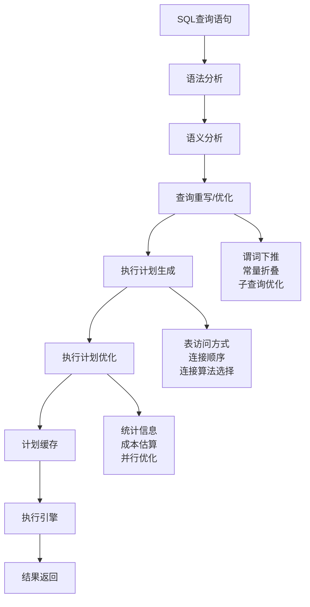

# SQL查询优化设计与原理

## 概述

SQL查询优化是数据库性能调优的核心技术，通过深入理解查询执行计划、索引使用原理和优化策略，可以显著提升数据库的查询性能。查询优化涉及查询重写、执行计划分析、统计信息维护等多个方面，是数据库管理员和后端工程师必备的核心技能。

## 查询优化基础原理

### 查询执行原理

**查询处理流程**：



**查询优化器的核心组件**：

```java
// 查询优化器实现
public class QueryOptimizer {
    private final CatalogManager catalogManager;
    private final StatisticsManager statisticsManager;
    private final CostEstimator costEstimator;
    private final PlanGenerator planGenerator;
    
    public QueryOptimizer(CatalogManager catalogManager, StatisticsManager statisticsManager) {
        this.catalogManager = catalogManager;
        this.statisticsManager = statisticsManager;
        this.costEstimator = new CostEstimator(statisticsManager);
        this.planGenerator = new PlanGenerator(catalogManager);
    }
    
    public QueryPlan optimize(SQLQuery query) {
        // 1. 语法和语义分析
        ParsedQuery parsedQuery = parseQuery(query);
        
        // 2. 查询重写（逻辑优化）
        LogicalPlan logicalPlan = rewriteQuery(parsedQuery);
        
        // 3. 执行计划生成（物理优化）
        List<PhysicalPlan> candidatePlans = generateCandidatePlans(logicalPlan);
        
        // 4. 成本估算和选择最优计划
        PhysicalPlan optimalPlan = selectOptimalPlan(candidatePlans);
        
        return new QueryPlan(optimalPlan);
    }
    
    private LogicalPlan rewriteQuery(ParsedQuery query) {
        LogicalPlan plan = new LogicalPlan(query);
        
        // 谓词下推
        plan = pushDownPredicates(plan);
        
        // 投影下推
        plan = pushDownProjections(plan);
        
        // 常量折叠
        plan = foldConstants(plan);
        
        // 子查询优化
        plan = optimizeSubqueries(plan);
        
        // 连接重排序
        plan = reorderJoins(plan);
        
        return plan;
    }
    
    private PhysicalPlan selectOptimalPlan(List<PhysicalPlan> candidatePlans) {
        PhysicalPlan bestPlan = null;
        double bestCost = Double.MAX_VALUE;
        
        for (PhysicalPlan plan : candidatePlans) {
            double cost = costEstimator.estimateCost(plan);
            if (cost < bestCost) {
                bestCost = cost;
                bestPlan = plan;
            }
        }
        
        return bestPlan;
    }
}
```

### 逻辑优化原理

**谓词下推（Predicate Pushdown）**：

```java
// 谓词下推优化
public class PredicatePushdownOptimizer {
    
    public LogicalPlan pushDownPredicates(LogicalPlan plan) {
        return plan.transform(node -> {
            if (node instanceof ScanOperator) {
                return pushPredicatesToScan(node);
            } else if (node instanceof JoinOperator) {
                return pushPredicatesToJoin(node);
            } else if (node instanceof AggregateOperator) {
                return pushPredicatesToAggregate(node);
            }
            return node;
        });
    }
    
    private Operator pushPredicatesToScan(ScanOperator scan) {
        // 收集上层节点的过滤条件
        Set<Predicate> pushablePredicates = collectPushablePredicates(scan);
        
        if (!pushablePredicates.isEmpty()) {
            // 创建新的扫描节点，包含过滤条件
            FilterOperator filter = new FilterOperator(pushablePredicates);
            filter.addChild(scan);
            return filter;
        }
        
        return scan;
    }
    
    private Set<Predicate> collectPushablePredicates(Operator root) {
        Set<Predicate> predicates = new HashSet<>();
        collectPredicatesRecursively(root, predicates);
        return predicates;
    }
    
    private void collectPredicatesRecursively(Operator node, Set<Predicate> predicates) {
        if (node instanceof FilterOperator) {
            FilterOperator filter = (FilterOperator) node;
            predicates.addAll(filter.getPredicates());
            
            // 检查谓词是否可以下推
            for (Predicate predicate : filter.getPredicates()) {
                if (isPushablePredicate(predicate, node.getChild(0))) {
                    // 可以下推的谓词
                    predicates.add(predicate);
                }
            }
        }
        
        // 递归处理子节点
        for (Operator child : node.getChildren()) {
            collectPredicatesRecursively(child, predicates);
        }
    }
    
    private boolean isPushablePredicate(Predicate predicate, Operator child) {
        // 检查谓词是否可以下推到子节点
        if (child instanceof ScanOperator) {
            // 扫描操作可以接受大部分谓词
            return true;
        } else if (child instanceof JoinOperator) {
            // 连接操作只能接受连接相关的谓词
            return isJoinPredicate(predicate, child);
        } else if (child instanceof AggregateOperator) {
            // 聚合操作只能接受分组列相关的谓词
            return isGroupByPredicate(predicate, child);
        }
        
        return false;
    }
    
    private boolean isJoinPredicate(Predicate predicate, Operator join) {
        JoinOperator joinOp = (JoinOperator) join;
        
        // 检查谓词是否涉及连接的列
        Set<String> predicateColumns = getColumnsInPredicate(predicate);
        Set<String> joinColumns = new HashSet<>();
        joinColumns.addAll(joinOp.getLeftJoinColumns());
        joinColumns.addAll(joinOp.getRightJoinColumns());
        
        return !Collections.disjoint(predicateColumns, joinColumns);
    }
    
    private boolean isGroupByPredicate(Predicate predicate, Operator aggregate) {
        AggregateOperator aggOp = (AggregateOperator) aggregate;
        
        // 检查谓词是否涉及分组列
        Set<String> predicateColumns = getColumnsInPredicate(predicate);
        Set<String> groupByColumns = new HashSet<>(aggOp.getGroupByColumns());
        
        return !Collections.disjoint(predicateColumns, groupByColumns);
    }
    
    private Set<String> getColumnsInPredicate(Predicate predicate) {
        Set<String> columns = new HashSet<>();
        
        if (predicate instanceof ComparisonPredicate) {
            ComparisonPredicate comp = (ComparisonPredicate) predicate;
            if (comp.getLeft() instanceof ColumnReference) {
                columns.add(((ColumnReference) comp.getLeft()).getColumnName());
            }
            if (comp.getRight() instanceof ColumnReference) {
                columns.add(((ColumnReference) comp.getRight()).getColumnName());
            }
        } else if (predicate instanceof BooleanPredicate) {
            BooleanPredicate bool = (BooleanPredicate) predicate;
            columns.addAll(getColumnsInPredicate(bool.getLeft()));
            columns.addAll(getColumnsInPredicate(bool.getRight()));
        }
        
        return columns;
    }
}
```

**投影下推（Projection Pushdown）**：

```java
// 投影下推优化
public class ProjectionPushdownOptimizer {
    
    public LogicalPlan pushDownProjections(LogicalPlan plan) {
        // 分析顶层查询需要的列
        Set<String> requiredColumns = analyzeRequiredColumns(plan);
        
        return plan.transform(node -> {
            if (node instanceof ScanOperator) {
                return optimizeScanProjection(node, requiredColumns);
            } else if (node instanceof JoinOperator) {
                return optimizeJoinProjection(node, requiredColumns);
            }
            return node;
        });
    }
    
    private Set<String> analyzeRequiredColumns(LogicalPlan plan) {
        Set<String> requiredColumns = new HashSet<>();
        
        // 分析投影操作需要的列
        plan.traverse(node -> {
            if (node instanceof ProjectOperator) {
                ProjectOperator project = (ProjectOperator) node;
                requiredColumns.addAll(project.getOutputColumns());
            }
        });
        
        // 分析过滤条件需要的列
        plan.traverse(node -> {
            if (node instanceof FilterOperator) {
                FilterOperator filter = (FilterOperator) node;
                requiredColumns.addAll(extractColumnsFromPredicates(filter.getPredicates()));
            }
        });
        
        // 分析连接条件需要的列
        plan.traverse(node -> {
            if (node instanceof JoinOperator) {
                JoinOperator join = (JoinOperator) node;
                requiredColumns.addAll(join.getJoinColumns());
            }
        });
        
        return requiredColumns;
    }
    
    private Operator optimizeScanProjection(ScanOperator scan, Set<String> requiredColumns) {
        Set<String> tableColumns = scan.getTableSchema().getColumnNames();
        
        // 检查是否所有列都需要
        if (requiredColumns.contains("*") || requiredColumns.containsAll(tableColumns)) {
            return scan; // 所有列都需要，不进行投影下推
        }
        
        // 创建新的投影操作
        Set<String> actualRequiredColumns = new HashSet<>(requiredColumns);
        actualRequiredColumns.retainAll(tableColumns); // 只保留表中存在的列
        
        if (!actualRequiredColumns.isEmpty()) {
            ProjectOperator project = new ProjectOperator(actualRequiredColumns);
            project.addChild(scan);
            return project;
        }
        
        return scan;
    }
    
    private Set<String> extractColumnsFromPredicates(List<Predicate> predicates) {
        Set<String> columns = new HashSet<>();
        
        for (Predicate predicate : predicates) {
            columns.addAll(extractColumnsFromPredicate(predicate));
        }
        
        return columns;
    }
    
    private Set<String> extractColumnsFromPredicate(Predicate predicate) {
        Set<String> columns = new HashSet<>();
        
        predicate.traverse(expr -> {
            if (expr instanceof ColumnReference) {
                ColumnReference col = (ColumnReference) expr;
                columns.add(col.getColumnName());
            }
        });
        
        return columns;
    }
}
```

### 物理优化原理

**连接算法选择**：

```java
// 连接算法优化器
public class JoinAlgorithmOptimizer {
    
    public PhysicalPlan optimizeJoins(LogicalPlan plan) {
        return plan.transform(node -> {
            if (node instanceof JoinOperator) {
                return optimizeJoinNode((JoinOperator) node);
            }
            return node;
        });
    }
    
    private Operator optimizeJoinNode(JoinOperator join) {
        // 获取表统计信息
        TableStatistics leftStats = getTableStatistics(join.getLeftChild());
        TableStatistics rightStats = getTableStatistics(join.getRightChild());
        
        // 估算连接成本
        JoinCostAnalysis analysis = analyzeJoinCost(join, leftStats, rightStats);
        
        // 选择最优的连接算法
        JoinAlgorithm bestAlgorithm = selectBestJoinAlgorithm(analysis);
        
        // 生成物理执行计划
        return createPhysicalJoinPlan(join, bestAlgorithm, analysis);
    }
    
    private JoinAlgorithm selectBestJoinAlgorithm(JoinCostAnalysis analysis) {
        Map<JoinAlgorithm, Double> algorithmCosts = new HashMap<>();
        
        // Nested Loop Join
        if (analysis.canUseNestedLoopJoin()) {
            algorithmCosts.put(JoinAlgorithm.NESTED_LOOP, 
                estimateNestedLoopJoinCost(analysis));
        }
        
        // Hash Join
        if (analysis.canUseHashJoin()) {
            algorithmCosts.put(JoinAlgorithm.HASH_JOIN, 
                estimateHashJoinCost(analysis));
        }
        
        // Sort Merge Join
        if (analysis.canUseSortMergeJoin()) {
            algorithmCosts.put(JoinAlgorithm.SORT_MERGE_JOIN, 
                estimateSortMergeJoinCost(analysis));
        }
        
        // 选择成本最低的算法
        return algorithmCosts.entrySet().stream()
                .min(Map.Entry.comparingByValue())
                .map(Map.Entry::getKey)
                .orElse(JoinAlgorithm.NESTED_LOOP);
    }
    
    private double estimateNestedLoopJoinCost(JoinCostAnalysis analysis) {
        double outerTableCost = analysis.getOuterTableRows();
        double innerTableCost = analysis.getInnerTableRows();
        double joinSelectivity = analysis.getJoinSelectivity();
        
        // Nested Loop Join成本 = 外表扫描成本 + 内表扫描次数 * 内表访问成本
        return outerTableCost + (outerTableCost * innerTableCost * joinSelectivity);
    }
    
    private double estimateHashJoinCost(JoinCostAnalysis analysis) {
        double leftTableCost = analysis.getLeftTableRows();
        double rightTableCost = analysis.getRightTableRows();
        double hashTableBuildCost = rightTableCost;
        double probeCost = leftTableCost;
        
        // Hash Join成本 = 构建哈希表成本 + 探测成本
        return hashTableBuildCost + probeCost;
    }
    
    private double estimateSortMergeJoinCost(JoinCostAnalysis analysis) {
        double leftTableCost = analysis.getLeftTableRows();
        double rightTableCost = analysis.getRightTableRows();
        double leftSortCost = leftTableCost * Math.log(leftTableCost);
        double rightSortCost = rightTableCost * Math.log(rightTableCost);
        double mergeCost = leftTableCost + rightTableCost;
        
        // Sort Merge Join成本 = 排序成本 + 合并成本
        return leftSortCost + rightSortCost + mergeCost;
    }
    
    private PhysicalJoinOperator createPhysicalJoinPlan(JoinOperator logicalJoin, 
                                                       JoinAlgorithm algorithm,
                                                       JoinCostAnalysis analysis) {
        switch (algorithm) {
            case NESTED_LOOP:
                return new PhysicalNestedLoopJoin(
                    logicalJoin.getJoinType(),
                    logicalJoin.getJoinCondition(),
                    analysis.getOuterTable(),
                    analysis.getInnerTable()
                );
                
            case HASH_JOIN:
                return new PhysicalHashJoin(
                    logicalJoin.getJoinType(),
                    logicalJoin.getJoinCondition(),
                    analysis.getBuildTable(),
                    analysis.getProbeTable()
                );
                
            case SORT_MERGE_JOIN:
                return new PhysicalSortMergeJoin(
                    logicalJoin.getJoinType(),
                    logicalJoin.getJoinCondition(),
                    analysis.getLeftTable(),
                    analysis.getRightTable(),
                    analysis.getSortColumns()
                );
                
            default:
                throw new IllegalArgumentException("Unknown join algorithm: " + algorithm);
        }
    }
    
    // 连接成本分析
    public static class JoinCostAnalysis {
        private final double leftTableRows;
        private final double rightTableRows;
        private final double joinSelectivity;
        private final boolean leftTableSorted;
        private final boolean rightTableSorted;
        private final double memoryLimit;
        
        public JoinCostAnalysis(double leftTableRows, double rightTableRows, 
                               double joinSelectivity, boolean leftTableSorted, 
                               boolean rightTableSorted, double memoryLimit) {
            this.leftTableRows = leftTableRows;
            this.rightTableRows = rightTableRows;
            this.joinSelectivity = joinSelectivity;
            this.leftTableSorted = leftTableSorted;
            this.rightTableSorted = rightTableSorted;
            this.memoryLimit = memoryLimit;
        }
        
        public boolean canUseHashJoin() {
            // 哈希连接需要足够内存存储较小的表
            return rightTableRows * 8 <= memoryLimit; // 假设每行8字节
        }
        
        public boolean canUseSortMergeJoin() {
            // 排序合并连接需要至少一个表已排序
            return leftTableSorted || rightTableSorted;
        }
        
        public boolean canUseNestedLoopJoin() {
            // 嵌套循环连接适用于任何情况
            return true;
        }
        
        // Getters
        public double getLeftTableRows() { return leftTableRows; }
        public double getRightTableRows() { return rightTableRows; }
        public double getJoinSelectivity() { return joinSelectivity; }
    }
}
```

## 执行计划分析

### 执行计划结构

**执行计划节点类型**：

```java
// 执行计划节点
public interface ExecutionNode {
    String getNodeType();
    List<ExecutionNode> getChildren();
    String toString(int indent);
}

// 扫描节点
public class ScanNode implements ExecutionNode {
    private final String tableName;
    private final List<String> columns;
    private final Predicate filter;
    private final IndexUsage indexUsage;
    
    @Override
    public String toString(int indent) {
        StringBuilder sb = new StringBuilder();
        sb.append("  ".repeat(indent)).append("Table Scan: ").append(tableName);
        
        if (filter != null) {
            sb.append(" (filter: ").append(filter.toString()).append(")");
        }
        
        if (indexUsage != null) {
            sb.append("\n").append("  ".repeat(indent)).append("  Index: ");
            sb.append(indexUsage.toString());
        }
        
        if (!columns.isEmpty()) {
            sb.append("\n").append("  ".repeat(indent)).append("  Columns: ");
            sb.append(String.join(", ", columns));
        }
        
        return sb.toString();
    }
}

// 连接节点
public class JoinNode implements ExecutionNode {
    private final JoinType joinType;
    private final Predicate joinCondition;
    private final JoinAlgorithm algorithm;
    private final ExecutionNode leftChild;
    private final ExecutionNode rightChild;
    
    @Override
    public String toString(int indent) {
        StringBuilder sb = new StringBuilder();
        sb.append("  ".repeat(indent)).append(algorithm).append(" ");
        sb.append(joinType).append(" JOIN");
        
        if (joinCondition != null) {
            sb.append(" ON (").append(joinCondition.toString()).append(")");
        }
        
        return sb.toString();
    }
}

// 聚合节点
public class AggregateNode implements ExecutionNode {
    private final List<String> groupByColumns;
    private final List<AggregateFunction> aggregateFunctions;
    private final ExecutionNode child;
    
    @Override
    public String toString(int indent) {
        StringBuilder sb = new StringBuilder();
        sb.append("  ".repeat(indent)).append("Aggregate");
        
        if (!groupByColumns.isEmpty()) {
            sb.append(" GROUP BY ").append(String.join(", ", groupByColumns));
        }
        
        if (!aggregateFunctions.isEmpty()) {
            sb.append(" (");
            List<String> functions = aggregateFunctions.stream()
                    .map(AggregateFunction::toString)
                    .collect(Collectors.toList());
            sb.append(String.join(", ", functions)).append(")");
        }
        
        return sb.toString();
    }
}
```

### 成本估算模型

**统计信息管理**：

```java
// 统计信息管理器
public class StatisticsManager {
    private final Map<String, TableStatistics> tableStatistics = new ConcurrentHashMap<>();
    private final HistogramGenerator histogramGenerator;
    private final SelectivityEstimator selectivityEstimator;
    
    public void updateTableStatistics(String tableName, TableStatistics stats) {
        tableStatistics.put(tableName, stats);
    }
    
    public TableStatistics getTableStatistics(String tableName) {
        return tableStatistics.get(tableName);
    }
    
    // 估算查询选择性
    public double estimateSelectivity(Predicate predicate) {
        return selectivityEstimator.estimateSelectivity(predicate, tableStatistics);
    }
    
    // 估算基数
    public long estimateCardinality(String tableName, Predicate filter) {
        TableStatistics stats = tableStatistics.get(tableName);
        if (stats == null) {
            return 0; // 没有统计信息时返回默认值
        }
        
        double selectivity = estimateSelectivity(filter);
        return (long) (stats.getRowCount() * selectivity);
    }
}

// 选择性估算器
public class SelectivityEstimator {
    
    public double estimateSelectivity(Predicate predicate, Map<String, TableStatistics> stats) {
        if (predicate instanceof ComparisonPredicate) {
            return estimateComparisonSelectivity((ComparisonPredicate) predicate, stats);
        } else if (predicate instanceof InPredicate) {
            return estimateInSelectivity((InPredicate) predicate, stats);
        } else if (predicate instanceof LikePredicate) {
            return estimateLikeSelectivity((LikePredicate) predicate, stats);
        } else if (predicate instanceof BooleanPredicate) {
            return estimateBooleanSelectivity((BooleanPredicate) predicate, stats);
        }
        
        return 1.0; // 默认选择性
    }
    
    private double estimateComparisonSelectivity(ComparisonPredicate pred, 
                                               Map<String, TableStatistics> stats) {
        ColumnReference column = (ColumnReference) pred.getLeft();
        Expression value = pred.getRight();
        
        if (value instanceof Literal) {
            Object literalValue = ((Literal) value).getValue();
            return estimateEqualitySelectivity(column.getColumnName(), literalValue, stats);
        } else {
            // 范围查询估算
            return estimateRangeSelectivity(column.getColumnName(), pred.getOperator(), stats);
        }
    }
    
    private double estimateEqualitySelectivity(String columnName, Object value, 
                                             Map<String, TableStatistics> stats) {
        // 查找列统计信息
        for (TableStatistics tableStat : stats.values()) {
            ColumnStatistics colStat = tableStat.getColumnStatistics(columnName);
            if (colStat != null) {
                if (colStat.hasHistogram()) {
                    // 使用直方图估算
                    return colStat.getHistogram().getSelectivity(value);
                } else {
                    // 使用基本统计信息估算
                    return 1.0 / colStat.getDistinctValueCount();
                }
            }
        }
        
        // 默认估算：等值查询的典型选择性
        return 0.01;
    }
    
    private double estimateRangeSelectivity(String columnName, ComparisonOperator operator,
                                          Map<String, TableStatistics> stats) {
        for (TableStatistics tableStat : stats.values()) {
            ColumnStatistics colStat = tableStat.getColumnStatistics(columnName);
            if (colStat != null && colStat.hasMinMax()) {
                double range = colStat.getMaxValue() - colStat.getMinValue();
                
                switch (operator) {
                    case GREATER_THAN:
                        return 0.33; // 大于的典型选择性
                    case LESS_THAN:
                        return 0.33; // 小于的典型选择性
                    case GREATER_THAN_OR_EQUAL:
                        return 0.34; // 大于等于的典型选择性
                    case LESS_THAN_OR_EQUAL:
                        return 0.34; // 小于等于的典型选择性
                    default:
                        return 0.5;
                }
            }
        }
        
        return 0.33; // 默认范围选择性
    }
}

// 直方图实现
public class Histogram {
    private final List<Bucket> buckets;
    private final int numBuckets;
    private final double minValue;
    private final double maxValue;
    
    public double getSelectivity(Object value) {
        if (value instanceof Number) {
            return getNumericSelectivity((Number) value);
        } else if (value instanceof String) {
            return getStringSelectivity((String) value);
        }
        
        return 0.01; // 默认选择性
    }
    
    private double getNumericSelectivity(Number value) {
        double numValue = value.doubleValue();
        
        // 二分查找确定值所在的桶
        int bucketIndex = findBucket(numValue);
        
        if (bucketIndex == -1) {
            return numValue < minValue || numValue > maxValue ? 0.0 : 0.01;
        }
        
        Bucket bucket = buckets.get(bucketIndex);
        
        // 在桶内使用线性插值
        double bucketRange = bucket.getMaxValue() - bucket.getMinValue();
        double valueRange = numValue - bucket.getMinValue();
        
        double bucketSelectivity = bucket.getDistinctValues() / bucket.getTotalRows();
        
        if (bucketRange > 0) {
            return bucketSelectivity * (valueRange / bucketRange);
        } else {
            return bucketSelectivity;
        }
    }
    
    private int findBucket(double value) {
        int left = 0, right = buckets.size() - 1;
        
        while (left <= right) {
            int mid = left + (right - left) / 2;
            Bucket bucket = buckets.get(mid);
            
            if (value >= bucket.getMinValue() && value <= bucket.getMaxValue()) {
                return mid;
            } else if (value < bucket.getMinValue()) {
                right = mid - 1;
            } else {
                left = mid + 1;
            }
        }
        
        return -1;
    }
    
    public static class Bucket {
        private final double minValue;
        private final double maxValue;
        private final long distinctValues;
        private final long totalRows;
        
        public Bucket(double minValue, double maxValue, long distinctValues, long totalRows) {
            this.minValue = minValue;
            this.maxValue = maxValue;
            this.distinctValues = distinctValues;
            this.totalRows = totalRows;
        }
        
        // Getters
        public double getMinValue() { return minValue; }
        public double getMaxValue() { return maxValue; }
        public long getDistinctValues() { return distinctValues; }
        public long getTotalRows() { return totalRows; }
    }
}
```

## 索引优化策略

### 索引选择策略

**索引选择算法**：

```java
// 智能索引选择器
public class IndexSelector {
    private final QueryAnalyzer queryAnalyzer;
    private final CostEstimator costEstimator;
    private final IndexMaintenanceCostEstimator maintenanceCostEstimator;
    
    public List<IndexRecommendation> recommendIndexes(List<SQLQuery> queries) {
        Map<String, IndexRecommendation> recommendations = new HashMap<>();
        
        for (SQLQuery query : queries) {
            QueryAnalysis analysis = queryAnalyzer.analyze(query);
            
            // 分析查询中的过滤条件
            Set<Predicate> predicates = analysis.getPredicates();
            for (Predicate predicate : predicates) {
                IndexRecommendation rec = analyzePredicateForIndex(predicate);
                mergeRecommendation(recommendations, rec);
            }
            
            // 分析查询中的排序要求
            List<OrderByClause> orderByClauses = analysis.getOrderByClauses();
            for (OrderByClause orderBy : orderByClauses) {
                IndexRecommendation rec = analyzeOrderByForIndex(orderBy);
                mergeRecommendation(recommendations, rec);
            }
            
            // 分析复合查询条件
            Set<Predicate> combinedPredicates = analyzeCombinedPredicates(predicates);
            IndexRecommendation combinedRec = analyzeCombinedPredicatesForIndex(combinedPredicates);
            mergeRecommendation(recommendations, combinedRec);
        }
        
        // 评估维护成本
        evaluateMaintenanceCost(recommendations);
        
        // 返回排序后的推荐
        return recommendations.values().stream()
                .sorted((r1, r2) -> Double.compare(r2.getBenefit(), r1.getBenefit()))
                .collect(Collectors.toList());
    }
    
    private IndexRecommendation analyzePredicateForIndex(Predicate predicate) {
        if (predicate instanceof ComparisonPredicate) {
            return analyzeEqualityPredicate((ComparisonPredicate) predicate);
        } else if (predicate instanceof RangePredicate) {
            return analyzeRangePredicate((RangePredicate) predicate);
        } else if (predicate instanceof InPredicate) {
            return analyzeInPredicate((InPredicate) predicate);
        }
        
        return null;
    }
    
    private IndexRecommendation analyzeEqualityPredicate(ComparisonPredicate predicate) {
        ColumnReference column = (ColumnReference) predicate.getLeft();
        
        if (predicate.getOperator() == ComparisonOperator.EQUAL) {
            // 创建单列索引
            IndexColumn indexColumn = new IndexColumn(column.getColumnName(), SortOrder.ASC);
            Index index = new Index("idx_" + column.getTableAlias() + "_" + column.getColumnName(),
                                   Arrays.asList(indexColumn));
            
            // 估算索引效益
            double selectivity = estimateColumnSelectivity(column);
            double benefit = calculateEqualityIndexBenefit(selectivity);
            
            return new IndexRecommendation(index, IndexType.B_TREE, benefit, 
                                         "Equality predicate on column " + column.getColumnName());
        }
        
        return null;
    }
    
    private IndexRecommendation analyzeRangePredicate(RangePredicate predicate) {
        ColumnReference column = (ColumnReference) predicate.getColumn();
        
        // 范围查询需要创建索引
        IndexColumn indexColumn = new IndexColumn(column.getColumnName(), SortOrder.ASC);
        Index index = new Index("idx_" + column.getTableAlias() + "_" + column.getColumnName(),
                               Arrays.asList(indexColumn));
        
        double selectivity = estimateColumnSelectivity(column);
        double benefit = calculateRangeIndexBenefit(selectivity);
        
        return new IndexRecommendation(index, IndexType.B_TREE, benefit,
                                     "Range predicate on column " + column.getColumnName());
    }
    
    private double calculateEqualityIndexBenefit(double selectivity) {
        // 等值查询的索引效益 = 1 - 选择性
        // 选择性越低（唯一性越高），索引效益越高
        return Math.max(0, 1.0 - selectivity);
    }
    
    private double calculateRangeIndexBenefit(double selectivity) {
        // 范围查询的索引效益计算
        // 考虑范围查询的高效益特性
        if (selectivity < 0.1) {
            return 0.9; // 高选择性（低重复值）
        } else if (selectivity < 0.5) {
            return 0.7; // 中等选择性
        } else {
            return 0.3; // 低选择性（高重复值）
        }
    }
}

// 复合索引优化
public class CompositeIndexOptimizer {
    
    public List<IndexColumn> optimizeColumnOrder(List<Predicate> predicates, 
                                               List<OrderByClause> orderByClauses) {
        List<IndexColumn> candidateColumns = new ArrayList<>();
        
        // 从过滤条件中选择列
        for (Predicate predicate : predicates) {
            if (predicate instanceof EqualityPredicate) {
                EqualityPredicate eq = (EqualityPredicate) predicate;
                IndexColumn column = new IndexColumn(eq.getColumnName(), SortOrder.ASC);
                column.setSelectivity(1.0); // 等值查询的选择性最高
                candidateColumns.add(column);
            }
        }
        
        // 从排序条件中选择列
        for (OrderByClause orderBy : orderByClauses) {
            if (orderBy.getDirection() == SortDirection.ASC) {
                IndexColumn column = new IndexColumn(orderBy.getColumnName(), SortOrder.ASC);
                column.setSelectivity(0.5); // 排序列的中等选择性
                candidateColumns.add(column);
            } else {
                IndexColumn column = new IndexColumn(orderBy.getColumnName(), SortOrder.DESC);
                column.setSelectivity(0.5);
                candidateColumns.add(column);
            }
        }
        
        // 根据选择性排序（选择性低的在前）
        candidateColumns.sort((c1, c2) -> Double.compare(c1.getSelectivity(), c2.getSelectivity()));
        
        return candidateColumns;
    }
    
    public CompositeIndexSuggestion suggestCompositeIndex(SQLQuery query) {
        QueryAnalysis analysis = analyzeQuery(query);
        
        // 分析WHERE子句
        List<Predicate> equalityPredicates = analysis.getEqualityPredicates();
        List<Predicate> rangePredicates = analysis.getRangePredicates();
        
        // 分析ORDER BY子句
        List<OrderByClause> orderByClauses = analysis.getOrderByClauses();
        
        // 构建复合索引建议
        List<IndexColumn> indexColumns = new ArrayList<>();
        
        // 优先添加等值查询列
        for (Predicate predicate : equalityPredicates) {
            ColumnReference column = ((EqualityPredicate) predicate).getColumn();
            indexColumns.add(new IndexColumn(column.getColumnName(), SortOrder.ASC));
        }
        
        // 然后添加范围查询列
        for (Predicate predicate : rangePredicates) {
            ColumnReference column = ((RangePredicate) predicate).getColumn();
            // 检查是否已存在
            boolean exists = indexColumns.stream()
                    .anyMatch(col -> col.getColumnName().equals(column.getColumnName()));
            
            if (!exists) {
                indexColumns.add(new IndexColumn(column.getColumnName(), SortOrder.ASC));
            }
        }
        
        // 最后添加排序列
        for (OrderByClause orderBy : orderByClauses) {
            boolean exists = indexColumns.stream()
                    .anyMatch(col -> col.getColumnName().equals(orderBy.getColumnName()));
            
            if (!exists) {
                SortOrder sortOrder = orderBy.getDirection() == SortDirection.ASC ? 
                                    SortOrder.ASC : SortOrder.DESC;
                indexColumns.add(new IndexColumn(orderBy.getColumnName(), sortOrder));
            }
        }
        
        // 评估索引效益
        double benefit = evaluateCompositeIndexBenefit(indexColumns, analysis);
        double maintenanceCost = estimateMaintenanceCost(indexColumns);
        double netBenefit = benefit - maintenanceCost;
        
        if (netBenefit > 0) {
            Index index = new Index("composite_index_" + System.currentTimeMillis(), indexColumns);
            return new CompositeIndexSuggestion(index, netBenefit, 
                "Composite index covering WHERE and ORDER BY clauses");
        }
        
        return null;
    }
}
```

## 查询性能调优实战

### 慢查询分析

**慢查询检测器**：

```java
// 慢查询分析器
public class SlowQueryAnalyzer {
    private final QueryExecutionLogger executionLogger;
    private final StatisticsCollector statisticsCollector;
    
    public SlowQueryReport analyzeSlowQueries(Duration threshold) {
        List<QueryExecutionRecord> slowQueries = executionLogger.getSlowQueries(threshold);
        
        Map<String, List<QueryExecutionRecord>> groupedQueries = slowQueries.stream()
                .collect(Collectors.groupingBy(record -> normalizeQuery(record.getQuery())));
        
        List<SlowQueryAnalysis> analyses = new ArrayList<>();
        
        for (Map.Entry<String, List<QueryExecutionRecord>> entry : groupedQueries.entrySet()) {
            String query = entry.getKey();
            List<QueryExecutionRecord> executions = entry.getValue();
            
            SlowQueryAnalysis analysis = analyzeQueryExecutions(query, executions);
            analyses.add(analysis);
        }
        
        return new SlowQueryReport(analyses);
    }
    
    private SlowQueryAnalysis analyzeQueryExecutions(String query, 
                                                   List<QueryExecutionRecord> executions) {
        // 计算统计指标
        double avgExecutionTime = calculateAverage(executions, 
            record -> record.getExecutionTime().toMillis());
        
        double stdDeviation = calculateStandardDeviation(executions,
            record -> record.getExecutionTime().toMillis(), avgExecutionTime);
        
        Duration p95 = calculatePercentile(executions, 
            record -> record.getExecutionTime(), 0.95);
        
        Duration p99 = calculatePercentile(executions,
            record -> record.getExecutionTime(), 0.99);
        
        // 分析执行计划变化
        List<QueryExecutionPlan> plans = executions.stream()
                .map(QueryExecutionRecord::getExecutionPlan)
                .filter(Objects::nonNull)
                .collect(Collectors.toList());
        
        List<PlanVariation> planVariations = analyzePlanVariations(plans);
        
        // 生成优化建议
        List<OptimizationSuggestion> suggestions = generateOptimizationSuggestions(query, executions);
        
        return new SlowQueryAnalysis(query, executions.size(), avgExecutionTime, 
                                   stdDeviation, p95, p99, planVariations, suggestions);
    }
    
    private List<PlanVariation> analyzePlanVariations(List<QueryExecutionPlan> plans) {
        Map<String, Integer> planHashes = new HashMap<>();
        
        for (QueryExecutionPlan plan : plans) {
            String planHash = hashExecutionPlan(plan);
            planHashes.merge(planHash, 1, Integer::sum);
        }
        
        List<PlanVariation> variations = new ArrayList<>();
        
        for (Map.Entry<String, Integer> entry : planHashes.entrySet()) {
            String planHash = entry.getKey();
            int frequency = entry.getValue();
            QueryExecutionPlan plan = plans.stream()
                    .filter(p -> hashExecutionPlan(p).equals(planHash))
                    .findFirst()
                    .orElse(null);
            
            if (plan != null) {
                variations.add(new PlanVariation(plan, frequency, 
                    frequency / (double) plans.size()));
            }
        }
        
        return variations;
    }
    
    private String hashExecutionPlan(QueryExecutionPlan plan) {
        // 生成执行计划的哈希值
        try {
            String planString = plan.toString();
            MessageDigest digest = MessageDigest.getInstance("MD5");
            byte[] hash = digest.digest(planString.getBytes());
            return Base64.getEncoder().encodeToString(hash);
        } catch (NoSuchAlgorithmException e) {
            return plan.toString();
        }
    }
    
    private List<OptimizationSuggestion> generateOptimizationSuggestions(String query, 
                                                                        List<QueryExecutionRecord> executions) {
        List<OptimizationSuggestion> suggestions = new ArrayList<>();
        
        // 分析执行计划
        for (QueryExecutionRecord execution : executions) {
            QueryExecutionPlan plan = execution.getExecutionPlan();
            if (plan != null) {
                suggestions.addAll(analyzeExecutionPlan(plan));
            }
        }
        
        // 分析查询特征
        suggestions.addAll(analyzeQueryCharacteristics(query));
        
        // 分析系统资源
        suggestions.addAll(analyzeResourceUsage(executions));
        
        return suggestions;
    }
    
    private List<OptimizationSuggestion> analyzeExecutionPlan(QueryExecutionPlan plan) {
        List<OptimizationSuggestion> suggestions = new ArrayList<>();
        
        // 检查是否存在全表扫描
        List<ScanNode> scanNodes = plan.findNodesOfType(ScanNode.class);
        for (ScanNode scanNode : scanNodes) {
            if (scanNode.isFullTableScan()) {
                suggestions.add(new OptimizationSuggestion(
                    OptimizationType.ADD_INDEX,
                    "Full table scan detected on table " + scanNode.getTableName() + 
                    ". Consider adding an index to improve performance.",
                    "Add index on columns used in WHERE clause"
                ));
            }
        }
        
        // 检查是否存在嵌套循环连接
        List<JoinNode> joinNodes = plan.findNodesOfType(JoinNode.class);
        for (JoinNode joinNode : joinNodes) {
            if (joinNode.getAlgorithm() == JoinAlgorithm.NESTED_LOOP) {
                if (joinNode.getEstimatedCost() > 1000) {
                    suggestions.add(new OptimizationSuggestion(
                        OptimizationType.JOIN_ALGORITHM,
                        "Nested loop join with high cost detected. Consider using hash join.",
                        "Add indexes on join columns or rewrite query to use hash join"
                    ));
                }
            }
        }
        
        // 检查排序操作
        List<SortNode> sortNodes = plan.findNodesOfType(SortNode.class);
        for (SortNode sortNode : sortNodes) {
            if (sortNode.isExternalSort()) {
                suggestions.add(new OptimizationSuggestion(
                    OptimizationType.OPTIMIZE_SORTING,
                    "External sort detected. Consider adding index to avoid sorting.",
                    "Add index on ORDER BY columns or increase sort buffer size"
                ));
            }
        }
        
        return suggestions;
    }
}
```

### 查询重写优化

**查询重写优化器**：

```java
// 查询重写优化器
public class QueryRewriteOptimizer {
    
    public SQLQuery rewriteQuery(SQLQuery originalQuery) {
        SQLQuery query = new SQLQuery(originalQuery);
        
        // 1. 常量折叠
        query = foldConstants(query);
        
        // 2. 谓词简化
        query = simplifyPredicates(query);
        
        // 3. 子查询优化
        query = optimizeSubqueries(query);
        
        // 4. 连接重写
        query = rewriteJoins(query);
        
        // 5. 投影优化
        query = optimizeProjections(query);
        
        return query;
    }
    
    private SQLQuery foldConstants(SQLQuery query) {
        QueryTransformer transformer = new QueryTransformer() {
            @Override
            public Expression transformExpression(Expression expr) {
                if (expr instanceof ArithmeticExpression) {
                    ArithmeticExpression arithmetic = (ArithmeticExpression) expr;
                    
                    Expression left = transformExpression(arithmetic.getLeft());
                    Expression right = transformExpression(arithmetic.getRight());
                    
                    // 如果两个操作数都是常量，进行折叠
                    if (left instanceof Literal && right instanceof Literal) {
                        Object leftValue = ((Literal) left).getValue();
                        Object rightValue = ((Literal) right).getValue();
                        
                        try {
                            Object result = evaluateArithmetic(
                                arithmetic.getOperator(), leftValue, rightValue);
                            return new Literal(result);
                        } catch (ArithmeticException e) {
                            // 运算失败，返回原始表达式
                            return new ArithmeticExpression(left, right, arithmetic.getOperator());
                        }
                    }
                    
                    return new ArithmeticExpression(left, right, arithmetic.getOperator());
                } else if (expr instanceof FunctionCall) {
                    FunctionCall function = (FunctionCall) expr;
                    
                    // 检查是否所有参数都是常量
                    List<Expression> newArgs = new ArrayList<>();
                    boolean allConstants = true;
                    
                    for (Expression arg : function.getArguments()) {
                        Expression newArg = transformExpression(arg);
                        newArgs.add(newArg);
                        if (!(newArg instanceof Literal)) {
                            allConstants = false;
                        }
                    }
                    
                    // 如果所有参数都是常量，尝试常量折叠
                    if (allConstants) {
                        try {
                            Object result = evaluateFunction(function.getFunctionName(), 
                                                          newArgs.stream()
                                                          .map(arg -> ((Literal) arg).getValue())
                                                          .collect(Collectors.toList()));
                            return new Literal(result);
                        } catch (Exception e) {
                            // 函数求值失败，返回原始调用
                            return new FunctionCall(function.getFunctionName(), newArgs);
                        }
                    }
                    
                    return new FunctionCall(function.getFunctionName(), newArgs);
                }
                
                return expr;
            }
        };
        
        return transformer.transformQuery(query);
    }
    
    private SQLQuery simplifyPredicates(SQLQuery query) {
        QueryTransformer transformer = new QueryTransformer() {
            @Override
            public Predicate transformPredicate(Predicate predicate) {
                if (predicate instanceof BooleanPredicate) {
                    BooleanPredicate bool = (BooleanPredicate) predicate;
                    
                    Predicate left = transformPredicate(bool.getLeft());
                    Predicate right = transformPredicate(bool.getRight());
                    
                    // 简化逻辑运算
                    return simplifyBooleanExpression(left, right, bool.getOperator());
                } else if (predicate instanceof ComparisonPredicate) {
                    ComparisonPredicate comp = (ComparisonPredicate) predicate;
                    
                    // 简化冗余的比较
                    return simplifyComparison(comp);
                }
                
                return predicate;
            }
            
            private Predicate simplifyBooleanExpression(Predicate left, Predicate right, 
                                                      BooleanOperator operator) {
                // TRUE AND X = X
                if (operator == BooleanOperator.AND) {
                    if (isTrue(left)) return right;
                    if (isTrue(right)) return left;
                    
                    // FALSE AND X = FALSE
                    if (isFalse(left)) return new LiteralPredicate(false);
                    if (isFalse(right)) return new LiteralPredicate(false);
                }
                
                // TRUE OR X = TRUE
                if (operator == BooleanOperator.OR) {
                    if (isTrue(left)) return new LiteralPredicate(true);
                    if (isTrue(right)) return new LiteralPredicate(true);
                    
                    // FALSE OR X = X
                    if (isFalse(left)) return right;
                    if (isFalse(right)) return left;
                }
                
                return new BooleanPredicate(left, right, operator);
            }
            
            private Predicate simplifyComparison(ComparisonPredicate comp) {
                // X = X 简化为 TRUE
                if (comp.getOperator() == ComparisonOperator.EQUAL) {
                    if (comp.getLeft().equals(comp.getRight())) {
                        return new LiteralPredicate(true);
                    }
                }
                
                // X != X 简化为 FALSE
                if (comp.getOperator() == ComparisonOperator.NOT_EQUAL) {
                    if (comp.getLeft().equals(comp.getRight())) {
                        return new LiteralPredicate(false);
                    }
                }
                
                return comp;
            }
            
            private boolean isTrue(Predicate predicate) {
                return predicate instanceof LiteralPredicate && 
                       ((LiteralPredicate) predicate).getValue().equals(true);
            }
            
            private boolean isFalse(Predicate predicate) {
                return predicate instanceof LiteralPredicate && 
                       ((LiteralPredicate) predicate).getValue().equals(false);
            }
        };
        
        return transformer.transformQuery(query);
    }
    
    private SQLQuery optimizeSubqueries(SQLQuery query) {
        // 检查是否可以将IN子查询转换为JOIN
        if (canConvertInToJoin(query)) {
            return convertInToJoin(query);
        }
        
        // 检查是否可以将EXISTS子查询转换为JOIN
        if (canConvertExistsToJoin(query)) {
            return convertExistsToJoin(query);
        }
        
        return query;
    }
    
    private boolean canConvertInToJoin(SQLQuery query) {
        // 检查查询是否包含IN子查询
        // 并验证转换的可行性
        return query.getFromClause().getTables().stream()
                .anyMatch(table -> table.hasSubqueryInCondition() &&
                                 table.canConvertInSubqueryToJoin());
    }
    
    private SQLQuery convertInToJoin(SQLQuery query) {
        // 将IN子查询转换为半连接
        QueryRewriter rewriter = new QueryRewriter();
        return rewriter.convertInSubqueryToSemiJoin(query);
    }
}
```

## 总结

SQL查询优化是一个复杂而重要的主题，需要深入理解查询执行原理和优化技术：

### 核心优化技术

1. **逻辑优化**：
   - 谓词下推：将过滤条件推到数据源附近
   - 投影下推：只读取需要的列
   - 常量折叠：计算编译时常量表达式

2. **物理优化**：
   - 连接算法选择：根据数据特征选择最优算法
   - 索引使用策略：有效利用索引加速查询
   - 并行执行计划：利用多核CPU加速查询

3. **统计信息**：
   - 基数估算：准确估算中间结果大小
   - 选择性计算：评估过滤条件的筛选效果
   - 直方图：维护数据分布的详细统计

### 实践建议

1. **理解执行计划**：学会阅读和分析执行计划
2. **建立索引策略**：根据查询模式设计合适的索引
3. **监控查询性能**：建立慢查询监控和分析机制
4. **定期统计信息更新**：确保统计信息的准确性
5. **查询重写优化**：通过改写查询语句提升性能

通过系统学习和实践这些优化技术，可以显著提升数据库查询性能，为应用提供更好的用户体验。