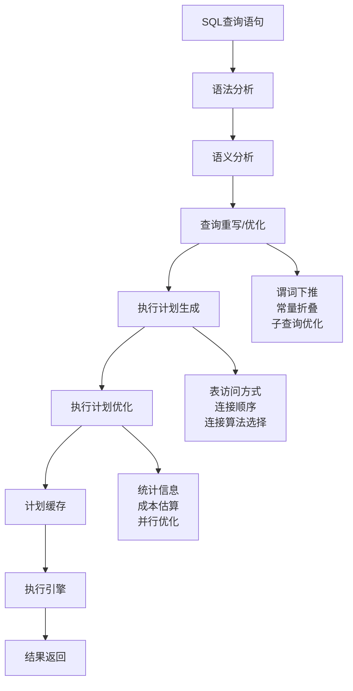

# SQL查询优化设计与原理

## 概述

SQL查询优化是数据库性能调优的核心技术，通过深入理解查询执行计划、索引使用原理和优化策略，可以显著提升数据库的查询性能。查询优化涉及查询重写、执行计划分析、统计信息维护等多个方面，是数据库管理员和后端工程师必备的核心技能。

## 查询优化基础原理

### 查询执行原理

**查询处理流程**：



**查询优化器的核心组件**：

```python
# 查询优化器实现
class QueryOptimizer:
    def __init__(self, catalog_manager: CatalogManager, statistics_manager: StatisticsManager):
        self.catalog_manager = catalog_manager
        self.statistics_manager = statistics_manager
        self.cost_estimator = CostEstimator(statistics_manager)
        self.plan_generator = PlanGenerator(catalog_manager)
    
    def optimize(self, query: SQLQuery) -> QueryPlan:
        # 1. 语法和语义分析
        parsed_query = self._parse_query(query)
        
        # 2. 查询重写（逻辑优化）
        logical_plan = self._rewrite_query(parsed_query)
        
        # 3. 执行计划生成（物理优化）
        candidate_plans = self._generate_candidate_plans(logical_plan)
        
        # 4. 成本估算和选择最优计划
        optimal_plan = self._select_optimal_plan(candidate_plans)
        
        return QueryPlan(optimal_plan)
    
    def _rewrite_query(self, query: ParsedQuery) -> LogicalPlan:
        plan = LogicalPlan(query)
        
        # 谓词下推
        plan = self._push_down_predicates(plan)
        
        # 投影下推
        plan = self._push_down_projections(plan)
        
        # 常量折叠
        plan = self._fold_constants(plan)
        
        # 子查询优化
        plan = self._optimize_subqueries(plan)
        
        # 连接重排序
        plan = self._reorder_joins(plan)
        
        return plan
    
    def _select_optimal_plan(self, candidate_plans: list[PhysicalPlan]) -> PhysicalPlan:
        best_plan = None
        best_cost = float('inf')
        
        for plan in candidate_plans:
            cost = self.cost_estimator.estimate_cost(plan)
            if cost < best_cost:
                best_cost = cost
                best_plan = plan
        
        return best_plan
```

### 逻辑优化原理

**谓词下推（Predicate Pushdown）**：

```python
# 谓词下推优化
class PredicatePushdownOptimizer:
    
    def push_down_predicates(self, plan: LogicalPlan) -> LogicalPlan:
        return plan.transform(lambda node: {
            ScanOperator: lambda n: self._push_predicates_to_scan(n),
            JoinOperator: lambda n: self._push_predicates_to_join(n),
            AggregateOperator: lambda n: self._push_predicates_to_aggregate(n)
        }.get(type(node), lambda n: n)(node))
    
    def _push_predicates_to_scan(self, scan: ScanOperator) -> Operator:
        # 收集上层节点的过滤条件
        pushable_predicates = self._collect_pushable_predicates(scan)
        
        if pushable_predicates:
            # 创建新的扫描节点，包含过滤条件
            filter_op = FilterOperator(pushable_predicates)
            filter_op.add_child(scan)
            return filter_op
        
        return scan
    
    def _collect_pushable_predicates(self, root: Operator) -> set[Predicate]:
        predicates = set()
        self._collect_predicates_recursively(root, predicates)
        return predicates
    
    def _collect_predicates_recursively(self, node: Operator, predicates: set[Predicate]) -> None:
        if isinstance(node, FilterOperator):
            filter_op = node
            predicates.update(filter_op.get_predicates())
            
            # 检查谓词是否可以下推
            for predicate in filter_op.get_predicates():
                if self._is_pushable_predicate(predicate, node.get_child(0)):
                    # 可以下推的谓词
                    predicates.add(predicate)
        
        # 递归处理子节点
        for child in node.get_children():
            self._collect_predicates_recursively(child, predicates)
    
    def _is_pushable_predicate(self, predicate: Predicate, child: Operator) -> bool:
        # 检查谓词是否可以下推到子节点
        if isinstance(child, ScanOperator):
            # 扫描操作可以接受大部分谓词
            return True
        elif isinstance(child, JoinOperator):
            # 连接操作只能接受连接相关的谓词
            return self._is_join_predicate(predicate, child)
        elif isinstance(child, AggregateOperator):
            # 聚合操作只能接受分组列相关的谓词
            return self._is_group_by_predicate(predicate, child)
        
        return False
    
    def _is_join_predicate(self, predicate: Predicate, join: Operator) -> bool:
        join_op = join
        
        # 检查谓词是否涉及连接的列
        predicate_columns = self._get_columns_in_predicate(predicate)
        join_columns = set()
        join_columns.update(join_op.get_left_join_columns())
        join_columns.update(join_op.get_right_join_columns())
        
        return not predicate_columns.isdisjoint(join_columns)
    
    def _is_group_by_predicate(self, predicate: Predicate, aggregate: Operator) -> bool:
        agg_op = aggregate
        
        # 检查谓词是否涉及分组列
        predicate_columns = self._get_columns_in_predicate(predicate)
        group_by_columns = set(agg_op.get_group_by_columns())
        
        return not predicate_columns.isdisjoint(group_by_columns)
    
    def _get_columns_in_predicate(self, predicate: Predicate) -> set[str]:
        columns = set()
        
        if isinstance(predicate, ComparisonPredicate):
            comp = predicate
            if isinstance(comp.get_left(), ColumnReference):
                columns.add(comp.get_left().get_column_name())
            if isinstance(comp.get_right(), ColumnReference):
                columns.add(comp.get_right().get_column_name())
        elif isinstance(predicate, BooleanPredicate):
            bool_pred = predicate
            columns.update(self._get_columns_in_predicate(bool_pred.get_left()))
            columns.update(self._get_columns_in_predicate(bool_pred.get_right()))
        
        return columns
}
```

**投影下推（Projection Pushdown）**：

```java
# 投影下推优化
class ProjectionPushdownOptimizer:
    """投影下推优化器"""
    
    def push_down_projections(self, plan):
        """执行投影下推优化"""
        # 分析顶层查询需要的列
        required_columns = self._analyze_required_columns(plan)
        
        return plan.transform(lambda node: {
            ScanOperator: lambda n: self._optimize_scan_projection(n, required_columns),
            JoinOperator: lambda n: self._optimize_join_projection(n, required_columns)
        }.get(type(node), lambda n: n)(node))
    
    def _analyze_required_columns(self, plan: LogicalPlan) -> set[str]:
        required_columns = set()
        
        # 分析投影操作需要的列
        plan.traverse(lambda node: 
            required_columns.update(node.get_output_columns()) 
            if isinstance(node, ProjectOperator) 
            else None
        )
        
        # 分析过滤条件需要的列
        plan.traverse(lambda node: 
            required_columns.update(self._extract_columns_from_predicates(node.get_predicates())) 
            if isinstance(node, FilterOperator) 
            else None
        )
        
        # 分析连接条件需要的列
        plan.traverse(lambda node: 
            required_columns.update(node.get_join_columns()) 
            if isinstance(node, JoinOperator) 
            else None
        )
        
        return required_columns
    
    def _optimize_scan_projection(self, scan: ScanOperator, required_columns: set[str]) -> Operator:
        table_columns = scan.get_table_schema().get_column_names()
        
        # 检查是否所有列都需要
        if "*" in required_columns or required_columns.issuperset(table_columns):
            return scan  # 所有列都需要，不进行投影下推
        
        # 创建新的投影操作
        actual_required_columns = required_columns.intersection(table_columns)  # 只保留表中存在的列
        
        if actual_required_columns:
            project_op = ProjectOperator(actual_required_columns)
            project_op.add_child(scan)
            return project_op
        
        return scan
    
    def _extract_columns_from_predicates(self, predicates: list[Predicate]) -> set[str]:
        columns = set()
        
        for predicate in predicates:
            columns.update(self._extract_columns_from_predicate(predicate))
        
        return columns
    
    def _extract_columns_from_predicate(self, predicate: Predicate) -> set[str]:
        columns = set()
        
        predicate.traverse(lambda expr: 
            columns.add(expr.get_column_name()) 
            if isinstance(expr, ColumnReference) 
            else None
        )
        
        return columns
}
```

### 物理优化原理

**连接算法选择**：

```python
# 连接算法优化器
class JoinAlgorithmOptimizer:
    
    def optimize_joins(self, plan: LogicalPlan) -> PhysicalPlan:
         return plan.transform(lambda node: self._optimize_join_node(node) if isinstance(node, JoinOperator) else node)
    
    def _optimize_join_node(self, join: JoinOperator) -> Operator:
        """优化连接节点"""
        # 获取表统计信息
        left_stats = self._get_table_statistics(join.get_left_child())
        right_stats = self._get_table_statistics(join.get_right_child())
        
        # 估算连接成本
        analysis = self._analyze_join_cost(join, left_stats, right_stats)
        
        # 选择最优的连接算法
        best_algorithm = self._select_best_join_algorithm(analysis)
        
        # 生成物理执行计划
        return self._create_physical_join_plan(join, best_algorithm, analysis)
    
    def _select_best_join_algorithm(self, analysis: 'JoinCostAnalysis') -> 'JoinAlgorithm':
        """选择最优连接算法"""
        algorithm_costs = {}
        
        # Nested Loop Join
        if analysis.can_use_nested_loop_join():
            algorithm_costs[JoinAlgorithm.NESTED_LOOP] = self._estimate_nested_loop_join_cost(analysis)
        
        # Hash Join
        if analysis.can_use_hash_join():
            algorithm_costs[JoinAlgorithm.HASH_JOIN] = self._estimate_hash_join_cost(analysis)
        
        # Sort Merge Join
        if analysis.can_use_sort_merge_join():
            algorithm_costs[JoinAlgorithm.SORT_MERGE_JOIN] = self._estimate_sort_merge_join_cost(analysis)
        
        # 选择成本最低的算法
        return min(algorithm_costs.items(), key=lambda x: x[1])[0] if algorithm_costs else JoinAlgorithm.NESTED_LOOP
    
    def _estimate_nested_loop_join_cost(self, analysis: 'JoinCostAnalysis') -> float:
        """估算嵌套循环连接成本"""
        outer_table_cost = analysis.get_outer_table_rows()
        inner_table_cost = analysis.get_inner_table_rows()
        join_selectivity = analysis.get_join_selectivity()
        
        # Nested Loop Join成本 = 外表扫描成本 + 内表扫描次数 * 内表访问成本
        return outer_table_cost + (outer_table_cost * inner_table_cost * join_selectivity)
    
    def _estimate_hash_join_cost(self, analysis: 'JoinCostAnalysis') -> float:
        """估算哈希连接成本"""
        left_table_cost = analysis.get_left_table_rows()
        right_table_cost = analysis.get_right_table_rows()
        hash_table_build_cost = right_table_cost
        probe_cost = left_table_cost
        
        # Hash Join成本 = 构建哈希表成本 + 探测成本
        return hash_table_build_cost + probe_cost
    
    def _estimate_sort_merge_join_cost(self, analysis: 'JoinCostAnalysis') -> float:
        """估算排序合并连接成本"""
        import math
        left_table_cost = analysis.get_left_table_rows()
        right_table_cost = analysis.get_right_table_rows()
        left_sort_cost = left_table_cost * math.log(left_table_cost)
        right_sort_cost = right_table_cost * math.log(right_table_cost)
        merge_cost = left_table_cost + right_table_cost
        
        # Sort Merge Join成本 = 排序成本 + 合并成本
        return left_sort_cost + right_sort_cost + merge_cost
    
    def _create_physical_join_plan(self, logical_join: JoinOperator, 
                                  algorithm: 'JoinAlgorithm',
                                  analysis: 'JoinCostAnalysis') -> PhysicalJoinOperator:
        """创建物理连接执行计划"""
        if algorithm == JoinAlgorithm.NESTED_LOOP:
            return PhysicalNestedLoopJoin(
                logical_join.get_join_type(),
                logical_join.get_join_condition(),
                analysis.get_outer_table(),
                analysis.get_inner_table()
            )
        elif algorithm == JoinAlgorithm.HASH_JOIN:
            return PhysicalHashJoin(
                logical_join.get_join_type(),
                logical_join.get_join_condition(),
                analysis.get_build_table(),
                analysis.get_probe_table()
            )
        elif algorithm == JoinAlgorithm.SORT_MERGE_JOIN:
            return PhysicalSortMergeJoin(
                logical_join.get_join_type(),
                logical_join.get_join_condition(),
                analysis.get_left_table(),
                analysis.get_right_table(),
                analysis.get_sort_columns()
            )
        else:
            raise ValueError(f"Unknown join algorithm: {algorithm}")
    
    # 连接成本分析
    class JoinCostAnalysis:
        """连接成本分析类"""
        def __init__(self, left_table_rows: float, right_table_rows: float, 
                     join_selectivity: float, left_table_sorted: bool, 
                     right_table_sorted: bool, memory_limit: float):
            self.left_table_rows = left_table_rows
            self.right_table_rows = right_table_rows
            self.join_selectivity = join_selectivity
            self.left_table_sorted = left_table_sorted
            self.right_table_sorted = right_table_sorted
            self.memory_limit = memory_limit
        
        def can_use_hash_join(self) -> bool:
            """检查是否可以使用哈希连接"""
            # 哈希连接需要足够内存存储较小的表
            return self.right_table_rows * 8 <= self.memory_limit  # 假设每行8字节
        
        def can_use_sort_merge_join(self) -> bool:
            """检查是否可以使用排序合并连接"""
            # 排序合并连接需要至少一个表已排序
            return self.left_table_sorted or self.right_table_sorted
        
        def can_use_nested_loop_join(self) -> bool:
            """检查是否可以使用嵌套循环连接"""
            # 嵌套循环连接适用于任何情况
            return True
        
        # Getters
        def get_left_table_rows(self) -> float:
            """获取左表行数"""
            return self.left_table_rows
        
        def get_right_table_rows(self) -> float:
            """获取右表行数"""
            return self.right_table_rows
        
        def get_join_selectivity(self) -> float:
            """获取连接选择性"""
            return self.join_selectivity
        
        def get_outer_table_rows(self) -> float:
            """获取外表行数"""
            # 默认将小表作为外表
            return min(self.left_table_rows, self.right_table_rows)
        
        def get_inner_table_rows(self) -> float:
            """获取内表行数"""
            # 默认将大表作为内表
            return max(self.left_table_rows, self.right_table_rows)
        
        def get_build_table(self):
            """获取构建表（用于哈希连接）"""
            # 选择较小的表作为构建表
            return self.left_table if self.left_table_rows <= self.right_table_rows else self.right_table
        
        def get_probe_table(self):
            """获取探测表（用于哈希连接）"""
            # 选择较大的表作为探测表
            return self.right_table if self.left_table_rows <= self.right_table_rows else self.left_table
        
        def get_sort_columns(self):
            """获取排序列"""
            # 这里应该返回实际的排序列
            return []
    }
```

## 执行计划分析

### 执行计划结构

**执行计划节点类型**：

```python
from abc import ABC, abstractmethod
from typing import List, Optional
from dataclasses import dataclass
from enum import Enum

# 执行计划节点基类
class ExecutionNode(ABC):
    @abstractmethod
    def get_node_type(self) -> str:
        """获取节点类型"""
        pass
    
    @abstractmethod
    def get_children(self) -> list['ExecutionNode']:
        """获取子节点"""
        pass
    
    @abstractmethod
    def __str__(self, indent: int = 0) -> str:
        """以缩进格式输出执行计划"""
        pass

# 扫描节点
@dataclass
class ScanNode(ExecutionNode):
    table_name: str
    columns: List[str] = None
    filter: Optional['Predicate'] = None
    index_usage: Optional['IndexUsage'] = None
    
    def get_node_type(self) -> str:
        return "Table Scan"
    
    def get_children(self) -> list[ExecutionNode]:
        return []  # 扫描节点没有子节点
    
    def __str__(self, indent: int = 0) -> str:
        indent_str = "  " * indent
        result = f"{indent_str}Table Scan: {self.table_name}"
        
        if self.filter:
            result += f" (filter: {self.filter})"
        
        if self.index_usage:
            result += f"\n{indent_str}  Index: {self.index_usage}"
        
        if self.columns:
            result += f"\n{indent_str}  Columns: {', '.join(self.columns)}"
        
        return result

# 连接类型枚举
class JoinType(Enum):
    INNER = "INNER"
    LEFT = "LEFT"
    RIGHT = "RIGHT"
    FULL = "FULL"
    CROSS = "CROSS"

# 连接算法枚举
class JoinAlgorithm(Enum):
    NESTED_LOOP = "Nested Loop"
    HASH = "Hash"
    SORT_MERGE = "Sort Merge"

# 连接节点
@dataclass
class JoinNode(ExecutionNode):
    join_type: JoinType
    join_condition: Optional['Predicate'] = None
    algorithm: JoinAlgorithm = JoinAlgorithm.NESTED_LOOP
    left_child: Optional[ExecutionNode] = None
    right_child: Optional[ExecutionNode] = None
    
    def get_node_type(self) -> str:
        return "Join"
    
    def get_children(self) -> List[ExecutionNode]:
        children = []
        if self.left_child:
            children.append(self.left_child)
        if self.right_child:
            children.append(self.right_child)
        return children
    
    def __str__(self, indent: int = 0) -> str:
        indent_str = "  " * indent
        result = f"{indent_str}{self.algorithm.value} {self.join_type.value} JOIN"
        
        if self.join_condition:
            result += f" ON ({self.join_condition})"
        
        return result

# 聚合函数类
@dataclass
class AggregateFunction:
    function_name: str
    column_name: str
    alias: Optional[str] = None
    
    def __str__(self) -> str:
        if self.alias:
            return f"{self.function_name}({self.column_name}) AS {self.alias}"
        return f"{self.function_name}({self.column_name})"

# 聚合节点
@dataclass
class AggregateNode(ExecutionNode):
    group_by_columns: List[str] = None
    aggregate_functions: List[AggregateFunction] = None
    child: Optional[ExecutionNode] = None
    
    def get_node_type(self) -> str:
        return "Aggregate"
    
    def get_children(self) -> List[ExecutionNode]:
        return [self.child] if self.child else []
    
    def __str__(self, indent: int = 0) -> str:
        indent_str = "  " * indent
        result = f"{indent_str}Aggregate"
        
        if self.group_by_columns:
            result += f" GROUP BY {', '.join(self.group_by_columns)}"
        
        if self.aggregate_functions:
            functions_str = ', '.join(str(func) for func in self.aggregate_functions)
            result += f" ({functions_str})"
        
        return result
```

### 成本估算模型

**统计信息管理**：

```python
from typing import Dict, Any, Optional
from dataclasses import dataclass
from concurrent.futures import ThreadPoolExecutor

# 列统计信息
@dataclass
class ColumnStatistics:
    column_name: str
    distinct_value_count: int
    min_value: Optional[Any] = None
    max_value: Optional[Any] = None
    has_histogram: bool = False
    
    def get_distinct_value_count(self) -> int:
        return self.distinct_value_count
    
    def has_min_max(self) -> bool:
        return self.min_value is not None and self.max_value is not None

# 表统计信息
@dataclass
class TableStatistics:
    table_name: str
    row_count: int
    column_statistics: Dict[str, ColumnStatistics] = None
    
    def get_row_count(self) -> int:
        return self.row_count
    
    def get_column_statistics(self, column_name: str) -> Optional[ColumnStatistics]:
        if self.column_statistics:
            return self.column_statistics.get(column_name)
        return None

# 选择性估算器
class SelectivityEstimator:
    def estimate_selectivity(self, predicate: Any, stats: Dict[str, TableStatistics]) -> float:
        """估算查询选择性"""
        predicate_type = type(predicate).__name__
        
        if predicate_type == "ComparisonPredicate":
            return self._estimate_comparison_selectivity(predicate, stats)
        elif predicate_type == "InPredicate":
            return self._estimate_in_selectivity(predicate, stats)
        elif predicate_type == "LikePredicate":
            return self._estimate_like_selectivity(predicate, stats)
        elif predicate_type == "BooleanPredicate":
            return self._estimate_boolean_selectivity(predicate, stats)
        
        return 1.0  # 默认选择性
    
    def _estimate_comparison_selectivity(self, pred: Any, stats: Dict[str, TableStatistics]) -> float:
        """估算比较谓词的选择性"""
        column_name = pred.get_left().get_column_name()
        operator = pred.get_operator()
        value = pred.get_right()
        
        for table_stat in stats.values():
            col_stat = table_stat.get_column_statistics(column_name)
            if col_stat:
                if hasattr(value, "get_value"):  # Literal值
                    literal_value = value.get_value()
                    return self._estimate_equality_selectivity(column_name, literal_value, stats)
                else:
                    # 范围查询估算
                    return self._estimate_range_selectivity(column_name, operator, stats)
        
        return 0.33  # 默认选择性
    
    def _estimate_equality_selectivity(self, column_name: str, value: Any, 
                                      stats: Dict[str, TableStatistics]) -> float:
        """估算等值查询的选择性"""
        for table_stat in stats.values():
            col_stat = table_stat.get_column_statistics(column_name)
            if col_stat:
                if col_stat.has_histogram:
                    # 使用直方图估算（简化实现）
                    return 1.0 / col_stat.distinct_value_count
                else:
                    # 使用基本统计信息估算
                    return 1.0 / col_stat.distinct_value_count
        
        return 0.01  # 默认选择性
    
    def _estimate_range_selectivity(self, column_name: str, operator: str, 
                                  stats: Dict[str, TableStatistics]) -> float:
        """估算范围查询的选择性"""
        for table_stat in stats.values():
            col_stat = table_stat.get_column_statistics(column_name)
            if col_stat and col_stat.has_min_max():
                # 根据操作符估算选择性
                operator_selectivity = {
                    ">": 0.33,  # 大于的典型选择性
                    "<": 0.33,  # 小于的典型选择性
                    ">=": 0.34,  # 大于等于的典型选择性
                    "<=": 0.34,  # 小于等于的典型选择性
                    "!=": 0.99,  # 不等于的典型选择性
                    "BETWEEN": 0.1,  # BETWEEN的典型选择性
                }
                return operator_selectivity.get(operator, 0.5)  # 默认范围选择性
        
        return 0.33  # 默认范围选择性

# 统计信息管理器
class StatisticsManager:
    def __init__(self):
        self.table_statistics: Dict[str, TableStatistics] = {}
        self.selectivity_estimator = SelectivityEstimator()
    
    def update_table_statistics(self, table_name: str, stats: TableStatistics):
        """更新表统计信息"""
        self.table_statistics[table_name] = stats
    
    def get_table_statistics(self, table_name: str) -> Optional[TableStatistics]:
        """获取表统计信息"""
        return self.table_statistics.get(table_name)
    
    def estimate_selectivity(self, predicate: Any) -> float:
        """估算查询选择性"""
        return self.selectivity_estimator.estimate_selectivity(predicate, self.table_statistics)
    
    def estimate_cardinality(self, table_name: str, filter_predicate: Optional[Any]) -> int:
        """估算基数（结果行数）"""
        stats = self.get_table_statistics(table_name)
        if not stats:
            return 0  # 没有统计信息时返回默认值
        
        if not filter_predicate:
            return stats.get_row_count()  # 无过滤条件，返回总行数
        
        selectivity = self.estimate_selectivity(filter_predicate)
        return int(stats.get_row_count() * selectivity)
```

**使用示例**：

```python
# 创建统计信息
user_stats = TableStatistics(
    table_name="users",
    row_count=100000,
    column_statistics={
        "age": ColumnStatistics(
            column_name="age",
            distinct_value_count=70,
            min_value=18,
            max_value=85,
            has_histogram=True
        ),
        "gender": ColumnStatistics(
            column_name="gender",
            distinct_value_count=2,
            min_value="M",
            max_value="F",
            has_histogram=False
        )
    }
)

# 初始化统计信息管理器
stats_manager = StatisticsManager()
stats_manager.update_table_statistics("users", user_stats)

# 估算查询选择性和基数
# 假设我们有一个谓词：age > 30
# selectivity = stats_manager.estimate_selectivity(age_gt_30_predicate)
# cardinality = stats_manager.estimate_cardinality("users", age_gt_30_predicate)
```


            bucket = buckets[mid]
            
            if value >= bucket.get_min_value() and value <= bucket.get_max_value():
                return mid
            elif value < bucket.get_min_value():
                right_idx = mid - 1
            else:
                left_idx = mid + 1
        }
        
        return -1

class Bucket:
    def __init__(self, min_value: float, max_value: float, distinct_values: int, total_rows: int):
        self.min_value = min_value
        self.max_value = max_value
        self.distinct_values = distinct_values
        self.total_rows = total_rows
    
    # Getters
    def get_min_value(self) -> float:
        return self.min_value
    
    def get_max_value(self) -> float:
        return self.max_value
    
    def get_distinct_values(self) -> int:
        return self.distinct_values
    
    def get_total_rows(self) -> int:
        return self.total_rows
```

## 索引优化策略

### 索引选择策略

**索引选择算法**：

```python
# 智能索引选择器
class IndexSelector:
    def __init__(self, query_analyzer, cost_estimator, maintenance_cost_estimator):
        self.query_analyzer = query_analyzer
        self.cost_estimator = cost_estimator
        self.maintenance_cost_estimator = maintenance_cost_estimator
    
    def recommend_indexes(self, queries):
        """推荐适合的索引"""
        recommendations = {}
        
        for query in queries:
            analysis = self.query_analyzer.analyze(query)
            
            # 分析查询中的过滤条件
            predicates = analysis.get_predicates()
            for predicate in predicates:
                rec = self.analyze_predicate_for_index(predicate)
                self.merge_recommendation(recommendations, rec)
            
            # 分析查询中的排序要求
            order_by_clauses = analysis.get_order_by_clauses()
            for order_by in order_by_clauses:
                rec = self.analyze_order_by_for_index(order_by)
                self.merge_recommendation(recommendations, rec)
            
            # 分析复合查询条件
            combined_predicates = self.analyze_combined_predicates(predicates)
            combined_rec = self.analyze_combined_predicates_for_index(combined_predicates)
            self.merge_recommendation(recommendations, combined_rec)
        
        # 评估维护成本
        self.evaluate_maintenance_cost(recommendations)
        
        # 返回排序后的推荐
        return sorted(recommendations.values(), 
                      key=lambda r: r.get_benefit(), reverse=True)
    
    def analyze_predicate_for_index(self, predicate):
        """分析谓词并推荐索引"""
        if isinstance(predicate, ComparisonPredicate):
            return self.analyze_equality_predicate(predicate)
        elif isinstance(predicate, RangePredicate):
            return self.analyze_range_predicate(predicate)
        elif isinstance(predicate, InPredicate):
            return self.analyze_in_predicate(predicate)
        
        return None
    
    def analyze_combined_predicates_for_index(self, combined_predicates):
        """分析复合谓词并推荐索引"""
        # 假设analysis、equalityPredicates和rangePredicates已经在方法外部定义或作为参数传入
        # 这里为了示例，我们简化处理
        
        # 分析ORDER BY子句
        order_by_clauses = analysis.get_order_by_clauses()
        
        # 构建复合索引建议
        index_columns = []
        
        # 优先添加等值查询列
        for predicate in equality_predicates:
            column = predicate.get_column()
            index_columns.append(IndexColumn(column.get_column_name(), SortOrder.ASC))
        
        # 然后添加范围查询列
        for predicate in range_predicates:
            column = predicate.get_column()
            # 检查是否已存在
            exists = any(col.get_column_name() == column.get_column_name() for col in index_columns)
            
            if not exists:
                index_columns.append(IndexColumn(column.get_column_name(), SortOrder.ASC))
        
        # 最后添加排序列
        for order_by in order_by_clauses:
            exists = any(col.get_column_name() == order_by.get_column_name() for col in index_columns)
            
            if not exists:
                sort_order = SortOrder.ASC if order_by.get_direction() == SortDirection.ASC else SortOrder.DESC
                index_columns.append(IndexColumn(order_by.get_column_name(), sort_order))
        
        # 评估索引效益
        benefit = self.evaluate_composite_index_benefit(index_columns, analysis)
        maintenance_cost = self.estimate_maintenance_cost(index_columns)
        net_benefit = benefit - maintenance_cost
        
        if net_benefit > 0:
            import time
            index = Index(f"composite_index_{int(time.time() * 1000)}", index_columns)
            return CompositeIndexSuggestion(index, net_benefit, 
                "Composite index covering WHERE and ORDER BY clauses")
        
        return None
}
```

## 查询性能调优实战

### 慢查询分析

**慢查询检测器**：

```java
# 慢查询分析器
class SlowQueryAnalyzer:
    def __init__(self, execution_logger, statistics_collector):
        self.execution_logger = execution_logger
        self.statistics_collector = statistics_collector
    
    def analyze_slow_queries(self, threshold):
        """分析慢查询"""
        slow_queries = self.execution_logger.get_slow_queries(threshold)
        
        # 按标准化查询分组
        grouped_queries = {}
        for record in slow_queries:
            normalized_query = self.normalize_query(record.get_query())
            if normalized_query not in grouped_queries:
                grouped_queries[normalized_query] = []
            grouped_queries[normalized_query].append(record)
        
        analyses = []
        
        for query, executions in grouped_queries.items():
            analysis = self.analyze_query_executions(query, executions)
            analyses.append(analysis)
        
        return SlowQueryReport(analyses)
    
    def analyze_query_executions(self, query, executions):
        """分析查询执行情况"""
        # 计算统计指标
        avg_execution_time = self.calculate_average(executions, 
            lambda record: record.get_execution_time().to_millis())
        
        std_deviation = self.calculate_standard_deviation(executions,
            lambda record: record.get_execution_time().to_millis(), avg_execution_time)
        
        p95 = self.calculate_percentile(executions, 
            lambda record: record.get_execution_time(), 0.95)
        
        # 这里应该继续实现分析逻辑，然后返回SlowQueryAnalysis实例
        # 由于代码片段不完整，我们返回一个简化版本
        return SlowQueryAnalysis(query, avg_execution_time, std_deviation, p95, [])
    
    def analyze_execution_plan(self, plan):
        """分析执行计划并生成优化建议"""
        suggestions = []
        
        # 检查连接操作
        # 这里应该有检查嵌套循环连接的代码
        # ...
        
        # 检查排序操作
        sort_nodes = plan.find_nodes_of_type(SortNode)
        for sort_node in sort_nodes:
            if sort_node.is_external_sort():
                suggestions.append(OptimizationSuggestion(
                    OptimizationType.OPTIMIZE_SORTING,
                    "External sort detected. Consider adding index to avoid sorting.",
                    "Add index on ORDER BY columns or increase sort buffer size"
                ))
        
        return suggestions
}
```

### 查询重写优化

**查询重写优化器**：

```python
# 查询重写优化器
class QueryRewriteOptimizer:
    
    def rewrite_query(self, original_query):
        """重写查询以优化性能"""
        query = SQLQuery(original_query)
        
        # 1. 常量折叠
        query = self.fold_constants(query)
        
        # 2. 谓词简化
        query = self.simplify_predicates(query)
        
        # 3. 子查询优化
        query = self.optimize_subqueries(query)
        
        # 4. 连接重写
        query = self.rewrite_joins(query)
        
        # 5. 投影优化
        query = self.optimize_projections(query)
        
        return query
    
    def fold_constants(self, query):
        """执行常量折叠优化"""
        # 在Python中使用内部类的方式重写
        class QueryTransformer:
            def __init__(self, parent):
                self.parent = parent
                
            def transform_expression(self, expr):
                if isinstance(expr, ArithmeticExpression):
                    arithmetic = expr
                    
                    left = self.transform_expression(arithmetic.get_left())
                    right = self.transform_expression(arithmetic.get_right())
                    
                    # 如果两个操作数都是常量，进行折叠
                    if isinstance(left, Literal) and isinstance(right, Literal):
                        left_value = left.get_value()
                        right_value = right.get_value()
                        
                        try:
                            result = self.parent.evaluate_arithmetic(
                                arithmetic.get_operator(), left_value, right_value)
                            return Literal(result)
                        except ArithmeticError:
                            # 运算失败，返回原始表达式
                            return ArithmeticExpression(left, right, arithmetic.get_operator())
                    
                    return ArithmeticExpression(left, right, arithmetic.get_operator())
                elif isinstance(expr, FunctionCall):
                    function = expr
                    
                    # 检查是否所有参数都是常量
                    new_args = []
                    all_constants = True
                    
                    for arg in function.get_arguments():
                        new_arg = self.transform_expression(arg)
                        new_args.append(new_arg)
                        if not isinstance(new_arg, Literal):
                            all_constants = False
                    
                    # 如果所有参数都是常量，尝试常量折叠
                    if all_constants:
                        try:
                            result = self.parent.evaluate_function(function.get_function_name(), 
                                                                 new_args)
                            return Literal(result)
                        except Exception:
                            # 函数执行失败，返回原始表达式
                            return FunctionCall(function.get_function_name(), new_args)
                    
                    return FunctionCall(function.get_function_name(), new_args)
                
                return expr
            
        transformer = QueryTransformer(self)
        return transformer.transform_expression(query.get_expression())
    
    def rewrite_joins(self, query):
        """重写连接操作以优化性能"""
        # 检查是否可以将IN子查询转换为JOIN
        if self.can_convert_in_to_join(query):
            return self.convert_in_to_join(query)
        
        # 检查是否可以将EXISTS子查询转换为JOIN
        if self.can_convert_exists_to_join(query):
            return self.convert_exists_to_join(query)
        
        return query
    
    def can_convert_in_to_join(self, query):
        """检查查询是否可以将IN子查询转换为JOIN"""
        # 检查查询是否包含IN子查询并验证转换的可行性
        tables = query.get_from_clause().get_tables()
        return any(table.has_subquery_in_condition() and 
                  table.can_convert_in_subquery_to_join()
                  for table in tables)
    
    def convert_in_to_join(self, query):
        """将IN子查询转换为半连接"""
        rewriter = QueryRewriter()
        return rewriter.convert_in_subquery_to_semi_join(query)
}
```

## 总结

SQL查询优化是一个复杂而重要的主题，需要深入理解查询执行原理和优化技术：

### 核心优化技术

1. **逻辑优化**：
   - 谓词下推：将过滤条件推到数据源附近
   - 投影下推：只读取需要的列
   - 常量折叠：计算编译时常量表达式

2. **物理优化**：
   - 连接算法选择：根据数据特征选择最优算法
   - 索引使用策略：有效利用索引加速查询
   - 并行执行计划：利用多核CPU加速查询

3. **统计信息**：
   - 基数估算：准确估算中间结果大小
   - 选择性计算：评估过滤条件的筛选效果
   - 直方图：维护数据分布的详细统计

### 实践建议

1. **理解执行计划**：学会阅读和分析执行计划
2. **建立索引策略**：根据查询模式设计合适的索引
3. **监控查询性能**：建立慢查询监控和分析机制
4. **定期统计信息更新**：确保统计信息的准确性
5. **查询重写优化**：通过改写查询语句提升性能

通过系统学习和实践这些优化技术，可以显著提升数据库查询性能，为应用提供更好的用户体验。