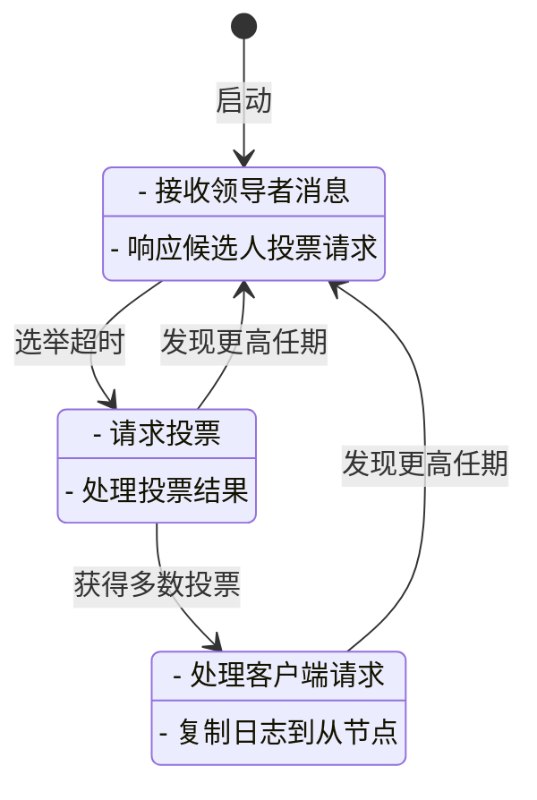

# Raft共识算法详解

## 目录
1. [Raft算法概述](#raft算法概述)
2. [Raft状态机](#raft状态机)
3. [领导者选举](#领导者选举)
4. [日志复制](#日志复制)
5. [安全性保证](#安全性保证)
6. [Python实现](#python实现)
7. [Go语言实现](#go语言实现)
8. [实际应用案例](#实际应用案例)
9. [性能优化](#性能优化)
10. [监控与调试](#监控与调试)

## Raft算法概述

### 什么是Raft？

Raft是一种分布式共识算法，旨在让分布式系统中的多个节点就某个值或状态达成一致。它是为了易于理解和实现而设计的，是目前最广泛使用的共识算法之一。

### Raft设计目标

1. **安全性**：绝不能返回错误的结果
2. **可用性**：只要大多数节点存活，系统就能正常工作
3. **不依赖时序**：使用逻辑时钟而非物理时钟
4. **降低复杂度**：相比Paxos更容易理解和实现

### Raft核心概念

```python
# Raft节点状态枚举
class NodeState:
    LEADER = "leader"
    CANDIDATE = "candidate"
    FOLLOWER = "follower"

class RaftNode:
    def __init__(self, node_id, peers):
        self.node_id = node_id
        self.peers = peers
        self.current_term = 0
        self.voted_for = None
        self.log = []  # 状态机日志
        self.commit_index = -1
        self.last_applied = -1
        
        # 领导者状态
        self.next_index = {}  # 对每个节点的下一个日志索引
        self.match_index = {} # 对每个节点已知已复制的最高日志索引
        
        self.state = NodeState.FOLLOWER
        self.votes_received = set()
```

## Raft状态机

### 状态转换图



### 节点状态管理

```python
import time
import threading
import random
from enum import Enum
from typing import List, Optional, Dict

class RaftState(Enum):
    LEADER = "leader"
    CANDIDATE = "candidate"
    FOLLOWER = "follower"

class RaftConfig:
    def __init__(self):
        self.election_timeout_min = 150  # 毫秒
        self.election_timeout_max = 300  # 毫秒
        self.heartbeat_interval = 50     # 毫秒
        
class RaftNode:
    def __init__(self, node_id: int, peers: List[int], config: RaftConfig):
        self.node_id = node_id
        self.peers = peers
        self.config = config
        
        # 持久化状态
        self.current_term = 0
        self.voted_for = None
        self.log = []
        
        # 易失性状态
        self.commit_index = -1
        self.last_applied = -1
        
        # 领导者状态
        self.next_index = {}
        self.match_index = {}
        
        # 临时状态
        self.state = RaftState.FOLLOWER
        self.votes_received = set()
        self.election_timer = None
        self.heartbeat_timer = None
        
        self.start()
    
    def start(self):
        """启动Raft节点"""
        self.reset_election_timer()
        
    def reset_election_timer(self):
        """重置选举超时计时器"""
        if self.election_timer:
            self.election_timer.cancel()
        
        timeout = random.randint(
            self.config.election_timeout_min,
            self.config.election_timeout_max
        )
        
        self.election_timer = threading.Timer(timeout / 1000.0, self.handle_election_timeout)
        self.election_timer.start()
    
    def become_follower(self, term: int):
        """成为跟随者"""
        self.state = RaftState.FOLLOWER
        self.current_term = term
        self.voted_for = None
        self.votes_received.clear()
        self.reset_election_timer()
        
        print(f"Node {self.node_id} became follower for term {term}")
    
    def become_candidate(self):
        """成为候选人"""
        self.state = RaftState.CANDIDATE
        self.current_term += 1
        self.voted_for = self.node_id
        self.votes_received = {self.node_id}
        
        print(f"Node {self.node_id} became candidate for term {self.current_term}")
        
        # 请求投票
        self.request_votes()
        self.reset_election_timer()
    
    def become_leader(self):
        """成为领导者"""
        self.state = RaftState.LEADER
        
        # 初始化领导者状态
        self.next_index = {}
        self.match_index = {}
        
        for peer in self.peers:
            self.next_index[peer] = len(self.log) + 1
            self.match_index[peer] = 0
        
        self.match_index[self.node_id] = len(self.log)
        
        print(f"Node {self.node_id} became leader for term {self.current_term}")
        
        # 开始发送心跳
        self.send_heartbeats()
```

## 领导者选举

### 选举超时机制

```python
def handle_election_timeout(self):
    """处理选举超时"""
    if self.state == RaftState.LEADER:
        return  # 领导者不会超时
    
    print(f"Node {self.node_id} election timeout, starting new election")
    self.become_candidate()

def request_votes(self):
    """请求其他节点投票"""
    last_log_index = len(self.log) - 1
    last_log_term = self.log[last_log_index].term if last_log_index >= 0 else 0
    
    for peer in self.peers:
        if peer != self.node_id:
            self.send_vote_request(peer, last_log_index, last_log_term)

def send_vote_request(self, target: int, last_log_index: int, last_log_term: int):
    """发送投票请求"""
    request = {
        'type': 'RequestVote',
        'term': self.current_term,
        'candidateId': self.node_id,
        'lastLogIndex': last_log_index,
        'lastLogTerm': last_log_term
    }
    
    # 发送网络请求（模拟）
    response = self.send_message(target, request)
    if response:
        self.handle_vote_response(response)

def handle_vote_response(self, response: dict):
    """处理投票响应"""
    if response['term'] > self.current_term:
        # 发现更高任期，立即成为跟随者
        self.become_follower(response['term'])
        return
    
    if response['term'] == self.current_term and response['voteGranted']:
        self.votes_received.add(response['candidateId'])
        
        # 检查是否获得多数票
        if len(self.votes_received) > len(self.peers) // 2:
            self.become_leader()
```

### 投票规则

```python
def can_vote_for(self, candidate: int, candidate_term: int, 
                last_log_index: int, last_log_term: int) -> bool:
    """判断是否可以投票给候选人"""
    
    # 1. 任期必须更大或相等
    if candidate_term < self.current_term:
        return False
    
    # 2. 不能投票给不同候选者（已投给别人的情况）
    if self.voted_for is not None and self.voted_for != candidate:
        return False
    
    # 3. 候选人日志必须至少和我的一样新
    my_last_log_index = len(self.log) - 1
    my_last_log_term = self.log[my_last_log_index].term if my_last_log_index >= 0 else 0
    
    if last_log_term < my_last_log_term:
        return False
    
    if last_log_term == my_last_log_term and last_log_index < my_last_log_index:
        return False
    
    return True
```

## 日志复制

### 日志条目结构

```python
@dataclass
class LogEntry:
    term: int          # 任期号
    index: int         # 日志索引
    command: dict      # 客户端命令
    timestamp: float   # 创建时间

class LogManager:
    def __init__(self):
        self.entries = []
        self.commit_index = -1
        self.last_applied = -1
    
    def append_entry(self, entry: LogEntry) -> bool:
        """追加日志条目"""
        # 确保日志索引连续
        if entry.index != len(self.entries):
            # 删除冲突的条目
            self.entries = self.entries[:entry.index]
            if len(self.entries) != entry.index:
                return False
        
        self.entries.append(entry)
        return True
    
    def get_entries_since(self, index: int) -> List[LogEntry]:
        """获取指定索引后的所有条目"""
        return self.entries[index:]
    
    def get_last_entry(self) -> Optional[LogEntry]:
        """获取最后一个条目"""
        return self.entries[-1] if self.entries else None
```

### 日志复制流程

```python
def append_entry(self, command: dict) -> bool:
    """客户端追加命令"""
    if self.state != RaftState.LEADER:
        return False
    
    # 创建新的日志条目
    entry = LogEntry(
        term=self.current_term,
        index=len(self.log),
        command=command,
        timestamp=time.time()
    )
    
    # 追加到本地日志
    self.log.append(entry)
    
    # 复制到从节点
    self.replicate_log()
    
    return True

def replicate_log(self):
    """复制日志到所有从节点"""
    for peer in self.peers:
        if peer != self.node_id:
            self.send_append_entries(peer)

def send_append_entries(self, target: int):
    """发送AppendEntries RPC"""
    prev_log_index = self.next_index[target] - 1
    prev_log_term = 0
    
    if prev_log_index >= 0:
        prev_log_term = self.log[prev_log_index].term
    
    entries = self.log[prev_log_index + 1:] if prev_log_index < len(self.log) else []
    
    request = {
        'type': 'AppendEntries',
        'term': self.current_term,
        'leaderId': self.node_id,
        'prevLogIndex': prev_log_index,
        'prevLogTerm': prev_log_term,
        'entries': [(e.term, e.index, e.command) for e in entries],
        'leaderCommit': self.commit_index
    }
    
    response = self.send_message(target, request)
    if response:
        self.handle_append_entries_response(target, response)

def handle_append_entries_response(self, target: int, response: dict):
    """处理AppendEntries响应"""
    if response['term'] > self.current_term:
        self.become_follower(response['term'])
        return
    
    if response['success']:
        # 更新匹配索引
        if response['matchIndex'] > self.match_index[target]:
            self.match_index[target] = response['matchIndex']
            self.next_index[target] = self.match_index[target] + 1
            
            # 检查是否可以提交新条目
            self.update_commit_index()
    else:
        # 减少next_index重试
        self.next_index[target] = max(1, self.next_index[target] - 1)

def update_commit_index(self):
    """更新提交索引"""
    # 找到大多数节点都有的最高日志索引
    match_indices = sorted(self.match_index.values(), reverse=True)
    
    for i, match_index in enumerate(match_indices):
        if i >= len(match_indices) // 2:
            # 找到多数节点支持的索引
            if match_index > self.commit_index and \
               self.log[match_index].term == self.current_term:
                self.commit_index = match_index
                self.apply_committed_entries()
                break

def apply_committed_entries(self):
    """应用已提交的条目到状态机"""
    while self.last_applied < self.commit_index:
        self.last_applied += 1
        entry = self.log[self.last_applied]
        self.apply_to_state_machine(entry.command)
        print(f"Applied command to state machine: {entry.command}")

def apply_to_state_machine(self, command: dict):
    """应用到状态机（实际业务逻辑）"""
    # 实现具体的业务逻辑
    pass
```

## 安全性保证

### 领导者完整性

```python
def ensure_leader_integrity(self, candidate_term: int, 
                          last_log_index: int, last_log_term: int) -> bool:
    """确保候选者日志至少和当前节点一样新"""
    last_index = len(self.log) - 1
    last_term = self.log[last_index].term if last_index >= 0 else 0
    
    # 规则1：任期更大的候选者获胜
    if last_term > last_log_term:
        return False
    
    # 规则2：相同任期下，索引更大的获胜
    if last_term == last_log_term and last_index > last_log_index:
        return False
    
    return True

def handle_append_entries(self, request: dict) -> dict:
    """处理AppendEntries请求"""
    # 检查任期
    if request['term'] < self.current_term:
        return {'term': self.current_term, 'success': False}
    
    # 如果发现更高任期，更新状态
    if request['term'] > self.current_term:
        self.become_follower(request['term'])
    
    # 检查前一个日志条目
    if not self.check_prev_log_entry(request):
        return {'term': self.current_term, 'success': False}
    
    # 处理冲突的日志条目
    self.resolve_log_conflicts(request['entries'])
    
    # 更新提交索引
    if request['leaderCommit'] > self.commit_index:
        self.commit_index = min(request['leaderCommit'], len(self.log) - 1)
    
    return {'term': self.current_term, 'success': True, 
            'matchIndex': len(self.log) - 1}
```

## Python实现

### 完整的Raft节点实现

```python
import json
import time
import threading
import socket
from dataclasses import dataclass, asdict
from typing import List, Dict, Optional, Callable
from enum import Enum

class MessageType(Enum):
    REQUEST_VOTE = "RequestVote"
    APPEND_ENTRIES = "AppendEntries"
    VOTE_RESPONSE = "VoteResponse"
    APPEND_ENTRIES_RESPONSE = "AppendEntriesResponse"

@dataclass
class RaftMessage:
    type: MessageType
    term: int
    source: int
    target: int
    data: dict
    
    def to_dict(self):
        return {
            'type': self.type.value,
            'term': self.term,
            'source': self.source,
            'target': self.target,
            'data': self.data
        }

class RaftNode:
    def __init__(self, node_id: int, peers: List[int], port: int):
        self.node_id = node_id
        self.peers = peers
        self.port = port
        self.is_running = True
        
        # Raft状态
        self.current_term = 0
        self.voted_for = None
        self.state = RaftState.FOLLOWER
        self.log = []
        self.commit_index = -1
        self.last_applied = -1
        
        # 领导者状态
        self.next_index = {}
        self.match_index = {}
        self.votes_received = set()
        
        # 网络通信
        self.sock = socket.socket(socket.AF_INET, socket.SOCK_DGRAM)
        self.sock.bind(('', port))
        
        # 启动线程
        self.election_thread = threading.Thread(target=self.election_loop)
        self.heartbeat_thread = threading.Thread(target=self.heartbeat_loop)
        self.network_thread = threading.Thread(target=self.network_loop)
        
        self.start()
    
    def start(self):
        """启动节点"""
        print(f"Node {self.node_id} starting on port {self.port}")
        
        self.election_thread.start()
        self.heartbeat_thread.start()
        self.network_thread.start()
    
    def stop(self):
        """停止节点"""
        self.is_running = False
        self.sock.close()
    
    def election_loop(self):
        """选举循环"""
        while self.is_running:
            if self.state == RaftState.FOLLOWER:
                # 等待选举超时
                time.sleep(random.uniform(0.15, 0.3))
                if self.is_running and self.state == RaftState.FOLLOWER:
                    print(f"Node {self.node_id} election timeout")
                    self.become_candidate()
            
            elif self.state == RaftState.CANDIDATE:
                # 等待投票结果
                time.sleep(0.1)
                
                # 检查是否获得多数票
                if len(self.votes_received) > len(self.peers) // 2:
                    self.become_leader()
                elif self.state == RaftState.CANDIDATE:
                    # 重新开始选举
                    self.current_term += 1
                    self.voted_for = None
                    self.votes_received.clear()
            
            elif self.state == RaftState.LEADER:
                # 领导者不休眠，发送心跳
                time.sleep(0.05)
    
    def heartbeat_loop(self):
        """心跳循环"""
        while self.is_running:
            if self.state == RaftState.LEADER:
                self.send_heartbeat()
            time.sleep(0.05)
    
    def network_loop(self):
        """网络消息循环"""
        while self.is_running:
            try:
                data, addr = self.sock.recvfrom(4096)
                message = RaftMessage(**json.loads(data.decode()))
                self.handle_message(message)
            except socket.timeout:
                continue
            except Exception as e:
                if self.is_running:
                    print(f"Network error: {e}")
    
    def handle_message(self, message: RaftMessage):
        """处理接收到的消息"""
        if message.term > self.current_term:
            self.become_follower(message.term)
        
        if message.type == MessageType.REQUEST_VOTE:
            self.handle_vote_request(message)
        elif message.type == MessageType.APPEND_ENTRIES:
            self.handle_append_entries_request(message)
        elif message.type == MessageType.VOTE_RESPONSE:
            self.handle_vote_response(message)
        elif message.type == MessageType.APPEND_ENTRIES_RESPONSE:
            self.handle_append_entries_response(message)
    
    def send_message(self, target: int, message: RaftMessage):
        """发送消息到目标节点"""
        try:
            # 假设所有节点在同一台机器的不同端口
            target_port = self.port + target
            self.sock.sendto(json.dumps(message.to_dict()).encode(), 
                           ('localhost', target_port))
        except Exception as e:
            print(f"Failed to send message to node {target}: {e}")
    
    # 实现所有处理方法...
    
    def test_raft_cluster(self):
        """测试Raft集群"""
        # 创建5个节点的集群
        peers = [0, 1, 2, 3, 4]
        cluster = [RaftNode(i, [p for p in peers if p != i], 8000 + i) 
                  for i in peers]
        
        try:
            # 等待集群稳定
            time.sleep(2)
            
            # 测试添加命令
            for i, node in enumerate(cluster):
                if node.state == RaftState.LEADER:
                    print(f"Node {i} is leader, sending test commands")
                    
                    for j in range(5):
                        command = {'op': 'set', 'key': f'key{j}', 'value': f'value{j}'}
                        node.append_entry(command)
                        time.sleep(0.1)
                    
                    break
            
            # 等待命令提交
            time.sleep(2)
            
            # 检查日志复制
            for i, node in enumerate(cluster):
                print(f"Node {i} log: {len(node.log)} entries, "
                      f"state: {node.state.value}, "
                      f"commit_index: {node.commit_index}")
        
        finally:
            # 停止所有节点
            for node in cluster:
                node.stop()

# 使用示例
if __name__ == "__main__":
    # 创建并测试Raft集群
    cluster = RaftNode(0, [1, 2, 3, 4], 8000)
    cluster.test_raft_cluster()
```

## Go语言实现

### Go版本的核心结构体

```go
package raft

import (
    "fmt"
    "log"
    "math/rand"
    "net"
    "sync"
    "time"
)

// Raft角色
type NodeState int

const (
    Follower NodeState = iota
    Candidate
    Leader
)

// 日志条目
type LogEntry struct {
    Term    int         `json:"term"`
    Index   int         `json:"index"`
    Command interface{} `json:"command"`
}

// 消息类型
type MessageType int

const (
    RequestVote MessageType = iota
    AppendEntries
    VoteResponse
    AppendEntriesResponse
)

// 网络消息
type NetworkMessage struct {
    Type      MessageType `json:"type"`
    Term      int         `json:"term"`
    Source    int         `json:"source"`
    Target    int         `json:"target"`
    Data      map[string]interface{} `json:"data"`
}

// Raft节点
type RaftNode struct {
    nodeID    int
    peers     []int
    port      int
    
    // Raft状态
    currentTerm int
    votedFor    *int
    state       NodeState
    log         []LogEntry
    commitIndex int
    lastApplied int
    
    // 领导者状态
    nextIndex   map[int]int
    matchIndex  map[int]int
    votesReceived map[int]bool
    
    // 网络
    listener    net.Listener
    sendChan    chan NetworkMessage
    
    // 控制
    mutex       sync.RWMutex
    running     bool
    
    // 超时配置
    electionTimeout time.Duration
    heartbeatInterval time.Duration
}

// 创建新的Raft节点
func NewRaftNode(nodeID int, peers []int, port int) *RaftNode {
    node := &RaftNode{
        nodeID:    nodeID,
        peers:     peers,
        port:      port,
        
        currentTerm: 0,
        state:       Follower,
        log:         make([]LogEntry, 0),
        commitIndex: -1,
        lastApplied: -1,
        
        nextIndex:   make(map[int]int),
        matchIndex:  make(map[int]int),
        votesReceived: make(map[int]bool),
        
        sendChan:    make(chan NetworkMessage, 100),
        
        electionTimeout: time.Duration(150+rand.Intn(150)) * time.Millisecond,
        heartbeatInterval: 50 * time.Millisecond,
    }
    
    return node
}

// 启动节点
func (n *RaftNode) Start() error {
    n.running = true
    
    // 启动网络监听
    go n.listenForConnections()
    
    // 启动选举循环
    go n.electionLoop()
    
    // 启动心跳循环
    go n.heartbeatLoop()
    
    // 启动消息处理循环
    go n.messageLoop()
    
    log.Printf("Node %d started on port %d", n.nodeID, n.port)
    return nil
}

// 停止节点
func (n *RaftNode) Stop() {
    n.running = false
    if n.listener != nil {
        n.listener.Close()
    }
    close(n.sendChan)
}

// 选举循环
func (n *RaftNode) electionLoop() {
    ticker := time.NewTicker(n.electionTimeout)
    defer ticker.Stop()
    
    for n.running {
        select {
        case <-ticker.C:
            n.mutex.Lock()
            if n.state == Follower {
                n.becomeCandidate()
            }
            n.mutex.Unlock()
        }
    }
}

// 心跳循环
func (n *RaftNode) heartbeatLoop() {
    ticker := time.NewTicker(n.heartbeatInterval)
    defer ticker.Stop()
    
    for n.running {
        select {
        case <-ticker.C:
            n.mutex.Lock()
            if n.state == Leader {
                n.sendHeartbeat()
            }
            n.mutex.Unlock()
        }
    }
}

// 消息处理循环
func (n *RaftNode) messageLoop() {
    for msg := range n.sendChan {
        n.handleMessage(msg)
    }
}

// 成为候选人
func (n *RaftNode) becomeCandidate() {
    n.state = Candidate
    n.currentTerm++
    n.votedFor = &n.nodeID
    n.votesReceived = make(map[int]bool)
    n.votesReceived[n.nodeID] = true
    
    log.Printf("Node %d became candidate for term %d", n.nodeID, n.currentTerm)
    
    // 请求投票
    n.requestVotes()
}

// 成为领导者
func (n *RaftNode) becomeLeader() {
    n.state = Leader
    
    // 初始化领导者状态
    for _, peer := range n.peers {
        n.nextIndex[peer] = len(n.log) + 1
        n.matchIndex[peer] = 0
    }
    n.matchIndex[n.nodeID] = len(n.log)
    
    log.Printf("Node %d became leader for term %d", n.nodeID, n.currentTerm)
    
    // 立即发送心跳
    n.sendHeartbeat()
}

// 成为跟随者
func (n *RaftNode) becomeFollower(term int) {
    n.state = Follower
    n.currentTerm = term
    n.votedFor = nil
    n.votesReceived = make(map[int]bool)
    
    log.Printf("Node %d became follower for term %d", n.nodeID, term)
}

// 请求投票
func (n *RaftNode) requestVotes() {
    lastLogIndex := len(n.log) - 1
    lastLogTerm := 0
    if lastLogIndex >= 0 {
        lastLogTerm = n.log[lastLogIndex].Term
    }
    
    for _, peer := range n.peers {
        if peer != n.nodeID {
            msg := NetworkMessage{
                Type:   RequestVote,
                Term:   n.currentTerm,
                Source: n.nodeID,
                Target: peer,
                Data: map[string]interface{}{
                    "candidateId":     n.nodeID,
                    "lastLogIndex":   lastLogIndex,
                    "lastLogTerm":    lastLogTerm,
                },
            }
            n.sendChan <- msg
        }
    }
}

// 发送心跳
func (n *RaftNode) sendHeartbeat() {
    for _, peer := range n.peers {
        if peer != n.nodeID {
            n.sendAppendEntries(peer)
        }
    }
}

// 处理投票请求
func (n *RaftNode) handleVoteRequest(msg NetworkMessage) {
    candidateId := msg.Data["candidateId"].(int)
    lastLogIndex := int(msg.Data["lastLogIndex"].(float64))
    lastLogTerm := int(msg.Data["lastLogTerm"].(float64))
    
    // 检查任期
    if msg.Term < n.currentTerm {
        n.sendVoteResponse(msg.Source, false)
        return
    }
    
    // 检查是否已经投票
    if n.votedFor != nil && *n.votedFor != candidateId {
        n.sendVoteResponse(msg.Source, false)
        return
    }
    
    // 检查日志是否足够新
    myLastLogIndex := len(n.log) - 1
    myLastLogTerm := 0
    if myLastLogIndex >= 0 {
        myLastLogTerm = n.log[myLastLogIndex].Term
    }
    
    if lastLogTerm < myLastLogTerm ||
        (lastLogTerm == myLastLogTerm && lastLogIndex < myLastLogIndex) {
        n.sendVoteResponse(msg.Source, false)
        return
    }
    
    // 投票给候选者
    n.votedFor = &candidateId
    n.sendVoteResponse(msg.Source, true)
}

// 处理AppendEntries请求
func (n *RaftNode) handleAppendEntriesRequest(msg NetworkMessage) {
    // 检查任期
    if msg.Term < n.currentTerm {
        n.sendAppendEntriesResponse(msg.Source, false, -1)
        return
    }
    
    // 更新状态
    n.becomeFollower(msg.Term)
    
    // 检查前一个日志条目
    prevLogIndex := int(msg.Data["prevLogIndex"].(float64))
    prevLogTerm := int(msg.Data["prevLogTerm"].(float64))
    
    if !n.checkPrevLogEntry(prevLogIndex, prevLogTerm) {
        n.sendAppendEntriesResponse(msg.Source, false, len(n.log)-1)
        return
    }
    
    // 处理冲突的日志条目
    entries := n.parseEntries(msg.Data["entries"])
    n.resolveLogConflicts(entries)
    
    // 更新提交索引
    leaderCommit := int(msg.Data["leaderCommit"].(float64))
    if leaderCommit > n.commitIndex {
        n.commitIndex = min(leaderCommit, len(n.log)-1)
        n.applyCommittedEntries()
    }
    
    n.sendAppendEntriesResponse(msg.Source, true, len(n.log)-1)
}

// 应用已提交的条目
func (n *RaftNode) applyCommittedEntries() {
    for n.lastApplied < n.commitIndex {
        n.lastApplied++
        entry := n.log[n.lastApplied]
        n.applyToStateMachine(entry.Command)
    }
}

// 应用到状态机
func (n *RaftNode) applyToStateMachine(command interface{}) {
    // 实际的业务逻辑
    log.Printf("Node %d applied command: %v", n.nodeID, command)
}

// 辅助函数
func (n *RaftNode) sendMessage(msg NetworkMessage) {
    // 实际的网络发送逻辑
    log.Printf("Node %d sending message to %d: %v", n.nodeID, msg.Target, msg)
}

// 辅助函数定义...
func (n *RaftNode) sendVoteResponse(target int, granted bool) {
    msg := NetworkMessage{
        Type:   VoteResponse,
        Term:   n.currentTerm,
        Source: n.nodeID,
        Target: target,
        Data: map[string]interface{}{
            "voteGranted": granted,
        },
    }
    n.sendChan <- msg
}

func min(a, b int) int {
    if a < b {
        return a
    }
    return b
}

// 使用示例
func main() {
    // 创建5个节点的集群
    peers := []int{0, 1, 2, 3, 4}
    cluster := make([]*RaftNode, 5)
    
    for i := 0; i < 5; i++ {
        node := NewRaftNode(i, peers, 8000+i)
        cluster[i] = node
        node.Start()
        time.Sleep(100 * time.Millisecond)
    }
    
    // 等待集群稳定
    time.Sleep(2 * time.Second)
    
    // 测试领导者选举
    leader := 0
    for i, node := range cluster {
        node.mutex.RLock()
        if node.state == Leader {
            leader = i
            log.Printf("Node %d is the leader", i)
        }
        node.mutex.RUnlock()
    }
    
    // 测试命令追加
    command := map[string]interface{}{
        "op": "set",
        "key": "test_key",
        "value": "test_value",
    }
    
    cluster[leader].AppendEntry(command)
    
    // 等待日志复制
    time.Sleep(1 * time.Second)
    
    // 检查集群状态
    for i, node := range cluster {
        node.mutex.RLock()
        log.Printf("Node %d: state=%v, term=%d, log_entries=%d, commit_index=%d",
            i, node.state, node.currentTerm, len(node.log), node.commitIndex)
        node.mutex.RUnlock()
    }
    
    // 保持运行
    time.Sleep(30 * time.Second)
    
    // 停止所有节点
    for _, node := range cluster {
        node.Stop()
    }
}
```

## 实际应用案例

### 1. 分布式键值存储

```python
class DistributedKVStore:
    def __init__(self, raft_cluster):
        self.raft_cluster = raft_cluster
        self.kv_store = {}
        
    def set(self, key: str, value: str):
        """设置键值对"""
        command = {
            'type': 'SET',
            'key': key,
            'value': value
        }
        
        # 通过Raft共识添加命令
        self.raft_cluster.consensus_propose(command)
    
    def get(self, key: str) -> Optional[str]:
        """获取键值"""
        return self.kv_store.get(key)
    
    def apply_command(self, command: dict):
        """应用Raft日志中的命令"""
        if command['type'] == 'SET':
            self.kv_store[command['key']] = command['value']
```

### 2. 分布式配置管理

```go
type ConfigManager struct {
    raft *RaftNode
    config map[string]interface{}
    mu sync.RWMutex
}

func NewConfigManager(nodeID int, peers []int) *ConfigManager {
    config := &ConfigManager{
        config: make(map[string]interface{}),
    }
    
    // 创建Raft节点
    raftNode := NewRaftNode(nodeID, peers, 8000+nodeID)
    config.raft = raftNode
    
    // 设置命令应用回调
    raftNode.SetApplyCallback(config.applyConfigCommand)
    
    return config
}

func (c *ConfigManager) UpdateConfig(key string, value interface{}) error {
    command := map[string]interface{}{
        "type": "CONFIG_UPDATE",
        "key":   key,
        "value": value,
    }
    
    return c.raft.Propose(command)
}

func (c *ConfigManager) applyConfigCommand(command interface{}) {
    cmd := command.(map[string]interface{})
    if cmd["type"] == "CONFIG_UPDATE" {
        c.mu.Lock()
        c.config[cmd["key"].(string)] = cmd["value"]
        c.mu.Unlock()
        
        log.Printf("Config updated: %s = %v", cmd["key"], cmd["value"])
    }
}
```

## 性能优化

### 1. 批量日志复制

```python
class BatchAppendEntries:
    def __init__(self, batch_size=100):
        self.batch_size = batch_size
        self.pending_commands = []
        self.last_batch_time = time.time()
    
    def add_command(self, command):
        """添加待复制命令"""
        self.pending_commands.append(command)
        
        # 批量发送条件：达到批量大小或超时
        if (len(self.pending_commands) >= self.batch_size or 
            time.time() - self.last_batch_time > 0.1):
            self.flush_batch()
    
    def flush_batch(self):
        """发送批量命令"""
        if not self.pending_commands:
            return
        
        # 合并日志条目
        batch_command = {
            'type': 'BATCH_SET',
            'commands': self.pending_commands.copy()
        }
        
        # 通过Raft复制
        # self.raft.append_entry(batch_command)
        
        self.pending_commands.clear()
        self.last_batch_time = time.time()
```

### 2. 流水线日志复制

```go
type PipelineReplicator struct {
    nodeID int
    targets []int
    nextIndex map[int]int
    sendQueue chan []LogEntry
    workers int
}

func NewPipelineReplicator(nodeID int, targets []int) *PipelineReplicator {
    pr := &PipelineReplicator{
        nodeID: nodeID,
        targets: targets,
        nextIndex: make(map[int]int),
        sendQueue: make(chan []LogEntry, 1000),
        workers: 10,
    }
    
    // 启动工作协程
    for i := 0; i < pr.workers; i++ {
        go pr.worker()
    }
    
    return pr
}

func (pr *PipelineReplicator) worker() {
    for entries := range pr.sendQueue {
        for _, target := range pr.targets {
            go pr.sendBatchToTarget(target, entries)
        }
    }
}

func (pr *PipelineReplicator) sendBatchToTarget(target int, entries []LogEntry) {
    // 发送批量日志条目到目标节点
    request := &AppendEntriesRequest{
        Term: pr.currentTerm,
        LeaderId: pr.nodeID,
        PrevLogIndex: pr.nextIndex[target] - 1,
        Entries: entries,
    }
    
    // 发送网络请求
    // response := sendNetworkRequest(target, request)
    // 处理响应...
}
```

## 监控与调试

### 1. 性能监控

```python
class RaftMetrics:
    def __init__(self):
        self.commit_latency = []
        self.append_latency = []
        self.election_count = 0
        self.leader_changes = 0
    
    def record_commit_latency(self, latency_ms):
        """记录提交延迟"""
        self.commit_latency.append(latency_ms)
    
    def record_append_latency(self, latency_ms):
        """记录追加延迟"""
        self.append_latency.append(latency_ms)
    
    def get_metrics_summary(self):
        """获取指标摘要"""
        if not self.commit_latency:
            return "No metrics available"
        
        return {
            'avg_commit_latency': sum(self.commit_latency) / len(self.commit_latency),
            'max_commit_latency': max(self.commit_latency),
            'avg_append_latency': sum(self.append_latency) / len(self.append_latency),
            'election_count': self.election_count,
            'leader_changes': self.leader_changes
        }
```

### 2. 调试工具

```go
type RaftDebugger struct {
    node *RaftNode
    traceLevel int
    logFile *os.File
}

func NewRaftDebugger(node *RaftNode, traceLevel int) *RaftDebugger {
    filename := fmt.Sprintf("raft_node_%d.log", node.nodeID)
    file, _ := os.Create(filename)
    
    return &RaftDebugger{
        node: node,
        traceLevel: traceLevel,
        logFile: file,
    }
}

func (d *RaftDebugger) Log(message string, args ...interface{}) {
    timestamp := time.Now().Format("2006-01-02 15:04:05.000")
    stateStr := map[NodeState]string{
        Follower:  "F",
        Candidate: "C",
        Leader:    "L",
    }[d.node.state]
    
    logEntry := fmt.Sprintf("[%s] [%s] [T%d] %s\n",
        timestamp, stateStr, d.node.currentTerm,
        fmt.Sprintf(message, args...))
    
    d.logFile.WriteString(logEntry)
    d.logFile.Sync()
}

func (d *RaftDebugger) LogState() {
    d.Log("STATE: state=%s, term=%d, log_len=%d, commit_index=%d",
        d.node.state, d.node.currentTerm, len(d.node.log), d.node.commitIndex)
}
```

## 总结

Raft共识算法是分布式系统中的重要组件，通过清晰的领导者选举、日志复制和安全性保证机制，为分布式一致性提供了简单而可靠的解决方案。

### 关键特点：

1. **易理解性**：相比Paxos，Raft的设计更加直观和容易实现
2. **强一致性**：保证所有节点的状态机最终状态一致
3. **容错性**：即使部分节点故障，系统仍能正常工作
4. **可扩展性**：支持动态添加/删除节点

### 实际应用：

- 分布式键值存储（etcd、Consul）
- 分布式数据库主从选举
- 分布式配置管理
- 分布式协调服务

通过深入理解和正确实现Raft算法，可以构建更加可靠和稳定的分布式系统。

---

*最后更新：2025年11月*