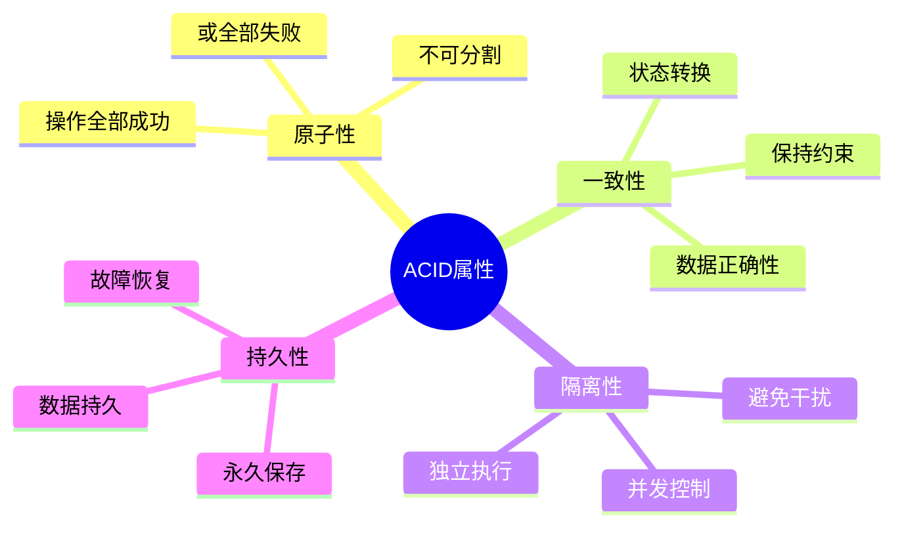

# 分布式事务ACID属性详解

## 目录
1. [ACID属性概述](#acid属性概述)
2. [原子性(Atomicity)](#原子性atomicity)
3. [一致性(Consistency)](#一致性consistency)
4. [隔离性(Isolation)](#隔离性isolation)
5. [持久性(Durability)](#持久性durability)
6. [分布式环境中的挑战](#分布式环境中的挑战)
7. [总结](#总结)

## ACID属性概述

**定义**：ACID是数据库事务处理的四个基本特性的缩写（Atomicity、Consistency、Isolation、Durability），是确保数据库完整性和一致性的关键概念，尤其在分布式系统中具有重要意义。

ACID是事务处理的基础，确保在复杂的数据操作中维持数据的可靠性和正确性。在分布式环境下，实现ACID特性面临着更多挑战，但仍是构建可靠系统的核心要求。

### ACID四要素



### 事务状态转换

事务在其生命周期中会经历多个状态转换，这对于理解事务的执行流程至关重要。典型的事务状态包括：

| 状态 | 描述 |
|------|------|
| ACTIVE | 事务正在执行中 |
| PREPARING | 事务准备提交 |
| PREPARED | 事务已准备就绪 |
| COMMITTING | 事务正在提交 |
| COMMITTED | 事务已成功提交 |
| ABORTING | 事务正在回滚 |
| ABORTED | 事务已回滚 |
| FAILED | 事务执行失败 |

这些状态转换确保事务能够正确地处理成功和失败的情况，特别是在分布式环境中。

## 原子性(Atomicity)

### 原子性定义

**核心概念**：原子性确保事务中的所有操作要么全部成功完成，要么全部失败回滚，不会出现部分成功、部分失败的中间状态。在分布式系统中，这意味着即使事务跨越多个节点，也必须保证整体操作的原子性。

原子性是事务可靠性的基础，它保证了在任何故障情况下，系统都不会留下不一致的数据状态。

### 原子性实现机制

原子性的实现通常依赖以下关键技术：

1. **事务日志**：记录所有操作的前像和后像，用于故障恢复
2. **两阶段提交(2PC)**：在分布式环境中协调多个节点的提交或回滚
3. **补偿机制**：通过反向操作撤销已执行的操作
4. **原子操作包装**：将多个操作封装为一个逻辑单元

**典型实现模式**：
- 使用事务管理器协调所有操作
- 为每个操作定义正向执行和回滚方法
- 在执行前准备好所有必要的资源
- 发生故障时按照执行顺序的反向执行回滚

**银行转账示例**：在分布式银行系统中，转账操作需要确保扣款和入账要么同时成功，要么都不执行，这正是原子性的典型应用场景。
```

## 一致性(Consistency)

### 一致性定义

**核心概念**：一致性确保事务执行前后，数据库从一个有效状态转换到另一个有效状态，所有数据完整性约束都得到满足。这意味着事务不会破坏数据库的任何预设规则。

一致性是业务逻辑的要求，它定义了数据的有效状态，而原子性、隔离性和持久性则是实现一致性的机制保障。

### 一致性约束类型

一致性约束主要包括以下几种类型：

1. **实体完整性**：确保主键的唯一性和非空性
2. **引用完整性**：确保外键引用的有效性
3. **域完整性**：确保数据符合预定义的数据类型和范围
4. **业务规则完整性**：确保数据符合特定业务的规则要求

### 一致性检查机制

一致性检查通常在以下时机进行：

- **事务开始前**：验证初始状态的有效性
- **事务执行过程中**：实时检查约束条件
- **事务提交前**：最终验证所有一致性规则

**银行系统示例**：
- 总资金守恒（转账前后总金额不变）
- 账户余额非负
- 账户ID唯一性
- 交易金额必须为正数

这些一致性规则确保银行系统的数据始终保持准确和有效，即使在并发操作或系统故障的情况下。
```

## 隔离性(Isolation)

### 隔离级别定义

**核心概念**：隔离性确保并发执行的事务之间互不干扰，每个事务都感觉自己是在独立执行。隔离性通过控制事务之间的可见性来防止各种并发问题。

### 事务隔离级别

SQL标准定义了四个隔离级别，按照从低到高的顺序：

| 隔离级别 | 脏读 | 不可重复读 | 幻读 | 锁定程度 |
|---------|------|------------|------|----------|
| 读未提交(Read Uncommitted) | 可能 | 可能 | 可能 | 最小 |
| 读已提交(Read Committed) | 不可能 | 可能 | 可能 | 中等 |
| 可重复读(Repeatable Read) | 不可能 | 不可能 | 可能 | 较高 |
| 串行化(Serializable) | 不可能 | 不可能 | 不可能 | 最大 |

### 并发问题详解

1. **脏读(Dirty Read)**：读取到其他事务未提交的数据
2. **不可重复读(Non-repeatable Read)**：同一事务中多次读取同一数据，结果不一致
3. **幻读(Phantom Read)**：同一事务中多次查询同一范围，返回的记录数不一致

### 隔离性实现机制

隔离性主要通过以下技术实现：

1. **锁机制**：
   - 共享锁(S)：允许多个事务同时读取
   - 排他锁(X)：防止其他事务读取或修改
   - 更新锁(U)：特殊类型的共享锁，为更新做准备

2. **MVCC（多版本并发控制）**：
   - 为数据维护多个版本
   - 读取操作不会阻塞写入操作
   - 写入操作不会阻塞读取操作

3. **乐观并发控制**：
   - 基于版本号或时间戳
   - 提交时检查冲突
   - 适用于读多写少的场景
```

## 持久性(Durability)

### 持久性定义

**核心概念**：持久性确保一旦事务成功提交，其结果就被永久保存到数据库中，即使发生系统崩溃、电源故障或其他灾难性事件，数据也不会丢失。

持久性是事务可靠性的关键保障，它确保了即使在极端情况下，已经提交的数据也能够被恢复。

### 持久性实现机制

持久性主要通过以下技术实现：

1. **预写日志(WAL - Write-Ahead Logging)**：
   - 在数据更新前先将操作记录到日志文件
   - 确保日志写入成功后才认为事务提交成功
   - 日志包含足够的信息用于数据恢复

2. **检查点(Checkpoint)机制**：
   - 定期将内存中的修改刷新到磁盘
   - 记录检查点时刻的系统状态
   - 恢复时只需要应用检查点之后的日志

3. **多副本存储**：
   - 将数据复制到多个物理存储设备
   - 使用RAID技术提高存储可靠性
   - 在分布式系统中使用多节点复制

4. **强制刷盘**：
   - 使用操作系统的fsync/fdatasync调用
   - 绕过操作系统缓冲区，直接写入物理磁盘
   - 确保数据真正持久化到存储介质

### 恢复过程

系统崩溃后的数据恢复通常包括以下步骤：

1. **分析阶段**：扫描日志，识别已提交和未提交的事务
2. **重做阶段(Redo)**：重新执行所有已提交事务的操作
3. **撤销阶段(Undo)**：回滚所有未提交事务的操作
4. **验证阶段**：检查数据一致性，确保恢复成功

持久性实现的强度可以根据业务需求进行调整，从基本的日志记录到完全的多副本同步复制，提供不同级别的数据安全性保障。
```

## 分布式环境中的挑战

在分布式系统中实现ACID属性面临着比单机系统更多的挑战，这主要是由于网络的不确定性、节点的独立性和系统的复杂性所导致的。

### CAP定理

**CAP定理**指出，在分布式系统中，无法同时满足以下三个特性：

- **一致性(Consistency)**：所有节点在同一时间看到相同的数据
- **可用性(Availability)**：每个请求都能在有限时间内收到响应
- **分区容错性(Partition tolerance)**：即使网络分区发生，系统仍能继续运行

在实际的分布式系统中，网络分区是不可避免的（P是必须的），因此必须在一致性(C)和可用性(A)之间做出权衡：

| 系统类型 | 特点 | 适用场景 | 示例 |
|---------|------|----------|------|
| CP系统 | 保证一致性，牺牲可用性 | 金融交易、关键业务数据 | 传统数据库、分布式锁 |
| AP系统 | 保证可用性，牺牲一致性 | 社交网络、内容平台 | NoSQL数据库、消息队列 |
| CA系统 | 理论上存在，实际分布式环境下不可能完全实现 | - | 单机数据库 |

### BASE理论

为了应对CAP定理的限制，BASE理论提供了一种务实的解决方案：

- **基本可用(Basically Available)**：系统保证基本的可用性
- **软状态(Soft State)**：允许系统存在中间状态
- **最终一致性(Eventual Consistency)**：系统最终会达到一致状态，无需保证实时一致性

BASE理论是对ACID的补充，特别适用于大规模分布式系统，允许在一致性和可用性之间找到平衡点。
```

### 分布式事务主要挑战

#### 1. 网络不确定性
- **网络分区**：节点间通信中断，导致协调困难
- **网络延迟**：通信延迟增加事务执行时间
- **消息丢失**：需要实现消息确认和重试机制

**解决方案**：超时机制、幂等性设计、最终一致性模式

#### 2. 节点故障
- **协调者故障**：可能导致事务悬挂
- **参与者故障**：可能导致部分提交或回滚
- **状态不一致**：节点重启后需要恢复正确状态

**解决方案**：领导者选举、日志记录、恢复机制、补偿事务

#### 3. 并发与性能问题
- **协调开销**：多节点协调增加延迟
- **资源锁定**：长时间锁定影响并发性能
- **死锁风险**：分布式死锁更难检测和解决

**解决方案**：异步处理、乐观并发控制、合理的事务边界设计

#### 4. 数据一致性挑战
- **全局数据视图**：跨节点数据难以保持一致
- **事务可见性**：确定事务结果的可见时机
- **部分失败恢复**：处理事务部分成功的复杂情况

**解决方案**：分布式事务协议、版本控制、冲突检测与解决
```

## 总结

分布式事务的ACID属性是构建可靠分布式系统的基础，但在实际实现中面临着诸多挑战。理解这些挑战并采取适当的解决方案，对于设计高性能、高可用、数据一致性的分布式系统至关重要。

### 核心要点回顾

1. **ACID属性的重要性**：
   - 原子性确保操作的整体性
   - 一致性保证数据的有效性
   - 隔离性控制并发访问
   - 持久性保障数据的可靠性

2. **分布式环境的权衡**：
   - CAP定理限制了同时满足一致性、可用性和分区容错性的可能性
   - BASE理论提供了更灵活的最终一致性解决方案
   - 不同业务场景需要不同的一致性级别

3. **实用的解决方案**：
   - 分布式事务协议（2PC、3PC、TCC、Saga等）
   - 消息队列和事件驱动架构
   - 幂等性设计和重试机制
   - 补偿事务和最终一致性模式

4. **设计原则**：
   - 尽量减少事务的范围和持续时间
   - 合理划分服务边界，避免分布式事务
   - 优先考虑最终一致性，仅在必要时使用强一致性
   - 建立完善的监控和故障恢复机制

在实际项目中，需要根据业务需求、性能要求和一致性级别，综合考虑各种因素，选择最合适的解决方案。没有放之四海而皆准的完美方案，只有最适合特定场景的权衡选择。

---

*文档创建时间：2025-11-21*
*最后更新时间：2025-11-21*