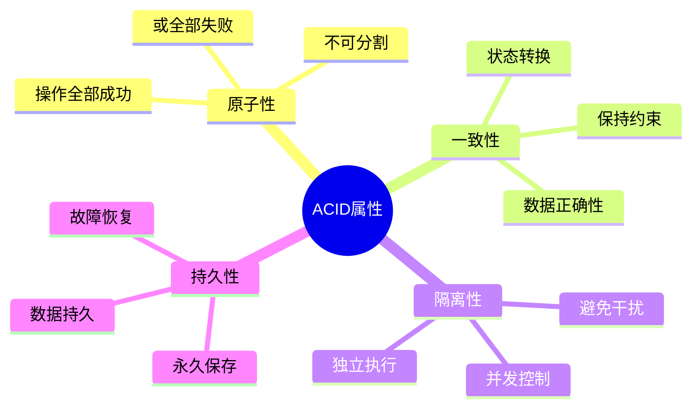

# 分布式事务ACID属性详解

## 目录
1. [ACID属性概述](#acid属性概述)
2. [原子性(Atomicity)](#原子性atomicity)
3. [一致性(Consistency)](#一致性consistency)
4. [隔离性(Isolation)](#隔离性isolation)
5. [持久性(Durability)](#持久性durability)
6. [分布式环境中的挑战](#分布式环境中的挑战)
7. [两阶段提交协议(2PC)](#两阶段提交协议2pc)
8. [三阶段提交协议(3PC)](#三阶段提交协议3pc)
9. [Saga模式](#saga模式)
10. [实际应用案例](#实际应用案例)

## ACID属性概述

ACID是数据库事务处理的四个基本特性的缩写，是确保数据库完整性和一致性的关键概念。

### ACID四要素



### 事务状态转换

```python
from enum import Enum
from typing import List, Callable, Any
import logging
import time

class TransactionState(Enum):
    ACTIVE = "active"
    PREPARING = "preparing"
    PREPARED = "prepared"
    COMMITTING = "committing"
    COMMITTED = "committed"
    ABORTING = "aborting"
    ABORTED = "aborted"
    FAILED = "failed"

class TransactionContext:
    """事务上下文"""
    def __init__(self, transaction_id: str):
        self.transaction_id = transaction_id
        self.state = TransactionState.ACTIVE
        self.operations = []
        self.participants = []
        self.timeout = 30000  # 30秒超时
        self.start_time = time.time()
        self.metadata = {}
        
    def add_operation(self, operation: Callable, *args, **kwargs):
        """添加操作到事务"""
        self.operations.append({
            'operation': operation,
            'args': args,
            'kwargs': kwargs,
            'result': None,
            'error': None
        })
    
    def add_participant(self, participant):
        """添加事务参与者"""
        self.participants.append(participant)
    
    def get_state(self) -> TransactionState:
        return self.state
    
    def set_state(self, state: TransactionState):
        self.state = state
        logging.info(f"Transaction {self.transaction_id} state changed to {state.value}")
```

## 原子性(Atomicity)

### 原子性定义

原子性确保事务中的所有操作要么全部成功，要么全部失败，不会出现部分成功的情况。

### 原子性实现机制

```python
import functools
from contextlib import contextmanager

class TransactionManager:
    """事务管理器"""
    def __init__(self):
        self.active_transactions = {}
        self.transaction_log = []
    
    def begin_transaction(self, transaction_id: str) -> TransactionContext:
        """开始事务"""
        if transaction_id in self.active_transactions:
            raise ValueError(f"Transaction {transaction_id} already exists")
        
        context = TransactionContext(transaction_id)
        self.active_transactions[transaction_id] = context
        
        # 记录事务开始
        self.log_operation(transaction_id, "BEGIN", {})
        return context
    
    def commit_transaction(self, transaction_id: str):
        """提交事务"""
        if transaction_id not in self.active_transactions:
            raise ValueError(f"Transaction {transaction_id} not found")
        
        context = self.active_transactions[transaction_id]
        context.set_state(TransactionState.COMMITTING)
        
        try:
            # 执行所有操作
            for op in context.operations:
                result = op['operation'](*op['args'], **op['kwargs'])
                op['result'] = result
            
            # 通知所有参与者
            for participant in context.participants:
                participant.prepare(transaction_id)
                participant.commit(transaction_id)
            
            context.set_state(TransactionState.COMMITTED)
            self.log_operation(transaction_id, "COMMIT", {})
            
        except Exception as e:
            self.abort_transaction(transaction_id, str(e))
            raise
        
        finally:
            del self.active_transactions[transaction_id]
    
    def abort_transaction(self, transaction_id: str, reason: str = ""):
        """中止事务"""
        if transaction_id not in self.active_transactions:
            logging.warning(f"Transaction {transaction_id} not found for abort")
            return
        
        context = self.active_transactions[transaction_id]
        context.set_state(TransactionState.ABORTING)
        
        try:
            # 回滚所有操作
            for op in reversed(context.operations):
                if hasattr(op['operation'], 'rollback'):
                    op['operation'].rollback()
            
            # 通知所有参与者回滚
            for participant in context.participants:
                participant.abort(transaction_id)
            
            context.set_state(TransactionState.ABORTED)
            self.log_operation(transaction_id, "ABORT", {'reason': reason})
            
        except Exception as e:
            context.set_state(TransactionState.FAILED)
            logging.error(f"Failed to abort transaction {transaction_id}: {e}")
        
        finally:
            del self.active_transactions[transaction_id]

class AtomicOperation:
    """原子操作包装器"""
    def __init__(self, operation: Callable, rollback_operation: Callable = None):
        self.operation = operation
        self.rollback_operation = rollback_operation
        self.executed = False
        self.result = None
        self.error = None
    
    def execute(self, *args, **kwargs):
        """执行操作"""
        try:
            self.result = self.operation(*args, **kwargs)
            self.executed = True
            return self.result
        except Exception as e:
            self.error = e
            raise
    
    def rollback(self):
        """回滚操作"""
        if not self.executed or not self.rollback_operation:
            return
        
        try:
            self.rollback_operation(self.result)
        except Exception as e:
            logging.error(f"Rollback failed: {e}")

@contextmanager
def atomic_transaction(transaction_manager: TransactionManager, transaction_id: str):
    """原子事务上下文管理器"""
    context = transaction_manager.begin_transaction(transaction_id)
    try:
        yield context
        transaction_manager.commit_transaction(transaction_id)
    except Exception as e:
        transaction_manager.abort_transaction(transaction_id, str(e))
        raise

# 使用示例
class Database:
    def __init__(self):
        self.data = {}
        self.transaction_log = []
    
    def insert(self, key: str, value: str):
        """插入数据"""
        self.data[key] = value
        self.transaction_log.append(('INSERT', key, value))
    
    def delete(self, key: str):
        """删除数据"""
        if key in self.data:
            del self.data[key]
            self.transaction_log.append(('DELETE', key, None))
    
    def get(self, key: str):
        """获取数据"""
        return self.data.get(key)

class BankAccount:
    def __init__(self, db: Database, account_id: str, initial_balance: float = 0):
        self.db = db
        self.account_id = account_id
        self.db.insert(f"balance_{account_id}", initial_balance)
    
    def transfer(self, to_account: str, amount: float) -> bool:
        """转账操作"""
        try:
            from_balance = float(self.db.get(f"balance_{self.account_id}"))
            to_balance = float(self.db.get(f"balance_{to_account}"))
            
            if from_balance < amount:
                raise ValueError("Insufficient balance")
            
            # 执行转账
            self.db.insert(f"balance_{self.account_id}", from_balance - amount)
            self.db.insert(f"balance_{to_account}", to_balance + amount)
            
            return True
        except Exception as e:
            logging.error(f"Transfer failed: {e}")
            return False

# 使用原子事务的示例
def test_atomic_transaction():
    transaction_manager = TransactionManager()
    db = Database()
    
    # 创建银行账户
    account1 = BankAccount(db, "acc1", 1000)
    account2 = BankAccount(db, "acc2", 500)
    
    print(f"Initial balances: acc1={db.get('balance_acc1')}, acc2={db.get('balance_acc2')}")
    
    with atomic_transaction(transaction_manager, "transfer_001") as ctx:
        # 模拟转账操作
        def transfer_operation():
            return account1.transfer("acc2", 200)
        
        op = AtomicOperation(transfer_operation)
        op.execute()
        ctx.add_operation(op)
    
    print(f"After transfer: acc1={db.get('balance_acc1')}, acc2={db.get('balance_acc2')}")

if __name__ == "__main__":
    test_atomic_transaction()
```

## 一致性(Consistency)

### 一致性定义

一致性确保事务执行前后数据库都处于有效状态，所有数据约束都得到满足。

### 一致性检查机制

```python
class ConsistencyRule:
    """一致性规则"""
    def __init__(self, name: str, check_function: Callable[[], bool]):
        self.name = name
        self.check_function = check_function
    
    def validate(self) -> bool:
        """验证规则"""
        return self.check_function()

class ConsistencyChecker:
    """一致性检查器"""
    def __init__(self):
        self.rules = []
        self.violations = []
    
    def add_rule(self, rule: ConsistencyRule):
        """添加一致性规则"""
        self.rules.append(rule)
    
    def validate_all(self) -> bool:
        """验证所有规则"""
        self.violations.clear()
        
        for rule in self.rules:
            if not rule.validate():
                self.violations.append(rule.name)
        
        if self.violations:
            logging.error(f"Consistency violations: {self.violations}")
            return False
        
        return True
    
    def get_violations(self) -> List[str]:
        return self.violations.copy()

# 示例：银行转账一致性规则
class BankConsistencyChecker:
    """银行系统一致性检查器"""
    def __init__(self, db: Database):
        self.db = db
        self.checker = ConsistencyChecker()
        self.setup_rules()
    
    def setup_rules(self):
        """设置一致性规则"""
        # 总余额不变
        self.checker.add_rule(ConsistencyRule(
            "total_balance_preserved",
            self.check_total_balance
        ))
        
        # 所有账户余额非负
        self.checker.add_rule(ConsistencyRule(
            "non_negative_balances",
            self.check_non_negative_balances
        ))
        
        # 没有重复的账户ID
        self.checker.add_rule(ConsistencyRule(
            "unique_account_ids",
            self.check_unique_accounts
        ))
    
    def check_total_balance(self) -> bool:
        """检查总余额保持不变"""
        total_balance = 0
        initial_total = 1500  # 初始总余额
        
        for key, value in self.db.data.items():
            if key.startswith("balance_"):
                total_balance += float(value)
        
        return abs(total_balance - initial_total) < 0.01
    
    def check_non_negative_balances(self) -> bool:
        """检查所有余额非负"""
        for key, value in self.db.data.items():
            if key.startswith("balance_") and float(value) < 0:
                return False
        return True
    
    def check_unique_accounts(self) -> bool:
        """检查账户ID唯一性"""
        account_ids = set()
        for key in self.db.data.keys():
            if key.startswith("balance_"):
                account_id = key.replace("balance_", "")
                if account_id in account_ids:
                    return False
                account_ids.add(account_id)
        return True
    
    def validate_transaction(self, transaction_id: str) -> bool:
        """验证事务后的一致性"""
        return self.checker.validate_all()
```

## 隔离性(Isolation)

### 隔离级别定义

隔离性确保并发事务之间不会相互干扰，有多个隔离级别：

1. **Read Uncommitted** - 读未提交数据
2. **Read Committed** - 读已提交数据
3. **Repeatable Read** - 可重复读
4. **Serializable** - 串行化

### 隔离级别实现

```python
from enum import Enum
import threading
import time

class IsolationLevel(Enum):
    READ_UNCOMMITTED = "read_uncommitted"
    READ_COMMITTED = "read_committed"
    REPEATABLE_READ = "repeatable_read"
    SERIALIZABLE = "serializable"

class LockManager:
    """锁管理器"""
    def __init__(self):
        self.locks = {}  # resource -> {mode: set(holders)}
        self.waiters = {}  # resource -> set(waiting_transactions)
        self.lock_modes = {
            'SHARED': 1,
            'EXCLUSIVE': 2
        }
    
    def acquire_lock(self, transaction_id: str, resource: str, mode: str, 
                    timeout: int = 30000) -> bool:
        """获取锁"""
        lock_key = f"{resource}:{mode}"
        start_time = time.time()
        
        while time.time() - start_time < timeout / 1000.0:
            with threading.Lock():
                if lock_key not in self.locks:
                    self.locks[lock_key] = {transaction_id}
                    return True
                
                # 检查是否可以兼容
                if self.is_compatible(lock_key, transaction_id, mode):
                    self.locks[lock_key].add(transaction_id)
                    return True
            
            time.sleep(0.001)  # 等待1毫秒
        
        return False
    
    def release_lock(self, transaction_id: str, resource: str, mode: str):
        """释放锁"""
        lock_key = f"{resource}:{mode}"
        with threading.Lock():
            if lock_key in self.locks:
                self.locks[lock_key].discard(transaction_id)
                if not self.locks[lock_key]:
                    del self.locks[lock_key]
    
    def is_compatible(self, lock_key: str, transaction_id: str, mode: str) -> bool:
        """检查锁兼容性"""
        if lock_key not in self.locks:
            return True
        
        holders = self.locks[lock_key]
        
        if mode == 'SHARED':
            # 共享锁：可以与多个共享锁共存，但不能与排他锁共存
            return all(holder == transaction_id or 
                      self.locks[lock_key] == {transaction_id} 
                      for holder in holders)
        elif mode == 'EXCLUSIVE':
            # 排他锁：必须单独持有
            return len(holders) == 0 or holders == {transaction_id}
        
        return False

class TransactionIsolationManager:
    """事务隔离管理器"""
    def __init__(self):
        self.transactions = {}  # transaction_id -> IsolationLevel
        self.lock_manager = LockManager()
        self.snapshot_data = {}  # transaction_id -> snapshot_data
    
    def begin_transaction(self, transaction_id: str, isolation_level: IsolationLevel):
        """开始事务"""
        self.transactions[transaction_id] = isolation_level
        
        # SERIALIZABLE级别需要创建快照
        if isolation_level == IsolationLevel.SERIALIZABLE:
            self.create_snapshot(transaction_id)
    
    def read_data(self, transaction_id: str, resource: str) -> Any:
        """读取数据"""
        if transaction_id not in self.transactions:
            raise ValueError(f"Transaction {transaction_id} not found")
        
        isolation_level = self.transactions[transaction_id]
        
        # 根据隔离级别执行不同的读取策略
        if isolation_level == IsolationLevel.READ_UNCOMMITTED:
            return self.read_uncommitted(resource)
        elif isolation_level == IsolationLevel.READ_COMMITTED:
            return self.read_committed(transaction_id, resource)
        elif isolation_level == IsolationLevel.REPEATABLE_READ:
            return self.repeatable_read(transaction_id, resource)
        elif isolation_level == IsolationLevel.SERIALIZABLE:
            return self.serializable_read(transaction_id, resource)
    
    def write_data(self, transaction_id: str, resource: str, value: Any):
        """写入数据"""
        if transaction_id not in self.transactions:
            raise ValueError(f"Transaction {transaction_id} not found")
        
        isolation_level = self.transactions[transaction_id]
        
        # 所有隔离级别都需要排他锁
        if not self.lock_manager.acquire_lock(transaction_id, resource, 'EXCLUSIVE'):
            raise TimeoutError(f"Failed to acquire exclusive lock for resource {resource}")
        
        # 执行写入
        self.execute_write(resource, value)
    
    def read_uncommitted(self, resource: str) -> Any:
        """读未提交 - 可能有脏读"""
        # 直接读取，不加锁
        return self.get_current_data(resource)
    
    def read_committed(self, transaction_id: str, resource: str) -> Any:
        """读已提交 - 避免脏读"""
        # 获取共享锁，读取后立即释放
        if not self.lock_manager.acquire_lock(transaction_id, resource, 'SHARED', 1000):
            raise TimeoutError(f"Failed to acquire shared lock for resource {resource}")
        
        data = self.get_current_data(resource)
        self.lock_manager.release_lock(transaction_id, resource, 'SHARED')
        return data
    
    def repeatable_read(self, transaction_id: str, resource: str) -> Any:
        """可重复读 - 避免不可重复读"""
        # 保持共享锁直到事务结束
        if not self.lock_manager.acquire_lock(transaction_id, resource, 'SHARED', 30000):
            raise TimeoutError(f"Failed to acquire shared lock for resource {resource}")
        
        # 检查是否有快照数据
        if transaction_id in self.snapshot_data and resource in self.snapshot_data[transaction_id]:
            return self.snapshot_data[transaction_id][resource]
        
        data = self.get_current_data(resource)
        
        # 创建快照
        if transaction_id not in self.snapshot_data:
            self.snapshot_data[transaction_id] = {}
        self.snapshot_data[transaction_id][resource] = data
        
        return data
    
    def serializable_read(self, transaction_id: str, resource: str) -> Any:
        """串行化 - 避免幻读"""
        # 获取范围锁或表锁来防止幻读
        range_lock_key = f"{resource}_range"
        if not self.lock_manager.acquire_lock(transaction_id, range_lock_key, 'EXCLUSIVE'):
            raise TimeoutError(f"Failed to acquire range lock for resource {resource}")
        
        # 使用重复读机制
        return self.repeatable_read(transaction_id, resource)
    
    def create_snapshot(self, transaction_id: str):
        """创建事务快照"""
        # 记录当前所有数据状态
        self.snapshot_data[transaction_id] = self.capture_current_state()
    
    def capture_current_state(self) -> dict:
        """捕获当前数据状态"""
        # 返回数据库的当前状态快照
        return self.get_all_data().copy()
    
    def commit_transaction(self, transaction_id: str):
        """提交事务"""
        # 释放所有锁
        # 清理快照
        if transaction_id in self.snapshot_data:
            del self.snapshot_data[transaction_id]
        
        # 清理事务信息
        if transaction_id in self.transactions:
            del self.transactions[transaction_id]
    
    # 数据访问方法（需要根据实际数据库实现）
    def get_current_data(self, resource: str) -> Any:
        """获取当前数据"""
        # 实际实现中会从数据库读取
        pass
    
    def get_all_data(self) -> dict:
        """获取所有数据"""
        # 实际实现中会返回完整的数据库状态
        pass
    
    def execute_write(self, resource: str, value: Any):
        """执行写入操作"""
        # 实际实现中会写入数据库
        pass

# 隔离级别测试
def test_isolation_levels():
    isolation_manager = TransactionIsolationManager()
    
    # 测试读已提交隔离级别
    isolation_manager.begin_transaction("tx1", IsolationLevel.READ_COMMITTED)
    isolation_manager.begin_transaction("tx2", IsolationLevel.READ_COMMITTED)
    
    try:
        # 模拟并发读取和写入
        value1 = isolation_manager.read_data("tx1", "account_balance")
        isolation_manager.write_data("tx2", "account_balance", 1000)
        value2 = isolation_manager.read_data("tx1", "account_balance")
        
        # 在READ_COMMITTED级别下，value1 != value2
        print(f"READ_COMMITTED: value1={value1}, value2={value2}")
        
    except Exception as e:
        print(f"Error: {e}")
    
    isolation_manager.commit_transaction("tx1")
    isolation_manager.commit_transaction("tx2")
```

## 持久性(Durability)

### 持久性定义

持久性确保一旦事务提交，其结果就永久保存在数据库中，即使系统崩溃也能恢复。

### 持久性实现机制

```python
import json
import os
import threading
from datetime import datetime
from typing import Any, List

class WriteAheadLog:
    """预写日志(WAL)"""
    def __init__(self, log_file: str):
        self.log_file = log_file
        self.buffer = []
        self.buffer_lock = threading.Lock()
        self.flush_threshold = 10
        
    def append(self, record: dict):
        """追加日志记录"""
        with self.buffer_lock:
            record['timestamp'] = datetime.now().isoformat()
            record['lsn'] = self.get_next_lsn()
            self.buffer.append(record)
            
            # 如果缓冲区满了，刷新到磁盘
            if len(self.buffer) >= self.flush_threshold:
                self.flush_to_disk()
    
    def flush_to_disk(self):
        """刷新到磁盘"""
        if not self.buffer:
            return
        
        with open(self.log_file, 'a') as f:
            for record in self.buffer:
                f.write(json.dumps(record) + '\n')
        
        self.buffer.clear()
        os.fsync(f.fileno())  # 强制刷新到磁盘
    
    def get_next_lsn(self) -> int:
        """获取下一个日志序列号"""
        # 实际实现中需要从数据库获取下一个LSN
        return len(self.buffer) + 1
    
    def force_flush(self):
        """强制刷新"""
        self.flush_to_disk()

class TransactionLog:
    """事务日志管理器"""
    def __init__(self, log_dir: str):
        self.log_dir = log_dir
        self.wal = WriteAheadLog(os.path.join(log_dir, "wal.log"))
        self.checkpoint_file = os.path.join(log_dir, "checkpoint.dat")
        self.active_transactions = {}
        
    def log_begin(self, transaction_id: str):
        """记录事务开始"""
        self.wal.append({
            'type': 'BEGIN',
            'transaction_id': transaction_id
        })
    
    def log_update(self, transaction_id: str, table: str, 
                  key: str, old_value: Any, new_value: Any):
        """记录更新操作"""
        self.wal.append({
            'type': 'UPDATE',
            'transaction_id': transaction_id,
            'table': table,
            'key': key,
            'old_value': old_value,
            'new_value': new_value
        })
    
    def log_commit(self, transaction_id: str):
        """记录事务提交"""
        self.wal.append({
            'type': 'COMMIT',
            'transaction_id': transaction_id
        })
        self.wal.force_flush()  # 确保提交日志刷新到磁盘
    
    def log_abort(self, transaction_id: str):
        """记录事务中止"""
        self.wal.append({
            'type': 'ABORT',
            'transaction_id': transaction_id
        })
    
    def create_checkpoint(self, active_transactions: dict):
        """创建检查点"""
        checkpoint_data = {
            'timestamp': datetime.now().isoformat(),
            'active_transactions': active_transactions,
            'database_state': self.capture_database_state()
        }
        
        with open(self.checkpoint_file, 'w') as f:
            json.dump(checkpoint_data, f)
        
        os.fsync(f.fileno())
    
    def recover_from_log(self):
        """从日志恢复数据库"""
        if not os.path.exists(self.log_file):
            return
        
        # 加载检查点
        checkpoint_state = self.load_checkpoint()
        
        # 重放日志
        self.replay_log(checkpoint_state)
    
    def load_checkpoint(self) -> dict:
        """加载检查点"""
        if not os.path.exists(self.checkpoint_file):
            return {}
        
        with open(self.checkpoint_file, 'r') as f:
            return json.load(f)
    
    def replay_log(self, checkpoint_state: dict):
        """重放日志"""
        with open(self.log_file, 'r') as f:
            for line in f:
                record = json.loads(line.strip())
                self.apply_log_record(record)
    
    def apply_log_record(self, record: dict):
        """应用日志记录"""
        if record['type'] == 'UPDATE':
            self.apply_update(record)
        elif record['type'] == 'COMMIT':
            self.apply_commit(record)
        elif record['type'] == 'ABORT':
            self.apply_abort(record)
    
    def apply_update(self, record: dict):
        """应用更新操作"""
        # 实际实现中会更新数据库状态
        pass
    
    def apply_commit(self, record: dict):
        """应用提交"""
        # 将事务标记为已提交
        pass
    
    def apply_abort(self, record: dict):
        """应用中止"""
        # 回滚事务
        pass
    
    def capture_database_state(self) -> dict:
        """捕获数据库状态"""
        # 实际实现中会返回完整的数据库状态
        return {}

class DurabilityManager:
    """持久性管理器"""
    def __init__(self, log_dir: str):
        self.log_dir = log_dir
        self.transaction_log = TransactionLog(log_dir)
        self.db_state = {}
        self.durability_enabled = True
        
        # 确保日志目录存在
        os.makedirs(log_dir, exist_ok=True)
    
    def execute_transaction(self, transaction_id: str, operations: List[dict]) -> bool:
        """执行事务"""
        try:
            # 记录事务开始
            self.transaction_log.log_begin(transaction_id)
            
            # 执行所有操作
            for operation in operations:
                if operation['type'] == 'UPDATE':
                    self.execute_update(transaction_id, operation)
            
            # 记录提交
            self.transaction_log.log_commit(transaction_id)
            
            return True
            
        except Exception as e:
            # 记录中止
            self.transaction_log.log_abort(transaction_id)
            logging.error(f"Transaction {transaction_id} failed: {e}")
            return False
    
    def execute_update(self, transaction_id: str, operation: dict):
        """执行更新操作"""
        table = operation['table']
        key = operation['key']
        new_value = operation['value']
        old_value = self.db_state.get(key)
        
        # 记录更新到日志
        self.transaction_log.log_update(transaction_id, table, key, old_value, new_value)
        
        # 更新内存状态
        self.db_state[key] = new_value
    
    def force_durability(self):
        """强制持久化"""
        self.transaction_log.wal.force_flush()
        self.transaction_log.create_checkpoint(self.db_state)
    
    def recover_database(self):
        """恢复数据库"""
        self.transaction_log.recover_from_log()
```

## 分布式环境中的挑战

### CAP定理

```python
class CAPTheorem:
    """CAP定理说明"""
    
    def __init__(self):
        self.properties = {
            'consistency': '所有节点在同一时间看到相同的数据',
            'availability': '每个请求都能收到响应',
            'partition_tolerance': '系统继续运行即使网络分区'
        }
    
    def explain_cap(self):
        print("CAP定理：在分布式系统中，无法同时满足以下三个特性：")
        for key, value in self.properties.items():
            print(f"- {key.capitalize()}: {value}")
        print("\n在网络分区的情况下，必须在一致性和可用性之间选择")

# 实际应用中的权衡
class SystemDesignChoice:
    """系统设计选择"""
    def __init__(self):
        self.choices = {
            'banking': {'consistency': True, 'availability': False},
            'social_media': {'consistency': False, 'availability': True},
            'ecommerce': {'consistency': True, 'availability': True}
        }
    
    def get_choice(self, system_type: str):
        return self.choices.get(system_type, {})
```

### 分布式事务挑战

```python
class DistributedTransactionChallenges:
    """分布式事务挑战分析"""
    
    def __init__(self):
        self.challenges = {
            'network_partitions': {
                'description': '网络分区可能导致节点间无法通信',
                'impact': '可能导致分布式事务无法完成',
                'solutions': ['超时机制', '幂等性设计', '最终一致性']
            },
            'node_failures': {
                'description': '参与事务的节点可能发生故障',
                'impact': '事务可能部分提交或回滚',
                'solutions': ['超时重试', '补偿机制', '健康检查']
            },
            'coordination_overhead': {
                'description': '协调者需要管理多个参与者',
                'impact': '增加延迟和复杂性',
                'solutions': ['异步协调', '批量处理', '分区协调']
            },
            'deadlocks': {
                'description': '分布式环境下的死锁更难检测和解决',
                'impact': '可能导致事务长时间阻塞',
                'solutions': ['超时机制', '死锁检测算法', '事务优先级']
            }
        }
    
    def analyze_challenge(self, challenge: str):
        if challenge in self.challenges:
            c = self.challenges[challenge]
            print(f"挑战: {challenge}")
            print(f"描述: {c['description']}")
            print(f"影响: {c['impact']}")
            print(f"解决方案: {', '.join(c['solutions'])}")
        else:
            print(f"未知挑战: {challenge}")
    
    def get_all_challenges(self):
        return list(self.challenges.keys())

# 分布式事务故障处理
class FaultHandling:
    """故障处理策略"""
    
    def __init__(self):
        self.timeout_config = {
            'transaction_timeout': 30000,  # 30秒
            'coordinator_timeout': 10000,   # 10秒
            'participant_timeout': 5000     # 5秒
        }
    
    def handle_coordinator_failure(self, transaction_id: str):
        """处理协调者故障"""
        # 参与者等待超时后，可以主动询问其他参与者事务状态
        # 或者等待新的协调者接管
        print(f"处理协调者故障: {transaction_id}")
    
    def handle_participant_failure(self, participant_id: str, transaction_id: str):
        """处理参与者故障"""
        # 协调者可以重试或标记参与者为不可用
        print(f"处理参与者故障: 参与者{participant_id}, 事务{transaction_id}")
    
    def handle_network_partition(self, partition_id: str):
        """处理网络分区"""
        # 在分区恢复后，需要检查和解决不一致状态
        print(f"处理网络分区: {partition_id}")

# 使用示例
def demonstrate_distributed_challenges():
    challenges = DistributedTransactionChallenges()
    
    print("=== 分布式事务挑战分析 ===\n")
    
    for challenge in challenges.get_all_challenges():
        challenges.analyze_challenge(challenge)
        print("-" * 50)
    
    fault_handler = FaultHandling()
    
    print("\n=== 故障处理示例 ===")
    fault_handler.handle_coordinator_failure("tx_001")
    fault_handler.handle_participant_failure("node_2", "tx_001")
    fault_handler.handle_network_partition("partition_1")
```

## 总结

分布式事务的ACID属性在分布式环境中面临着重大挑战：

### 主要挑战：
1. **网络不确定性**：延迟、分区、丢包
2. **节点故障**：硬件故障、软件崩溃
3. **并发复杂性**：多节点并发控制
4. **性能权衡**：一致性与可用性的平衡

### 解决方案策略：
1. **协议层面**：2PC、3PC、Saga模式
2. **架构层面**：微服务拆分、事件驱动
3. **技术层面**：消息队列、分布式缓存
4. **业务层面**：最终一致性、补偿机制

理解和正确应用这些概念，对于构建可靠的分布式系统至关重要。

---

*最后更新：2025年11月*