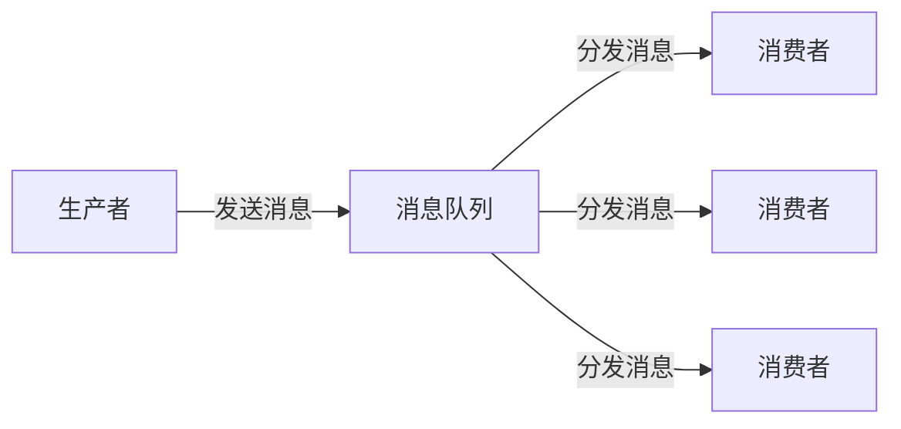

# 消息队列详解

## 目录
1. [消息队列概述](#消息队列概述)
2. [消息队列模式](#消息队列模式)
3. [Apache Kafka](#apache-kafka)
4. [RabbitMQ](#rabbitmq)
5. [Redis Streams](#redis-streams)
6. [消息队列对比](#消息队列对比)
7. [Python实现](#python实现)
8. [Go语言实现](#go语言实现)
9. [实际应用案例](#实际应用案例)
10. [最佳实践](#最佳实践)

## 消息队列概述

### 什么是消息队列？

消息队列（Message Queue）是一种异步通信模式，允许不同的应用程序或服务之间通过发送和接收消息来进行通信，而无需直接连接。

### 核心概念



### 消息队列优势

```python
class MessageQueueBenefits:
    """消息队列优势分析"""
    
    def __init__(self):
        self.benefits = {
            'decoupling': {
                'name': '解耦',
                'description': '生产者和消费者独立运行，互不依赖',
                'example': '订单系统和库存系统可以独立升级'
            },
            'scalability': {
                'name': '可扩展性',
                'description': '可以根据需求动态增加消费者数量',
                'example': '高峰期增加消费者实例处理更多订单'
            },
            'reliability': {
                'name': '可靠性',
                'description': '消息持久化，确保消息不会丢失',
                'example': '系统重启后仍能处理未完成的消息'
            },
            'async_processing': {
                'name': '异步处理',
                'description': '生产者不需要等待消费者处理完成',
                'example': '用户下单后立即返回，订单处理异步进行'
            },
            'load_balancing': {
                'name': '负载均衡',
                'description': '多个消费者分担消息处理任务',
                'example': '5个worker处理1000条消息，每个处理200条'
            },
            'fault_tolerance': {
                'name': '容错性',
                'description': '单个消费者故障不影响整体服务',
                'example': '某个消费者崩溃，其他消费者继续处理'
            }
        }
    
    def get_benefit_details(self, benefit_key: str):
        return self.benefits.get(benefit_key, {})
    
    def list_all_benefits(self):
        return list(self.benefits.keys())

# 消息系统架构图
class MessageSystemArchitecture:
    """消息系统架构"""
    
    def __init__(self):
        self.components = {
            'producer': '消息生产者，负责发送消息',
            'queue': '消息队列，存储和分发消息',
            'consumer': '消息消费者，处理消息',
            'broker': '消息代理，管理队列和路由',
            'topic': '主题，消息的分类'
        }
    
    def show_architecture_flow(self):
        flow = """
        1. 生产者发送消息到队列/主题
        2. 消息队列存储消息
        3. 消费者从队列获取消息
        4. 消费者处理消息
        5. 确认处理完成
        6. 消息从队列中删除
        """
        return flow.strip()
```

## 消息队列模式

### 1. 点对点模式（Point-to-Point）

```python
from abc import ABC, abstractmethod
from typing import Any, Optional
import time
import threading
from queue import Queue, Empty
import json

class Message(ABC):
    """消息基类"""
    def __init__(self, content: Any, message_id: Optional[str] = None):
        self.content = content
        self.message_id = message_id or self.generate_id()
        self.timestamp = time.time()
        self.headers = {}
        self.properties = {}
    
    def generate_id(self) -> str:
        """生成消息ID"""
        return f"msg_{int(time.time() * 1000000)}"
    
    def add_header(self, key: str, value: str):
        """添加消息头"""
        self.headers[key] = value
    
    def add_property(self, key: str, value: Any):
        """添加消息属性"""
        self.properties[key] = value

class PointToPointQueue:
    """点对点队列实现"""
    
    def __init__(self, name: str):
        self.name = name
        self.queue = Queue()
        self.consumers = []
        self.message_counter = 0
        self.is_running = True
    
    def produce(self, message: Message) -> str:
        """生产者发送消息"""
        self.message_counter += 1
        message.add_property('queue_name', self.name)
        message.add_property('message_number', self.message_counter)
        
        # 放入队列
        self.queue.put(message)
        print(f"Message {message.message_id} produced to queue {self.name}")
        
        return message.message_id
    
    def consume(self, consumer_id: str, auto_ack: bool = True) -> Optional[Message]:
        """消费者接收消息"""
        if not self.is_running:
            return None
        
        try:
            # 从队列获取消息（阻塞模式）
            message = self.queue.get(timeout=1)
            
            print(f"Consumer {consumer_id} received message {message.message_id}")
            
            if auto_ack:
                self.queue.task_done()
            
            return message
            
        except Empty:
            return None
    
    def get_queue_size(self) -> int:
        """获取队列大小"""
        return self.queue.qsize()
    
    def stop(self):
        """停止队列"""
        self.is_running = False

# 使用示例
def demo_point_to_point():
    queue = PointToPointQueue("order_queue")
    
    # 生产者
    for i in range(5):
        message = Message(f"Order {i+1}")
        queue.produce(message)
    
    # 消费者
    consumer_id = "worker_1"
    for i in range(3):
        message = queue.consume(consumer_id)
        if message:
            print(f"Processing: {message.content}")
            time.sleep(0.5)  # 模拟处理时间
    
    print(f"Remaining messages: {queue.get_queue_size()}")

if __name__ == "__main__":
    demo_point_to_point()
```

### 2. 发布/订阅模式（Publish/Subscribe）

```python
import asyncio
from typing import Dict, List, Set
from collections import defaultdict

class Topic:
    """主题"""
    def __init__(self, name: str):
        self.name = name
        self.subscribers: Set[str] = set()
        self.messages: List[Message] = []
    
    def add_subscriber(self, subscriber_id: str):
        """添加订阅者"""
        self.subscribers.add(subscriber_id)
    
    def remove_subscriber(self, subscriber_id: str):
        """移除订阅者"""
        self.subscribers.discard(subscriber_id)
    
    def publish_message(self, message: Message):
        """发布消息"""
        self.messages.append(message)
        print(f"Message {message.message_id} published to topic {self.name}")

class PublishSubscribeSystem:
    """发布/订阅系统"""
    
    def __init__(self):
        self.topics: Dict[str, Topic] = {}
        self.subscriptions: Dict[str, str] = {}  # subscriber_id -> topic_name
    
    def create_topic(self, topic_name: str) -> Topic:
        """创建主题"""
        if topic_name not in self.topics:
            self.topics[topic_name] = Topic(topic_name)
        return self.topics[topic_name]
    
    def subscribe(self, subscriber_id: str, topic_name: str) -> bool:
        """订阅主题"""
        if topic_name not in self.topics:
            return False
        
        self.topics[topic_name].add_subscriber(subscriber_id)
        self.subscriptions[subscriber_id] = topic_name
        print(f"Subscriber {subscriber_id} subscribed to topic {topic_name}")
        return True
    
    def unsubscribe(self, subscriber_id: str):
        """取消订阅"""
        if subscriber_id in self.subscriptions:
            topic_name = self.subscriptions[subscriber_id]
            self.topics[topic_name].remove_subscriber(subscriber_id)
            del self.subscriptions[subscriber_id]
            print(f"Subscriber {subscriber_id} unsubscribed from topic {topic_name}")
    
    def publish(self, topic_name: str, message: Message) -> bool:
        """发布消息到主题"""
        if topic_name not in self.topics:
            return False
        
        topic = self.topics[topic_name]
        message.add_property('topic_name', topic_name)
        topic.publish_message(message)
        
        # 通知所有订阅者
        for subscriber_id in topic.subscribers:
            self.notify_subscriber(subscriber_id, message)
        
        return True
    
    def notify_subscriber(self, subscriber_id: str, message: Message):
        """通知订阅者"""
        # 实际实现中，这里会调用订阅者的回调函数
        print(f"Notifying subscriber {subscriber_id} of message {message.message_id}")
    
    def get_subscriber_messages(self, subscriber_id: str) -> List[Message]:
        """获取订阅者未读消息"""
        if subscriber_id not in self.subscriptions:
            return []
        
        topic_name = self.subscriptions[subscriber_id]
        if topic_name in self.topics:
            return self.topics[topic_name].messages
        
        return []

# 使用示例
def demo_publish_subscribe():
    pubsub = PublishSubscribeSystem()
    
    # 创建主题
    news_topic = pubsub.create_topic("breaking_news")
    
    # 订阅者订阅
    pubsub.subscribe("user1", "breaking_news")
    pubsub.subscribe("user2", "breaking_news")
    pubsub.subscribe("user3", "tech_news")  # 不存在的主题
    
    # 发布消息
    message1 = Message("Breaking: AI technology breakthrough!")
    pubsub.publish("breaking_news", message1)
    
    message2 = Message("Tech: New programming language released")
    pubsub.publish("tech_news", message2)  # 不会发布，因为主题不存在
    
    # 检查订阅者消息
    for subscriber in ["user1", "user2"]:
        messages = pubsub.get_subscriber_messages(subscriber)
        print(f"Subscriber {subscriber} received {len(messages)} messages")

if __name__ == "__main__":
    demo_publish_subscribe()
```

### 3. 工作队列模式（Work Queues）

```python
import threading
import time
from concurrent.futures import ThreadPoolExecutor, as_completed
from typing import Callable, List

class WorkQueue:
    """工作队列 - 多个worker处理任务"""
    
    def __init__(self, name: str, max_workers: int = 4):
        self.name = name
        self.max_workers = max_workers
        self.task_queue = Queue()
        self.workers = []
        self.is_running = True
        self.completed_tasks = 0
        self.failed_tasks = 0
        self.task_results = {}
        
        # 启动worker线程
        for i in range(max_workers):
            worker = threading.Thread(
                target=self.worker_loop,
                args=(f"worker_{i}",),
                daemon=True
            )
            worker.start()
            self.workers.append(worker)
    
    def worker_loop(self, worker_id: str):
        """Worker工作循环"""
        print(f"Worker {worker_id} started")
        
        while self.is_running:
            try:
                # 获取任务
                task = self.task_queue.get(timeout=1)
                
                # 执行任务
                try:
                    print(f"Worker {worker_id} processing task {task['id']}")
                    result = self.execute_task(task)
                    
                    # 保存结果
                    self.task_results[task['id']] = {
                        'status': 'completed',
                        'result': result,
                        'worker_id': worker_id,
                        'timestamp': time.time()
                    }
                    
                    self.completed_tasks += 1
                    print(f"Worker {worker_id} completed task {task['id']}")
                    
                except Exception as e:
                    self.task_results[task['id']] = {
                        'status': 'failed',
                        'error': str(e),
                        'worker_id': worker_id,
                        'timestamp': time.time()
                    }
                    self.failed_tasks += 1
                    print(f"Worker {worker_id} failed task {task['id']}: {e}")
                
                finally:
                    self.task_queue.task_done()
                    
            except Empty:
                continue
    
    def execute_task(self, task: dict):
        """执行具体任务"""
        task_type = task['type']
        task_data = task['data']
        
        if task_type == 'process_order':
            return self.process_order(task_data)
        elif task_type == 'send_notification':
            return self.send_notification(task_data)
        elif task_type == 'generate_report':
            return self.generate_report(task_data)
        else:
            raise ValueError(f"Unknown task type: {task_type}")
    
    def process_order(self, order_data: dict):
        """处理订单"""
        # 模拟订单处理
        time.sleep(2)
        return f"Order {order_data['order_id']} processed"
    
    def send_notification(self, notification_data: dict):
        """发送通知"""
        # 模拟发送通知
        time.sleep(1)
        return f"Notification sent to {notification_data['user_id']}"
    
    def generate_report(self, report_data: dict):
        """生成报告"""
        # 模拟报告生成
        time.sleep(3)
        return f"Report {report_data['report_id']} generated"
    
    def submit_task(self, task_type: str, task_data: dict) -> str:
        """提交任务"""
        task_id = f"task_{int(time.time() * 1000000)}"
        task = {
            'id': task_id,
            'type': task_type,
            'data': task_data,
            'timestamp': time.time()
        }
        
        self.task_queue.put(task)
        print(f"Task {task_id} submitted to queue {self.name}")
        
        return task_id
    
    def get_task_status(self, task_id: str) -> dict:
        """获取任务状态"""
        return self.task_results.get(task_id, {'status': 'pending'})
    
    def get_queue_stats(self) -> dict:
        """获取队列统计"""
        return {
            'queue_size': self.task_queue.qsize(),
            'completed_tasks': self.completed_tasks,
            'failed_tasks': self.failed_tasks,
            'active_workers': len([w for w in self.workers if w.is_alive()])
        }
    
    def wait_for_completion(self, timeout: int = None):
        """等待所有任务完成"""
        self.task_queue.join()
    
    def stop(self):
        """停止工作队列"""
        self.is_running = False
        
        # 等待所有worker结束
        for worker in self.workers:
            worker.join(timeout=5)

# 使用示例
def demo_work_queue():
    work_queue = WorkQueue("order_processing", max_workers=3)
    
    # 提交各种任务
    tasks = [
        ('process_order', {'order_id': '001', 'amount': 100}),
        ('process_order', {'order_id': '002', 'amount': 200}),
        ('send_notification', {'user_id': 'user1', 'message': 'Order confirmed'}),
        ('generate_report', {'report_id': 'R001', 'type': 'daily'}),
        ('process_order', {'order_id': '003', 'amount': 150}),
    ]
    
    task_ids = []
    for task_type, task_data in tasks:
        task_id = work_queue.submit_task(task_type, task_data)
        task_ids.append(task_id)
    
    # 检查任务状态
    time.sleep(1)
    print("\nTask Status:")
    for task_id in task_ids:
        status = work_queue.get_task_status(task_id)
        print(f"Task {task_id}: {status['status']}")
    
    # 等待完成
    work_queue.wait_for_completion()
    
    # 显示最终统计
    stats = work_queue.get_queue_stats()
    print(f"\nQueue Statistics: {stats}")
    
    work_queue.stop()

if __name__ == "__main__":
    demo_work_queue()
```

## Apache Kafka

### Kafka核心概念

```python
class KafkaConcepts:
    """Kafka核心概念说明"""
    
    def __init__(self):
        self.concepts = {
            'topic': '主题，消息的分类',
            'partition': '分区，主题的子集，用于提高并发性',
            'offset': '偏移量，消息在分区中的位置',
            'producer': '生产者，发布消息到主题',
            'consumer': '消费者，从主题订阅和消费消息',
            'consumer_group': '消费者组，多个消费者共享订阅',
            'broker': 'Kafka服务器实例',
            'cluster': '多个broker组成的集群',
            'replication': '副本机制，确保数据可靠性'
        }
    
    def explain_concept(self, concept: str):
        return self.concepts.get(concept, f"Unknown concept: {concept}")

class KafkaMessage:
    """Kafka消息"""
    
    def __init__(self, key: str, value: str, topic: str, partition: int = None):
        self.key = key
        self.value = value
        self.topic = topic
        self.partition = partition
        self.offset = None
        self.timestamp = time.time()
    
    def to_dict(self):
        return {
            'key': self.key,
            'value': self.value,
            'topic': self.topic,
            'partition': self.partition,
            'offset': self.offset,
            'timestamp': self.timestamp
        }

class KafkaTopic:
    """Kafka主题"""
    
    def __init__(self, name: str, partitions: int = 1, replication_factor: int = 1):
        self.name = name
        self.partitions = partitions
        self.replication_factor = replication_factor
        self.partition_logs = {}
        
        # 初始化分区日志
        for i in range(partitions):
            self.partition_logs[i] = []
    
    def get_partition_for_key(self, key: str) -> int:
        """根据key计算分区"""
        if self.partitions == 1:
            return 0
        
        # 简单的哈希分区算法
        return hash(key) % self.partitions
    
    def append_message(self, message: KafkaMessage, partition: int = None):
        """追加消息到分区"""
        if partition is None:
            partition = self.get_partition_for_key(message.key)
        
        if partition not in self.partition_logs:
            raise ValueError(f"Partition {partition} does not exist")
        
        # 设置消息的分区和偏移量
        message.partition = partition
        message.offset = len(self.partition_logs[partition])
        
        # 追加消息
        self.partition_logs[partition].append(message)
    
    def get_messages_from_offset(self, partition: int, offset: int, count: int = None):
        """从指定偏移量获取消息"""
        if partition not in self.partition_logs:
            return []
        
        partition_log = self.partition_logs[partition]
        
        if offset >= len(partition_log):
            return []
        
        if count is None:
            return partition_log[offset:]
        else:
            return partition_log[offset:offset + count]

class KafkaProducer:
    """Kafka生产者"""
    
    def __init__(self, bootstrap_servers: List[str]):
        self.bootstrap_servers = bootstrap_servers
        self.topics = {}
        self.buffer = []
        self.buffer_size = 1024 * 1024  # 1MB
        self.flush_interval = 5000  # 5秒
    
    def create_topic(self, name: str, partitions: int = 1, replication_factor: int = 1):
        """创建主题"""
        self.topics[name] = KafkaTopic(name, partitions, replication_factor)
    
    def send(self, topic: str, key: str, value: str, partition: int = None):
        """发送消息"""
        if topic not in self.topics:
            raise ValueError(f"Topic {topic} does not exist")
        
        message = KafkaMessage(key, value, topic, partition)
        kafka_topic = self.topics[topic]
        kafka_topic.append_message(message)
        
        print(f"Sent message to topic {topic}, partition {message.partition}, offset {message.offset}")
        
        return message.offset
    
    def flush(self):
        """刷新缓冲区"""
        # 在实际Kafka实现中，这里会批量发送消息
        self.buffer.clear()
    
    def close(self):
        """关闭生产者"""
        self.flush()

class KafkaConsumer:
    """Kafka消费者"""
    
    def __init__(self, bootstrap_servers: List[str], group_id: str):
        self.bootstrap_servers = bootstrap_servers
        self.group_id = group_id
        self.topics = {}
        self.subscription = set()
        self.consumer_offsets = {}  # topic -> partition -> offset
        self.is_running = True
    
    def subscribe(self, topics: List[str]):
        """订阅主题"""
        for topic in topics:
            if topic in self.subscription:
                continue
            
            self.subscription.add(topic)
            if topic not in self.consumer_offsets:
                self.consumer_offsets[topic] = {}
            
            print(f"Consumer group {self.group_id} subscribed to topic {topic}")
    
    def poll(self, timeout_ms: int = 1000) -> List[KafkaMessage]:
        """拉取消息"""
        if not self.is_running:
            return []
        
        messages = []
        
        for topic in self.subscription:
            if topic not in kafka_producer.topics:
                continue
            
            kafka_topic = kafka_producer.topics[topic]
            
            for partition in range(kafka_topic.partitions):
                # 获取当前消费者在该分区的偏移量
                current_offset = self.consumer_offsets[topic].get(partition, 0)
                
                # 从该偏移量获取新消息
                new_messages = kafka_topic.get_messages_from_offset(
                    partition, current_offset
                )
                
                for message in new_messages:
                    messages.append(message)
                    # 更新偏移量
                    self.consumer_offsets[topic][partition] = message.offset + 1
        
        return messages
    
    def commit_offsets(self):
        """提交偏移量"""
        # 在实际Kafka实现中，这里会向Broker提交offset
        print(f"Consumer group {self.group_id} committed offsets")
    
    def close(self):
        """关闭消费者"""
        self.is_running = False

# 全局生产者实例（用于演示）
kafka_producer = KafkaProducer(['localhost:9092'])

# 使用示例
def demo_kafka():
    print("=== Kafka演示 ===")
    
    # 创建主题
    kafka_producer.create_topic("user_events", partitions=3)
    
    # 生产者发送消息
    messages = [
        ("user1", "login", "User1 logged in"),
        ("user2", "purchase", "User2 made a purchase"),
        ("user1", "logout", "User1 logged out"),
        ("user3", "login", "User3 logged in"),
        ("user2", "browse", "User2 browsed products")
    ]
    
    for user_id, event_type, event_data in messages:
        kafka_producer.send("user_events", user_id, 
                          json.dumps({"type": event_type, "data": event_data}))
    
    # 创建消费者组
    consumer_group_a = KafkaConsumer(['localhost:9092'], "group_a")
    consumer_group_b = KafkaConsumer(['localhost:9092'], "group_b")
    
    # 订阅主题
    consumer_group_a.subscribe(["user_events"])
    consumer_group_b.subscribe(["user_events"])
    
    # 模拟消费者拉取消息
    print("\n--- Consumer Group A ---")
    messages_a = consumer_group_a.poll()
    for message in messages_a:
        print(f"Consumed: Topic={message.topic}, Partition={message.partition}, "
              f"Offset={message.offset}, Key={message.key}, Value={message.value}")
    
    print("\n--- Consumer Group B ---")
    messages_b = consumer_group_b.poll()
    for message in messages_b:
        print(f"Consumed: Topic={message.topic}, Partition={message.partition}, "
              f"Offset={message.offset}, Key={message.key}, Value={message.value}")
    
    # 显示分区信息
    topic = kafka_producer.topics["user_events"]
    print(f"\n--- Topic Information ---")
    print(f"Topic: {topic.name}")
    print(f"Partitions: {topic.partitions}")
    for partition, messages in topic.partition_logs.items():
        print(f"Partition {partition}: {len(messages)} messages")

if __name__ == "__main__":
    demo_kafka()
```

## RabbitMQ

### RabbitMQ核心概念和实现

```python
class RabbitMQConcepts:
    """RabbitMQ核心概念"""
    
    def __init__(self):
        self.concepts = {
            'exchange': '交换机，接收生产者消息并路由到队列',
            'queue': '队列，存储消息直到被消费者消费',
            'binding': '绑定，交换机和队列之间的路由规则',
            'routing_key': '路由键，用于消息路由',
            'virtual_host': '虚拟主机，隔离不同环境',
            'connection': '连接，应用程序和RabbitMQ之间的连接',
            'channel': '通道，在连接内执行操作的虚拟连接',
            'ack': '确认机制，确保消息被正确处理'
        }

class RabbitMQExchange:
    """RabbitMQ交换机"""
    
    def __init__(self, name: str, exchange_type: str):
        self.name = name
        self.exchange_type = exchange_type  # direct, topic, fanout, headers
        self.bindings = []
        self.messages = []
    
    def bind_queue(self, queue_name: str, routing_key: str = ''):
        """绑定队列"""
        binding = {
            'queue': queue_name,
            'routing_key': routing_key,
            'arguments': {}
        }
        self.bindings.append(binding)
    
    def publish_message(self, message: Message, routing_key: str = ''):
        """发布消息"""
        self.messages.append({
            'message': message,
            'routing_key': routing_key,
            'timestamp': time.time()
        })
        print(f"Message {message.message_id} published to exchange {self.name}")

class RabbitMQQueue:
    """RabbitMQ队列"""
    
    def __init__(self, name: str, durable: bool = True, auto_delete: bool = False):
        self.name = name
        self.durable = durable
        self.auto_delete = auto_delete
        self.messages = []
        self.consumers = []
        self.message_count = 0
        self.consumer_count = 0
        self.ack_required = True
    
    def declare(self):
        """声明队列"""
        print(f"Queue {self.name} declared (durable={self.durable})")
    
    def bind_to_exchange(self, exchange: RabbitMQExchange, routing_key: str = ''):
        """绑定到交换机"""
        exchange.bind_queue(self.name, routing_key)
        print(f"Queue {self.name} bound to exchange {exchange.name}")
    
    def declare_consumer(self, consumer_tag: str, auto_ack: bool = False):
        """声明消费者"""
        consumer = {
            'tag': consumer_tag,
            'auto_ack': auto_ack,
            'messages_consumed': 0
        }
        self.consumers.append(consumer)
        self.consumer_count += 1
    
    def get_message(self, auto_ack: bool = True) -> Optional[Message]:
        """获取消息（非阻塞）"""
        if not self.messages:
            return None
        
        message = self.messages.pop(0)
        
        if auto_ack or self.ack_required:
            # 模拟消息确认
            pass
        else:
            # 需要手动确认
            pass
        
        self.message_count -= 1
        return message
    
    def consume_message(self, timeout: int = None) -> Optional[Message]:
        """消费消息（阻塞）"""
        start_time = time.time()
        
        while True:
            message = self.get_message()
            if message:
                return message
            
            if timeout and (time.time() - start_time) * 1000 > timeout:
                return None
            
            time.sleep(0.1)
    
    def put_message(self, message: Message):
        """放入消息"""
        self.messages.append(message)
        self.message_count += 1
        print(f"Message {message.message_id} added to queue {self.name}")
    
    def get_message_count(self) -> int:
        """获取消息数量"""
        return self.message_count

class RabbitMQChannel:
    """RabbitMQ通道"""
    
    def __init__(self, connection):
        self.connection = connection
        self.exchanges = {}
        self.queues = {}
        self.is_open = True
    
    def exchange_declare(self, name: str, exchange_type: str):
        """声明交换机"""
        if name not in self.exchanges:
            self.exchanges[name] = RabbitMQExchange(name, exchange_type)
        return self.exchanges[name]
    
    def queue_declare(self, name: str, durable: bool = True) -> RabbitMQQueue:
        """声明队列"""
        if name not in self.queues:
            self.queues[name] = RabbitMQQueue(name, durable)
        return self.queues[name]
    
    def queue_bind(self, queue_name: str, exchange_name: str, routing_key: str = ''):
        """绑定队列到交换机"""
        queue = self.queues[queue_name]
        exchange = self.exchanges[exchange_name]
        queue.bind_to_exchange(exchange, routing_key)
    
    def basic_publish(self, exchange: str, routing_key: str, message: Message):
        """发布消息"""
        if exchange in self.exchanges:
            self.exchanges[exchange].publish_message(message, routing_key)
        else:
            raise ValueError(f"Exchange {exchange} not found")
    
    def basic_get(self, queue: str, auto_ack: bool = True) -> Optional[Message]:
        """获取消息"""
        if queue in self.queues:
            return self.queues[queue].get_message(auto_ack)
        return None
    
    def basic_consume(self, queue: str, consumer_tag: str, auto_ack: bool = False):
        """开始消费"""
        if queue in self.queues:
            self.queues[queue].declare_consumer(consumer_tag, auto_ack)
    
    def close(self):
        """关闭通道"""
        self.is_open = False

class RabbitMQConnection:
    """RabbitMQ连接"""
    
    def __init__(self, host: str = 'localhost', port: int = 5672):
        self.host = host
        self.port = port
        self.is_open = True
        self.channels = []
    
    def channel(self) -> RabbitMQChannel:
        """创建通道"""
        channel = RabbitMQChannel(self)
        self.channels.append(channel)
        return channel
    
    def close(self):
        """关闭连接"""
        self.is_open = False
        for channel in self.channels:
            channel.close()

# RabbitMQ使用示例
def demo_rabbitmq():
    print("=== RabbitMQ演示 ===")
    
    # 创建连接和通道
    connection = RabbitMQConnection('localhost')
    channel = connection.channel()
    
    # 声明交换机
    direct_exchange = channel.exchange_declare('order_events', 'direct')
    topic_exchange = channel.exchange_declare('user_events', 'topic')
    
    # 声明队列
    order_queue = channel.queue_declare('order_queue', durable=True)
    user_queue = channel.queue_declare('user_queue', durable=True)
    
    # 绑定队列到交换机
    channel.queue_bind('order_queue', 'order_events', 'order.created')
    channel.queue_bind('order_queue', 'order_events', 'order.updated')
    channel.queue_bind('user_queue', 'user_events', 'user.*')
    
    # 发布消息
    order_messages = [
        Message('Order 001 created', 'order_id_001'),
        Message('Order 002 created', 'order_id_002'),
        Message('Order 001 updated', 'order_id_001')
    ]
    
    user_messages = [
        Message('User 001 registered', 'user_id_001'),
        Message('User 002 registered', 'user_id_002'),
        Message('User 001 profile updated', 'user_id_001')
    ]
    
    # 发送订单消息
    for msg in order_messages:
        channel.basic_publish('order_events', 'order.created', msg)
        order_queue.put_message(msg)
    
    # 发送用户消息
    for msg in user_messages:
        channel.basic_publish('user_events', 'user.registered', msg)
        user_queue.put_message(msg)
    
    # 模拟消费者
    print("\n--- 消费订单消息 ---")
    for _ in range(3):
        message = order_queue.consume_message(timeout=1000)
        if message:
            print(f"Consumed: {message.content}")
        else:
            print("No more messages")
    
    print("\n--- 消费用户消息 ---")
    for _ in range(3):
        message = user_queue.consume_message(timeout=1000)
        if message:
            print(f"Consumed: {message.content}")
        else:
            print("No more messages")
    
    # 显示队列统计
    print(f"\n--- 队列统计 ---")
    print(f"Order queue: {order_queue.get_message_count()} messages")
    print(f"User queue: {user_queue.get_message_count()} messages")
    
    connection.close()

if __name__ == "__main__":
    demo_rabbitmq()
```

## 消息队列对比

```python
class MessageQueueComparison:
    """消息队列对比分析"""
    
    def __init__(self):
        self.comparisons = {
            'kafka': {
                'name': 'Apache Kafka',
                'throughput': '极高',
                'latency': '低',
                'persistence': '强',
                'ordering': '分区有序',
                'replay': '支持',
                'use_cases': ['日志收集', '流处理', '实时分析'],
                'complexity': '高',
                'learning_curve': '陡峭'
            },
            'rabbitmq': {
                'name': 'RabbitMQ',
                'throughput': '中等',
                'latency': '低',
                'persistence': '强',
                'ordering': '队列有序',
                'replay': '有限支持',
                'use_cases': ['任务队列', 'RPC', '消息路由'],
                'complexity': '中等',
                'learning_curve': '平缓'
            },
            'redis_streams': {
                'name': 'Redis Streams',
                'throughput': '高',
                'latency': '极低',
                'persistence': '中等',
                'ordering': '流有序',
                'replay': '支持',
                'use_cases': ['简单队列', '实时通知', '缓存'],
                'complexity': '低',
                'learning_curve': '简单'
            },
            'activemq': {
                'name': 'Apache ActiveMQ',
                'throughput': '中等',
                'latency': '中等',
                'persistence': '强',
                'ordering': '队列有序',
                'replay': '支持',
                'use_cases': ['企业集成', 'JMS标准', '事务消息'],
                'complexity': '高',
                'learning_curve': '中等'
            }
        }
    
    def compare_feature(self, feature: str) -> dict:
        """对比特定特性"""
        return {name: details[feature] for name, details in self.comparisons.items()}
    
    def recommend_by_use_case(self, use_case: str) -> list:
        """根据使用场景推荐"""
        recommendations = {
            'high_throughput': ['kafka', 'redis_streams'],
            'low_latency': ['redis_streams', 'rabbitmq'],
            'complex_routing': ['rabbitmq', 'activemq'],
            'log_streaming': ['kafka'],
            'simple_queue': ['redis_streams', 'rabbitmq'],
            'enterprise_integration': ['activemq', 'rabbitmq']
        }
        return recommendations.get(use_case, [])
    
    def print_comparison_table(self):
        """打印对比表格"""
        print("=== 消息队列对比 ===\n")
        
        features = ['throughput', 'latency', 'persistence', 'complexity']
        print(f"{'特性':<12} {'Kafka':<15} {'RabbitMQ':<15} {'Redis Streams':<15} {'ActiveMQ':<15}")
        print("-" * 80)
        
        for feature in features:
            row = f"{feature:<12}"
            for mq in ['kafka', 'rabbitmq', 'redis_streams', 'activemq']:
                row += f"{self.comparisons[mq][feature]:<15}"
            print(row)

# 性能测试工具
class MessageQueueBenchmark:
    """消息队列性能测试"""
    
    def __init__(self):
        self.results = {}
    
    def benchmark_producer(self, mq_name: str, message_count: int, message_size: int = 1024):
        """测试生产者性能"""
        start_time = time.time()
        
        # 模拟发送消息
        for i in range(message_count):
            message = Message('x' * message_size, f'bench_{i}')
            # 模拟发送时间
            time.sleep(0.0001)  # 0.1ms per message
        
        end_time = time.time()
        duration = end_time - start_time
        
        throughput = message_count / duration
        mb_per_sec = (message_count * message_size) / (1024 * 1024) / duration
        
        self.results[f'{mq_name}_producer'] = {
            'messages_per_second': throughput,
            'mb_per_second': mb_per_sec,
            'total_messages': message_count,
            'duration': duration
        }
        
        return self.results[f'{mq_name}_producer']
    
    def benchmark_consumer(self, mq_name: str, message_count: int, batch_size: int = 100):
        """测试消费者性能"""
        start_time = time.time()
        
        # 模拟批量消费
        batch_count = 0
        while batch_count < message_count:
            # 模拟批量获取
            batch = min(batch_size, message_count - batch_count)
            
            # 模拟处理时间
            time.sleep(0.001)  # 1ms per batch
            
            batch_count += batch
        
        end_time = time.time()
        duration = end_time - start_time
        
        throughput = message_count / duration
        
        self.results[f'{mq_name}_consumer'] = {
            'messages_per_second': throughput,
            'batch_size': batch_size,
            'total_messages': message_count,
            'duration': duration
        }
        
        return self.results[f'{mq_name}_consumer']
    
    def run_comprehensive_benchmark(self, message_count: int = 10000):
        """运行综合性能测试"""
        message_queues = ['kafka', 'rabbitmq', 'redis_streams']
        
        print("=== 消息队列性能测试 ===")
        print(f"测试参数: {message_count}条消息，1KB消息大小\n")
        
        for mq in message_queues:
            print(f"测试 {mq.upper()}:")
            
            # 生产者测试
            producer_result = self.benchmark_producer(mq, message_count)
            print(f"  生产者: {producer_result['messages_per_second']:.0f} msg/s "
                  f"({producer_result['mb_per_second']:.1f} MB/s)")
            
            # 消费者测试
            consumer_result = self.benchmark_consumer(mq, message_count)
            print(f"  消费者: {consumer_result['messages_per_second']:.0f} msg/s")
            print()
    
    def print_results(self):
        """打印结果"""
        print("=== 测试结果汇总 ===")
        for test_name, result in self.results.items():
            print(f"{test_name}:")
            for key, value in result.items():
                if isinstance(value, float):
                    print(f"  {key}: {value:.2f}")
                else:
                    print(f"  {key}: {value}")
            print()

# 使用示例
def demo_queue_comparison():
    comparison = MessageQueueComparison()
    benchmark = MessageQueueBenchmark()
    
    # 显示对比表
    comparison.print_comparison_table()
    
    # 显示使用场景推荐
    print(f"\n=== 使用场景推荐 ===")
    for use_case in ['high_throughput', 'simple_queue', 'complex_routing']:
        recommended = comparison.recommend_by_use_case(use_case)
        print(f"{use_case}: {', '.join(recommended)}")
    
    # 运行性能测试
    benchmark.run_comprehensive_benchmark(1000)

if __name__ == "__main__":
    demo_queue_comparison()
```

## 总结

消息队列是现代分布式系统的重要组成部分：

### 主要优势：
1. **解耦**：生产者和消费者独立演进
2. **可靠性**：消息持久化和确认机制
3. **可扩展性**：支持多消费者负载均衡
4. **异步性**：提高系统响应性

### 选择指南：
- **Kafka**：高吞吐量日志和流处理
- **RabbitMQ**：复杂路由和企业集成
- **Redis Streams**：简单队列和低延迟场景
- **ActiveMQ**：JMS标准和事务支持

### 最佳实践：
1. 合理设置重试机制
2. 实现幂等性处理
3. 监控队列深度和处理延迟
4. 设计优雅的消费者关闭机制
5. 使用批量处理提高性能

---

*最后更新：2025年11月*